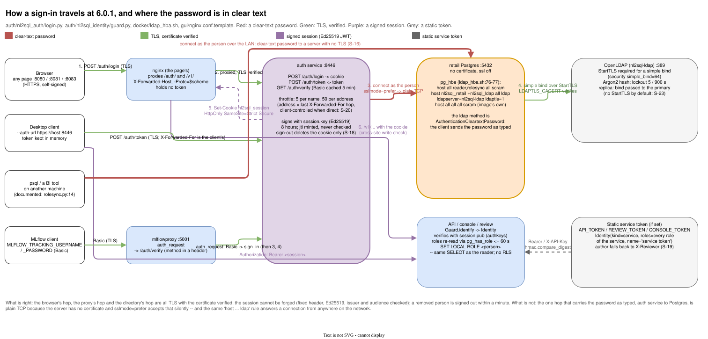
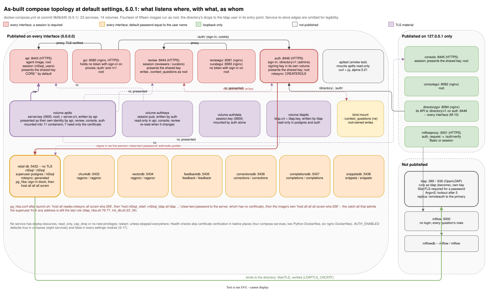
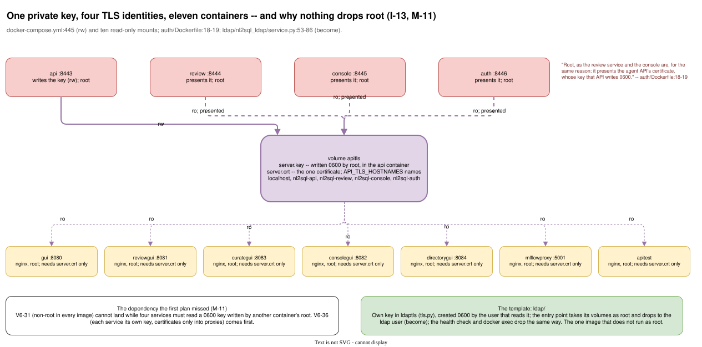
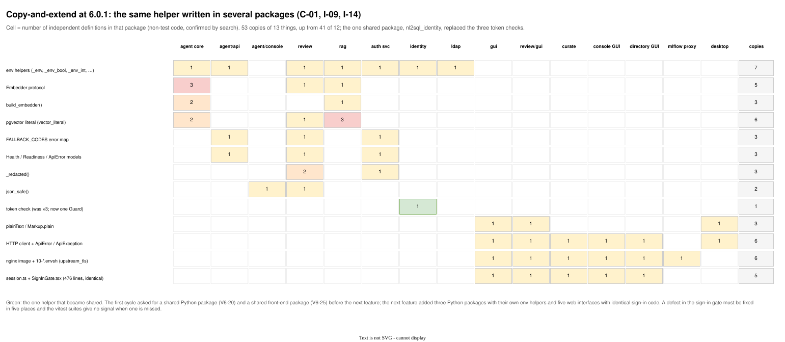

# Adversarial review, v6.1 cycle: the architecture as implemented

**Reviewed at:** commit `9b0b340` (release 6.0.1), branch `utils/ldap_auth`, 2026-10-04.
**Review tag:** `v6_1_review`. Second cycle; the first was `v6_x_review` at `a625cf0` (5.6.1). Finding ids are kept from the first cycle where a finding persists, each with its status: **Unchanged**, **Worse**, **Improved**, **Mitigated**, **Resolved**, **New**. The comparison is [`v6_1_review_changes_since_v6_x.md`](v6_1_review_changes_since_v6_x.md).
**Companion documents:** [`v6_1_review_architecture_as_documented.md`](v6_1_review_architecture_as_documented.md), [`v6_1_review_implementation.md`](v6_1_review_implementation.md), [`v6_1_review_mitigation_plan.md`](v6_1_review_mitigation_plan.md), [`v6_1_review_summary.md`](v6_1_review_summary.md).

> **Enhanced edition.** The text below is [`v6_1_review_architecture_as_implemented.md`](v6_1_review_architecture_as_implemented.md) unchanged, with 6 figures added (1 the repair loop and what it does not reset (first-cycle figure, unchanged); 2 the per-model trace over rest (first-cycle figure, unchanged); 3 how a sign-in travels, and where the password is in clear text; 4 the compose topology at 6.0.1 defaults; 5 one key, four identities, eleven containers, and why nothing drops root; 6 copy-and-extend at 6.0.1). Each figure is an SVG rendered by draw.io from the `.drawio` source in [`diagrams/`](diagrams/), with a PNG beside it; a figure the first cycle drew is embedded unchanged where the code it shows did not change, and its caption says so. The original file is untouched.

## Scope and method

This document reviews the architecture **as the code realises it**: the pipeline graph and its state, the services and their boundaries, the data flows between them, and the deployment topology that `docker-compose.yml` and the three shell scripts build. It asks where the implementation departs from the design, where promises are not kept, and where the structure will resist the next change.

Method: static reading of the agent package (`agent/nl2sql_agent/`) with its API and console sub-packages, the review service, the RAG package, the new `auth/` (`nl2sql_auth`, `nl2sql_identity`, `gui/`) and `ldap/` packages, `docker/auth_roles.sql`, `docker/ldap_hba.sh`, the five web clients, the desktop client, every Dockerfile, `docker-compose.yml`, `setup.sh`, `launch.sh`, `start.sh`, and the shape of the test suite. Every first-cycle citation was re-checked at this commit; where a line number is repeated below it is because the file did not change there. No code was executed; nothing in the sibling `fireworks_nl2sql` folder was consulted. The 6.0.1 changelog's account of what was checked live was read as a claim, not as evidence.

Finding ids are `I-nn`. Severity is Critical / High / Medium / Low. Confidence is **Verified** (read in the code) or **Inferred**.

## 1. Verdict

6.0 built the identity seam the first cycle asked for, and built it well in its own terms. One shared package, `auth/nl2sql_identity`, verifies a session every service reads; Postgres is the authority for passwords (through pg_hba's `ldap` method) and for groups (through `pg_has_role`, re-read once a minute); every guarded route takes a dependency that yields an `Identity`; a signed-in person's `principal` reaches `SET LOCAL ROLE` in the executor, the planner gate, the console and the review validators; jobs have owners and someone else's is a 404. The first-cycle findings about identity (I-06 here, D-05, S-06, S-14, C-10 elsewhere) are resolved. It is also the first shared package in the repository, which the first cycle said did not exist.

Nothing else moved. The three pipeline defects in the audit stage are at the same line numbers; the engine leak, the session-level `SET` on pooled connections, the unbounded queue and the untimed `EXPLAIN` are unchanged. The structure grew exactly the way the first cycle said it would if nothing was shared: a sixth nginx image, a fourth FastAPI application built as one `create_app` closure, five byte-identical copies of the sign-in front end (2,380 lines), 362 more lines of shell that now run superuser SQL and rewrite `pg_hba.conf` from the host, and the API's private key presented by four services and mounted into eleven containers. The identity seam also arrived with structural risks of its own: a secure default that lives in compose rather than in the services, a session that cannot be revoked, a sign-in whose password crosses to Postgres in clear text, authorization that is opt-in per route, and a certificate volume that every service's start now depends on.

Of the first cycle's seventeen findings here: one resolved, one mitigated, nine unchanged, six worse. Three are new.

## 2. Where the implementation is stronger than the spec

The first cycle's four points stand (least privilege tested live; the tree-wide function denylist; measured routing departures; the desktop client's TLS story). 6.0 adds:

- **The session format resists the usual JWT mistakes.** `tokens.py:47` compares the header to one fixed value, so `"alg": "none"` or an HMAC signed with the public key is malformed, not negotiated; issuer and audience are checked (line 188); timestamps must be `int`, not `bool` (line 155); the key is Ed25519 and only the auth service holds the private half.
- **Postgres is the password authority.** `login.py:81-105` checks a password by opening a connection as the person; the service never sees a hash and cannot be made to accept a password the database would not.
- **Authorization is re-read.** `guard.current()` (`guard.py:297-329`) asks Postgres which groups a person holds now, at most once a minute per person, and signs out a person whose role is gone.
- **Cookie writes need provenance.** `check_origin` (`guard.py:139-167`) trusts `Sec-Fetch-Site` first and falls back to `Origin`/`Referer` against the proxy's `X-Forwarded-Host`, port included; the cookie is `HttpOnly`, `SameSite=Strict` and `Secure` over HTTPS (`auth/app.py:315-324`).
- **The directory image is the pattern the first cycle asked for everywhere.** It has its own key (`ldap/nl2sql_ldap/tls.py`), it starts as root only to take ownership of its volumes and then drops to `ldap` (`service.py:53-86`, `become`), its root is a peer credential on a local socket with no password (`slapd.py:20-21`), it refuses passwords over unencrypted connections (`slapd.py:158`), hashes with Argon2 and locks accounts.
- **The role sync is scoped.** `nl2sql_rolesync` holds `CREATEROLE` and `ADMIN` on five roles and nothing else (`auth_roles.sql:66-72`), so it can make and remove people and cannot touch the owner or the reader; a directory name that is already a role is reported and left alone (`rolesync.py:137-140`); reserved names are refused on the way in (`layout.py:43-56`).
- **A replica refuses to empty itself** (`replica.py:262-267`), and `ldap_hba.sh` parses the new rules before reloading and puts the old file back on error (lines 100-105).

## 3. Findings

### 3.1 Pipeline behaviour versus the design

**I-01 · High · Verified · Unchanged — The sensitive-column policy is dead code.**
`_audit` still calls `present.audit(state.get("claims", []), result, question=..., assumptions=...)` without the tag set (`graph.py:1107-1112`); `_finish` still calls `render_answer` without it (`graph.py:1149-1157`); `present.tagged_sensitive_columns` (`present.py:249`) has no caller outside its module. `graph.py` is 1,176 lines, as it was.

**I-02 · High · Verified · Unchanged — Stale audit across repair cycles; the rewrite budget spent on the wrong attempt; narrator failure filed as a retrieval error.**
`_narrate` reads `state.get("audit")` at `graph.py:1068`; a `semantic_issue` routes to `repair` (`graph.py:1128-1131`); nothing on that path writes `audit`, `claims` or `narration_retries`; `MAX_NARRATION_RETRIES = 1` (`graph.py:137`) and the counter is consumed at `graph.py:1093`. The narrator's exception is still written to `retrieval_errors["narrator"]` (`graph.py:1088`).

**Figure 1. The repair loop and what it does not reset (first-cycle figure, unchanged).** `graph.py` is the same 1,176 lines it was at 5.6.1; the lines the figure cites (1068, 1093, 1137) are unchanged, and so is the defect.

Also as [PNG](diagrams/v6_x_review_repair_loop_state.png) · editable source [`v6_x_review_repair_loop_state.drawio`](diagrams/v6_x_review_repair_loop_state.drawio)

**I-03 · High · Verified · Unchanged — The per-model trace does not leave the process.**
`api/models.py:179-185` still declares `node`, `ms`, `model_calls`, `detail`; `translate.py:88` still builds it with `TraceEntry(**t)`, dropping `model`, `rung`, `route`, `hops`. `agent/API.md:290` still claims otherwise.

**Figure 2. The per-model trace over REST (first-cycle figure, unchanged).** `api/models.py:179` and `translate.py:88` are as they were: the four routing fields are still dropped on the way out, and `agent/API.md:290` still says otherwise.

Also as [PNG](diagrams/v6_x_review_trace_field_loss.png) · editable source [`v6_x_review_trace_field_loss.drawio`](diagrams/v6_x_review_trace_field_loss.drawio)

**I-04 · Medium · Verified · Unchanged — `EXPLAIN` runs without a timeout.**
`explain_plan` (`database.py:268-303`) gained `SET LOCAL ROLE` for the principal (line 297), which is right, and still sets no `statement_timeout`; `run_select` does (line 318).

**I-05 · Medium · Verified · Unchanged — Sample rows flow to the model host** (`database.py`, `_sample_rows`; `OLLAMA_BASE_URL` defaults to `http://192.168.10.82:11434` at `docker-compose.yml:250`).

### 3.2 Identity, authorisation and tenancy

**I-06 · Resolved — There is an identity seam, and the RLS path has a caller.**
`nl2sql_identity.Guard.require(*roles)` (`guard.py:331-347`) is the one dependency; the API uses `guard.require(USERS)` (`api/app.py:314`), the console `guard.require(*console.allowed_roles)` (`console/app.py:189`), the review service three variants (`review/app.py:404-406`). `Identity.principal` (`tokens.py:93-100`) is a signed-in person's role name; the API passes it to `jobs.submit(principal=..., owner=...)` (`api/app.py:493-498`) and refuses a body that names anyone else (lines 475-481); `Database.run_select` and `explain_plan` do `SET LOCAL ROLE` (`database.py:297`, `322`); the review validators do the same (`validation.py:182`, `snippet_validation.py:268`). Job listing filters by owner and another owner's job is a 404 (`api/app.py:519`, `527-533`). Attribution is `author(caller, claimed)` = `caller.principal or claimed` (`review/app.py:194-200`): the signed-in name wins. What remains of the first cycle's finding is in two new ones: the static service token is a second identity channel with every role and no name (S-19), and the person's identity reaches `current_user` and nothing else (I-18).

**Figure 3. How a sign-in travels, and where the password is in clear text.** The browser's hop, the proxy's hop and the directory's hop are TLS with the certificate verified. Between them the auth service connects to Postgres as the person with `sslmode=prefer` against a server that has no certificate, so the password crosses the compose network as typed; and a person connecting directly reaches the same `host ... ldap` rule from anywhere on the network.

Also as [PNG](diagrams/v6_1_review_signin_flow.png) · editable source [`v6_1_review_signin_flow.drawio`](diagrams/v6_1_review_signin_flow.drawio)

**I-07 · Medium · Verified · Mitigated (code unchanged) — The job store is still an unbounded queue in process memory.**
`_prune_locked` (`jobs.py:321-343`) still drops only terminal jobs; `max_jobs` is still a soft target; the pool is still two; there is still no 429. What changed is who can reach it: with sign-in on by default a `POST /v1/questions` loop needs an account in `nl2sql-users`. With `--no-auth` the first cycle's High returns.

### 3.3 Boundaries and coupling

**I-08 · Medium · Verified · Unchanged — Three ways to the engine; session-level `SET` on pooled connections.**
`schema_retrieval.py:98` (`database._engine`), `literals.py:166` (fallback to `_engine`), and `SET statement_timeout` without `LOCAL` at `examples.py:477`, `retrieval.py:177`, `snippets.py:231`.

**I-09 · Medium · Verified · Worse — No shared platform package beyond identity; the same infrastructure is now written five to six times.**
The first shared package exists: `auth/nl2sql_identity` is copied into the agent, review and auth images (`agent/Dockerfile:12`, `review/Dockerfile:29`, `auth/Dockerfile:28`). Everything else the first cycle counted is still copied, and the new packages added copies rather than using one: environment helpers now in five files (`agent/nl2sql_agent/config.py`, `review/nl2sql_review/settings.py`, `auth/nl2sql_auth/settings.py:53-76`, `auth/nl2sql_identity/guard.py:78-87`, `ldap/nl2sql_ldap/settings.py:87-112`); `_redacted` in three (`review/app.py:1509`, `review/server.py:131`, `auth/server.py:48`); `FALLBACK_CODES` and the `Health`/`Readiness`/`ApiError` models now in three services; the `Embedder` protocol still in five. The review service still runs the RAG loaders as subprocesses (`promote.py`).

**I-10 · Medium · Verified · Unchanged — The review service writes into the checkout as root and shells out to loaders.**
`docker-compose.yml:640` (`./context_questions` read-write), no `USER` in `review/Dockerfile`, no lock around a promotion.

**I-11 · Medium · Verified · Worse — `create_app` closures as the unit of structure, now four of them.**
`review/nl2sql_review/app.py` is 1,537 lines (was 1,488), `create_app` from line 325; `agent/nl2sql_agent/api/app.py` 769 (was 720); `console/app.py` 390 (was 372); and the new `auth/nl2sql_auth/app.py` is 732 lines with `create_app` from line 177, every route a closure over the same locals. The pattern was copied into the new service rather than replaced (V6-26 open).

### 3.4 Deployment topology as built

**I-12 · High · Verified · Worse — Nine servers, seven published on every interface, the superuser unchanged.**
Eight Postgres servers (`postgres`, `chunkdb`, `vectordb`, `feedbackdb`, `correctionsdb`, `completionsdb`, `snippetsdb`, `mlflowdb`) plus OpenLDAP (`ldap`, not published, which is right). The seven store ports still publish with no bind address (`docker-compose.yml:29, 55, 81, 119, 154, 184, 218`), each with a default password equal to its user name; `docker/init_db.sh:34-35` still sets the `postgres` superuser's password to `nl2sql` at build time; `init_db.sh:23` still appends `host all all all scram-sha-256`. 6.0 wrote its sign-in block *above* that line (`ldap_hba.sh:76-77`), so the catch-all that admits the superuser from any address is still the last rule. The new `auth` service is the one new port on every interface (`:1031`), which the desktop client needs; the directory page is loopback-only (`:1085`) while the API it fronts is on the auth service's open port (M-10).

**Figure 4. The compose topology at 6.0.1 defaults.** Twenty-three services and fourteen volumes. Every page and the API ask for a session; seven stores still listen on every interface with default passwords and the retail superuser's is known; the API's private key is in eleven containers; the directory alone is published nowhere and runs unprivileged.

Also as [PNG](diagrams/v6_1_review_deployment_topology.png) · editable source [`v6_1_review_deployment_topology.drawio`](diagrams/v6_1_review_deployment_topology.drawio)

**I-13 · High · Verified · Worse (raised from Medium) — One private key, four identities, eleven containers, and the reason nothing can drop root.**
The `apitls` volume is written by the API (`docker-compose.yml:445`, read-write) and mounted read-only into ten more containers (`524, 626, 697, 744, 810, 869, 1033, 1087, 1216, 1241`): every nginx, the review service, the console, the auth service, MLflow's proxy and the smoke test. Four services present the one key as their own TLS identity (API, review, console, auth; `API_TLS_HOSTNAMES` at `docker-compose.yml:412` lists all four names). `auth/Dockerfile:18-19` states the consequence in its own words: "Root, as the review service and the console are, for the same reason: it presents the agent API's certificate, whose key that API writes 0600." The shared key is why every Python image runs as root. The first cycle listed non-root (V6-31) and separate TLS identities (V6-36) as independent; they are not, and the one image that got its own key is the one that runs unprivileged.

**Figure 5. One key, four identities, eleven containers, and why nothing drops root.** The API writes `server.key` 0600 as root. Four services present it as their own identity and run as root to read it; seven more mount it needing only the certificate. The directory image, with its own key, is the one image that drops privileges, and it is the template for the rest.

Also as [PNG](diagrams/v6_1_review_key_sharing.png) · editable source [`v6_1_review_key_sharing.drawio`](diagrams/v6_1_review_key_sharing.drawio)

**I-14 · Medium · Verified · Worse — Six copies of one nginx image.**
`gui/`, `review/gui/`, `curate/`, `console/`, `auth/gui/` and `docker/mlflow-proxy/` each carry a Dockerfile on `nginx:1.29-alpine`, a `nginx.conf.template` and a `10-*.envsh` that writes the same `proxy_ssl_*` block (`gui/10-nl2sql-config.envsh:40-68` and its five siblings). The sign-in front end was added to each page by copying: `src/auth/session.ts` (145 lines) and `src/auth/SignInGate.tsx` (331 lines) are byte-identical in all five projects, 2,380 lines in which a fix must be made five times.

**Figure 6. Copy-and-extend at 6.0.1.** Fifty-three copies of thirteen things, up from forty-one of twelve. The sign-in gate is five identical copies, the nginx image six, the environment helpers seven. One row went the other way: the three token checks are one `Guard`.

Also as [PNG](diagrams/v6_1_review_duplication_matrix.png) · editable source [`v6_1_review_duplication_matrix.drawio`](diagrams/v6_1_review_duplication_matrix.drawio)

**I-15 · Medium · Verified · Worse — Orchestration in shell grew, and now does privileged database work.**
`launch.sh` 1,381 lines (was 1,156), `setup.sh` 944 (839), `start.sh` 883 (851): 3,208 lines (was 2,846). `launch.sh:306-315` runs `docker/auth_roles.sql` as the superuser through `docker compose exec`, passing the rolesync password as a `psql -v` argument (S-21); `launch.sh:317-325` pipes `docker/ldap_hba.sh` into the database container as `postgres` to rewrite `pg_hba.conf`; `launch.sh:287-300` generates three secrets into `.env`. Each is correct and tested against a fake `docker`, and each is reconciliation the owning service should perform (V6-41 open). The fake `docker` is also how the first of the four 6.0 defects got through: it accepted an `exec` with a missing variable (changelog, v6_0_1).

### 3.5 Caches and lifecycle

**I-16 · Low · Verified · Unchanged — Process-lifetime caches with no reload signal**, now joined by three new caches that do have a lifetime: the guard's per-person role cache (60 s, `guard.py:189`), the public key (re-stat every 30 s, `guard.py:75`), the Basic-credential cache (300 s, `auth/app.py:117`). The new ones are better; the old ones (`_literals()`, `_contract_resources()`, `SchemaRetriever._edges`, `KnowledgeBase._cached_collections`) are as they were.

### 3.6 Persistence patterns

**I-17 · Low · Verified · Unchanged (half withdrawn) — Hand-rolled id allocation.**
`corrections.py:293, 319` still mints `fix_id` as `max(...) + 1` under a table lock. The first cycle also faulted the feedback writer's delete-then-insert; `api/feedback.py:144-150` explains that `ON CONFLICT DO UPDATE` needs table-level `SELECT`, which would let the writer read every pending submission, and the first cycle should have credited the comment. That half is withdrawn.

### 3.7 New since the first cycle

**I-18 · Low · Verified · New — The person's identity reaches `current_user` and nothing else.**
`SET LOCAL ROLE` makes the person `current_user` for one transaction; the connection is the reader's, so `session_user`, the server log's `%u` and `pg_stat_activity.usename` all say `nl2sql_reader`. Nothing sets `application_name` per request (no occurrence in `database.py` or compose). And because `nl2sql_users` has `SELECT` on every table (`auth_roles.sql:50-54`) and no table has a row-level policy, a person's query returns what the reader's would. "Runs as the person" is therefore attribution inside the transaction and preparation for RLS, not isolation or auditability, and `USAGE_GUIDE.md:352` promises more.

**I-19 · Medium · Verified · New — Every service's start now depends on one certificate volume and one service.**
The auth service `depends_on` the API (`docker-compose.yml:987-992`) because it presents the API's certificate; the directory page depends on auth; MLflow's proxy is "refused and retried" until the certificate exists (compose comment, `:1183-1186`); every nginx exits at start if the certificate file is unreadable (`gui/10-nl2sql-config.envsh:43-50, 93-99`). A regeneration of the development certificate, which happens whenever `API_TLS_HOSTNAMES` changes, re-keys four services and invalidates every pinned fingerprint at once. Sign-in verification itself is decoupled (each service reads the public key from `authkeys` and re-reads it when it changes, `guard.py:196-219`), which is the right design; the certificate is the coupling that remains, and it is the same coupling as I-13.

**I-20 · Medium · Verified · New — Authorization is opt-in, route by route.**
Every guarded route carries `dependencies=[*DOCUMENTED, Depends(reviewing)]` or a `caller: Identity = Depends(...)` parameter: thirty-one route decorators in `review/app.py`, eight in `api/app.py`, four in `console/app.py`, fourteen in `auth/app.py`. A new route added without the dependency is open to anyone, and nothing (no router-level dependency, no middleware, no test that walks `app.routes` and asserts each `/v1` route has a guard) would say so. The first cycle's router refactor (V6-26) is where a default-deny belongs; until then a test over `app.routes` is one afternoon.

## 4. Conformance table: spec versus code

| Claim | Where | Implemented? | Finding |
|---|---|---|---|
| Reader role: `SELECT` only, read-only transactions | `reader_role.sql`, `database.py:318` | Yes | — |
| Reader role: `statement_timeout` and `work_mem` at the role | `reader_role.sql` | No | D-03, S-11 |
| Per-person role: read-only default, `statement_timeout`, `CONNECTION LIMIT` | `rolesync.py:190-206` | Yes (60 s, 5); no `work_mem` | S-11 |
| Read-only transaction on `EXPLAIN` | `database.py:295` | Yes; no timeout | I-04 |
| Static validator | `validate.py` | Yes | — |
| Planner gate, as the principal | `database.py:296-297` | Yes | — |
| Sensitive-column policy (7.3 rule 3) | `present.py:249, 814, 951`; `graph.py:1107` | **No** (never wired) | I-01 |
| Unsupported claims back to the narrator once (7.3 rule 4) | `graph.py:1068-1140` | Once per run, not per attempt | I-02 |
| Per-model trace | `state.py`; `api/models.py:179` | In-process only | I-03 |
| RLS via `principal` → `SET ROLE` | `database.py:322`; `api/app.py:493` | Mechanism yes, caller yes, policies none | I-18 |
| Password checked by the database (6.0, `auth/README.md`) | `ldap_hba.sh:77`; `login.py:86-96` | Yes; in clear text to a server without TLS | S-16 |
| Session signed asymmetrically, verified everywhere (6.0) | `tokens.py`; `guard.py` | Yes | — |
| Groups re-read from Postgres within a minute (6.0) | `guard.py:297-329` | Yes | — |
| A removed person loses access within a minute (6.0) | `guard.py:322-328`; `rolesync.py:231-242` | Yes for group and account removal; not for a stolen or changed-password session | S-18 |
| Sign-in on by default (6.0) | `docker-compose.yml:418` and seven more; `api/settings.py:157` | In compose yes; in the services no | S-17 |
| Model routing | `router.py`, `complexity.py`, `llm.py` | Yes, six documented departures | D-01 |

## 5. Mitigation, repair and improvement plan (implemented architecture)

The first cycle's seventeen items, with status, and five new ones.

| # | Action | Addresses | Status / depends on | Effort |
|---|---|---|---|---|
| A1 | **Per-attempt state reset on the repair edge**, lifetimes declared in `state.py`, graph test. | I-02 | Open | S |
| A2 | **Node-failure channel** `node_errors`. | I-02, D-12 | Open | S |
| A3 | **Resolve the sensitive-column policy** per the owner's decision. | I-01, I-05 | Open (decision V6-02 not taken) | S / M |
| A4 | **Carry routing fields over REST** with `extra="forbid"`. | I-03 | Open | S |
| A5 | **Time-box `EXPLAIN`.** | I-04 | Open | S |
| A6 | **Shared package**: extend `nl2sql_identity` into (or beside) a `nl2sql_common` carrying env helpers, `Embedder`, `vector_literal`, error envelope, `Health`/`Readiness`/`ApiError`, `_redacted`, `json_safe`; install it as a package with a version (C-12) rather than `COPY` it. | I-09, I-11 | Partial (identity only) | M |
| A7 | **Single engine accessor; `SET LOCAL` in retrievers.** | I-08 | Open | S |
| A8 | **Routers instead of `create_app` closures**, now in four services; put a router-level dependency on every `/v1` router so denial is the default (I-20). | I-11, I-20 | Open; after A6 | M |
| A9 | **Bound the job store** (429 + `Retry-After`, queued TTL, rate limit). | I-07 | Open | S |
| A10 | **Identity seam.** | I-06 | **Done** (6.0) | — |
| A11 | **Review service writes through a library with a lock, as a non-root owner.** | I-10 | Open (decision V6-04 not taken) | M |
| A12 | **Topology consolidation target.** | I-12 | Open (decision V6-03 not taken) | L |
| A13 | **Separate TLS identities; mount only certificates into proxies.** Now the prerequisite for every non-root image (I-13): a service that owns its key can be the user that reads it. The directory image is the template. | I-13, I-19 | Open; **do first** | S |
| A14 | **One proxy image**, and one `web/` package for the client and the sign-in gate (`session.ts`, `SignInGate.tsx`). | I-14 | Open; worse | M |
| A15 | **Orchestration out of shell**: `auth_roles.sql` and `ldap_hba.sh` belong to the auth service's start-up (it already holds a role that can create roles; give it the hba rewrite through a small privileged helper or a Postgres-side function), not to `launch.sh`. | I-15 | Open; worse | L |
| A16 | **Reload signal for caches**, behind an admin role (now exists: `nl2sql_admins`). | I-16 | Open; unblocked | S |
| A17 | **Sequences for fix ids.** (Feedback verdicts: keep delete-then-insert; the reason is recorded.) | I-17 | Open, narrowed | S |
| A18 | **New. Default-deny test**: walk `app.routes` in each service and assert every `/v1` (and `/directory/v1`) route has a `Guard` dependency; later, a router-level dependency makes the test redundant. | I-20 | — | S |
| A19 | **New. Make the person visible to the database**: `SET LOCAL application_name = 'nl2sql:<person>'` beside `SET LOCAL ROLE`, and say in the docs what `current_user` does and does not reach. | I-18 | — | S |
| A20 | **New. Decouple start-up from the API's certificate**: with A13, the auth service and the proxies carry their own, and nothing `depends_on` the API for TLS material. | I-19 | A13 | S |
| A21 | **New. Session revocation store** (see S-18 in the implementation review): a `jti` (or per-person `not_before`) table the guard's recheck already has a connection to; written by sign-out, password change, lock and removal. | S-18 | A6 | M |
| A22 | **New. Service tokens name a principal and hold explicit roles**; `X-Reviewer` is never the author. | S-19 | — | S |

Effort key: S under a day, M one to three days, L a week or more. Any change to shipped images ships as a new version with a changelog entry; published tags are never re-pushed.
