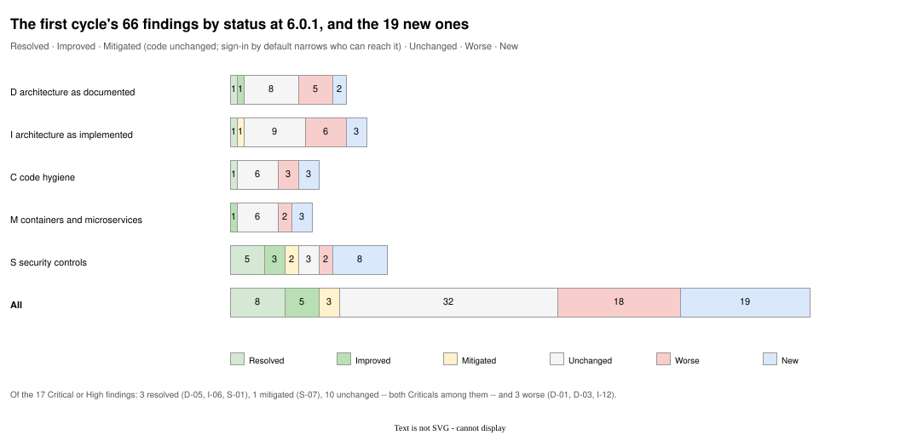

# From the first adversarial review to the second: what changed

**First cycle:** `v6_x_review`, commit `a625cf0` (release 5.6.1), 2026-10-03, five documents with `_enhanced` editions.
**Second cycle:** `v6_1_review`, commit `9b0b340` (release 6.0.1), 2026-10-04, the same five documents with `_enhanced` editions, and this one.

This document records what changed between the two: in the repository, in the method, in each of the first cycle's 66 findings, in the 51 plan items, and in the review itself where the first cycle was wrong or incomplete. It is written so that a third cycle can start from it.

## 1. What changed in the repository

Between the two commits the repository shipped 6.0.0 and 6.0.1: sign-in. `git diff --stat` between them (excluding generated images, lockfiles and the first cycle's own files) is 259 files, +24,774 / −779 lines. In outline:

| What | Before (5.6.1) | After (6.0.1) |
|---|---|---|
| Services in `docker-compose.yml` | 19 | 23 (`ldap`, `auth`, `directorygui`, `mlflowproxy`) |
| Volumes | 10 | 14 (`ldapdata`, `ldaptls`, `authdata`, `authkeys`) |
| Image families published together | 9 | 13 |
| Servers | 8 Postgres | 8 Postgres + OpenLDAP |
| Python packages | 5 | 8 (`nl2sql_auth`, `nl2sql_identity`, `nl2sql_ldap`; 4,968 new lines) |
| Web interfaces | 4 | 5 (the directory page, 1,362 lines) |
| nginx proxy images | 4 | 6 |
| Lines of shell in the three scripts | 2,846 | 3,208 |
| Lines in `docker-compose.yml` | 970 | 1,312 |
| Test functions | ~3,400 Python | 4,363 collected offline, 5,122 with Docker, Node and Java; 357 in `tests/auth` and `tests/ldap` |
| Authentication | one static token per service, empty by default | a session from a directory password checked by Postgres, on by default; the tokens optional |
| Who SQL runs as | the reader | the signed-in person (`SET LOCAL ROLE`) |
| Transport on the pages | the API HTTPS; pages HTTP | every page and proxy HTTPS with the API's certificate |
| The pipeline (`graph.py`, `present.py`, `api/models.py`) | — | unchanged |
| The dataset image | `retail-postgres:v1_1` | `retail-postgres:v1_1` |
| The spec | arch5.2 (2026-09-27) | arch5.2 |

The 6.0.1 changelog also records the release process: 6.0.0 was published with four defects that only running `start.sh` against the published images found, and 6.0.1 corrected them the next day.

## 2. What changed in the method

- **Ids are stable.** A finding that persists keeps its first-cycle id; a new one continues the sequence (D-16+, I-18+, C-11+, M-10+, S-16+). The first cycle did not anticipate this and numbered from 1; this cycle makes it the rule.
- **Every finding has a status**: Unchanged, Worse, Improved, Mitigated (the code is unchanged and the exposure is narrower because of a changed default), Resolved, New. The next cycle should add **Regressed**.
- **Every first-cycle citation was re-checked** at the new commit. Where a line number is repeated in the new documents, it is because the file did not change there (`graph.py` is 1,176 lines in both; `api/models.py:179` is the same class).
- **The changelog's "Checked live" sections were read as claims**, not as evidence: nothing was executed in either cycle.
- **New code was read in full**: `auth/nl2sql_identity`, `auth/nl2sql_auth`, `ldap/nl2sql_ldap`, `docker/auth_roles.sql`, `docker/ldap_hba.sh`, the six nginx templates and start-up fragments, the fifteen Dockerfiles, the whole of `docker-compose.yml`.
- **Plan items are tracked.** Each of the first cycle's 51 `V6-nn` items has a status in the new plan; new items continue the sequence from V6-52.

## 3. The first cycle's 66 findings, one by one

Severity is the first cycle's, then this cycle's. "Why" is the one fact that decides the status.

| Id | Was | Now | Status | Why |
|---|---|---|---|---|
| D-01 | High | High | Worse | arch5.2 still the authority; 6.0 and 6.0.1 shipped with no spec; "Designed, not built" at line 11 |
| D-02 | Medium | Medium | Worse | V6-01 decided in code; V6-02..05 untaken; the four 6.0 design answers recorded only in prose |
| D-03 | High | High | Worse | blueprint still stale and now silent on every role 6.0 created |
| D-04 | High | High | Unchanged | `present.py:249` still has no caller from the graph |
| D-05 | High | — | **Resolved** | `auth/README.md` names where a principal comes from; `Identity.principal` reaches `SET LOCAL ROLE` |
| D-06 | Medium | **High** | Worse | "one person on one machine" (`USAGE_GUIDE.md:1014`) beside sign-in by default; databases open; `README.md:1519` connects as the owner |
| D-07 | Medium | Medium | Improved | review token wording and query-string scope now true; `API.md:290` trace claim remains; new overstatement at `USAGE_GUIDE.md:352` |
| D-08 | Medium | Medium | Worse | nine servers, 23 services, 13 profiles, still unweighed |
| D-09 | Medium | Medium | Unchanged | read-write bind mount, no `USER`, no lock |
| D-10 | Low | Low | Unchanged | 13 families released together, unnamed |
| D-11 | High | High | Unchanged | `graph.py:1068` unchanged |
| D-12 | Medium | Medium | Unchanged | `graph.py:1088` unchanged |
| D-13 | Medium | Medium | Unchanged | `useAsk.ts:5` "fourteen pipeline nodes"; sign-in facts now in nine documents |
| D-14 | Low | Low | Unchanged | wording unchanged; the test is red (C-11) |
| D-15 | Low | Low | Unchanged | no tier named; `tests/auth` has the first posture tests |
| I-01 | High | High | Unchanged | `graph.py:1107-1112` |
| I-02 | High | High | Unchanged | `graph.py:1068, 1088, 1093, 1137` |
| I-03 | High | High | Unchanged | `api/models.py:179-185`, `translate.py:88` |
| I-04 | Medium | Medium | Unchanged | `explain_plan` gained `SET LOCAL ROLE`, not a timeout |
| I-05 | Medium | Medium | Unchanged | `_sample_rows`; `OLLAMA_BASE_URL` default remote |
| I-06 | High | — | **Resolved** | `Guard.require`; principal to `jobs.submit`; owners; `author()` |
| I-07 | Medium | Medium | Mitigated | `_prune_locked` unchanged; a `POST` loop needs an account |
| I-08 | Medium | Medium | Unchanged | `schema_retrieval.py:98`, `literals.py:166`, session-level `SET` ×3 |
| I-09 | Medium | Medium | Worse | one shared package (identity); env helpers ×5, `_redacted` ×3 |
| I-10 | Medium | Medium | Unchanged | `docker-compose.yml:640` |
| I-11 | Medium | Medium | Worse | review 1,537 lines; a fourth closure, `auth/app.py` 732 |
| I-12 | High | High | Worse | nine servers; catch-all `pg_hba` rule still last |
| I-13 | Medium | **High** | Worse | four presenters, eleven mounts; the reason for root (`auth/Dockerfile:18-19`) |
| I-14 | Medium | Medium | Worse | six nginx images; `session.ts`/`SignInGate.tsx` identical ×5 |
| I-15 | Medium | Medium | Worse | 3,208 lines; superuser SQL and `pg_hba` from `launch.sh` |
| I-16 | Low | Low | Unchanged | old caches as before; new ones have TTLs |
| I-17 | Low | Low | Unchanged | `corrections.py:293, 319`; feedback half withdrawn |
| C-01 | Medium | Medium | Worse | 2,380 identical front-end lines; ×5 env helpers; ×6 nginx |
| C-02 | Medium | Medium | Unchanged | 54 + 24 broad catches; +2 +2 annotated in new packages |
| C-03 | Medium | Medium | Worse | every unit larger; one new 732-line closure |
| C-04 | Medium | Medium | Unchanged | same three leaks |
| C-05 | Low | Low | Unchanged | "fourteen pipeline nodes" |
| C-06 | Medium | Medium | Worse | `.env` parser now reads passwords; superuser SQL from shell |
| C-07 | Medium | Medium | Unchanged | auth 5 of 6 pinned; rag 0 of 4; no hashes |
| C-08 | Low | Low | Unchanged | — |
| C-09 | Low | Low | Unchanged (narrowed) | feedback delete-then-insert has a recorded privilege reason; withdrawn for that half |
| C-10 | Low | — | **Resolved** (sessions) | `author()` prefers the principal; token path → S-19 |
| M-01 | High | High | Unchanged | 14 of 15 Dockerfiles without `USER`; the directory drops privileges in code |
| M-02 | Medium | Medium | Unchanged | floating tags; alpine 3.21 and 3.22 (M-12) |
| M-03 | High | High | Unchanged | zero hardening keys in 1,312 lines |
| M-04 | High | High | Unchanged | seven stores, no bind address |
| M-05 | Medium | Medium | Worse | eleven mounts (was seven) |
| M-06 | Medium | Medium | Improved | three secrets generated; 0600; `*_FILE` readers |
| M-07 | Medium | Medium | Worse | six proxies; twelve unverified health checks |
| M-08 | Critical | Critical | Unchanged | `init_db.sh:34-35`; `v1_1` still pinned |
| M-09 | Low | Low | Unchanged | — |
| S-01 | High | — | **Resolved** | sign-in on by default (in compose; S-17) |
| S-02 | Medium | — | **Resolved** | `hmac.compare_digest`, `guard.py:239` |
| S-03 | Medium | — | **Resolved** | `query_token` on the stream's dependency only |
| S-04 | Medium | **Low** | Mitigated | `*` still default on API and review; `SameSite=Strict`, no credentials with `*` |
| S-05 | Medium | Medium | Unchanged | `/readyz` open; exception text in responses |
| S-06 | Medium | — | **Resolved** | owners; 404 for strangers |
| S-07 | High | **Medium** | Mitigated | queue unbounded; needs an account; `EXPLAIN` untimed |
| S-08 | Critical | Critical | Unchanged | see M-04, M-08 |
| S-09 | Medium | Medium | Worse | four services on one key |
| S-10 | Medium | Medium | Improved | see M-06 |
| S-11 | Low | Low | Improved | person roles: 60 s timeout, `CONNECTION LIMIT 5`, read-only default; service roles none |
| S-12 | Medium | Medium | Unchanged | — |
| S-13 | Low | Low | Improved | query token logged on one route only; no filter |
| S-14 | Low | — | **Resolved** (sessions) | signed-in author; token path → S-19 |
| S-15 | Low | Low | Worse | twelve places (was four) |

**Figure 1. The first cycle's 66 findings by status, and the 19 new ones.** Eight resolved, five improved, three mitigated by the new default, thirty-two unchanged, eighteen worse. Both Criticals are unchanged; of the fifteen Highs, three are resolved, one mitigated, three worse and eight unchanged.

Also as [PNG](diagrams/v6_1_review_finding_status.png) · editable source [`v6_1_review_finding_status.drawio`](diagrams/v6_1_review_finding_status.drawio)

## 4. New findings

| Id | Severity | What |
|---|---|---|
| D-16 | High | The largest design change since arch4 has no design document: trust boundaries, credential worth and lifetime, alternatives, limits and promised properties are implied by code and stated nowhere a reviewer can hold the code to. |
| D-17 | Medium | Direct database access by people is documented as a feature; that it sends the password in clear text to a server without TLS is not. |
| I-18 | Low | The person's identity reaches `current_user` for one transaction and nothing else: `session_user`, logs and `pg_stat_activity` say the reader; no RLS; no `application_name`. |
| I-19 | Medium | Every service's start depends on the API's certificate volume and, for the auth service, on the API itself. |
| I-20 | Medium | Authorization is opt-in route by route (57 decorators across four services); nothing asserts that every route has a guard. |
| C-11 | Medium | A test that fails on every run (`test_no_benchmark_question_is_a_golden_pair_verbatim`) ships in the suite and is recorded as expected. |
| C-12 | Low | The shared identity package is copied into three images, with no version. |
| C-13 | Medium | 100% coverage in every language and four defects in the shipped 6.0.0; no tier starts the stack and uses it. |
| M-10 | Medium | The directory page is on loopback; its API is on the auth service's open port. |
| M-11 | Medium | The shared `0600` key is why four services run as root; the first plan ordered non-root before separate identities. |
| M-12 | Low | `alpine:3.21` and `alpine:3.22` in one release. |
| S-16 | High | A person's directory password crosses to a Postgres with no TLS, by clear-text `ldap` authentication, over a `host` rule, on a port open to the network; the auth service connects with `sslmode=prefer`; direct connection is documented. |
| S-17 | Medium | `AUTH_ENABLED` defaults `false` in every settings module and nginx fragment; only compose makes it `true`. |
| S-18 | Medium | No session revocation: sign-out, password change, password set and lockout leave sessions valid for eight hours; `jti` unused. |
| S-19 | Medium | The static service token, when set, is an identity with every role of its service and the self-asserted `X-Reviewer` as its only name. |
| S-20 | Low | The per-address throttle trusts the last `X-Forwarded-For` hop from a direct caller on the published auth port. |
| S-21 | Low | The rolesync password is passed as a `psql -v` argument through `docker compose exec`. |
| S-22 | Low | nginx overwrites `X-Forwarded-Proto`, so behind a TLS terminator the session cookie is set without `Secure`. |
| S-23 | Low | A replica's primary is reached without StartTLS by default; a warning, not a refusal. |

## 5. Severity before and after

| | Critical | High | Medium | Low | Total |
|---|---|---|---|---|---|
| First cycle (66) | 2 | 15 | 35 | 14 | 66 |
| Resolved | 0 | −3 (D-05, I-06, S-01) | −3 (S-02, S-03, S-06) | −2 (C-10, S-14) | −8 |
| Raised / lowered | 0 | +2 (D-06, I-13) −1 (S-07) | +1 (S-07) −2 (D-06, I-13) −1 (S-04) | +1 (S-04) | 0 |
| New | 0 | +2 (D-16, S-16) | +10 | +7 | +19 |
| **Second cycle (77)** | **2** | **15** | **40** | **20** | **77** |

The High count is unchanged at fifteen by coincidence: three resolved, one lowered, two raised, two new. The two Criticals are the same two findings.

### Critical and High, first cycle to second

| Finding | Was | Now |
|---|---|---|
| M-08 / S-08 superuser password, open port | Critical | Critical, unchanged |
| D-01 spec stale | High | High, worse |
| D-03 blueprint stale | High | High, worse |
| D-04 sensitive policy documented, dead | High | High, unchanged |
| D-05 no identity model | High | Resolved |
| D-11 field lifetimes | High | High, unchanged |
| I-01, I-02, I-03 pipeline trio | High | High, unchanged |
| I-06 no identity seam | High | Resolved |
| I-12 eight servers on every interface | High | High, worse (nine) |
| M-01 root everywhere | High | High, unchanged (one image fixed, four added) |
| M-03 no hardening | High | High, unchanged |
| M-04 seven stores open | High | High, unchanged |
| S-01 auth off by default | High | Resolved |
| S-07 queue DoS | High | Medium, mitigated |
| D-06 posture contradiction | Medium | **High**, worse |
| I-13 shared key | Medium | **High**, worse |
| D-16 no design for 6.0 | — | **High**, new |
| S-16 clear-text passwords to Postgres | — | **High**, new |

## 6. The first plan's 51 items

| Status | Count | Items |
|---|---|---|
| Done | 4 | V6-01, V6-10, V6-21, V6-30 |
| Superseded | 1 | V6-09 (tokens required → sign-in required) |
| Partial | 8 | V6-08, V6-11, V6-12, V6-20, V6-31, V6-38, V6-39, V6-46 |
| Open | 38 | the rest, including V6-06 and V6-07 (the Critical) and V6-15 to V6-19 (the pipeline) |

**What the plan said versus what shipped.** The first plan's release shape put Phases 1 and 2 (safe defaults, generated secrets, the pipeline fixes, the trace fields, `retail-postgres:v1_2`) in 6.0.0 and identity (V6-21, V6-30) in 6.1. What shipped as 6.0.0 was identity, done larger than recommended (a directory, groups, database-checked passwords, HTTPS everywhere), with Phases 1 and 2 untouched. The owner's four design decisions were made and implemented in one release; the Critical and ten Highs shipped under the major version that the decision justified. This is recorded as a fact about sequencing, not as a judgement of the identity work, which is good.

**New items** V6-52 to V6-71 (twenty) are in the new plan; nine are in Phase 1 because they are each under a day and each closes a new finding. One first-cycle item moved: V6-36 (separate TLS identities) from Phase 5 to Phase 1, because it is the prerequisite of V6-31 (non-root), which the first plan did not see.

## 7. Where the first cycle was wrong or incomplete

Recorded so the method improves.

1. **C-09 / I-17, the feedback writer's delete-then-insert.** The first cycle called it a hand-rolled idiom. `agent/nl2sql_agent/api/feedback.py:144-150` explains that `ON CONFLICT DO UPDATE` needs table-level `SELECT`, which would let the writer read every pending submission; the role was shaped to withhold exactly that. The first cycle read `store.py`'s column grants and not the docstring beside the code it faulted. Withdrawn for that half.
2. **D-14, benchmark independence.** The first cycle wrote "a test asserts none is golden-pair text verbatim" as if the test passed. It had been failing since 5.4; the first cycle did not run the suite (static review) and did not read the changelog's record of the failure. Now C-11.
3. **V6-31 and V6-36 were ordered wrongly.** The first plan put non-root images in Phase 4 and separate TLS identities in Phase 5 as independent items. The reason every Python image runs as root is the shared `0600` key (`auth/Dockerfile:18-19` says so; the first cycle's own M-05 described the sharing). The dependency was there to be read and was not. Now M-11, and V6-36 moves to Phase 1.
4. **S-01's fix was predicted as "tokens required".** It arrived as "sign-in required", which is better, and left the tokens as an optional unattributed channel the first cycle did not anticipate (S-19). A plan item should say the property wanted ("no anonymous caller by default") rather than the mechanism.
5. **The first cycle's figures.** Three of the ten (`repair_loop_state`, `trace_field_loss`, `row_data_flow`) are still exact at this commit because the code they draw did not change; the `_enhanced` editions of this cycle re-embed them unchanged and say so in their captions. The other seven describe 5.6.1 and are replaced by this cycle's figures.
6. **Counting.** The first cycle said "roughly 3,400 Python test functions"; the README's collector count, which a test holds, was 4,363 offline at this commit and is the number to quote.

## 8. For the third cycle

- Start from this file and `v6_1_review_summary.md`; keep every id; add **Regressed** to the status vocabulary.
- Check first whether V6-06, V6-07 and V6-52 landed: if the Critical is still open at a third cycle, the plan's Phase 1 is not being followed and the review should say so before anything else.
- Re-check the five pipeline findings by line number; they have been stable for two cycles and are the cheapest Highs in the plan.
- If `Multi-Agent_NL2SQL_arch6.md` exists, review it as the authority and move the sign-in design findings (D-16) to "as documented" conformance checks.
- If a `tests/security/` or acceptance tier exists (V6-49, V6-67), read it before reading the code: it is the project's own statement of what it defends.
- Keep the figures generated and tested; the first cycle's tooling (`adversary_reviews/diagrams/generate.py`, `tests/docs/test_review_diagrams.py`) carried into this cycle unchanged in shape and gained a second cycle's figures.
