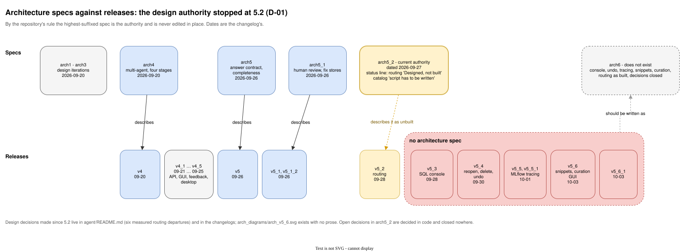
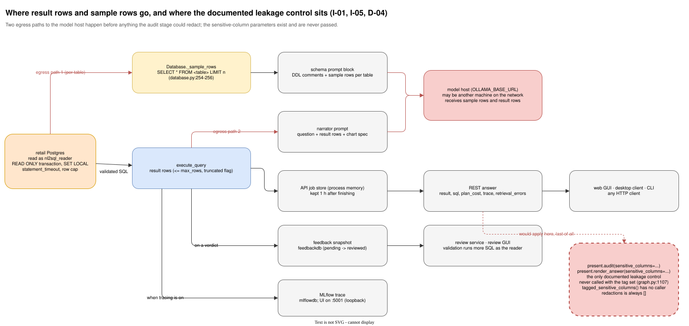
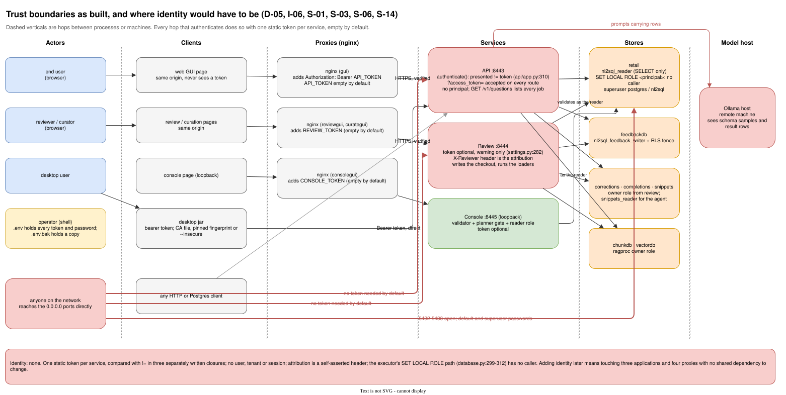
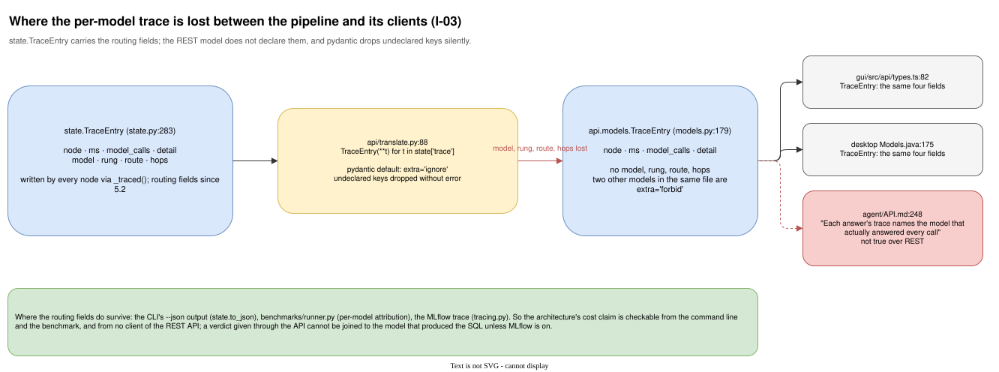
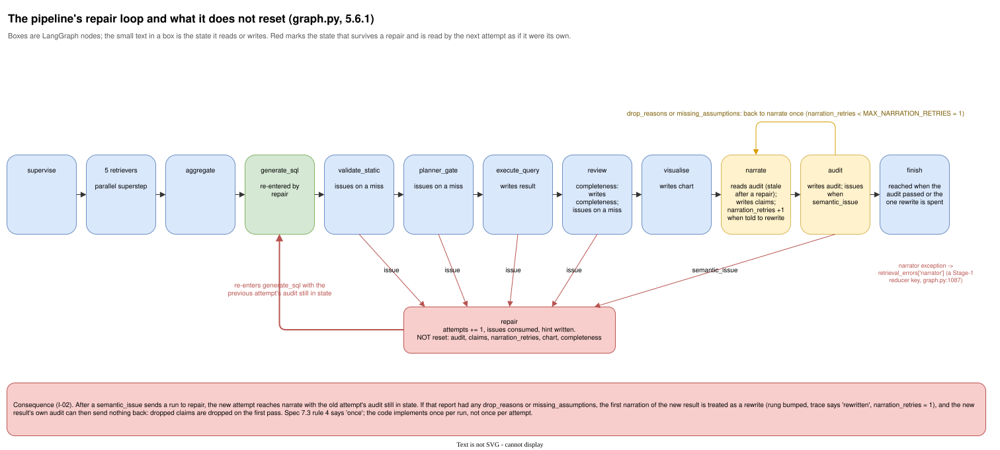

# Adversarial review, v6.x cycle: the architecture as documented

**Reviewed at:** commit `a625cf0` (release 5.6.1), branch `misc/adversary-review/v6_x`, 2026-10-03.
**Review tag:** `v6_x_review`. This is the first of a repeating exercise; later cycles should diff against this file.
**Companion documents:** [`v6_x_review_architecture_as_implemented.md`](v6_x_review_architecture_as_implemented.md), [`v6_x_review_implementation.md`](v6_x_review_implementation.md), [`v6_x_review_mitigation_plan.md`](v6_x_review_mitigation_plan.md) (the combined plan), [`v6_x_review_summary.md`](v6_x_review_summary.md).

> **Enhanced edition.** The text below is [`v6_x_review_architecture_as_documented.md`](v6_x_review_architecture_as_documented.md) unchanged, with 5 figures added (1 architecture specs against releases; 2 where sample rows and result rows go; 3 trust boundaries as built; 4 the per-model trace over REST; 5 the repair loop and what it does not reset). Each figure is an SVG rendered by draw.io from the `.drawio` source in [`diagrams/`](diagrams/), with a PNG beside it. The original file is untouched.

## Scope and method

This document reviews the architecture **as the repository describes it**, not as the code does it. The question asked of every source was: if a competent engineer joined tomorrow and read only the documentation, would they form a correct and complete picture of the system, its boundaries, its security posture and its failure behaviour, and would the design they read be a sound one?

Sources read in full or in large part:

- `multi-agent_arch_specs/Multi-Agent_NL2SQL_arch5_2.md` (the current spec by the repository's own rule that a higher suffix supersedes a lower one), with `arch5_1.md`, `arch5.md` and `arch4.md` for lineage.
- `README.md`, `USAGE_GUIDE.md`, `QUICKSTART.md`, `CHANGELOG.md`, `CHANGELOG_SIMPLE.md`.
- `agent/README.md`, `agent/API.md`, `review/README.md`, `rag/README.md`, `console/README.md`, `curate/README.md`, `gui/README.md`, `desktop/README.md`, `benchmarks/README.md`, `models/README.md`, `data_gen/README.md`.
- `arch_diagrams/generate.py` (the diagrams are generated from it, so it is documentation).

Where a documented claim was checked against code, the check is noted and the detailed code finding lives in the implemented-architecture review. LLM-specific security (prompt injection, retrieved-text-as-instructions) is out of scope for this cycle by request.

Finding IDs are `D-nn`. Severity is Critical / High / Medium / Low. Confidence is **Verified** (the cited text was read) or **Inferred** (a conclusion drawn from what was read).

## 1. Verdict

The documentation is unusually good at explaining *why* and unusually weak at staying *current*. Every module, script and container carries a rationale a reader can argue with, the changelog is honest about mistakes, and tests hold numbers in the READMEs to the code. But the architecture specification that the whole repository points to as its design authority stopped at 5.2 (dated 2026-09-27), and four minor releases have shipped since with no spec of their own. The spec's own status line still says model routing is "Designed, not built". Its security blueprint describes controls the code never had, has since gained, or has in a weaker form. And several of the design's load-bearing security promises (the sensitive-column policy, the per-model trace in the API, the review token being "not optional") are stated in the documents and not kept by the implementation, which means a reader of the docs believes in protections that do not exist.

The design itself, read on its own terms, is sound in the data path (screen → retrieve → generate → static validate → plan gate → execute as a read-only role → review → narrate → audit) and thin in the control plane: there is no identity model, no threat model, no deployment-tier model, and the decomposition into eight database servers and four proxy images is asserted rather than argued.

## 2. What the documentation does well

Credit where it is due, because the plan below should preserve these:

- **Reasoning is recorded.** `agent/README.md` lists six places the code departs from the spec and why each was found by running it. `benchmarks/README.md` records what the first run got wrong. `CHANGELOG.md` records what broke after publishing. This is rare and valuable.
- **Numbers are tested.** `tests/docs/test_docs.py` and `tests/docs/test_versions.py` hold settings tables, counts and version declarations to the code. Stale counts have been caught repeatedly (CHANGELOG 5.4, 5.5, 5.6.1).
- **The security section in `USAGE_GUIDE.md` is honest.** It says plainly that the stack is set up for one person on one machine, that the API has no token, and that the databases are published with development passwords.
- **Supersession is explicit.** Each spec says what it supersedes; the repository rule (never edit `archN` in place, write `archN+1`) gives a stable history.

## 3. Findings

### 3.1 Spec currency and supersession

**D-01 · High · Verified — The design authority is four releases behind, and says so wrongly.**
`Multi-Agent_NL2SQL_arch5_2.md` lines 3–13 describe routing as "**Designed, not built:** section 10, Phase 8, is the plan, and the READMEs describe the code as it is, which sends every call to the one model `OLLAMA_MODEL` names." Routing shipped in 5.2.0 on 2026-09-28. The component table (line 849 onward) still says of the model catalog "the script has to be written". Since then 5.3 added the SQL console (a new service and a new way to run SQL as the reader), 5.4 added reopen/delete with undo across the golden set and fix stores, 5.5 added MLflow tracing (a new service, a new database, a new data flow carrying every question's rows), and 5.6 added a fifth retriever, a seventh Postgres server and a fourth web interface. None has an architecture document. `arch_diagrams/arch_v5_6.svg` exists; the prose does not.
*Why it matters:* the repository's own rule makes the highest-suffixed spec the authority. A reader who follows that rule is told routing does not exist and is told nothing about the console, tracing or snippets. The six documented routing departures live in `agent/README.md`, not in any spec, so the design record is split across a stale spec and a current README.

**Figure 1. Architecture specs against releases.** The highest-suffixed spec, arch5.2, is dated 2026-09-27 and describes routing as unbuilt; the five releases since have no spec, and the decisions made in that time live in `agent/README.md` and the changelogs.

Also as [PNG](diagrams/v6_x_review_spec_lineage.png) · editable source [`v6_x_review_spec_lineage.drawio`](diagrams/v6_x_review_spec_lineage.drawio)

**D-02 · Medium · Verified — Open decisions are never closed.**
The spec carries a numbered list of open decisions. Several have been decided in code (the six routing departures; "ignore, not refuse" a foreign catalog), and none is marked closed in any spec. Because `archN` is never edited, the only way to close a decision is `archN+1`, which has not been written.

### 3.2 The security architecture as written

**D-03 · High · Verified — The security blueprint (section 8) describes a reader role the repository does not create.**
Section 8's Credentials row (line 782) says the reader has `SET statement_timeout = '30s'` and `SET work_mem` bounded at the role, and adds "**Today the agent connects as `nl2sql`, the owner.**" Checked against `docker/reader_role.sql`: the role gets `default_transaction_read_only = on`, `GRANT SELECT`, and the `CONNECT`/`pg_cancel_backend`/`pg_terminate_backend` revocations, but no `statement_timeout` and no `work_mem`. The timeout is applied per transaction by the executor instead (`database.py:312`), which protects the agent's path but not any other consumer of the role, and nothing bounds `work_mem` anywhere. The "today the agent connects as the owner" sentence has been false since 3.1 (CHANGELOG v3_1).
*Why it matters:* the blueprint is the one place the security design is stated as a table of rules. Two of its rules are not implemented and one of its facts is stale, so the table cannot be used as a checklist, which is its purpose.

**D-04 · High · Verified — A control is documented that cannot take effect: the sensitive-column policy.**
Section 7.3 rule 3 (line 746) and section 8's Output row say columns tagged sensitive "never appear in the narrative or the table, only their aggregates", and `agent/API.md` documents `audit.redactions` on every answer. The implemented-architecture review (I-01) confirms the tag reader exists in `present.py` and is never called from the graph, so `redactions` is always empty. As a *design*, the policy is also underspecified: it is applied at presentation, after the rows have been fetched, sent to the narrator model, held in the job store for an hour, snapshotted into the feedback staging table and recorded in an MLflow trace. A redaction performed last protects nothing that left earlier. The spec even notes "the retail schema has none", which is the honest reason nobody noticed.
*Why it matters:* a reader of API.md and the spec believes a data-leakage control exists. The plan must either make it real at the right layer (the executor or the schema prompt) or remove the claim.

**Figure 2. Where sample rows and result rows go.** Both egress paths to the model host happen before anything the audit stage could redact. The sensitive-column parameters in `present.py` exist and are never passed by the graph, so `redactions` is always empty.

Also as [PNG](diagrams/v6_x_review_row_data_flow.png) · editable source [`v6_x_review_row_data_flow.drawio`](diagrams/v6_x_review_row_data_flow.drawio)

**D-05 · High · Verified — The documented architecture has no identity model, and the one it gestures at is unreachable.**
Section 8's Row-level-security row says RLS is "production requirement, not implemented in the test system: the executor runs `SET ROLE <principal>`... `principal` is in the state contract so the executor can." That plumbing exists (`database.py:299–312`). But no document says where a principal would come from. The API, the review service and the console each authenticate with one static bearer token; the review service attributes promotions to a self-asserted `X-Reviewer` header. There is no notion of user, tenant, role or session anywhere in the design. So the documented path to RLS has a hole exactly where authentication would be.
*Why it matters:* the project is explicitly heading toward multi-user use (four GUIs, a desktop client, a review queue with reviewer attribution). Adding identity later to three independently written FastAPI apps and four proxies is far more expensive than designing the seam now.

**Figure 3. Trust boundaries as built.** Every hop that authenticates does so with one static token per service, empty by default. Nothing carries an identity, reviewer attribution is a self-asserted header, and the executor's `SET LOCAL ROLE` path has no caller.

Also as [PNG](diagrams/v6_x_review_trust_boundaries.png) · editable source [`v6_x_review_trust_boundaries.drawio`](diagrams/v6_x_review_trust_boundaries.drawio)

**D-06 · Medium · Verified — Documented defaults contradict the documented posture.**
`USAGE_GUIDE.md` lines 946–966 say the stack is "set up for one person on one machine." `README.md`, `agent/API.md` and the four GUI READMEs describe a REST API with tokens, CORS, TLS and a desktop client, i.e. a network service. `docker-compose.yml` publishes seven Postgres servers on every interface with default passwords, the API and three GUIs on every interface with no token, and only the console and MLflow on loopback. The documentation does not reconcile these: there is no threat model, no definition of deployment tiers (personal / shared LAN / exposed), and no hardening checklist beyond five bullets. A reader following `QUICKSTART.md` ends up with an unauthenticated API and seven databases open to the network, and has been told this is fine because it is "one machine".
*Why it matters:* "development defaults" are the defaults everyone runs. The documents normalise a posture they also admit is unsafe to share.

**D-07 · Medium · Verified — Documented controls are stronger than the implemented ones.**
Three cases where the documents promise more than the code delivers (details in the companion reviews):
- `review/README.md` line 599: the review token is "Not optional the way the agent's token is." `review/nl2sql_review/settings.py` lines 136, 212 and 282–286 make it optional with a start-up warning.
- `agent/API.md` and the GUI comments say the query-string token is accepted "for this one route" (the event stream). The single `authenticate` dependency accepts `?access_token=` and is attached to every guarded route (`agent/nl2sql_agent/api/app.py:298–318`, applied at lines 389–700).
- `agent/API.md` line 248: "Each answer's trace names the model that actually answered every call." The REST `TraceEntry` has no model field (`api/models.py:179–185`); the field is dropped in translation.
*Why it matters:* documentation that overstates controls is worse than documentation that is silent, because it stops people checking.

**Figure 4. The per-model trace over REST.** The state's `TraceEntry` carries `model`, `rung`, `route` and `hops`; the API's `TraceEntry` declares four fields and pydantic drops the rest without error. Both clients mirror the four-field shape, and API.md claims the opposite.

Also as [PNG](diagrams/v6_x_review_trace_field_loss.png) · editable source [`v6_x_review_trace_field_loss.drawio`](diagrams/v6_x_review_trace_field_loss.drawio)

### 3.3 Decomposition and topology as designed

**D-08 · Medium · Verified — Eight database servers are asserted, not argued.**
The deployment table and `rag/README.md` explain why each *store* exists (knowledge chunks, vectors, feedback staging, corrections, completions, snippets, MLflow). No document weighs a store-per-server design against one or two Postgres/pgvector clusters with a database or schema per store and a role per consumer. The cost is paid in the docs themselves: seven published ports, seven passwords, seven volumes, seven healthchecks, a "reader role recreated on every start" story told separately for retail (`reader_role.sql`), snippets (`07_load_snippets.py`) and feedback (`store.py`), and a `setup.sh`/`launch.sh` pair that has grown to nearly 2,000 lines partly to orchestrate them.
*Why it matters:* every added server multiplies the security surface and the operational surface, and the design record gives a future maintainer no basis for deciding whether the next feature deserves its own server too.

**D-09 · Medium · Verified — The review service is documented as one service with four unrelated responsibilities.**
`review/README.md` describes a staging-queue API, a promotion engine that rewrites a tracked markdown document in the developer's checkout (the "markdown-first" decision), a runner for the RAG loaders, a SQL validator against the retail database, and since 5.6 a curation API and a schema endpoint. The markdown-first decision is a recorded user decision and is not re-litigated here. What the documents leave open: there is no described concurrency model for two reviewers promoting at once (the document is a file; `.bak` is the only described safety), no described audit trail other than "look at the git diff", and the fact that a running container writes into the source tree is stated as a mount rather than discussed as a design choice with consequences (root-owned files, uncommitted state, a service that cannot run without a checkout).

**D-10 · Low · Verified — "Services" that cannot be deployed independently.**
`CHANGELOG.md` states that all app images are released together at one version, and `tests/docs/test_versions.py` enforces it. The agent image carries three entry points (CLI, API, console). The four proxy images differ only in which token and upstream they hold. The documentation calls these microservices; the release rule makes them a modular monolith shipped as containers. Either is a legitimate choice, but the docs should name the one that was made, because it changes what "a service" may assume about its neighbours' versions.

### 3.4 The state contract and failure semantics

**D-11 · High · Verified — The state contract does not say which fields live for an attempt and which for a run.**
Section 7.3 rule 4 says unsupported claims go back to the narrator "once". The state contract (spec section on state; `state.py`) lists `audit`, `claims`, `narration_retries`, `issues`, `attempts` without saying which are reset when the repair loop re-enters `generate_sql`. The implemented-architecture review (I-02) shows the consequence: after an audit `semantic_issue` sends the run to repair, the previous attempt's `audit` is still in state when the new attempt reaches `narrate`, so the new narration is treated as a rewrite of the old one and the once-only budget is spent before the new result has been audited. This is a design gap that produced a real defect, not merely an implementation slip.
*Why it matters:* a repair loop is only as correct as the definition of what it resets.

**Figure 5. The repair loop and what it does not reset.** Nothing on the repair edge clears `audit`, `claims` or `narration_retries`, so the next attempt's first narration is read as a rewrite of the previous one and the once-only renarration is spent before the new result has been audited.

Also as [PNG](diagrams/v6_x_review_repair_loop_state.png) · editable source [`v6_x_review_repair_loop_state.drawio`](diagrams/v6_x_review_repair_loop_state.drawio)

**D-12 · Medium · Verified — Failure channels are overloaded in the contract.**
`retrieval_errors` is documented as the Stage-1 retrievers' failure record (five branches, one reducer). The narrator's failure is written to the same key (`graph.py:1087`), and the API surfaces it under `retrieval_errors`. The contract has no general "node failures" field, so Stage-4 failures masquerade as retrieval failures to every client.

### 3.5 Consistency between documents

**D-13 · Medium · Verified — Narrative drift is not tested; only numeric drift is.**
The docs tests catch counts and settings rows. They cannot catch the stale "Designed, not built", the stale "connects as the owner", the API.md trace claim, or the GUI comment in `gui/src/api/useAsk.ts` that describes "fourteen pipeline nodes" when the graph has eighteen. The same facts are restated across `README.md`, `USAGE_GUIDE.md`, `QUICKSTART.md`, `agent/README.md`, `agent/USAGE.md`, `agent/API.md` and the two changelogs; each restatement is a place to drift.

**D-14 · Low · Verified — Benchmark independence is documented more strongly than it is guaranteed.**
`benchmarks/README.md` says the fifteen questions are "deliberately not the 45 golden pairs" and a test asserts none is golden-pair text verbatim. Since 4.4 the golden set grows from promoted feedback, and two benchmark questions have been promoted into it (B03 and B14 correspond to Q46 and Q47). Whether that is acceptable is the project owner's decision and has been made; the finding here is only that the documentation still describes the old guarantee and the test checks verbatim text, not provenance.

### 3.6 The testing strategy as documented

**D-15 · Low · Inferred — Coverage is presented as the quality gate; security and architecture conformance have no documented tier.**
The READMEs describe 100% statement and branch coverage across Python, four web interfaces and the desktop client, plus shell coverage, Docker-gated tests and live least-privilege tests (`tests/agent/test_least_privilege_live.py`). That is excellent. What the documented strategy lacks is a tier for *posture*: nothing documented asserts what the default compose exposes, that token comparison is constant-time, that query-string tokens are scoped, or that the spec's security table matches `reader_role.sql`. The repository already has the pattern (docs tests that read compose); the strategy just does not name security as a thing the tests defend.

## 4. Mitigation, repair and improvement plan (documentation)

Ordered so that each step has what it needs. Items marked **(code first)** depend on an implementation fix recorded in the companion reviews; the documentation should describe the fixed behaviour, not the current one. The repository rule that a spec is never edited in place is respected: all spec changes go into a new `Multi-Agent_NL2SQL_arch6.md`.

| # | Action | Addresses | Depends on | Effort |
|---|---|---|---|---|
| P1 | **Decide and record the identity model** as a design decision: single shared token per service (current), or authenticated principals (who issues them, how they map to `principal` and to reviewer attribution). This is a user decision; the rest of the plan branches on it. | D-05 | — | S (decision) |
| P2 | **Decide the fate of the sensitive-column policy**: implement it at the executor/schema-prompt layer, or delete the claim from spec, API.md and the `redactions` field. | D-04 | — | S (decision) |
| P3 | **Write `Multi-Agent_NL2SQL_arch6.md`** superseding 5.2: status line reflecting what is built; sections for the console (5.3), reopen/undo (5.4), tracing (5.5), snippets and curation (5.6); fold the six routing departures from `agent/README.md` into the spec as decisions; close every open decision that code has decided; add a **field-lifetime table** to the state contract (per-run vs per-attempt vs per-narration, and which node resets what); add a **node-failure channel** distinct from `retrieval_errors`. | D-01, D-02, D-11, D-12 | P1, P2, and the code fixes I-01/I-02/I-03 so the spec describes the repaired behaviour | L |
| P4 | **Rewrite the security blueprint in arch6 as a verified table**: every row names the file and line that implements it and the test that checks it; remove "today the agent connects as the owner"; state the role-level timeout/work_mem rule or drop it to match `reader_role.sql` after the implementation decision. | D-03, D-07 | P3; S-plan items in the implementation review | M |
| P5 | **Add a threat model and deployment tiers** (`SECURITY.md` or an arch6 section): assets, actors, trust boundaries (browser → proxy → API → DBs → model host), and three named tiers (personal machine / shared LAN / exposed) with the compose settings each requires. Point `QUICKSTART.md` and `USAGE_GUIDE.md` at it; make the Security section a checklist rather than prose. | D-06 | P1 | M |
| P6 | **Correct the overstated controls in place** (these are docs, not specs, so they may be edited): `review/README.md` token wording to match the code or **(code first)** the code to match the wording; `agent/API.md` query-string-token scope **(code first)**; `agent/API.md` trace/model claim **(code first)**. | D-07 | S-03/S-01/I-03 fixes | S |
| P7 | **Record the topology decision**: an arch6 section that weighs store-per-server against a shared cluster and either justifies the current eight or sets the consolidation target. Record the "released together" rule as "modular monolith in containers" and say what services may assume about each other. | D-08, D-10 | P1 | M |
| P8 | **Document the review service's write model**: concurrency between reviewers, the `.bak` strategy, root-owned files, what is and is not in git after a promotion, and the recovery procedure. If the implementation review's recommendation (the service writes through a library with a lock and the loaders run in-process) is adopted, document that instead. | D-09 | I-08 decision | S |
| P9 | **Add narrative-drift tests**: a conformance table in arch6 (spec section → module → test) read by a docs test, so a row that names a function or file that no longer exists fails; a test that greps for a small list of forbidden stale phrases in docs and code comments ("Designed, not built", "fourteen pipeline nodes", "connects as `nl2sql`, the owner"). | D-13 | P3 | S |
| P10 | **Update `benchmarks/README.md`** to describe how the golden set now grows and what the independence test does and does not guarantee, in line with the owner's decision on B03/B14. | D-14 | — | S |
| P11 | **Name a security test tier** in `README.md`'s testing section and seed it with the posture tests from the implementation review (default exposure, constant-time compare, query-token scope, role grants vs spec table). | D-15 | S-plan items | S |
| P12 | **Reduce restatement**: pick one home per fact (ports and defaults → compose plus one table; settings → the service README; flags → `--help` plus one table) and make other documents link rather than repeat. Extend `tests/docs/test_docs.py` to the new single sources. | D-13 | P3 | M |

Effort key: S under a day, M one to three days, L a week or more.
