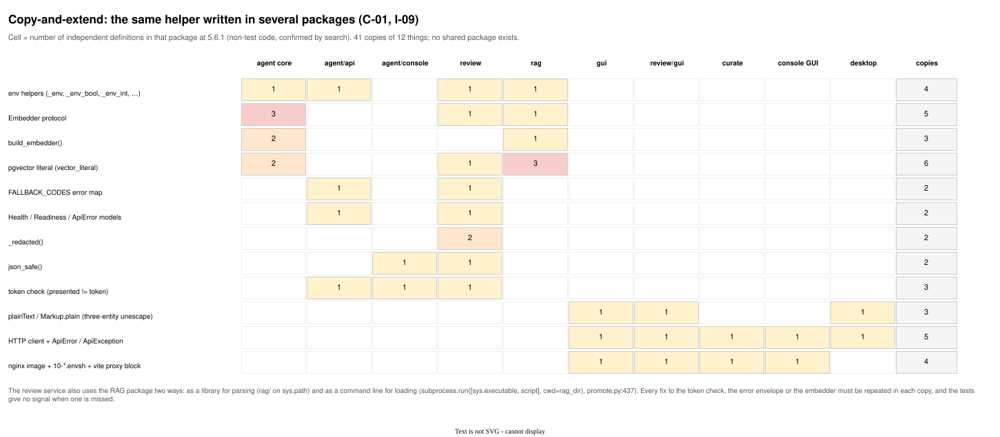
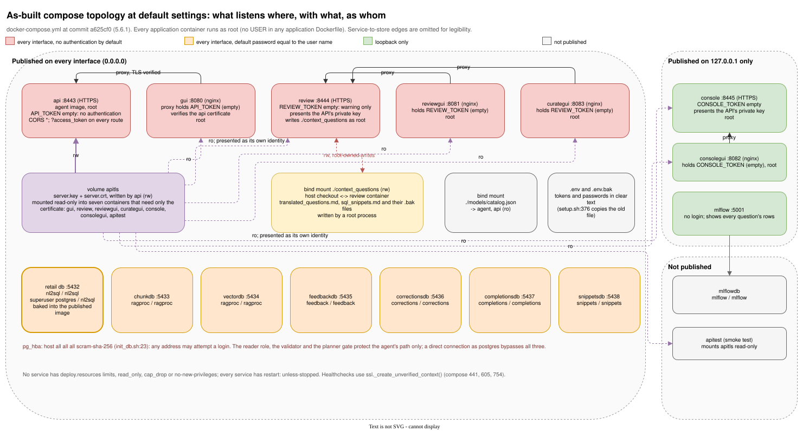

# Adversarial review, v6.x cycle: the architecture as implemented

**Reviewed at:** commit `a625cf0` (release 5.6.1), branch `misc/adversary-review/v6_x`, 2026-10-03.
**Review tag:** `v6_x_review`.
**Companion documents:** [`v6_x_review_architecture_as_documented.md`](v6_x_review_architecture_as_documented.md), [`v6_x_review_implementation.md`](v6_x_review_implementation.md), [`v6_x_review_mitigation_plan.md`](v6_x_review_mitigation_plan.md), [`v6_x_review_summary.md`](v6_x_review_summary.md).

> **Enhanced edition.** The text below is [`v6_x_review_architecture_as_implemented.md`](v6_x_review_architecture_as_implemented.md) unchanged, with 6 figures added (1 where sample rows and result rows go; 2 the repair loop and what it does not reset; 3 the per-model trace over REST; 4 trust boundaries as built; 5 copy-and-extend across packages; 6 the compose topology at default settings). Each figure is an SVG rendered by draw.io from the `.drawio` source in [`diagrams/`](diagrams/), with a PNG beside it. The original file is untouched.

## Scope and method

This document reviews the architecture **as the code realises it**: the pipeline graph and its state, the services and their boundaries, the data flows between them, and the deployment topology that `docker-compose.yml` and the three shell scripts build. It asks where the implementation departs from the design, where the design's promises are not kept, and where the structure itself will resist the next round of changes.

Method: static reading of the agent package (`agent/nl2sql_agent/`), the API and console sub-packages, the review service (`review/nl2sql_review/`), the RAG package and loaders (`rag/`), the four web clients, the desktop client, the Dockerfiles, `docker-compose.yml`, `setup.sh`, `launch.sh`, `start.sh`, and the test suite's shape. No code was executed and nothing in the sibling `fireworks_nl2sql` folder was consulted. Line numbers are as of the reviewed commit. Line-level hygiene, container hardening and individual security controls are in the implementation review; this document stays at the level of structure and behaviour.

Finding IDs are `I-nn`. Severity is Critical / High / Medium / Low. Confidence is **Verified** (read in the code) or **Inferred**.

## 1. Verdict

The data path is implemented faithfully and in places better than the spec: the Supervisor, five parallel retrievers, aggregator, pglast validator, planner gate, read-only executor under the reader role, Completeness Reviewer, narrator and audit are all there, each timed into a trace, with a single repair budget. The least-privilege work on the databases is real and tested live.

Three defects sit in the presentation and audit stage where the architecture's correctness claims are made: the sensitive-column control is dead code, the audit report leaks across repair cycles and spends the narrator's once-only rewrite on the wrong attempt, and the per-model trace that the API promises never leaves the process. Around the pipeline, the system has grown by accretion into three independently written FastAPI applications, four copies of one nginx image, eight Postgres servers and nearly 3,000 lines of shell orchestration, with no shared platform package and no seam for identity. The code is clean module by module; the structure between modules is where the risk is.

## 2. Where the implementation is stronger than the spec

- **Least privilege is real.** `docker/reader_role.sql` revokes `CONNECT` on every other database from `PUBLIC` and `EXECUTE` on `pg_cancel_backend`/`pg_terminate_backend`; the feedback writer in `review/nl2sql_review/store.py` gets column-level grants and row-level-security policies fencing it to `state = 'pending'`; the snippet reader gets `SELECT` and nothing else. `tests/agent/test_least_privilege_live.py` exercises these against a real server.
- **The static validator denies by function name anywhere in the tree** (`validate.py:183–193`), including `pg_sleep`, `pg_read_file`, `lo_import` and `dblink`, which the spec only sketched.
- **Routing departures were measured, not guessed.** Each of the six departures in `agent/README.md` cites the benchmark run that forced it.
- **Clients were built to the contract and in two languages**, and the desktop client's TLS story (CA file, pinned fingerprint, or an explicit and loudly labelled `--insecure`) is better than most.

## 3. Findings

### 3.1 Pipeline behaviour versus the design

**I-01 · High · Verified — The sensitive-column policy is dead code.**
`present.tagged_sensitive_columns(schema)` (`present.py:249`) reads the comment tag the spec describes. `present.audit(..., sensitive_columns=...)` (`present.py:814`) and `present.render_answer(..., sensitive_columns=...)` (`present.py:951`) accept the set. The graph never passes it: `_audit` calls `present.audit(state.get("claims", []), result, question=..., assumptions=...)` (`graph.py:1107–1112`) and `_finish` calls `render_answer` without it (`graph.py:1146–1157`). A repository-wide search finds no caller of `tagged_sensitive_columns` outside `present.py`. Consequences: `AuditReport.redactions` is always empty; the API field `audit.redactions` documented in `agent/API.md` can never be non-empty; the console, the review validator and the MLflow trace have no equivalent at all. Also by design the policy runs after rows have been fetched, narrated by a model, stored in the job store and snapshotted to feedback, so even wired up it would redact last. The retail schema has no tagged columns, which is why no test caught it.

**Figure 1. Where sample rows and result rows go.** Both egress paths to the model host happen before anything the audit stage could redact. The sensitive-column parameters in `present.py` exist and are never passed by the graph, so `redactions` is always empty.

Also as [PNG](diagrams/v6_x_review_row_data_flow.png) · editable source [`v6_x_review_row_data_flow.drawio`](diagrams/v6_x_review_row_data_flow.drawio)

**I-02 · High · Verified — The audit report is stale across repair cycles, and the narrator's rewrite budget is spent on the wrong attempt.**
`_narrate` builds its `rejected` list from `state.get("audit")` (`graph.py:1068–1073`). `_route_after_audit` sends a `semantic_issue` to `repair` (`graph.py:1125–1131`), which re-enters `generate_sql` → validate → plan → execute → review → visualise → `narrate`. Nothing on that path writes `audit`, `claims` or `narration_retries` (the only writer of `audit` is `_audit` itself, lines 1102–1113), so when the **new** attempt reaches `_narrate`:
- if the stale report has any `drop_reasons` or `missing_assumptions`, the first narration of the new result is treated as a rewrite: the narrator is told to fix claims about rows it has never seen, the rung is bumped (`complexity.narrator_rung(result, rewrite=True)`), the trace says "(rewritten)", and `narration_retries` becomes 1 (`graph.py:1092–1093`);
- the new result's own audit then cannot send anything back, because `MAX_NARRATION_RETRIES = 1` (`graph.py:137`) and the counter is already 1 (`graph.py:1137–1140`); dropped claims are dropped for good on the first pass.
The spec's rule 4 ("once") is therefore implemented as "once per run" when it means "once per attempt". Separately, a narrator exception is recorded as `retrieval_errors["narrator"]` (`graph.py:1087`), a Stage-1 reducer key, so every client reports a Stage-4 failure as a retrieval failure.

**Figure 2. The repair loop and what it does not reset.** Nothing on the repair edge clears `audit`, `claims` or `narration_retries`, so the next attempt's first narration is read as a rewrite of the previous one and the once-only renarration is spent before the new result has been audited.

Also as [PNG](diagrams/v6_x_review_repair_loop_state.png) · editable source [`v6_x_review_repair_loop_state.drawio`](diagrams/v6_x_review_repair_loop_state.drawio)

**I-03 · High · Verified — The per-model trace does not leave the process.**
`state.TraceEntry` carries `model`, `rung`, `route` and `hops` (`state.py:283–299`). The API's `TraceEntry` has only `node`, `ms`, `model_calls`, `detail` (`api/models.py:179–185`); `translate.answer_from_state` builds it with `TraceEntry(**t)` (`api/translate.py:88`), so pydantic drops the four routing fields silently. The web client (`gui/src/api/types.ts:82–87`) and the desktop client (`desktop/.../Models.java:175`) mirror the four-field shape. `agent/API.md:248` says each answer's trace names the model that answered. Consequences: no REST client can attribute an answer to a model; a verdict given through the API cannot be joined to the model that produced the SQL except via MLflow when tracing is on; the architecture's "economic claim" is checkable from the CLI and benchmark only. The spec's "Per-model trace" row (`arch5_2` component table) is satisfied in-process only.

**Figure 3. The per-model trace over REST.** The state's `TraceEntry` carries `model`, `rung`, `route` and `hops`; the API's `TraceEntry` declares four fields and pydantic drops the rest without error. Both clients mirror the four-field shape, and API.md claims the opposite.

Also as [PNG](diagrams/v6_x_review_trace_field_loss.png) · editable source [`v6_x_review_trace_field_loss.drawio`](diagrams/v6_x_review_trace_field_loss.drawio)

**I-04 · Medium · Verified — The planner gate's `EXPLAIN` runs without a timeout.**
`Database.run_select` sets `SET LOCAL statement_timeout` (`database.py:312`); `Database.explain_plan` (`database.py:272–296`) does not. Planning is usually milliseconds, but planning time is unbounded for pathological joins and large `IN` lists, and the console exposes `EXPLAIN` directly to anyone with its token. The spec's Transaction row says the read-only transaction covers "every statement, including EXPLAIN"; the role's `default_transaction_read_only` makes that true, but the timeout rule does not extend to it.

**I-05 · Medium · Verified — Raw sample rows flow to the model host as part of the schema prompt.**
`Database._sample_rows` runs `SELECT * FROM <table> LIMIT n` (`database.py:254–256`) and the rows are inlined in the schema block the generator sees. With a remote `OLLAMA_BASE_URL` (the committed catalog describes `192.168.10.82`), real rows leave the host on every question. There is no data-classification gate between the database and the prompt, and I-01 means the only documented control sits downstream of this flow. This is a data-egress architecture point, not a prompt-injection one.

### 3.2 Identity, authorisation and tenancy

**I-06 · High · Verified — There is no identity seam; the RLS path exists and is unreachable.**
`Nl2SqlAgent.run(question, principal=...)` (`graph.py:415–428`) threads a principal into state; `Database.run_select` does `SET LOCAL ROLE` when one is supplied (`database.py:299–312`). No entry point supplies one: the API, the console and the CLI never set it (a search of `agent/nl2sql_agent/api` and `console` finds no `principal`). Authentication is one static token per service, checked by three separately written closures (`api/app.py:293–318`, `console/app.py:169`, `review/app.py:369`). Reviewer attribution is a self-asserted header: `X-Reviewer` is read at `review/app.py:799` and `969` and used as `reviewer or found.reviewer`. Consequences: `GET /v1/questions` returns every job to any token holder (`api/app.py:485–486`); no action anywhere is attributable to a person; adding identity later means touching three apps and four proxies with no shared dependency to change.

**Figure 4. Trust boundaries as built.** Every hop that authenticates does so with one static token per service, empty by default. Nothing carries an identity, reviewer attribution is a self-asserted header, and the executor's `SET LOCAL ROLE` path has no caller.

Also as [PNG](diagrams/v6_x_review_trust_boundaries.png) · editable source [`v6_x_review_trust_boundaries.drawio`](diagrams/v6_x_review_trust_boundaries.drawio)

**I-07 · Medium · Verified — The job store is an unbounded queue in process memory.**
`JobStore` (`api/jobs.py:103–118`) keeps at most `max_jobs=200` and forgets a finished job after `ttl_seconds=3600`, with a worker pool of two. `_prune_locked` (`api/jobs.py:308–327`) only drops jobs that have *finished*, so queued jobs accumulate without bound and `max_jobs` is a soft target. There is no queue-depth limit returning 429/503, no per-client quota and no rate limit. Jobs and their SSE streams are per-process, so the API cannot run more than one replica; with the two-worker pool draining at roughly one job a minute, a loop of `POST /v1/questions` is a trivial denial of service for anyone who can reach the port (which, by default, needs no token).

### 3.3 Boundaries and coupling

**I-08 · Medium · Verified — Three ways to reach the database engine, two of them through a private attribute.**
`Database.engine` is a public property (added for the console). `schema_retrieval.read_foreign_keys` uses `database._engine` directly with the comment that it "should move there" (`schema_retrieval.py:98`). `literals._engine()` tries `engine` then falls back to `_engine` (`literals.py:158–166`). The retrievers each hold their own engine and set `SET statement_timeout` at **session** level on pooled connections (`examples.py:477`, `retrieval.py:177`, `snippets.py:231`) rather than `SET LOCAL` as the executor does (`database.py:312`), so pool state is mutated and relied upon across borrowers. Harmless today because every borrower sets the same value; a trap for the first one that does not.

**I-09 · Medium · Verified — No shared platform package; the same infrastructure is written three to six times.**
Confirmed duplicates (file:line, non-test code only):
- environment helpers: `agent/nl2sql_agent/config.py:53–86` (`_env`, `_env_str`, `_env_bool`, `_env_int`, `_env_float`), `review/nl2sql_review/settings.py:72–98` (the same five plus `_env_tuple`), `agent/nl2sql_agent/api/settings.py:39` (`_env_tuple`), `rag/ragproc/config.py:24` (`_env_int`);
- `Embedder` protocol: `agent/.../retrieval.py:55`, `examples.py:90`, `snippets.py:83`, `review/.../corrections.py:99`, `rag/ragproc/embedder.py:14`; `build_embedder` in `retrieval.py:59`, `examples.py:480`, `rag/ragproc/embedder.py:88`;
- pgvector literal formatting: `retrieval.py:213`, `examples.py:492`, `review/.../corrections.py:425`, `rag/ragproc/vector_store.py:120`, `rag/ragproc/snippets.py:492`, `rag/ragproc/golden_vectors.py:127`;
- API scaffolding: `FALLBACK_CODES` in `api/app.py:76` and `review/app.py:152`; `Health`/`Readiness`/`ApiError` models in `api/models.py:372–396` and `review/models.py:579–596`; `_redacted` in `review/app.py:1460` and `review/server.py:131`; `json_safe` in `console/query.py:115` and `review/validation.py:104`; the token-check closure three times (I-06).
The review service imports the RAG parser as a library (the tests put `rag/` on `sys.path` for this) but runs the RAG **loaders** as subprocesses (`promote.py:437–439`: `subprocess.run([sys.executable, script, *args], cwd=settings.rag_dir)`), so the same package is a library on one side of a call and a CLI on the other.

**Figure 5. Copy-and-extend across packages.** Twelve helpers defined 41 times across ten packages, with no shared package. Every fix to the token check, the error envelope or the embedder is a fix made several times.

Also as [PNG](diagrams/v6_x_review_duplication_matrix.png) · editable source [`v6_x_review_duplication_matrix.drawio`](diagrams/v6_x_review_duplication_matrix.drawio)

**I-10 · Medium · Verified — The review service writes into the source checkout as root and shells out to mutate databases.**
`docker-compose.yml:597` bind-mounts `./context_questions` read-write into the review container; the review image has no `USER` (see the implementation review), so promoted documents and their `.bak` siblings arrive on the host owned by root. Loading is by subprocess (I-09). Reader credentials for the retail database are passed to the snippet validator through the subprocess environment (`review/nl2sql_review/snippets.py`). There is no lock around the document rewrite; two promotions at once race on the file. The "source of truth is a tracked markdown file" decision is the owner's and stands; the architecture around it (root writes, unlocked file, CLI-by-subprocess) is what this finding is about.

**I-11 · Medium · Verified — `create_app` closures as the unit of structure.**
`review/nl2sql_review/app.py` is 1,488 lines with `create_app` beginning at line 277, so about 1,200 lines of route handlers live inside one function's scope and share its locals. `agent/nl2sql_agent/api/app.py` (720 lines, `create_app` at 212) and `console/app.py` (372 lines, `create_app` at 106) follow the same pattern. The pattern makes dependency injection easy for tests but makes the routes untestable and unreusable individually, prevents `APIRouter` composition, and is the direct cause of the three-way duplication of auth, error envelope and health handling.

### 3.4 Deployment topology as built

**I-12 · High · Verified — Eight Postgres servers, seven of them published on every interface.**
`docker-compose.yml` runs `db` (retail, 5432), `chunkdb` (5433), `vectordb` (5434), `feedbackdb` (5435), `correctionsdb` (5436), `completionsdb` (5437), `snippetsdb` (5438) and `mlflowdb` (internal). All but `mlflowdb` publish `"${X_PORT:-nnnn}:5432"` with no bind address (lines 21, 72, 46, 110, 145, 175, 209), each with a default password equal or near-equal to its user name (lines 12, 69, 106, 141, 171, 205, 815). Only the console, its GUI and MLflow default to `127.0.0.1` (lines 743, 792, 871). The retail image also sets the `postgres` superuser's password to the same default at build time (`docker/init_db.sh:34`) and accepts `host all all all scram-sha-256` (`init_db.sh:23`). The reader-role work is thus undermined by the topology: the superuser is reachable on a published port with a password printed in the compose file.

**Figure 6. The compose topology at default settings.** Seven stores and five web services listen on every interface with empty tokens and default passwords; the API's private key is mounted into seven containers; a root process writes into the bind-mounted checkout; only the console and MLflow are on loopback.

Also as [PNG](diagrams/v6_x_review_deployment_topology.png) · editable source [`v6_x_review_deployment_topology.drawio`](diagrams/v6_x_review_deployment_topology.drawio)

**I-13 · Medium · Verified — One private key, three identities, seven copies.**
The API writes `server.key`/`server.crt` into the `apitls` volume (mounted read-write at `docker-compose.yml:429`). The review service and the console present the **same** key and certificate as their own TLS identity, and the volume is mounted (read-only) into the five proxy and test containers (lines 494, 588, 648, 686, 746, 794, 907), which need only the certificate to verify upstream. A compromise of any proxy container yields the key for all three services. The design also means the certificate's names must cover every service, which is why it is regenerated when "the names it must cover change".

**I-14 · Medium · Verified — Four copies of one nginx image.**
`gui/`, `review/gui/`, `curate/` and `console/` each carry a Dockerfile (`node:26-alpine` build stage into `nginx:1.29-alpine`), an `nginx.conf.template`, a `10-*.envsh` that turns a token into an `Authorization` header, a `vite.config.ts` with the same proxy block, and a near-identical `api/client.ts`, `ApiError` class and `plainText`/`counted` helpers. The only material differences are the upstream, the token variable and the paths list. The desktop client's `Markup.plain` is the third copy of `plainText`.

**I-15 · Medium · Verified — Orchestration logic lives in shell.**
`launch.sh` (1,156 lines), `setup.sh` (839) and `start.sh` (851) parse `.env` with grep (`compose_env`), rewrite `.env` and keep the previous one as `.env.bak` (`setup.sh:376`, so every token and password exists twice), compare document hashes inside containers, run loaders through `--entrypoint sh -c` in the review image, run a routing probe with Python inside the agent image, and decide which images to pull or build. All of it is tested to 100% by the shell-coverage tool, which is remarkable, and all of it is logic the services themselves (or a small Python CLI in the repository's own language) should own: startup reconciliation belongs in the service that owns the store, not in a script that reaches into containers.

### 3.5 Caches and lifecycle

**I-16 · Low · Verified — Process-lifetime caches with no invalidation signal.**
`_literals()`, `_contract_resources()`, `SchemaRetriever._edges` and `KnowledgeBase._cached_collections` are built once per process. They describe static data today, so they are correct; but the system has a live "learn from feedback" loop (promotion reloads the golden and snippet stores while the API runs), and nothing in the architecture says which caches a reload must invalidate. Each new store or tag (a sensitive-column tag, for instance) will need a restart until a reload signal exists. In a multi-worker deployment each worker would also hold its own copy.

### 3.6 Persistence patterns

**I-17 · Low · Verified — Hand-rolled id allocation and delete-then-insert.**
`corrections.py` allocates fix ids as `max(...) + 1` under `LOCK TABLE ... IN SHARE ROW EXCLUSIVE MODE` (`corrections.py:293`, `319`), serialising all writers to a store to mint an id a sequence would hand out for free. `feedback.py` records a verdict as delete-then-insert rather than an upsert, even though the writer role is granted `UPDATE` on specific columns (`store.py:275`). Both work; both are the shape of code that will surprise the first concurrent reviewer.

## 4. Conformance table: spec versus code

| Spec claim (arch5.2) | Where | Implemented? | Finding |
|---|---|---|---|
| Reader role: `SELECT` only, read-only transactions | `reader_role.sql`, `database.py:312` | Yes | — |
| Reader role: `statement_timeout` and `work_mem` at the role | `reader_role.sql` | No (timeout per transaction in the executor only; no `work_mem`) | D-03, I-04 |
| Read-only transaction on every statement including `EXPLAIN` | `database.py:272–296` | Yes via role default; no timeout on `EXPLAIN` | I-04 |
| Static validator: one statement, SELECT only, function denylist, table allowlist | `validate.py` | Yes | — |
| Planner gate cost ceiling | `database.py`, `graph.py` | Yes | — |
| Row cap with `truncated` | `database.py` | Yes | — |
| Sensitive-column policy (7.3 rule 3) | `present.py:249, 814, 951`; `graph.py:1107` | **No** (never wired) | I-01 |
| Unsupported claims back to the narrator once (7.3 rule 4) | `graph.py:1068–1140` | Partly (once per run, not per attempt) | I-02 |
| Every assumption appears in the narrative (7.3 rule 5) | `graph.py`, `present.py` | Yes, subject to I-02 | I-02 |
| Per-model trace | `state.py:283`; `api/models.py:179` | In-process only; not over REST | I-03 |
| RLS via `principal` → `SET ROLE` | `database.py:299–312` | Mechanism yes; no caller | I-06 |
| Markdown output HTML-escaped | `present.py` | Yes; clients un-escape three entities | — |
| Retrievers as one superstep with reducers | `graph.py`, `state.py` | Yes | — |
| Single `attempts` budget, `MAX_ATTEMPTS 7` | `graph.py` | Yes | — |
| Model routing: catalog, complexity, ladder, fallback | `router.py`, `complexity.py`, `llm.py` | Yes, with six documented departures | D-01 |

## 5. Mitigation, repair and improvement plan (implemented architecture)

| # | Action | Addresses | Depends on | Effort |
|---|---|---|---|---|
| A1 | **Define per-attempt state and reset it on repair.** In `_repair` (or a dedicated `reset_attempt` step on the repair edge) clear `audit`, `claims`, `narration_retries`, `chart`, `completeness` and any other per-attempt key; encode the field lifetimes in `state.py` as a tuple the reset reads so a new field cannot be forgotten. Add a graph test: semantic_issue → repair → new result with a dropped claim → one renarration happens. | I-02 | — | S |
| A2 | **Introduce a node-failure channel.** Add `node_errors: dict[str, str]` (reducer `operator.or_`) to the state; write the narrator's and any other Stage 3/4 failures there; keep `retrieval_errors` for Stage 1; surface both in the API with distinct names. Update API.md and the client types. | I-02 (second part), D-12 | — | S |
| A3 | **Resolve the sensitive-column policy** per the owner's decision (documentation plan P2). If kept: compute the tag set once from the schema, apply it in `Database._sample_rows` (exclude tagged columns from the prompt), in the static validator (reject bare selection of tagged columns unless aggregated), and in `render_answer`/`audit`; add a tagged column to the test fixtures so the path is exercised. If dropped: remove the parameters, the `redactions` field and the documentation. | I-01, I-05 | P2 | M |
| A4 | **Carry the routing fields over REST.** Extend `api/models.TraceEntry` with `model`, `rung`, `route`, `hops`; set `extra="forbid"` on it so a future state field cannot be dropped silently; update `gui/src/api/types.ts`, `desktop/.../Models.java` and the contract tests that compare them; update API.md. Consider adding a `trace` summary to the feedback snapshot so a verdict can be joined to a model without MLflow. | I-03 | — | S |
| A5 | **Time-box `EXPLAIN`.** Apply `SET LOCAL statement_timeout` in `explain_plan` with its own (shorter) setting; expose it in the console's meta. | I-04 | — | S |
| A6 | **Create a shared package** (`nl2sql_common/` or a `platform` sub-package the review image installs from the agent wheel): env helpers, `Embedder` + `build_embedder`, `vector_literal`, the error envelope and `FALLBACK_CODES`, `Health`/`Readiness`/`ApiError`, `_redacted`, `json_safe`, and an `authenticate` dependency factory. Replace the copies; keep one test module per helper. | I-09, I-11 | — | M |
| A7 | **Make the engine accessor single.** Remove the `_engine` fallbacks (`schema_retrieval.py:98`, `literals.py:166`) in favour of `Database.engine`; make the retrievers borrow connections from `Database` (or a shared `Engines` registry) and use `SET LOCAL` inside a transaction rather than session-level `SET`. | I-08 | A6 | S |
| A8 | **Split the FastAPI apps into routers** that take their dependencies as parameters: `api/routes/{questions,feedback,service}.py`, `review/routes/{submissions,promotion,fixes,snippets,golden,schema,service}.py`, `console/routes/...`; `create_app` becomes assembly only. Do this after A6 so each router imports the shared auth and envelope. | I-11 | A6 | M (review), S (api, console) |
| A9 | **Bound the job store.** Add `max_queued` with 429 + `Retry-After` when exceeded, prune queued jobs older than a submission TTL, add a per-token (or per-remote-address) rate limit at the API or in nginx, and publish the limits in `/v1/meta`. Document that the store is per process and the API is single-replica, or move the store to Postgres (the feedback database is already there) if replicas are wanted. | I-07 | — | S (bounds), M (external store) |
| A10 | **Add the identity seam** (shape depends on documentation plan P1). Minimum: one `Principal` type and one `authenticate` dependency in the shared package, returning a principal for a token (today: a single configured principal per service); the API passes it to `Nl2SqlAgent.run(principal=...)`; the review service records it instead of trusting `X-Reviewer`; job listing filters by principal. The RLS path then has a caller. | I-06 | A6, P1 | M |
| A11 | **Review service writes through a library, not a shell.** Call the loaders' functions in-process (they are already importable), take an advisory lock (a lock file beside the document or `pg_advisory_lock` on the snippet store) around a promotion, pass credentials as arguments not environment, and run as a non-root user that owns the mounted directory (implementation plan). Keep the markdown-first design. | I-10, I-09 (subprocess) | A6 | M |
| A12 | **Topology consolidation target** (owner decision, documentation plan P7): one pgvector cluster hosting `chunks`, `vectors`, `feedback`, `corrections`, `completions`, `snippets` and `mlflow` as databases with per-consumer roles; retail stays separate because it is the published dataset image. Fewer ports, one password policy, one healthcheck pattern, one reader-role script. Stage it: first bind every store to `127.0.0.1` by default (implementation plan), then merge stores release by release. | I-12 | P7 | L |
| A13 | **Separate TLS identities.** Give the review service and the console their own key pairs (generated the same way the API's is), mount only `server.crt` into proxies (a second volume or a `cert` sub-directory), and keep private keys in the service that uses them. | I-13 | — | S |
| A14 | **One proxy image, parameterised.** A single `nl2sql-proxy` image (nginx + envsh) that takes `UPSTREAM_URL`, `TOKEN` and `STATIC_ROOT`, with the four front ends built as static bundles copied in at build time or served from one image with four entry documents; or at least one shared `web/` workspace package for `client.ts`, `ApiError`, `text.ts` and the vite proxy config. | I-14 | — | M |
| A15 | **Move orchestration out of shell.** A `python -m nl2sql_ops` (or `tools/ops.py`) command that owns `.env` reconciliation, pin checks, store reconciliation and loader invocation, called by thin `setup.sh`/`launch.sh`/`start.sh` wrappers; store reconciliation (document hash vs store hash) moves into the service that owns the store as a startup step. Keep the shell-coverage gate for what remains. | I-15 | A11 | L |
| A16 | **Add a reload signal for caches.** A `reload()` on `Nl2SqlAgent` (and `POST /v1/admin/reload` behind the token) that rebuilds `_literals`, `_contract_resources`, `SchemaRetriever._edges` and `KnowledgeBase._cached_collections`; the review service calls it after a promotion. | I-16 | A10 (admin auth) | S |
| A17 | **Use sequences and upserts.** `fix_id` from a sequence or identity column (keep the `C001` display format as a generated column or in the API layer); feedback verdicts via `INSERT ... ON CONFLICT DO UPDATE` within the RLS fence. | I-17 | — | S |

Effort key: S under a day, M one to three days, L a week or more. Any change to shipped images ships as a new version with a changelog entry; published tags are never re-pushed.
