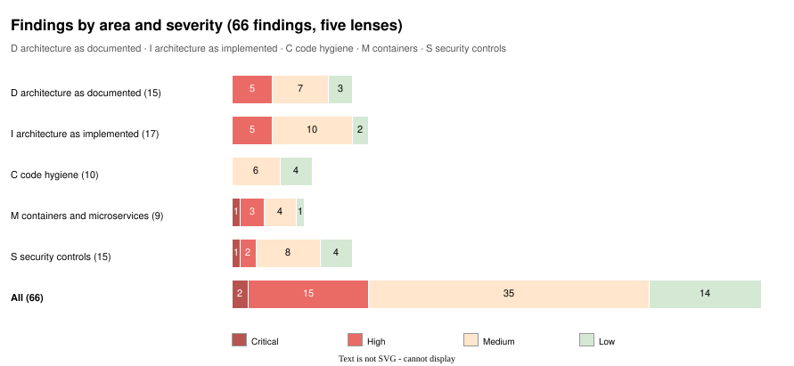

# v6.x adversarial review: summary of findings

**Reviewed at:** commit `a625cf0` (release 5.6.1), branch `misc/adversary-review/v6_x`, 2026-10-03.
**Review tag:** `v6_x_review`. The full reviews are
[`v6_x_review_architecture_as_documented.md`](v6_x_review_architecture_as_documented.md),
[`v6_x_review_architecture_as_implemented.md`](v6_x_review_architecture_as_implemented.md) and
[`v6_x_review_implementation.md`](v6_x_review_implementation.md); the combined, dependency-ordered plan is
[`v6_x_review_mitigation_plan.md`](v6_x_review_mitigation_plan.md) and is not repeated here.

> **Enhanced edition.** The text below is [`v6_x_review_summary.md`](v6_x_review_summary.md) unchanged, with 3 figures added (1 the compose topology at default settings; 2 trust boundaries as built; 3 findings by area and severity). Each figure is an SVG rendered by draw.io from the `.drawio` source in [`diagrams/`](diagrams/), with a PNG beside it. The original file is untouched.

## Scope

Three lenses, by request: the architecture as documented, the architecture as implemented, and the implementation itself (code hygiene, container and microservice practice, and security controls other than LLM-specific ones such as prompt injection, which are deferred to a later cycle). Method was static reading of the specs, READMEs, changelogs, the Python packages, the four TypeScript clients, the Java client, every Dockerfile, `docker-compose.yml`, the shell scripts and the test suite. Nothing was executed and nothing outside this repository was consulted. Every finding cites a file and, where it applies, a line at the reviewed commit, and is marked Verified (read) or Inferred (reasoned).

## Headline verdict

The data path is strong and the perimeter is weak. Inside the pipeline the controls are real and tested live: a `SELECT`-only reader role in read-only transactions, an AST validator with a function denylist, a planner cost gate, a row cap, a row-level-security fence on the feedback writer. Around it, the defaults are off: no token on any service, seven Postgres servers on every interface with passwords equal to their user names, and a published dataset image whose superuser password is `nl2sql`. Three correctness defects sit in the stage where the architecture makes its verification claims: the sensitive-column policy is dead code, the audit report leaks across repair cycles and spends the narrator's single rewrite on the wrong attempt, and the per-model trace the API promises is dropped before it reaches any client. Structurally, the repository has grown by copy-and-extend into three separately written FastAPI applications, four copies of one proxy image, eight database servers and nearly 3,000 lines of shell orchestration, with no shared platform package and no seam for identity. The design authority, the arch5.2 spec, is four releases behind and says routing is not built.

**Figure 1. The compose topology at default settings.** Seven stores and five web services listen on every interface with empty tokens and default passwords; the API's private key is mounted into seven containers; a root process writes into the bind-mounted checkout; only the console and MLflow are on loopback.

Also as [PNG](diagrams/v6_x_review_deployment_topology.png) · editable source [`v6_x_review_deployment_topology.drawio`](diagrams/v6_x_review_deployment_topology.drawio)

## The ten findings that matter most

1. **M-08 / S-08 · Critical** — `docker/init_db.sh:34` sets the `postgres` superuser password to `DB_PASSWORD` (default `nl2sql`) at image build time; the image is published; compose publishes port 5432 on every interface. Every data-path control is bypassed by connecting as the superuser.
2. **M-04 / S-01 · High** — Seven stores published on `0.0.0.0` with default passwords; `API_TOKEN`, `REVIEW_TOKEN`, `CONSOLE_TOKEN` default empty; the API and three GUIs listen on every interface. `review/README.md` says its token is "not optional"; `settings.py:282` only warns.
3. **I-01 · High** — The sensitive-column policy (spec 7.3 rule 3, API field `audit.redactions`) is never wired: `graph.py:1107` calls `present.audit` without the tag set; `tagged_sensitive_columns` has no caller. `redactions` is always empty.
4. **I-02 · High** — After an audit `semantic_issue` sends a run to repair, nothing resets `audit`, `claims` or `narration_retries` (`graph.py:1068–1140`), so the new attempt's first narration is treated as a rewrite of the old one and the once-only renarration (`MAX_NARRATION_RETRIES = 1`) is spent before the new result is audited. Narrator failures are also filed under `retrieval_errors`.
5. **I-03 · High** — `state.TraceEntry` carries `model`, `rung`, `route`, `hops`; the API's `TraceEntry` (`api/models.py:179`) has four fields and `translate.py:88` drops the rest silently. `agent/API.md:248` claims the opposite; GUI and desktop types mirror the loss.
6. **M-01 / M-03 · High** — Every application image runs as root (no `USER` in ten Dockerfiles); compose has no resource limits, read-only filesystems, dropped capabilities or `no-new-privileges`; the review container writes root-owned files into the bind-mounted checkout (`docker-compose.yml:597`).
7. **I-06 / D-05 · High** — No identity model: one static token per service, three independent token checks, reviewer attribution by a self-asserted `X-Reviewer` header, `GET /v1/questions` listing every job to any holder. The `principal` → `SET LOCAL ROLE` path exists (`database.py:299–312`) and has no caller.
8. **D-01 / D-03 · High** — `arch5_2.md` still says routing is "Designed, not built" and that "today the agent connects as `nl2sql`, the owner"; its security table lists role-level `statement_timeout`/`work_mem` that `reader_role.sql` does not set; 5.3–5.6 have no spec.
9. **S-07 / I-07 · High** — `JobStore._prune_locked` (`api/jobs.py:308–327`) drops only finished jobs; queued jobs are unbounded with a two-worker pool and no rate limit; `explain_plan` has no statement timeout. A `POST` loop is a denial of service, needing no token by default.
10. **S-03 / S-02 / S-04 · Medium** — The `?access_token=` query parameter is honoured on every guarded route (`api/app.py:298–318`), not only the event stream as documented; token comparison is `!=` in three places; CORS defaults to `*` on the API and the review service.

**Figure 2. Trust boundaries as built.** Every hop that authenticates does so with one static token per service, empty by default. Nothing carries an identity, reviewer attribution is a self-asserted header, and the executor's `SET LOCAL ROLE` path has no caller.

Also as [PNG](diagrams/v6_x_review_trust_boundaries.png) · editable source [`v6_x_review_trust_boundaries.drawio`](diagrams/v6_x_review_trust_boundaries.drawio)

## Findings by severity

| Document | Critical | High | Medium | Low | Total |
|---|---|---|---|---|---|
| Architecture as documented (D) | 0 | 5 | 7 | 3 | 15 |
| Architecture as implemented (I) | 0 | 5 | 10 | 2 | 17 |
| Implementation: hygiene (C) | 0 | 0 | 6 | 4 | 10 |
| Implementation: containers (M) | 1 | 3 | 4 | 1 | 9 |
| Implementation: security (S) | 1 | 2 | 8 | 4 | 15 |
| **All** | **2** | **15** | **35** | **14** | **66** |

Several findings are the same defect seen through different lenses (for example D-04/I-01, D-07/I-03/S-03, M-04/M-08/S-08, I-12/M-04); the combined plan de-duplicates them.

**Figure 3. Findings by area and severity.** Sixty-six findings across the five lenses; several are one defect seen through more than one lens, which the combined plan de-duplicates.

Also as [PNG](diagrams/v6_x_review_severity_matrix.png) · editable source [`v6_x_review_severity_matrix.drawio`](diagrams/v6_x_review_severity_matrix.drawio)

## Full index

### Architecture as documented
- **D-01 High** — Spec authority four releases stale; status line wrong about routing; no spec for 5.3–5.6.
- **D-02 Medium** — Open decisions decided in code, never closed in a spec.
- **D-03 High** — Security blueprint describes role limits that do not exist and a stale "connects as the owner" fact.
- **D-04 High** — Sensitive-column policy documented as a control; dead in code and applied at the wrong layer by design.
- **D-05 High** — No identity model; the RLS path has no documented source of a principal.
- **D-06 Medium** — "One person on one machine" posture contradicted by network-service docs and defaults; no threat model or tiers.
- **D-07 Medium** — Documented controls stronger than implemented ones (review token, query-string token scope, per-model trace).
- **D-08 Medium** — Eight database servers asserted, never weighed against a shared cluster.
- **D-09 Medium** — Review service's write model (file in the checkout, no lock, no audit trail) undiscussed.
- **D-10 Low** — Called microservices, released as a modular monolith.
- **D-11 High** — State contract silent on per-attempt vs per-run field lifetimes; caused I-02.
- **D-12 Medium** — `retrieval_errors` overloaded for Stage-4 failures.
- **D-13 Medium** — Only numeric drift is tested; narrative drift (stale phrases, "fourteen nodes") is not.
- **D-14 Low** — Benchmark independence described as stronger than guaranteed; owner's decision stands.
- **D-15 Low** — No documented security/conformance test tier.

### Architecture as implemented
- **I-01 High** — Sensitive-column policy dead code.
- **I-02 High** — Stale audit across repair cycles; rewrite budget spent on the wrong attempt; narrator errors under `retrieval_errors`.
- **I-03 High** — Routing fields dropped from the REST trace.
- **I-04 Medium** — `EXPLAIN` without a statement timeout.
- **I-05 Medium** — Raw sample rows sent to the model host in the schema prompt; no egress gate.
- **I-06 High** — No identity seam; RLS path unreachable; three token-check closures.
- **I-07 Medium** — In-process job store with unbounded queue; single replica.
- **I-08 Medium** — `_engine` reached through private attribute in two modules; session-level `SET` on pooled connections.
- **I-09 Medium** — No shared package; infrastructure duplicated three to six times; RAG used as library and as subprocess.
- **I-10 Medium** — Review service writes to the checkout as root, shells out to loaders, no lock.
- **I-11 Medium** — 1,200-line `create_app` closure in the review service; same pattern in API and console.
- **I-12 High** — Eight Postgres servers, seven published on every interface, superuser with a known password.
- **I-13 Medium** — One TLS key for three services, copied into seven containers.
- **I-14 Medium** — Four copies of one nginx image and client.
- **I-15 Medium** — Orchestration logic in 2,846 lines of shell.
- **I-16 Low** — Process-lifetime caches with no reload signal.
- **I-17 Low** — `max+1` ids under a table lock; delete-then-insert verdicts.

### Implementation: code hygiene
- **C-01 Medium** — Duplication by copy-and-extend (embedder ×5, vector literal ×6, env helpers ×3, API scaffolding ×2, token check ×3, front ends ×4).
- **C-02 Medium** — 78 `except Exception` across the two services; no error taxonomy.
- **C-03 Medium** — Oversized units (review app 1,488 lines; three scripts ~2,850; compose 970).
- **C-04 Medium** — Encapsulation leaks; inconsistent `extra="forbid"`.
- **C-05 Low** — Version history in comments; stale "fourteen pipeline nodes"; TODO without tracker.
- **C-06 Medium** — Shell as the orchestration language, with its own `.env` parser.
- **C-07 Medium** — Inconsistent pinning (rag 0 of 5 pinned, review 3 of 7), no hashes.
- **C-08 Low** — Coverage-shaped tests and test-only parameters.
- **C-09 Low** — Hand-rolled id allocation and delete-then-insert.
- **C-10 Low** — Self-asserted reviewer attribution.

### Implementation: containers and microservices
- **M-01 High** — Every application image runs as root; root-owned writes into the checkout.
- **M-02 Medium** — Base images float on tags; rebuilds not reproducible.
- **M-03 High** — No resource limits, read-only filesystems, dropped capabilities or `no-new-privileges`.
- **M-04 High** — Seven Postgres servers on every interface with default credentials.
- **M-05 Medium** — Private key mounted where only the certificate is needed.
- **M-06 Medium** — Secrets as environment, duplicated into `.env.bak`, inline in URLs.
- **M-07 Medium** — Microservice costs without the benefits; healthchecks disable TLS verification and are duplicated.
- **M-08 Critical** — Published dataset image carries a known superuser password.
- **M-09 Low** — No SBOM, signature or provenance in publishing.

### Implementation: security controls (non-LLM)
- **S-01 High** — Authentication off by default on every service.
- **S-02 Medium** — Non-constant-time token comparison ×3.
- **S-03 Medium** — Query-string token honoured on every route.
- **S-04 Medium** — CORS `*` by default on API and review.
- **S-05 Medium** — Exception text and store errors in client-facing responses.
- **S-06 Medium** — Any token holder lists and cancels every job.
- **S-07 High** — Unbounded queue; no rate limit; `EXPLAIN` untimed.
- **S-08 Critical** — Databases reachable from the network with known passwords, including a superuser.
- **S-09 Medium** — One TLS key for three services.
- **S-10 Medium** — Secret handling (environment, `.env.bak`, defaults equal to user names, no rotation).
- **S-11 Low** — No role-level `statement_timeout`/`work_mem`/connection limits.
- **S-12 Medium** — Supply chain: unpinned ranges, no hashes, floating base tags.
- **S-13 Low** — Access logs would record a query-string token.
- **S-14 Low** — No non-repudiation for promotions and fixes.
- **S-15 Low** — Healthchecks use `ssl._create_unverified_context()`.

## Strengths worth protecting

- Database least privilege, tested live: `nl2sql_reader`, `nl2sql_feedback_writer` with RLS, `snippets_reader`.
- pglast validator with a tree-wide function denylist; planner cost gate; per-transaction timeout; row cap.
- HTTPS everywhere by default with an explicit off switch; proxies verify upstream; the desktop client's CA/fingerprint/`--insecure` design.
- 100% statement-and-branch gates in every language, contract tests between the three client languages and the server, shell coverage measurement, Docker Hub tag tests.
- Documentation that records reasons and mistakes (`agent/README.md` departures, `benchmarks/README.md` first-run errors, the changelogs).

## Decisions the owner needs to make

1. Identity model: keep a single shared token per service, or introduce principals (recommended).
2. Sensitive-column policy: implement it where data leaves the database, or remove the claim (recommended until a tagged column exists).
3. Topology: keep eight Postgres servers, or consolidate the non-retail stores into one cluster (recommended, staged).
4. Review write model: in-process loaders with a lock and a non-root owner of the mounted directory (recommended), and whether promotions should commit.

## What this cycle did not cover

LLM-specific security (prompt injection, retrieved text as instructions, model-side data handling) by request; dynamic testing of any kind; dependency vulnerability scanning; the MLflow server's own security beyond its bind address; the data generator's content. These are candidates for the next cycle, which should start by diffing against this file.
