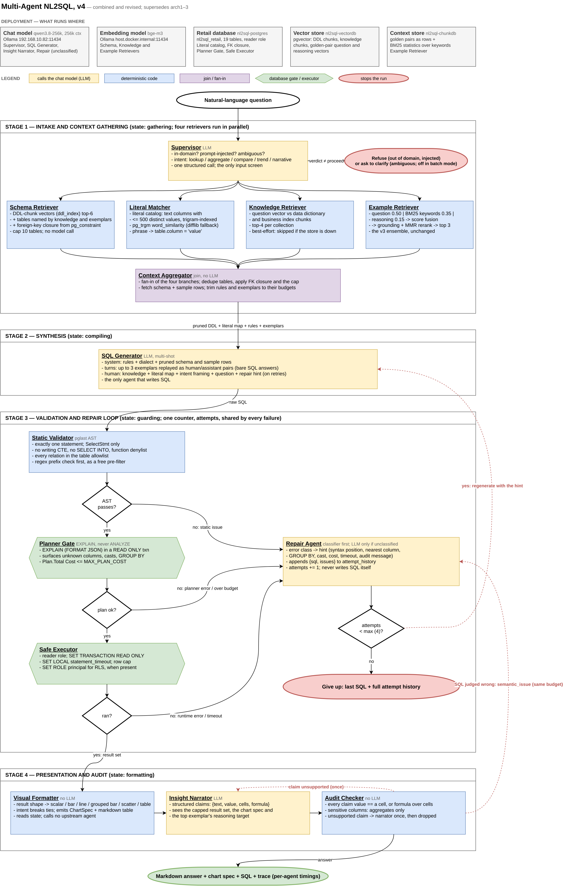
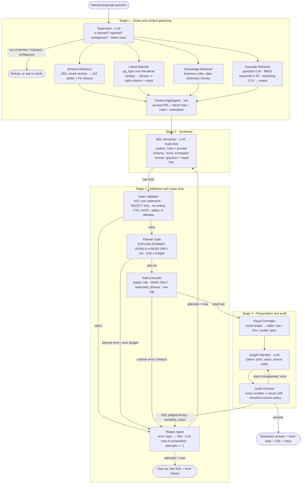

# Multi-Agent NL2SQL Architecture, v4

**Status:** combined and revised. Supersedes `Multi-Agent_NL2SQL_arch1.md`,
`Multi-Agent_NL2SQL_arch2.md`, `Multi-Agent_NL2SQL_arch3.md` and the
`Multi-agent NL2SQL.drawio` diagram. Where the three earlier documents
disagree, arch3 was taken as authoritative, then arch2, then arch1; the
draw.io diagram is read as the visual companion to arch3 and is called out
where it departs from arch3's own text.

**Diagram:** [`Multi-Agent_NL2SQL_arch4.drawio`](Multi-Agent_NL2SQL_arch4.drawio)
(editable in draw.io) and [`Multi-Agent_NL2SQL_arch4.png`](Multi-Agent_NL2SQL_arch4.png)
(rendered). The draw.io file is generated by
[`make_arch4_drawio.py`](make_arch4_drawio.py), so a change to an agent's
wording is a one-line edit and a re-run rather than a redraw. The same
architecture is drawn inline below in Mermaid, which renders on GitHub.



**Ground truth used for validation:** the v3 agent in `agent/nl2sql_agent/`,
the retail schema in `data_gen/ddl.sql` (19 tables), the RAG stores built by
`rag/`, and the benchmark results in `benchmarks/README.md`.

---

## 1. Verdict

The four-layer design shared by arch2 and arch3 -- intake and schema
grounding, synthesis, a validation and repair loop, then presentation and
audit -- is sound, and the measured evidence supports its two central
claims:

- **Retrieval before generation is what fixes the hard questions.** The
  schema-only agent scores 1/3 on grain questions and 0/1 on fan-out; with
  the knowledge base both go to full marks. (`benchmarks/README.md`)
- **The LLM is the wrong tool for the validation gate.** The only question in
  45 benchmark runs where a configuration failed to answer at all was one
  where the agent wrote a correct query and its own LLM reviewer rejected it
  three times. Validation must be deterministic. arch2 and arch3 already say
  so; the current code does not yet do it.

The documents are not implementable as written. Five things are wrong and
seven are missing. All are fixed below; the change log in section 12 lists
every departure from arch1-3 with its reason.

### What is wrong

| # | Where | Problem | Resolution |
|---|---|---|---|
| W1 | draw.io | A **planner failure never reaches the repair loop.** The "Database Engine Pass" routes FAIL straight to the "Send Error Stack" terminator. arch3's own text ("catches structural database tracebacks... misaligned aggregation grouping identifiers"), arch2 and arch1 all say engine errors are repaired. The planner is the only component that can see an unknown column, a bad type cast or a missing GROUP BY, which are the common real errors. | Every failure -- static, planner, runtime, or audit -- routes to the Repair Agent under one shared retry budget. The terminator is reached only when that budget is spent. (section 6) |
| W2 | arch3, draw.io | **`EXPLAIN ANALYZE` executes the query.** The "non-executing" engine pass would run every candidate once for the plan and again for the answer. The cost and timeout check would *be* the run. | Plain `EXPLAIN (FORMAT JSON)` inside a `READ ONLY` transaction, which is what the v3 code already does. The plan's `Total Cost` is the cost gate; `statement_timeout` belongs on execution. (section 6.2) |
| W3 | draw.io | **Presentation agents can re-enter the pipeline without a budget.** The Insight Audit Agent "can call" the SQL Generator, and both presentation agents "can call" the schema, aggregator and fuzzy-match agents. A generator call from the audit stage runs synthesis, validation, execution and audit again with no counter drawn. The other calls re-invoke agents to fetch state the pipeline already holds. | Presentation agents *read* the shared state. If the audit judges the SQL semantically wrong it emits a `semantic_issue` that routes to the Repair Agent under the same retry budget as every other failure: one loop, one counter. (section 7.3) |
| W4 | arch3 | **A regex cannot enforce read-only.** PostgreSQL accepts data-modifying CTEs (`WITH x AS (DELETE ... RETURNING *) SELECT * FROM x` starts with `WITH`), `SELECT ... INTO`, and functions with side effects. A "starts with SELECT" check passes all of them. | The AST parser rejects writing CTEs, `INTO`, multiple statements and a function denylist. The backstop is the database: a `SELECT`-only reader role, `default_transaction_read_only`, `SET TRANSACTION READ ONLY`. Verified against the running database: both the writing CTE and `SELECT INTO` are refused inside a `READ ONLY` transaction, which the v3 executor already opens. The regex survives only as a free pre-filter. (section 8) |
| W5 | all three, code | **The retry budget is defined four ways.** arch3: "Max 3 Retries". draw.io: `counter < 4`. arch2: "max retries window", unspecified. Code: `MAX_SQL_ATTEMPTS=3` *generations*, so two retries. | One counter, `attempts`, counting generations. Default 4 = one first draft and three repairs. Every failure source increments the same counter. (section 6.4) |

### What is missing

| # | Gap | Resolution |
|---|---|---|
| M1 | **No state contract.** All three documents say agents "communicate via structured messages" and none defines the message. Nothing is unit-testable, which arch2 lists as the architecture's main advantage, until the interface exists. | `AgentState` is defined field by field in section 3. Every agent is a function of a subset of it and returns a partial update. |
| M2 | **The Supervisor classifies intent and nothing consumes the class.** | Three consumers are defined: routing (out of domain, injected, ambiguous), the generator's task framing, and the formatter's chart choice. (section 4.1) |
| M3 | **The clarification path was lost between arch1 and arch3.** arch1's Analyzer "clarifies ambiguous vocabulary"; arch2 and arch3 drop it. The benchmark's first run found 4 of 15 questions admitted two correct answers. | The Supervisor may exit to a clarification interrupt. Disabled in batch and benchmark mode. (section 4.1) |
| M4 | **The Fuzzy Match Agent has no catalog to search and no extension to search it with.** `pg_trgm` is available in the retail image but not installed; no document says which columns hold matchable literals. | A literal catalog: every text column with at most 500 distinct values (42 of the 43 text columns in this schema, none over 200 values), indexed by trigram. Fallback to `difflib` when the extension is absent. (section 4.3) |
| M5 | **The Schema Agent's index is described as if it had to be built.** The v2 vector store already holds one DDL chunk per table (`knowledge/ddl_index.md`) with keywords and grain. What is missing is foreign-key closure and the removal of the LLM table-selection call, which costs 24% of the v3 run. | Schema retrieval = DDL-chunk vectors + FK closure from `pg_constraint`, capped at 10 tables, no model call. (section 4.2) |
| M6 | **"Audits math vs rows" is a sentence, not a check.** | Every number in the narrative must be a result cell, a declared aggregate of result cells, or marked derived with its formula. The narrator emits structured claims; a deterministic checker verifies them. (section 7.2) |
| M7 | **The worked-example retrieval built in v3 is not in the architecture.** arch3 puts "assembles few-shot golden pairs based on schema similarity" inside the generator, which is weaker than the three-retriever ensemble with reranking that exists and measures 45/45 on its own corpus. | The Example Retriever is a Stage 1 agent, parallel with schema and literal retrieval, and keeps the v3 ensemble unchanged. (section 4.4) |

Smaller corrections, applied without further comment: stage 2 is renamed
from "Synthesis & Statistical Analysis" (nothing statistical happens there);
the Context Aggregator is a join node, not an agent; "cross-site scripting"
is not an input threat to a SQL system and is replaced by prompt-injection
screening; draw.io label typos ("Pruned DL + Valed Row Literals") are fixed;
the validator's table allowlist check from arch2, dropped by arch3, is
restored.

### Name reconciliation

| arch1 | arch2 | arch3 / draw.io | v4 (this document) |
|---|---|---|---|
| Analyzer Agent | Supervisor / Router Agent | Supervisor Agent | **Supervisor** |
| Metadata / RAG Agent | Vector-RAG Schema Agent (Pruner) | Vector-RAG Schema Agent | **Schema Retriever** |
| -- | Fuzzy Match & Entity Matcher Agent | Fuzzy Match Agent | **Literal Matcher** |
| -- | -- | Context Aggregator | **Context Aggregator** (join) |
| (implicit in RAG agent) | -- | (inside SQL Generator) | **Knowledge Retriever**, **Example Retriever** |
| SQL Generator Agent | SQL Generator Agent | SQL Generator Agent | **SQL Generator** |
| Query Validator Agent | Query Validator Agent | SQL Query Validator Agent | **Static Validator** |
| -- | (inside validator: EXPLAIN) | Database Engine Pass | **Planner Gate** |
| (inside generator) | SQL Repair Agent | SQL Repair Agent | **Repair Agent** |
| -- | Safe Execution Layer | Execute | **Safe Executor** |
| Insight & Visual Agent | Visual Agent | Visual Formatting Agent | **Visual Formatter** |
| Insight & Visual Agent | Insight & Guardrail Agent | Insight Audit Agent | **Insight Narrator** + **Audit Checker** |

---

## 2. Architecture

Four stages, one shared state object, one retry loop. Agents marked **LLM**
call the chat model; everything else is deterministic code. On the happy
path exactly three model calls are made: Supervisor, SQL Generator, Insight
Narrator.



Stage 1's four retrievers run as parallel branches of the graph; the
aggregator is the fan-in. Stage 3 is a single loop: whichever gate fails,
the Repair Agent turns the failure into a hint and the generator tries
again, until `attempts` reaches its limit.

### What runs where

| Component | Host | Used by |
|---|---|---|
| Chat model `qwen3.8-256k`, 256k context | Ollama at `192.168.10.82:11434` | Supervisor, SQL Generator, Insight Narrator, Repair Agent (unclassified errors only) |
| Embedding model `bge-m3` | Ollama at `host.docker.internal:11434` | Schema, Knowledge and Example Retrievers |
| Retail database, `nl2sql_retail` (19 tables) | `nl2sql-postgres` | Literal catalog, FK closure, Planner Gate, Safe Executor |
| Vector store (pgvector): DDL chunks, knowledge chunks, golden-pair question and reasoning vectors | `nl2sql-vectordb` | Schema, Knowledge and Example Retrievers |
| Context store: golden pairs as rows + BM25 statistics | `nl2sql-chunkdb` | Example Retriever |

---

## 3. The shared state

The one thing every document promised and none delivered. Every agent is a
pure function of a subset of these fields and returns a partial update;
LangGraph merges the updates. Field names that already exist in the v3
`AgentState` keep their names.

```python
class AgentState(TypedDict, total=False):
    # --- input ---------------------------------------------------------
    question: str
    principal: str | None            # end-user identity, for SET ROLE / RLS (section 8)

    # --- stage 1: intake ------------------------------------------------
    intent: Literal["lookup", "aggregate", "compare", "trend", "narrative"]
    verdict: Literal["proceed", "out_of_domain", "injection", "ambiguous"]
    clarification: str | None        # the question to ask back when verdict == "ambiguous"

    selected_tables: list[str]       # Schema Retriever: ≤ 10, FK-closed
    schema: str                      # DDL + comments + sample rows for selected_tables
    literal_map: list[LiteralMatch]  # Literal Matcher: phrase -> (table, column, value, score)
    knowledge: str                   # Knowledge Retriever: rendered chunks
    knowledge_tables: list[str]
    example_shots: list[Shot]        # Example Retriever: {question, reasoning_target, sql_code}
    example_tables: list[str]
    retrieval_errors: dict[str, str] # retriever name -> why it was skipped (best-effort)

    # --- stage 2: synthesis --------------------------------------------
    sql: str
    attempts: int                    # generations so far; the one retry budget

    # --- stage 3: validation and repair --------------------------------
    issues: list[Issue]              # {source, message, hint}; source in
                                     #   static | planner | runtime | audit
    attempt_history: list[Attempt]   # {sql, issues} for every failed generation
    plan_cost: float | None          # EXPLAIN total cost of the accepted query
    result: QueryResult | None       # {columns, rows, row_count, truncated}

    # --- stage 4: presentation -----------------------------------------
    chart: ChartSpec | None          # {kind, x, y, series} or None for a table
    claims: list[Claim]              # {text, value, cells: list[(row, col)], formula: str | None}
    narrative: str
    audit: AuditReport               # {passed, unsupported_claims, redactions}

    # --- output and observability --------------------------------------
    answer: str                      # rendered markdown
    error: str | None
    trace: list[TraceEntry]          # {node, ms, model_calls, tokens_in, tokens_out}
```

Rules that follow from the contract:

- **Retrieval is best-effort.** A retriever that cannot reach its store
  writes to `retrieval_errors` and the run continues without it. This is
  the v2/v3 behaviour and it stays: at the limit, with every store down, the
  pipeline degrades to schema-only.
- **`attempts` is the only counter.** No agent keeps its own.
- **`trace` is appended by every node**, which is what lets the benchmark
  attribute time per agent rather than per stage.

---

## 4. Stage 1: intake and context gathering

### 4.1 Supervisor (LLM)

Receives the raw question. One structured-output call returning `verdict`,
`intent`, and `clarification`. It is the only agent that sees the question
before any retrieval, so it is where input screening lives.

| Output | Consumed by | Effect |
|---|---|---|
| `verdict = out_of_domain` | router | Answer "this database holds retail sales, pricing, promotions and advertising for FY2024-FY2025; that question is outside it." No SQL. |
| `verdict = injection` | router | Refuse. The question contains instructions to the system (ignore rules, reveal schema, run a statement) rather than a question about the data. |
| `verdict = ambiguous` | router | LangGraph `interrupt` with `clarification`. **Off** in batch and benchmark mode, where it collapses to `proceed`. |
| `intent` | SQL Generator | A one-line task framing in the human turn: "This is a comparison; return both sides and the difference." |
| `intent` | Visual Formatter | Tie-breaker for chart choice: `trend` prefers a line, `compare` a grouped bar. |

The prompt is short and the output is small, so this call is fast relative to
generation. It replaces nothing in v3, so it is a net addition of one model
call; section 9 shows it is paid for several times over by the calls it
enables removing.

### 4.2 Schema Retriever (no LLM)

Replaces the v3 `select_tables` model call, which costs 364 of 1499 seconds in
the benchmark and is the second-slowest stage.

1. Embed the question; search the `ddl_index` collection, which already holds
   one chunk per table with its full `CREATE TABLE`, comments, grain and
   keywords. Take the top-k tables by cosine distance (k = 6).
2. Add any table named by the Knowledge and Example Retrievers
   (`knowledge_tables`, `example_tables`), as v3 does.
3. **Foreign-key closure**: for every pair of selected tables, add any table
   that is the shortest join path between them, read from `pg_constraint`.
   This is what catches `dim_ad_placement`, the bridge that benchmark B15
   needs and that a similarity search will never rank because the question
   does not mention it.
4. Cap at 10 tables. If the cap is exceeded, drop the lowest-ranked
   non-bridge tables first.
5. Render `schema` as v3 does: columns, types, comments, keys, sample rows.

The 10-table cap from arch2 and arch3 is kept. With 19 tables it is a real
limit, and the largest of the 45 golden pairs touches 6; the median touches 4.

### 4.3 Literal Matcher (no LLM)

The agent arch2 and arch3 describe but never give a catalog to search.

**Literal catalog.** Built once at startup (or at image build time) from the
retail database: every text column whose distinct count is at most 500. In
this schema that is 42 of the 43 text columns, the largest being
`dim_product.sku_id`, `product_name` and `upc_barcode` at 200 values each;
the one excluded is `fact_pos_retail_sales.basket_id` at 258,308. Stored as `(table, column, value)` rows with a trigram index.

**Candidates** are extracted from the question deterministically: quoted
strings, capitalised multi-word phrases, tokens in ALL_CAPS or with
underscores (`SCAN_BACK`), and any token that is not an English stopword and
does not match a column name.

**Matching** uses `pg_trgm`'s `word_similarity` when the extension is
installed (it is available in the retail image and not yet installed), and
Python `difflib.get_close_matches` otherwise. Matches above 0.6 are kept;
the top match per candidate goes into `literal_map`, and ties across columns
are all kept, because "Dairy & Eggs" is a department and a reasonable model
should be told so rather than guess.

**Output** is rendered into the generator's human turn as a short block:

```
Literal values in this database that match the question:
  "Dairy & Eggs"  -> dim_product.department_name = 'Dairy & Eggs'
  "SCAN_BACK"     -> dim_allowance_type.allowance_type_code = 'SCAN_BACK'
  "Print Flyer"   -> dim_ad_channel.channel_type = 'Print Flyer'
```

Benchmark evidence: B07, B09 and B15 each turn on a literal the model has to
spell exactly (`Dairy & Eggs`, `SCAN_BACK`, `Print Flyer`). All three pass
today because the question spells the literal exactly as the database does;
the literal map is what makes them pass when it does not ("dairy and eggs",
"scan-back allowances").

### 4.4 Knowledge Retriever and Example Retriever (no LLM)

Both are the v2 and v3 components unchanged, moved into the parallel fan-out:

- **Knowledge Retriever:** embed the question, search every `*_embeddings`
  collection (data dictionary, business index; the DDL index is now the
  Schema Retriever's), top-4 chunks per collection, render to `knowledge`.
- **Example Retriever:** the three-retriever ensemble over the 45 golden
  pairs -- question vectors 0.50, BM25 over keywords 0.35, reasoning-target
  vectors 0.15 -- min-max score fusion, then grounding-and-MMR rerank, top 3.
  Measured 45/45 on retrieving each pair from its own question; RRF at k=60
  managed 25/45, which is why score fusion is the default.

arch3 placed example assembly inside the generator, keyed on "schema
similarity". The ensemble is kept instead because it is measured, and
because retrieval is I/O (1.2 s for all four retrievers over 15 questions)
and belongs with the other I/O, not inside the one expensive model call.

### 4.5 Context Aggregator (join, no LLM)

The fan-in node. It does three things and calls no model:

1. Waits for all four branches (LangGraph handles the join).
2. Deduplicates tables across `selected_tables`, `knowledge_tables` and
   `example_tables`, applies the FK closure and the cap (section 4.2, steps
   3-4), and fetches `schema`.
3. Trims `knowledge` and the exemplars to their character budgets so the
   generator's prompt is bounded regardless of what retrieval returned.

---

## 5. Stage 2: synthesis

### 5.1 SQL Generator (LLM, multi-shot)

The v3 prompt shape, kept exactly, with two additions:

```
system:   rules · dialect · pruned schema and sample rows
human:    Rule that applies here: <exemplar.reasoning_target>
          Question: <exemplar.question>
          SQL:
assistant: <exemplar.sql_code>                       (× up to 3 exemplars)
human:    Knowledge base: <knowledge>
          Literal values in this database that match the question: <literal_map>   (new)
          Task: <intent framing>                                                     (new)
          Question: <question>
          <repair hint, on retries>
          SQL:
```

Exemplars are replayed as real human/assistant turns, not pasted as a block:
that is the shape instruct models are tuned on and it is what makes the
example a demonstration rather than a quotation. Assistant turns are bare
SQL with no comment prefix, because the Static Validator requires the
statement to begin with `SELECT` or `WITH`.

The generator is the only model call in the stage and the only place SQL is
written. The Repair Agent does not write SQL; it writes hints (section 6.3).

---

## 6. Stage 3: validation and repair loop

Three deterministic gates in series, one repair path, one counter. This is
the stage the documents got most wrong and the one the benchmark says
matters most: the v3 LLM validator costs 499 seconds over 15 questions and
is the only component that ever turned a right answer into no answer.

### 6.1 Static Validator (no LLM)

Parse with `pglast`, which wraps PostgreSQL's own parser (`libpg_query`), so
what it accepts is what the server accepts. Reject when:

- the input is not exactly one statement;
- the statement is not a `SelectStmt` (which covers `WITH ... SELECT`);
- any CTE body is an `InsertStmt`, `UpdateStmt`, `DeleteStmt` or `MergeStmt`
  (PostgreSQL allows these; a prefix check does not see them);
- the select has an `INTO` target;
- any function call is on the denylist: `pg_sleep`, `pg_read_file`,
  `pg_read_binary_file`, `lo_import`, `lo_export`, `dblink`, `dblink_exec`,
  `pg_terminate_backend`, `pg_cancel_backend`, `set_config`, `pg_notify`;
- any referenced relation is not in `selected_tables` (the arch2 allowlist,
  restored). The message names the closest allowed table by trigram so the
  hint is useful: `fact_ad_perf is not in scope; did you mean fact_ad_performance?`

A rejection is an `Issue` with `source = static`. The regex prefix check from
v3 runs first because it is free, and nothing relies on it.

### 6.2 Planner Gate (no LLM)

```sql
BEGIN; SET TRANSACTION READ ONLY;
EXPLAIN (FORMAT JSON) <sql>;
ROLLBACK;
```

Not `EXPLAIN ANALYZE`. `ANALYZE` executes the statement to report actual
timings; a "pass" built on it would run every candidate query before the
executor runs it again, and its "timeout check" would be the full run. Plain
`EXPLAIN` plans without executing, in a few milliseconds, and:

- **reports every semantic error the parser cannot**: unknown column, type
  mismatch, aggregate outside GROUP BY, ambiguous reference. This is the
  feedback that repairs the common real mistakes, and it is why W1 matters.
- **returns `Plan.Total Cost`**, which is the cost gate. A query whose
  estimated cost exceeds `MAX_PLAN_COST` is rejected with a hint to add a
  filter or a join condition. This is arch1's "dangerous cross-joins" check,
  made concrete. Measured on the current data: the most expensive of the 45
  golden pairs plans at a cost of 125,767, a full scan of the sales fact at
  20,096, the sales fact cross-joined with `dim_product` at 1.6 million, and
  the sales fact cross-joined with itself at 12.5 billion. A default of
  **1,000,000** is eight times the hardest known-good query and below the
  smallest cross join that involves the fact table.

A planner error is an `Issue` with `source = planner` and the server's
message verbatim.

### 6.3 Repair Agent (classifier first, LLM only when unclassified)

The draw.io diagram changes arch3 here in a way that is kept: the Repair
Agent *passes its analysis back to the generator* rather than writing SQL
itself. One agent writes SQL. The cost is a second model call per retry, so
the repair agent classifies deterministically first and calls the model only
for what it cannot classify:

| Error (from any source) | Classified hint |
|---|---|
| `pglast` syntax error at position *n* | Quote the 40 characters around *n*; "syntax error here". |
| `column "x" does not exist` | Trigram-nearest columns in the pruned schema: "`x` is not a column; the schema has `x_amt`, `x_qty`." |
| `relation "t" does not exist` / allowlist miss | Nearest allowed table. |
| `must appear in the GROUP BY clause` | Name the column; "add it to GROUP BY or aggregate it." |
| `operator does not exist: a op b` | "Cast one side; `date_key` is an integer YYYYMMDD, not a date." |
| `division by zero` | "Guard the denominator with NULLIF." |
| plan cost over budget | "The plan is a cross join or an unfiltered scan; join on the declared keys and filter on fiscal_year." |
| `statement_timeout` | Same hint as cost, plus "add LIMIT if a sample answers the question." |
| `audit: semantic_issue` | The Audit Checker's own message (section 7.3). |
| anything else | **LLM call**: the failed SQL, the error, and the schema; asked for a one-paragraph diagnosis, not a query. |

Every repair appends `{sql, issues}` to `attempt_history`, so the hint on
attempt 3 can also say "attempts 1 and 2 both joined on date_key; that is
the error." The generator receives the hint in its human turn as v3's
`RETRY_FEEDBACK` already does.

### 6.4 The retry budget

```
attempts = 0
loop:
    generate            -> attempts += 1
    static  -> fail? -> repair -> attempts < MAX_ATTEMPTS ? loop : give_up
    planner -> fail? -> repair -> (same)
    execute -> fail? -> repair -> (same)
    audit   -> semantic_issue? -> repair -> (same)
```

`MAX_ATTEMPTS = 4`: one draft and three repairs, which is arch3's "max 3
retries" and the draw.io's `< 4`, stated once. Every failure source shares
the counter; there is no way to loop that does not spend it. Give-up returns
the last SQL and the full `attempt_history`, because a user who gets no
answer should at least see what was tried.

### 6.5 Safe Executor

The v3 `run_select`, hardened per section 8: a dedicated reader role, `SET
TRANSACTION READ ONLY`, `SET LOCAL statement_timeout`, a row cap with a
`truncated` flag, and `SET ROLE <principal>` when a principal is present. A
runtime error (a timeout that the planner could not predict, a division by
zero that only shows on real rows) is an `Issue` with `source = runtime` and
goes to the Repair Agent like any other.

---

## 7. Stage 4: presentation and audit

### 7.1 Visual Formatter (no LLM)

arch3's "infers chart configuration schemas" is a lookup on result shape, and
a lookup should not be a model call:

| Result shape | Chart |
|---|---|
| 1 row × 1 column | scalar; rendered as a sentence, no chart |
| 1 categorical + 1 numeric, ≤ 30 rows | bar |
| 1 date/week/month column + 1 numeric | line |
| 1 categorical + 2+ numeric | grouped bar |
| 2 numeric, no categorical | scatter |
| anything else, or > 30 rows | table only |

`intent` breaks ties (`trend` → line over bar). The output is a `ChartSpec`
(kind, x, y, series) and a markdown table of the rows; nothing renders the
chart here, so the consumer can draw it with whatever it has.

### 7.2 Insight Narrator (LLM)

Writes the narrative, but as **structured claims** rather than free prose:

```json
{"claims": [
  {"text": "Dairy & Eggs ran a 31.4% gross margin in fiscal month 12.",
   "value": 31.4, "cells": [[0, "gross_margin_pct"]], "formula": null},
  {"text": "That is 2.1 points above the department's FY2025 average.",
   "value": 2.1, "cells": [[0, "gross_margin_pct"], [1, "fy_avg_pct"]],
   "formula": "cells[0] - cells[1]"}
]}
```

Every number the narrator wants to say must point at the cells it came from.
Its prompt gets the question, the result set (capped), the chart spec, and
the `reasoning_target` of the top exemplar, which is the sentence that
explains the trap this kind of question has.

### 7.3 Audit Checker (no LLM)

arch2's "cross-references every single numerical figure ... against the true
execution table payload", made checkable:

1. For every claim: the value equals the named cell; or `formula` over the
   named cells evaluates to the value within rounding (2 decimals, matching
   the benchmark's tolerance); or the claim is dropped.
2. Any number in `text` that is not the claim's `value` fails the claim.
3. **Sensitive-column policy:** columns tagged sensitive in the catalog
   comments never appear in the narrative or the table, only their
   aggregates. (This is what "checks data leakage" in arch3 is taken to
   mean; the retail schema has none, and the mechanism is a comment tag.)
4. Unsupported claims are sent back to the narrator **once**; on the second
   failure they are dropped and the audit report says so.

**Bounded re-entry.** The draw.io diagram lets the audit agent call the SQL
Generator, and both presentation agents call three Stage 1 agents. Those
edges are removed:

- The presentation agents *read* `schema`, `literal_map` and `knowledge` from
  state. They are already there.
- If the audit concludes the SQL is wrong, not the narrative -- the result
  is empty when the question implies rows, a percentage exceeds 100, a
  fan-out pattern the knowledge base warns about is visible in the SQL -- it
  emits an `Issue` with `source = audit` and `semantic_issue` set. That
  routes to the Repair Agent and spends the same `attempts` counter as every
  other failure. This is where v3's LLM semantic review moves to: after
  execution, where it has rows to look at, and inside the budget.

---

## 8. Security blueprint

arch1's security section is the strongest part of arch1 and is kept whole;
the additions make each rule a configuration rather than an intention.

| Layer | Rule | Where |
|---|---|---|
| Credentials | The agent connects as `nl2sql_reader`: `GRANT SELECT` on the schema, `NOSUPERUSER NOCREATEDB NOCREATEROLE`, `ALTER ROLE ... SET default_transaction_read_only = on`, `SET statement_timeout = '30s'`, `SET work_mem` bounded. **Today the agent connects as `nl2sql`, the owner.** | `docker/init_db.sh` |
| Transaction | `SET TRANSACTION READ ONLY` on every statement, including EXPLAIN. Already in v3. | Planner Gate, Safe Executor |
| Statement | AST: one statement, SELECT only, no writing CTE, no INTO, function denylist, table allowlist. | Static Validator |
| Plan | Estimated cost ceiling; rejects cross joins before they run. | Planner Gate |
| Rows | Row cap with a `truncated` flag; the narrator is told when it is looking at a sample. | Safe Executor |
| Input | Injection and out-of-domain screening before any retrieval. Retrieved text (knowledge chunks, golden pairs) is data, never instructions; the system prompt says so and the exemplar turns are SQL only. | Supervisor, prompts |
| Output | Narrative claims are verified against rows; sensitive columns are aggregated only. Markdown output is rendered with HTML escaped, which is where the XSS concern from arch3 actually belongs. | Audit Checker, renderer |
| Row-level security | Production requirement, not implemented in the test system: the executor runs `SET ROLE <principal>` and the database's RLS policies apply. `principal` is in the state contract so the executor can. | Safe Executor |
| Irreversible actions | None exist. If the system ever proposes writes, arch1's propose/commit split with a human in the loop is the design. | -- |

---

## 9. Model calls and expected cost

The v3 benchmark (15 questions, `qwen3.8-256k`, multi-shot) spends its time
like this:

| v3 stage | seconds | v4 equivalent | model call? |
|---|---|---|---|
| `generate_sql` | 634 | SQL Generator | yes, unchanged |
| `validate_sql` | 499 | Static Validator + Planner Gate | **no** |
| `select_tables` | 364 | Schema Retriever + FK closure | **no** |
| `retrieve_knowledge` + `retrieve_examples` | 1.2 | four parallel retrievers | no |
| -- | -- | Supervisor | yes, new, small prompt |
| -- | -- | Insight Narrator | yes, new |
| -- | -- | Repair Agent | only for unclassified errors |

Happy-path model calls: v3 makes three (`select_tables`, `generate_sql`,
`validate_sql`); v4 makes three (Supervisor, SQL Generator, Insight
Narrator). The two v3 calls that are removed are the two that do not write
the answer and together cost more than the one that does. The two v4 calls
that are added have short prompts: the Supervisor sees only the question,
and the Narrator sees a capped result set rather than the schema.

**This is expected, not measured.** The claim to test when the pipeline
exists is that median latency falls and accuracy on the current 15 questions
holds at 15/15. The benchmark harness already supports per-stage timing and
configuration comparison; section 11 says what to add to it.

---

## 10. Mapping to the existing code and build order

What carries over from v3 unchanged, what is modified, and what is new.
Phases are ordered so each one is benchmarkable on its own.

| Component | Status | Module |
|---|---|---|
| Knowledge Retriever | carries over | `retrieval.py` |
| Example Retriever (ensemble + rerank) | carries over | `examples.py`, `rerank.py` |
| Multi-shot prompt and exemplar turns | carries over, two blocks added | `prompts.py` |
| `READ ONLY` transactions, `EXPLAIN`, row cap, timeout | carries over | `database.py` |
| Retry feedback into the generator | carries over | `graph.py`, `prompts.py` |
| Benchmark harness | carries over, gains per-agent trace | `benchmarks/` |
| LLM table selection | **removed** | `graph.py:_select_tables` |
| LLM validation review | **moved** to the audit stage as `semantic_issue` | `tools.py:validate_sql` |
| Static Validator (`pglast`) | new | `validate.py` |
| Planner Gate cost ceiling | new (EXPLAIN exists; the cost read does not) | `database.py` |
| Schema Retriever + FK closure | new (the DDL chunks exist) | `schema_retrieval.py` |
| Literal catalog + Literal Matcher | new; needs `CREATE EXTENSION pg_trgm` in the image | `literals.py`, `docker/init_db.sh` |
| Supervisor | new | `supervisor.py` |
| Repair Agent classifier | new | `repair.py` |
| Visual Formatter, Insight Narrator, Audit Checker | new | `present.py` |
| Reader role | new | `docker/init_db.sh` |
| Parallel Stage 1 and the shared `attempts` counter | new graph wiring | `graph.py` |

**Phase 1 -- take the model out of the gate.** Static Validator, Planner
Gate cost ceiling, Repair Agent classifier, shared counter. Remove the LLM
review from the gate. Benchmark: `validate_sql` seconds should approach
zero; accuracy must hold.

**Phase 2 -- take the model out of table selection.** Schema Retriever with
FK closure; Context Aggregator; Stage 1 fan-out. Benchmark: `select_tables`
seconds should approach zero; B15 (the bridge table) must still pass.

**Phase 3 -- literals.** `pg_trgm` in the image, literal catalog, Literal
Matcher. Benchmark: B07, B09, B15 and a new set of questions that misspell
or paraphrase literals ("dairy and eggs", "scan-back allowances").

**Phase 4 -- supervisor and presentation.** Supervisor, Visual Formatter,
Narrator, Audit Checker, semantic re-entry. Benchmark gains a narrative
check: every number in the answer must be in the result set.

**Phase 5 -- security hardening.** Reader role, `default_transaction_read_only`,
`SET ROLE` plumbing. Tests: the writing-CTE and `SELECT INTO` cases must be
rejected by the validator *and* by the database with the validator disabled.

---

## 11. Evaluation

The current benchmark cannot distinguish v3 from anything better: both the
knowledge and multi-shot configurations score 15/15, so there is no headroom.
Three additions make v4 measurable:

1. **Per-agent timing** from `trace`, replacing per-stage timing. The
   question to answer is whether the Supervisor and Narrator cost less than
   the removed validation and selection calls.
2. **A harder question set**: literal misspellings and paraphrases (for the
   Literal Matcher), questions that need a bridge table not mentioned in the
   question (for FK closure), and questions that need two-step reasoning
   (for the exemplars to show a difference at all).
3. **A narrative score** alongside execution accuracy: the fraction of
   numbers in the answer that the Audit Checker could trace to a cell.
   Execution accuracy says whether the SQL was right; this says whether the
   user was told the truth about it.

Configurations for ablation, each toggled by an environment flag as v3's
are: `SUPERVISOR_ENABLED`, `LITERALS_ENABLED`, `SCHEMA_RETRIEVAL=vector|llm`,
`AUDIT_ENABLED`, `MAX_ATTEMPTS`, `MAX_PLAN_COST`.

---

## 12. Change log against arch1-3

Every departure from the source documents, with the source it departs from.

| Change | From | Reason |
|---|---|---|
| Planner and runtime failures route to the Repair Agent | draw.io | W1: the terminator swallowed the most repairable errors; contradicts arch1, arch2 and arch3's text |
| `EXPLAIN`, not `EXPLAIN ANALYZE` | arch3, draw.io | W2: ANALYZE executes |
| Presentation agents read state; audit re-entry goes through the Repair Agent under the shared budget | draw.io | W3: unbounded loop |
| Read-only enforced by AST + reader role + READ ONLY transaction, regex demoted to pre-filter | arch3 | W4: writing CTEs |
| `MAX_ATTEMPTS = 4` generations, one counter | arch2, arch3, draw.io, code | W5 |
| `AgentState` contract | all | M1 |
| Supervisor outputs have named consumers; ambiguity exits to a clarification interrupt | arch2, arch3; restores arch1 | M2, M3 |
| Literal catalog defined; `pg_trgm` required; `difflib` fallback | arch2, arch3 | M4 |
| Schema retrieval reuses the DDL-chunk collection and adds FK closure; the LLM table-selection call is removed | arch3, code | M5 |
| Narrator emits structured claims; Audit Checker is a deterministic check | arch2, arch3 | M6 |
| Example Retriever is a Stage 1 agent using the v3 ensemble, not "schema similarity" inside the generator | arch3 | M7: the ensemble is measured |
| Stage 1 retrievers run in parallel; Context Aggregator is the join | arch3 (sequential) | independent given the question; retrieval is 0.1% of runtime either way, so this is for clarity, not speed |
| Visual Formatter is a shape lookup, no model call | arch3 | a lookup should not cost 30 seconds |
| Repair Agent classifies first, LLM only if unclassified | draw.io ("passes analysis back") | keeps the draw.io's single-writer design at one model call per retry for the common cases |
| Validator table allowlist restored | arch2 (dropped by arch3) | catches hallucinated tables before the planner, with a better message |
| "Cross-site scripting" screening replaced by prompt-injection screening; HTML escaping moved to output | arch3 | XSS is an output-rendering concern |
| Stage 2 renamed "Synthesis" | arch3 ("Synthesis & Statistical Analysis") | no statistical step exists |
| Vanna.ai dropped; LangGraph kept; MCP optional | arch1 | Vanna duplicates the RAG that exists and is measured; LangGraph is in use; MCP is an integration surface for the Safe Executor, not a requirement |
| SQLCoder noted as an option, not a recommendation | arch1 | the project standardised on `qwen3.8-256k` at 256k context via Ollama; the pipeline is model-agnostic through `OLLAMA_MODEL` |

Two things arch1 said that the later documents lost and this one keeps:
row-level security as a production requirement (section 8), and the
propose/commit split should writes ever be added.

---

## 13. Open decisions

Things this document chose that the owner may want to choose differently.

1. **Supervisor on the happy path.** It adds a model call to every question.
   The alternative is to run it only when the question fails a cheap
   heuristic (no schema vocabulary at all, or imperative phrasing). Kept on
   the path because it is the only injection screen and the prompt is small.
2. **Clarification interrupts** are off in batch mode by definition, which
   means the benchmark never exercises them. They need their own test:
   a set of deliberately ambiguous questions and a check that the
   clarification asked is the right one.
3. **`MAX_PLAN_COST = 1,000,000`** is calibrated to this dataset's size:
   eight times the most expensive golden pair, below the cheapest cross join
   involving the sales fact. It should be re-derived the same way whenever
   the data is regenerated, since plan costs scale with row counts.
4. **Literal catalog threshold of 500 distinct values** is generous for this
   schema (largest column: 200). On a schema with a 50,000-value product name
   column the catalog is still fine for trigram search, but the candidate
   extraction would need to be stricter to avoid spurious matches.
5. **Where the narrator's prompt gets its facts.** It is given the result
   set and the top exemplar's reasoning target, not the schema. If narratives
   turn out to need column descriptions ("net sales excludes markdowns"),
   the data-dictionary chunks are already in state and can be added.
