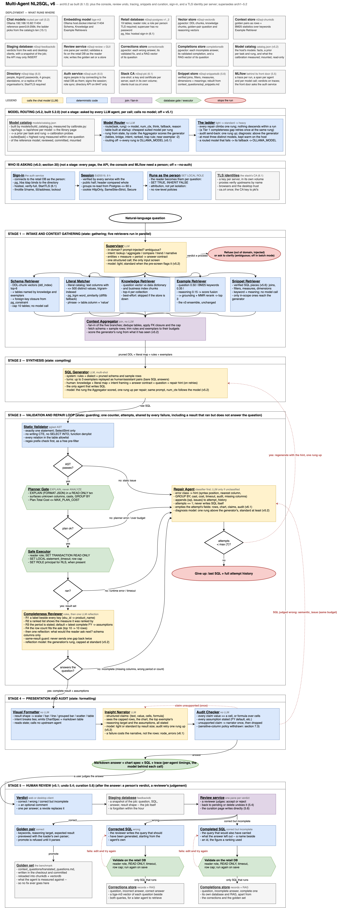
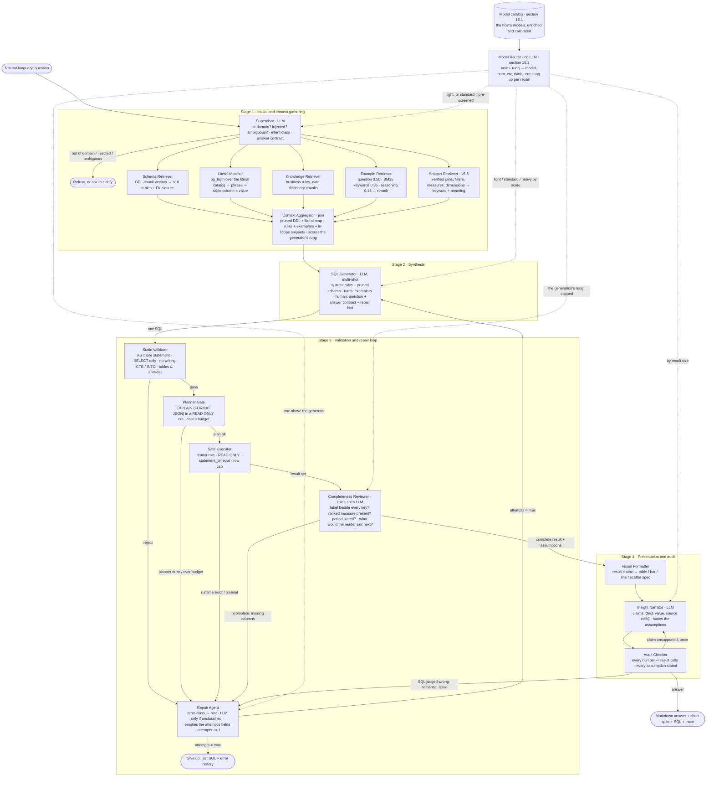
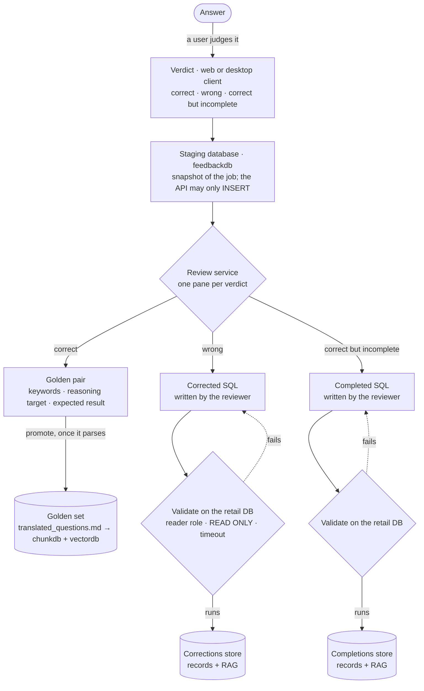

# Multi-Agent NL2SQL Architecture, v6

**Status:** built, as of **6.1.0** (2026-10-04). arch5.2 described a
pipeline whose model routing was "designed, not built"; it was built in
5.2.0, and five releases since have added a SQL console (5.3), taking a
judgement back (5.4), tracing (5.5), SQL snippets and a curation page (5.6),
and sign-in (6.0), with none of it in a spec. This document is the spec
again. Sections 1 to 15 are arch5.2's, corrected wherever the code departs
from them -- the state contract gains each field's lifetime and a channel
for agents that fail (section 3), the Repair Agent empties an attempt's
fields before the next one (6.3), the sensitive-column policy is withdrawn
(7.3), the security blueprint is a verified table (section 8), routing's six
departures are recorded as decisions (15.7) and the open decisions are
closed or restated (section 13). Sections 16 to 19 describe what 5.3 to 5.6
added. Section 20 is the sign-in **design** -- trust boundaries, what each
credential is worth, the alternatives rejected, the limits chosen, the
properties promised -- written against the code and holding it from now
on. Section 21 is 6.1's transport: TLS on the retail database, and a TLS
identity of its own for every server. The threat model and the deployment
tiers are in [`SECURITY.md`](../SECURITY.md).
Supersedes `Multi-Agent_NL2SQL_arch5_2.md`, and through it
`Multi-Agent_NL2SQL_arch5_1.md`, `Multi-Agent_NL2SQL_arch5.md`,
`Multi-Agent_NL2SQL_arch4.md`, `Multi-Agent_NL2SQL_arch1.md`,
`Multi-Agent_NL2SQL_arch2.md`, `Multi-Agent_NL2SQL_arch3.md` and the
`Multi-agent NL2SQL.drawio` diagram.
Where the three earlier documents disagree, arch3 was taken as
authoritative, then arch2, then arch1; the draw.io diagram is read as the
visual companion to arch3 and is called out where it departs from arch3's
own text.

**Diagram:** [`Multi-Agent_NL2SQL_arch6.drawio`](Multi-Agent_NL2SQL_arch6.drawio)
(editable in draw.io) and [`Multi-Agent_NL2SQL_arch6.png`](Multi-Agent_NL2SQL_arch6.png)
(rendered): arch5.2's, with a third deployment row for sign-in and the
stack's TLS, a band for who is asking above Stage 1, the fifth retriever,
the repair edge's reset, and Stage 5 with the curation page. The draw.io
file is generated by [`make_arch6_drawio.py`](make_arch6_drawio.py), so a
change to an agent's wording is a one-line edit and a re-run rather than a
redraw. The
same architecture is drawn inline below in Mermaid, which renders on GitHub.



**Ground truth used for validation:** the v3 agent in `agent/nl2sql_agent/`,
the retail schema in `data_gen/ddl.sql` (19 tables), the RAG stores built by
`rag/`, and the benchmark results in `benchmarks/README.md`.

---

## 1. Verdict

The four-layer design shared by arch2 and arch3 -- intake and schema
grounding, synthesis, a validation and repair loop, then presentation and
audit -- is sound, and the measured evidence supports its two central
claims:

- **Retrieval before generation is what fixes the hard questions.** The
  schema-only agent scores 1/3 on grain questions and 0/1 on fan-out; with
  the knowledge base both go to full marks. (`benchmarks/README.md`)
- **The LLM is the wrong tool for the validation gate.** The only question in
  45 benchmark runs where a configuration failed to answer at all was one
  where the agent wrote a correct query and its own LLM reviewer rejected it
  three times. Validation must be deterministic. arch2 and arch3 already say
  so; the current code does not yet do it.

The documents are not implementable as written. Five things are wrong and
eight are missing. All are fixed below; the change log in section 12 lists
every departure from arch1-3 with its reason.

### What is wrong

| # | Where | Problem | Resolution |
|---|---|---|---|
| W1 | draw.io | A **planner failure never reaches the repair loop.** The "Database Engine Pass" routes FAIL straight to the "Send Error Stack" terminator. arch3's own text ("catches structural database tracebacks... misaligned aggregation grouping identifiers"), arch2 and arch1 all say engine errors are repaired. The planner is the only component that can see an unknown column, a bad type cast or a missing GROUP BY, which are the common real errors. | Every failure -- static, planner, runtime, or audit -- routes to the Repair Agent under one shared retry budget. The terminator is reached only when that budget is spent. (section 6) |
| W2 | arch3, draw.io | **`EXPLAIN ANALYZE` executes the query.** The "non-executing" engine pass would run every candidate once for the plan and again for the answer. The cost and timeout check would *be* the run. | Plain `EXPLAIN (FORMAT JSON)` inside a `READ ONLY` transaction, which is what the v3 code already does. The plan's `Total Cost` is the cost gate; `statement_timeout` belongs on execution. (section 6.2) |
| W3 | draw.io | **Presentation agents can re-enter the pipeline without a budget.** The Insight Audit Agent "can call" the SQL Generator, and both presentation agents "can call" the schema, aggregator and fuzzy-match agents. A generator call from the audit stage runs synthesis, validation, execution and audit again with no counter drawn. The other calls re-invoke agents to fetch state the pipeline already holds. | Presentation agents *read* the shared state. If the audit judges the SQL semantically wrong it emits a `semantic_issue` that routes to the Repair Agent under the same retry budget as every other failure: one loop, one counter. (section 7.3) |
| W4 | arch3 | **A regex cannot enforce read-only.** PostgreSQL accepts data-modifying CTEs (`WITH x AS (DELETE ... RETURNING *) SELECT * FROM x` starts with `WITH`), `SELECT ... INTO`, and functions with side effects. A "starts with SELECT" check passes all of them. | The AST parser rejects writing CTEs, `INTO`, multiple statements and a function denylist. The backstop is the database: a `SELECT`-only reader role, `default_transaction_read_only`, `SET TRANSACTION READ ONLY`. Verified against the running database: both the writing CTE and `SELECT INTO` are refused inside a `READ ONLY` transaction, which the v3 executor already opens. The regex survives only as a free pre-filter. (section 8) |
| W5 | all three, code | **The retry budget is defined four ways.** arch3: "Max 3 Retries". draw.io: `counter < 4`. arch2: "max retries window", unspecified. Code: `MAX_SQL_ATTEMPTS=3` *generations*, so two retries. | One counter, `attempts`, counting generations. Default 7 = one first draft and six repairs; arch4 set 4, and section 6.4 says why arch5 raises it. Every failure source increments the same counter. (section 6.4) |

### What is missing

| # | Gap | Resolution |
|---|---|---|
| M1 | **No state contract.** All three documents say agents "communicate via structured messages" and none defines the message. Nothing is unit-testable, which arch2 lists as the architecture's main advantage, until the interface exists. | `AgentState` is defined field by field in section 3. Every agent is a function of a subset of it and returns a partial update. |
| M2 | **The Supervisor classifies intent and nothing consumes the class.** | Three consumers are defined: routing (out of domain, injected, ambiguous), the generator's task framing, and the formatter's chart choice. (section 4.1) |
| M3 | **The clarification path was lost between arch1 and arch3.** arch1's Analyzer "clarifies ambiguous vocabulary"; arch2 and arch3 drop it. The benchmark's first run found 4 of 15 questions admitted two correct answers. | The Supervisor may exit to a clarification interrupt. Disabled in batch and benchmark mode. (section 4.1) |
| M4 | **The Fuzzy Match Agent has no catalog to search and no extension to search it with.** `pg_trgm` is available in the retail image but not installed; no document says which columns hold matchable literals. | A literal catalog: every text column with at most 500 distinct values (42 of the 43 text columns in this schema, none over 200 values), indexed by trigram. Fallback to `difflib` when the extension is absent. (section 4.3) |
| M5 | **The Schema Agent's index is described as if it had to be built.** The v2 vector store already holds one DDL chunk per table (`knowledge/ddl_index.md`) with keywords and grain. What is missing is foreign-key closure and the removal of the LLM table-selection call, which costs 24% of the v3 run. | Schema retrieval = DDL-chunk vectors + FK closure from `pg_constraint`, capped at 10 tables, no model call. (section 4.2) |
| M6 | **"Audits math vs rows" is a sentence, not a check.** | Every number in the narrative must be a result cell, a declared aggregate of result cells, or marked derived with its formula. The narrator emits structured claims; a deterministic checker verifies them. (section 7.2) |
| M7 | **The worked-example retrieval built in v3 is not in the architecture.** arch3 puts "assembles few-shot golden pairs based on schema similarity" inside the generator, which is weaker than the three-retriever ensemble with reranking that exists and measures 45/45 on its own corpus. | The Example Retriever is a Stage 1 agent, parallel with schema and literal retrieval, and keeps the v3 ensemble unchanged. (section 4.4) |
| M8 | **Nothing asks whether a correct answer is a useful one.** Every gate checks that the SQL runs and that the narrative matches the rows; none checks that the rows answer the question a person would recognise. "Top 10 SKUs" comes back as ten `sku_id` values with no product name and no sales figure; "top ten stores" comes back as ten `store_id`s. The query is right and the answer is unusable without a second query. (New in arch5.) | An **answer contract** derived at intake says what a complete answer must carry -- a label beside every key, the measure that ranked the rows, the period it covers -- and a **Completeness Reviewer** after execution checks the result against it, deterministically first and with one reflective model call second. A gap is an `Issue` with `source = completeness` that routes to the Repair Agent under the shared budget. (sections 4.1, 6.6) |

Smaller corrections, applied without further comment: stage 2 is renamed
from "Synthesis & Statistical Analysis" (nothing statistical happens there);
the Context Aggregator is a join node, not an agent; "cross-site scripting"
is not an input threat to a SQL system and is replaced by prompt-injection
screening; draw.io label typos ("Pruned DL + Valed Row Literals") are fixed;
the validator's table allowlist check from arch2, dropped by arch3, is
restored.

### Name reconciliation

| arch1 | arch2 | arch3 / draw.io | v5 (this document) |
|---|---|---|---|
| Analyzer Agent | Supervisor / Router Agent | Supervisor Agent | **Supervisor** |
| Metadata / RAG Agent | Vector-RAG Schema Agent (Pruner) | Vector-RAG Schema Agent | **Schema Retriever** |
| -- | Fuzzy Match & Entity Matcher Agent | Fuzzy Match Agent | **Literal Matcher** |
| -- | -- | Context Aggregator | **Context Aggregator** (join) |
| (implicit in RAG agent) | -- | (inside SQL Generator) | **Knowledge Retriever**, **Example Retriever** |
| SQL Generator Agent | SQL Generator Agent | SQL Generator Agent | **SQL Generator** |
| Query Validator Agent | Query Validator Agent | SQL Query Validator Agent | **Static Validator** |
| -- | (inside validator: EXPLAIN) | Database Engine Pass | **Planner Gate** |
| (inside generator) | SQL Repair Agent | SQL Repair Agent | **Repair Agent** |
| -- | Safe Execution Layer | Execute | **Safe Executor** |
| Insight & Visual Agent | Visual Agent | Visual Formatting Agent | **Visual Formatter** |
| Insight & Visual Agent | Insight & Guardrail Agent | Insight Audit Agent | **Insight Narrator** + **Audit Checker** |
| -- | -- | -- | **Completeness Reviewer** (arch5) |
| -- | -- | -- | **Model Router** and the **model catalog** (arch5.2) |

---

## 2. Architecture

Four stages, one shared state object, one retry loop. Agents marked **LLM**
call a chat model; everything else is deterministic code. On the happy
path exactly four model calls are made: Supervisor, SQL Generator,
Completeness Reviewer (its reflection), Insight Narrator. Since arch5.2
*which* model answers each of them is the Model Router's decision, made
per call from the agent's task and the complexity the question presents
(section 15); routing changes the model behind a call, never the number
of calls.



Stage 1's five retrievers run as parallel branches of the graph; the
aggregator is the fan-in. Stage 3 is a single loop: whichever gate fails --
including the Completeness Reviewer, which is the one gate that can reject
a query that ran correctly -- the Repair Agent turns the failure into a
hint and the generator tries again, until `attempts` reaches its limit.

### What runs where

| Component | Host | Used by |
|---|---|---|
| Chat models: the **model catalog** (v5.2, section 15.1) -- today `qwen3.8-256k` (the reference: what v5.1 runs every call on), `qwen3.8`, `qwen3.6`, `qwen3-coder-next`, `gemma4:12b-mlx`, `deepseek-r1` 8b to 70b, `mistral:7b` | Ollama at `192.168.10.82:11434` | Supervisor, SQL Generator, Completeness Reviewer (reflection), Insight Narrator, Repair Agent (unclassified errors only) -- each through the Model Router, which picks the rung's model per call (section 15.3); `OLLAMA_MODEL` for every call when routing is off |
| Model catalog `models/catalog.json`: the host's models with their facts, a fit per task and rung, and what the calibration measured (v5.2) | built by `models/build_catalog.py` on the operator's machine; mounted into the agent | the Model Router, at startup |
| Embedding model `bge-m3` | Ollama at `host.docker.internal:11434` | Schema, Knowledge and Example Retrievers |
| Retail database, `nl2sql_retail` (19 tables) | `nl2sql-postgres` | Literal catalog, FK closure, label map, fiscal calendar, Planner Gate, Safe Executor |
| Vector store (pgvector): DDL chunks, knowledge chunks, golden-pair question and reasoning vectors | `nl2sql-vectordb` | Schema, Knowledge and Example Retrievers |
| Context store: golden pairs as rows + BM25 statistics | `nl2sql-chunkdb` | Example Retriever |
| Staging database: verdicts with a snapshot of the job (v5.1) | `nl2sql-feedbackdb` | the REST API (INSERT only), the review service |
| Review service and its GUI (v5.1) | `nl2sql-review`, `nl2sql-review-gui` | curators; validates fixes on the retail database as `nl2sql_reader` |
| Corrections store (pgvector): wrong answers, their validated fixes, a vector per question (v5.1) | `nl2sql-correctionsdb` | the review service; retrieval by an agent is future work (section 14) |
| Completions store (pgvector): incomplete answers, their validated completions, a vector per question (v5.1) | `nl2sql-completionsdb` | the same |
| SQL console and its page (v5.3, section 16) | `nl2sql-console`, `nl2sql-console-gui` -- the agent's image, run a third way | reviewers and curators, troubleshooting an answer; this machine only |
| MLflow and its store (v5.5, section 18) | `nl2sql-mlflow`, `nl2sql-mlflowdb`, behind `nl2sql-mlflow-proxy` | every run as a trace; this machine only |
| Snippet store (pgvector): SQL snippets, their meanings and vectors (v5.6, section 19) | `nl2sql-snippetsdb` | the Snippet Retriever (reading); the review service (writing, from the tracked document) |
| Curation page (v5.6) | `nl2sql-curate-gui`, in front of the review service | curators: snippets, golden pairs and fixes, written directly |
| Directory (OpenLDAP, standalone or a replica) (v6.0, section 20) | `nl2sql-ldap`, not published | the retail database (each person's password), the auth service |
| Auth service and the directory page (v6.0) | `nl2sql-auth` (8446 published; 8447, the directory's API, not), `nl2sql-directory-gui` | every page and client signs in here; every service verifies its sessions |
| The stack's CA and one TLS identity per server (v6.1, section 21) | `nl2sql-pki`, a one-shot | every server that serves TLS, before it starts |

---

## 3. The shared state

The one thing every document promised and none delivered. Every agent is a
pure function of a subset of these fields and returns a partial update;
LangGraph merges the updates. Field names that already exist in the v3
`AgentState` keep their names.

```python
class AgentState(TypedDict, total=False):
    # --- input ---------------------------------------------------------
    question: str
    principal: str | None            # end-user identity, for SET ROLE / RLS (section 8)

    # --- stage 1: intake ------------------------------------------------
    intent: Literal["lookup", "aggregate", "compare", "trend", "narrative"]
    verdict: Literal["proceed", "out_of_domain", "injection", "ambiguous"]
    clarification: str | None        # the question to ask back when verdict == "ambiguous"
    answer_contract: AnswerContract  # {entities, measure, period, ranked}: what a complete
                                     #   answer must carry (section 4.1, arch5)
    assumptions: list[str]           # defaults the pipeline chose for the user, e.g. the
                                     #   fiscal year; the narrator must state every one

    selected_tables: list[str]       # Schema Retriever: ≤ 10, FK-closed
    schema: str                      # DDL + comments + sample rows for selected_tables
    literal_map: list[LiteralMatch]  # Literal Matcher: phrase -> (table, column, value, score)
    knowledge: str                   # Knowledge Retriever: rendered chunks
    knowledge_tables: list[str]
    example_shots: list[Shot]        # Example Retriever: {question, reasoning_target, sql_code}
    example_tables: list[str]
    snippets: list[Snippet]          # Snippet Retriever: verified SQL pieces (v5.6, section 19)
    snippet_context: str             #   the ones whose tables are in scope, as the generator reads them
    retrieval_errors: dict[str, str] # retriever name -> why it was skipped (best-effort)
    node_errors: dict[str, str]      # an agent that is not a retriever and failed but was
                                     #   survived -- the Supervisor, the Narrator (v6.1)
    complexity: Complexity           # {score, signals, rung}: how hard the generator's task
                                     #   looks, scored by the Context Aggregator from what
                                     #   retrieval returned (section 15.2, v5.2)

    # --- stage 2: synthesis --------------------------------------------
    sql: str
    attempts: int                    # generations so far; the one retry budget

    # --- stage 3: validation and repair --------------------------------
    issues: list[Issue]              # {source, message, hint}; source in
                                     #   static | planner | runtime | completeness | audit
    attempt_history: list[Attempt]   # {sql, issues} for every failed generation
    plan_cost: float | None          # EXPLAIN total cost of the accepted query
    result: QueryResult | None       # {columns, rows, row_count, truncated}
    completeness: CompletenessReport # {passed, missing: list[MissingColumn], reflected: bool}

    # --- stage 4: presentation -----------------------------------------
    chart: ChartSpec | None          # {kind, x, y, series} or None for a table
    claims: list[Claim]              # {text, value, cells: list[(row, col)], formula: str | None}
    narrative: str
    audit: AuditReport               # {passed, unsupported_claims, drop_reasons,
                                     #   missing_assumptions, semantic_issue}
    narration_retries: int           # the narrator's one rewrite, per attempt

    # --- output and observability --------------------------------------
    answer: str                      # rendered markdown
    error: str | None
    trace: list[TraceEntry]          # {node, ms, model_calls, detail, model, rung, route, hops}
                                     #   model, rung, route, hops: which model answered, why,
                                     #   and which failed first (v5.2); over REST since v6.1
```

Rules that follow from the contract:

- **Retrieval is best-effort.** A retriever that cannot reach its store
  writes to `retrieval_errors` and the run continues without it. This is
  the v2/v3 behaviour and it stays: at the limit, with every store down, the
  pipeline degrades to schema-only.
- **`attempts` is the only counter.** No agent keeps its own.
- **`trace` is appended by every node**, which is what lets the benchmark
  attribute time per agent rather than per stage.
- **`trace` names the model** (v5.2). Every entry that made a model call
  records which model it went to and at which rung, so accuracy and time
  are attributable per model and not only per agent; the calibration in
  section 15.5 reads nothing else. The REST answer carries all of it
  (v6.1): the wire model forbids a field it does not declare, so a field
  added here and not there fails a test instead of disappearing.
- **A failed agent is not a failed retriever** (v6.1). A retriever that
  cannot reach its store writes `retrieval_errors`; the Supervisor or the
  Narrator, failing and survived, writes `node_errors`. A reader of either
  map knows which kind of thing went missing.
- **Every field has a lifetime** (v6.1). arch4 left it to each node to
  overwrite what it read, and the Insight Narrator of attempt 2 read the
  audit of attempt 1: a semantic issue sent the run back to repair, the
  next narration saw the previous audit's drop reasons, treated itself as
  a rewrite, and spent its one rewrite on a query that no longer existed.
  The lifetimes are declared beside the state (`state.LIFETIMES`) and the
  Repair Agent empties every attempt field on the way back to the
  generator (`attempt_reset()`):

| Lifetime | Fields | Means |
|---|---|---|
| **run** | `question`, `principal`, `intent`, `verdict`, `clarification`, `answer_contract`, every Stage 1 field, `retrieval_errors`, `node_errors`, `complexity`, `attempts`, `generation_rung`, `rung_holds`, `attempt_history`, `completeness`, `narrative`, `answer`, `error`, `trace`, `trace_id` | written once or accumulated for the whole run. `completeness` is one on purpose: the reviewer reads its earlier report so it reflects once per run and never sends the same gap back twice |
| **attempt** | `assumptions`, `plan_cost`, `result`, `chart`, `claims`, `audit`, `narration_retries` | one generated query and what became of it. Emptied on the repair edge |
| **handoff** | `sql`, `issues` | carried across the repair edge on purpose: the failed SQL and the hints about it are what the next generation is written from, and it replaces both |

A test holds the table to the state (`tests/agent/test_state.py`): a field
added without a lifetime fails, and so does a reset that misses one.

---

## 4. Stage 1: intake and context gathering

### 4.1 Supervisor (LLM)

Receives the raw question. One structured-output call returning `verdict`,
`intent`, `clarification` and, since arch5, the three fields the
**answer contract** is built from. It is the only agent that sees the
question before any retrieval, so it is where input screening lives.

| Output | Consumed by | Effect |
|---|---|---|
| `verdict = out_of_domain` | router | Answer "this database holds retail sales, pricing, promotions and advertising for FY2024-FY2025; that question is outside it." No SQL. |
| `verdict = injection` | router | Refuse. The question contains instructions to the system (ignore rules, reveal schema, run a statement) rather than a question about the data. |
| `verdict = ambiguous` | router | LangGraph `interrupt` with `clarification`. **Off** in batch and benchmark mode, where it collapses to `proceed`. |
| `intent` | SQL Generator | A one-line task framing in the human turn: "This is a comparison; return both sides and the difference." |
| `intent` | Visual Formatter | Tie-breaker for chart choice: `trend` prefers a line, `compare` a grouped bar. |
| `entities`, `measure`, `period` | answer contract | What the rows are about (`sku`, `store`, `department`...), the quantity that answers or ranks them (`net sales`, `gross margin`...), and the time span the question names -- or `null` when it names none. |

**The answer contract.** Deterministic code turns those three fields into
the columns a complete answer must carry, and the same contract is read by
the SQL Generator (section 5.1) before the query is written and by the
Completeness Reviewer (section 6.6) after it has run:

| Field | Derived from | Rule |
|---|---|---|
| `entities[].key`, `entities[].label` | the **label map**: for every dimension table, its key columns -- the surrogate `*_key` and any natural id such as `sku_id` or `store_id` -- and its `*_name` / `*_desc` columns, read from the catalog at startup (`dim_product.sku_id` → `product_name`, `dim_store.store_id` → `store_name`, `dim_vendor.vendor_key` → `vendor_name`; 10 of the 19 tables have one, every dimension but `dim_ad_channel`) | Every key column in the answer is accompanied by its label. An id is an address, not an answer. |
| `measure` | the Supervisor's `measure`, resolved against the knowledge base's metric definitions | A list that is ranked, filtered or limited by a quantity shows that quantity. "Top 10 SKUs" means "by something"; the something is a column. |
| `period` | the Supervisor's `period`, else the **latest complete fiscal year** read from `dim_date` (the greatest `fiscal_year` whose last calendar date is on or before the data's last sale date; FY2025 in the current data) | A measure is stated with the span it covers. When the question named none, the default is applied *and written to `assumptions`*, so the answer says "for FY2025, the latest complete fiscal year". A default the user is not told about is a wrong answer that looks right. |
| `ranked` | `intent` and the question's wording (top / bottom / best / worst / highest / most / N) | A ranked list carries its rank order, and the row count the question asked for. |

The contract names columns, never SQL. Which table supplies `product_name`
and how it is joined is the generator's job, and the pruned schema already
tells it.
The prompt is short and the output is small, so this call is fast relative to
generation. It replaces nothing in v3, so it is a net addition of one model
call; section 9 shows it is paid for several times over by the calls it
enables removing.

### 4.2 Schema Retriever (no LLM)

Replaces the v3 `select_tables` model call, which costs 364 of 1499 seconds in
the benchmark and is the second-slowest stage.

1. Embed the question; search the `ddl_index` collection, which already holds
   one chunk per table with its full `CREATE TABLE`, comments, grain and
   keywords. Take the top-k tables by cosine distance (k = 6).
2. Add any table named by the Knowledge and Example Retrievers
   (`knowledge_tables`, `example_tables`), as v3 does.
3. **Foreign-key closure**: for every pair of selected tables, add any table
   that is the shortest join path between them, read from `pg_constraint`.
   This is what catches `dim_ad_placement`, the bridge that benchmark B15
   needs and that a similarity search will never rank because the question
   does not mention it.
4. Cap at 10 tables. If the cap is exceeded, drop the lowest-ranked
   non-bridge tables first.
5. Render `schema` as v3 does: columns, types, comments, keys, sample rows.

The 10-table cap from arch2 and arch3 is kept. With 19 tables it is a real
limit, and the largest of the 45 golden pairs touches 6; the median touches 4.

### 4.3 Literal Matcher (no LLM)

The agent arch2 and arch3 describe but never give a catalog to search.

**Literal catalog.** Built once at startup (or at image build time) from the
retail database: every text column whose distinct count is at most 500. In
this schema that is 42 of the 43 text columns, the largest being
`dim_product.sku_id`, `product_name` and `upc_barcode` at 200 values each;
the one excluded is `fact_pos_retail_sales.basket_id` at 258,308. Stored as `(table, column, value)` rows with a trigram index.

**Candidates** are extracted from the question deterministically: quoted
strings, capitalised multi-word phrases, tokens in ALL_CAPS or with
underscores (`SCAN_BACK`), and any token that is not an English stopword and
does not match a column name.

**Matching** uses `pg_trgm`'s `word_similarity` when the extension is
installed (it is available in the retail image and not yet installed), and
Python `difflib.get_close_matches` otherwise. Matches above 0.6 are kept;
the top match per candidate goes into `literal_map`, and ties across columns
are all kept, because "Dairy & Eggs" is a department and a reasonable model
should be told so rather than guess.

**Output** is rendered into the generator's human turn as a short block:

```
Literal values in this database that match the question:
  "Dairy & Eggs"  -> dim_product.department_name = 'Dairy & Eggs'
  "SCAN_BACK"     -> dim_allowance_type.allowance_type_code = 'SCAN_BACK'
  "Print Flyer"   -> dim_ad_channel.channel_type = 'Print Flyer'
```

Benchmark evidence: B07, B09 and B15 each turn on a literal the model has to
spell exactly (`Dairy & Eggs`, `SCAN_BACK`, `Print Flyer`). All three pass
today because the question spells the literal exactly as the database does;
the literal map is what makes them pass when it does not ("dairy and eggs",
"scan-back allowances").

### 4.4 Knowledge Retriever and Example Retriever (no LLM)

Both are the v2 and v3 components unchanged, moved into the parallel fan-out:

- **Knowledge Retriever:** embed the question, search every `*_embeddings`
  collection (data dictionary, business index; the DDL index is now the
  Schema Retriever's), top-4 chunks per collection, render to `knowledge`.
- **Example Retriever:** the three-retriever ensemble over the 45 golden
  pairs -- question vectors 0.50, BM25 over keywords 0.35, reasoning-target
  vectors 0.15 -- min-max score fusion, then grounding-and-MMR rerank, top 3.
  Measured 45/45 on retrieving each pair from its own question; RRF at k=60
  managed 25/45, which is why score fusion is the default.

arch3 placed example assembly inside the generator, keyed on "schema
similarity". The ensemble is kept instead because it is measured, and
because retrieval is I/O (1.2 s for all four retrievers over 15 questions)
and belongs with the other I/O, not inside the one expensive model call.

### 4.5 Context Aggregator (join, no LLM)

The fan-in node. It does four things (the fourth since v5.2) and calls no
model:

1. Waits for all four branches (LangGraph handles the join).
2. Deduplicates tables across `selected_tables`, `knowledge_tables` and
   `example_tables`, applies the FK closure and the cap (section 4.2, steps
   3-4), and fetches `schema`.
3. Trims `knowledge` and the exemplars to their character budgets so the
   generator's prompt is bounded regardless of what retrieval returned.
4. Scores the generator's task (v5.2): from the table count after closure,
   whether closure added a bridge, the intent, the contract, the retrieved
   rules and the nearest exemplar, it writes `complexity` -- the rung the
   first draft is routed at (section 15.2). It is the one node that has
   seen everything the generator will see, and it calls no model, so the
   score costs nothing.

---

## 5. Stage 2: synthesis

### 5.1 SQL Generator (LLM, multi-shot)

The v3 prompt shape, kept exactly, with two additions:

```
system:   rules · dialect · pruned schema and sample rows
human:    Rule that applies here: <exemplar.reasoning_target>
          Question: <exemplar.question>
          SQL:
assistant: <exemplar.sql_code>                       (× up to 3 exemplars)
human:    Knowledge base: <knowledge>
          Literal values in this database that match the question: <literal_map>   (new)
          Task: <intent framing>                                                     (new)
          A complete answer includes: <answer contract, rendered>                    (arch5)
          Question: <question>
          <repair hint, on retries>
          SQL:
```

The contract line is rendered as plain prose so the generator sees it the
way a colleague would say it: "A complete answer names each SKU
(`product_name`) beside its `sku_id`, includes the total net sales that
rank it, and covers FY2025, the latest complete fiscal year." Most
questions will come back complete on the first draft because of this line,
and the reviewer in section 6.6 is what catches the rest; the two read the
same contract, so the hint on a retry is the same sentence with the missing
part underlined.

Exemplars are replayed as real human/assistant turns, not pasted as a block:
that is the shape instruct models are tuned on and it is what makes the
example a demonstration rather than a quotation. Assistant turns are bare
SQL with no comment prefix, because the Static Validator requires the
statement to begin with `SELECT` or `WITH`.

The generator is the only model call in the stage and the only place SQL is
written. The Repair Agent does not write SQL; it writes hints (section 6.3).

Which model writes it is the Model Router's call (v5.2): the rung the
Context Aggregator scored for the first draft, one rung higher on each
repair (section 15.3). The prompt is the same at every rung; only
`num_ctx` follows the model, since a light model is not lent a 256k window
it will never fill.

---

## 6. Stage 3: validation and repair loop

Three deterministic gates in series, then one reflective gate, one repair
path, one counter. This is the stage the documents got most wrong and the
one the benchmark says matters most: the v3 LLM validator costs 499 seconds
over 15 questions and is the only component that ever turned a right answer
into no answer. arch5 adds a fourth gate *after* execution, the
Completeness Reviewer (section 6.6): it is the one gate that can send back
a query that ran correctly, because running correctly and answering the
question are different things.

### 6.1 Static Validator (no LLM)

Parse with `pglast`, which wraps PostgreSQL's own parser (`libpg_query`), so
what it accepts is what the server accepts. Reject when:

- the input is not exactly one statement;
- the statement is not a `SelectStmt` (which covers `WITH ... SELECT`);
- any CTE body is an `InsertStmt`, `UpdateStmt`, `DeleteStmt` or `MergeStmt`
  (PostgreSQL allows these; a prefix check does not see them);
- the select has an `INTO` target;
- any function call is on the denylist: `pg_sleep`, `pg_read_file`,
  `pg_read_binary_file`, `lo_import`, `lo_export`, `dblink`, `dblink_exec`,
  `pg_terminate_backend`, `pg_cancel_backend`, `set_config`, `pg_notify`;
- any referenced relation is not in `selected_tables` (the arch2 allowlist,
  restored). The message names the closest allowed table by trigram so the
  hint is useful: `fact_ad_perf is not in scope; did you mean fact_ad_performance?`

A rejection is an `Issue` with `source = static`. The regex prefix check from
v3 runs first because it is free, and nothing relies on it.

### 6.2 Planner Gate (no LLM)

```sql
BEGIN; SET TRANSACTION READ ONLY;
EXPLAIN (FORMAT JSON) <sql>;
ROLLBACK;
```

Not `EXPLAIN ANALYZE`. `ANALYZE` executes the statement to report actual
timings; a "pass" built on it would run every candidate query before the
executor runs it again, and its "timeout check" would be the full run. Plain
`EXPLAIN` plans without executing, in a few milliseconds, and:

- **reports every semantic error the parser cannot**: unknown column, type
  mismatch, aggregate outside GROUP BY, ambiguous reference. This is the
  feedback that repairs the common real mistakes, and it is why W1 matters.
- **returns `Plan.Total Cost`**, which is the cost gate. A query whose
  estimated cost exceeds `MAX_PLAN_COST` is rejected with a hint to add a
  filter or a join condition. This is arch1's "dangerous cross-joins" check,
  made concrete. Measured on the current data: the most expensive of the 45
  golden pairs plans at a cost of 125,767, a full scan of the sales fact at
  20,096, the sales fact cross-joined with `dim_product` at 1.6 million, and
  the sales fact cross-joined with itself at 12.5 billion. A default of
  **1,000,000** is eight times the hardest known-good query and below the
  smallest cross join that involves the fact table.

A planner error is an `Issue` with `source = planner` and the server's
message verbatim.

### 6.3 Repair Agent (classifier first, LLM only when unclassified)

The draw.io diagram changes arch3 here in a way that is kept: the Repair
Agent *passes its analysis back to the generator* rather than writing SQL
itself. One agent writes SQL. The cost is a second model call per retry, so
the repair agent classifies deterministically first and calls the model only
for what it cannot classify:

| Error (from any source) | Classified hint |
|---|---|
| `pglast` syntax error at position *n* | Quote the 40 characters around *n*; "syntax error here". |
| `column "x" does not exist` | Trigram-nearest columns in the pruned schema: "`x` is not a column; the schema has `x_amt`, `x_qty`." |
| `relation "t" does not exist` / allowlist miss | Nearest allowed table. |
| `must appear in the GROUP BY clause` | Name the column; "add it to GROUP BY or aggregate it." |
| `operator does not exist: a op b` | "Cast one side; `date_key` is an integer YYYYMMDD, not a date." |
| `division by zero` | "Guard the denominator with NULLIF." |
| plan cost over budget | "The plan is a cross join or an unfiltered scan; join on the declared keys and filter on fiscal_year." |
| `statement_timeout` | Same hint as cost, plus "add LIMIT if a sample answers the question." |
| `completeness: missing columns` | The reviewer's own list, rendered as the contract sentence with the gap named: "The result has `sku_id` but no product name; add `dim_product.product_name`. It is ranked but shows no measure; add the `SUM(net_sales)` it was ranked by." No model call: the reviewer already did the thinking. (section 6.6) |
| `audit: semantic_issue` | The Audit Checker's own message (section 7.3). |
| anything else | **LLM call**: the failed SQL, the error, and the schema; asked for a one-paragraph diagnosis, not a query. Routed one rung above the generator's current rung, standard at least (v5.2, section 15.2): what the classifier could not name is not a job for the light model. |

Every repair appends `{sql, issues}` to `attempt_history`, so the hint on
attempt 3 can also say "attempts 1 and 2 both joined on date_key; that is
the error." The generator receives the hint in its human turn as v3's
`RETRY_FEEDBACK` already does.

**The attempt that failed is over** (v6.1). The same update that records
it empties every *attempt* field of section 3 -- the plan's cost, the rows,
the chart, the claims, the audit, the narrator's rewrite, the assumptions --
so nothing of attempt N is read by attempt N+1, and a run that gives up
after a repair reports no rows from a query it did not end with.

### 6.4 The retry budget

```
attempts = 0
loop:
    generate            -> attempts += 1
    static  -> fail? -> repair -> attempts < MAX_ATTEMPTS ? loop : give_up
    planner -> fail? -> repair -> (same)
    execute -> fail? -> repair -> (same)
    review  -> incomplete? -> repair -> (same)      (arch5)
    audit   -> semantic_issue? -> repair -> (same)
```

`MAX_ATTEMPTS = 7`: one draft and six repairs. arch4 set it to 4 -- arch3's
"max 3 retries" and the draw.io's `< 4`, stated once -- when the budget
paid for four kinds of failure. arch5 adds a fifth, and one that a correct
query can trigger: a run that spends a repair on a planner error and
another on a missing label column has used two of arch4's three, and the
reflection may still ask for a third. Seven keeps room for that without
loosening the rule that matters, which is that every failure source shares
the counter; there is no way to loop that does not spend it. The
same-result guard in section 6.6 is what stops the reviewer from spending
the extra room on the same gap twice. Give-up returns the last SQL and the
full `attempt_history`, because a user who gets no answer should at least
see what was tried.

Since v5.2 the counter also drives the model ladder: every repair raises
the rung the next generation is routed at by one, light to standard to
heavy, and nothing lowers it within a run (section 15.3). A budget of seven
therefore reaches the heavy rung by a light question's third or fourth
generation, so no question is given up on before the strongest model in
the ladder has tried it.

### 6.5 Safe Executor

The v3 `run_select`, hardened per section 8: a dedicated reader role, `SET
TRANSACTION READ ONLY`, `SET LOCAL statement_timeout`, a row cap with a
`truncated` flag, and `SET ROLE <principal>` when a principal is present. A
runtime error (a timeout that the planner could not predict, a division by
zero that only shows on real rows) is an `Issue` with `source = runtime` and
goes to the Repair Agent like any other.

### 6.6 Completeness Reviewer (rules first, then one reflective LLM call)

*New in arch5.* The three gates above answer "did it run?"; the
audit in section 7.3 answers "is the prose true to the rows?"; nothing
answered "are these the rows a person wanted?". The motivating cases:

| Question | What v4 returned | What a person wanted |
|---|---|---|
| top 10 SKUs | ten `sku_id` values | each SKU's `product_name` beside its id, and the net sales for FY2025 that made it a top-10 SKU |
| top ten stores | ten `store_id` values | `store_name` beside each id, and each store's FY2025 sales |
| which vendor supplies Dairy & Eggs | a `vendor_key` | the vendor's name |

All three are correct SQL, correctly executed, and useless without a second
query. The reviewer reads the result set with the question and the answer
contract in hand and asks, in two tiers, whether it is "fleshed out": whether
it carries the pertinent context a reader needs even when the question did
not spell it out.

**Tier 1 -- rules, no model call.** Each rule reads the contract, the
result's column list and the SQL's AST:

| Rule | Check | Hint on failure |
|---|---|---|
| R1 identity | every result column that is a key in the label map has its label column beside it | "add `product_name` next to `sku_id`" |
| R2 measure | when `ranked` or `measure` is set, a numeric column matching the measure is present; the `ORDER BY` expression, when there is one, appears in the select list | "the rows are ordered by `SUM(net_sales)` but it is not shown; select it" |
| R3 period | when `period` came from the default, the SQL filters `dim_date.fiscal_year` (or a joined equivalent) to it, and the assumption is recorded; when the question named a period, the filter matches it | "filter to fiscal_year = 2025 and keep it as the latest complete year" |
| R4 rows | a ranked question with N asked for gets at most N rows and no fewer unless the data runs out; a lookup that implies rows gets rows (moved here from the audit, where it fired too late to be cheap) | "the question asked for ten; the result has one hundred" |

A Tier 1 failure is an `Issue` with `source = completeness` and the rule's
hint, routed to the Repair Agent, which passes it to the generator as it
does every other hint. No model was consulted, so the retry costs one
generation, same as a syntax error.

**Tier 2 -- one reflective call, only when Tier 1 passes.** The rules can
only ask for what the contract can name. The reflection asks for what the
contract could not. The prompt is small: the question, the intent, the
contract, the result's columns and its first five rows, and the pruned
schema's *column names only*. It is routed at the rung the accepted
generation ran at, capped at standard (v5.2, section 15.2): a small prompt
and a short list are not the heavy model's job. It returns structured
output:

```json
{"complete": false,
 "missing": [
   {"column": "dim_product.brand_name",
    "why": "SKUs from the same brand are listed as if unrelated; a reader ranking SKUs will ask which brand"}],
 "note": "The FY2025 default is right: it is the last fiscal year the data holds in full."}
```

The reflection is bounded three ways, because an unbounded "what else would
be nice" loop is exactly the fault W3 removed from the presentation stage:

1. **It may only name columns that exist in the pruned schema.** Any
   `missing` entry whose column is not in `schema` is discarded before the
   verdict is read. It cannot invent data or ask for a new table.
2. **It runs once per accepted result, and its verdict spends the shared
   budget.** `complete = false` is an `Issue` like any other and goes
   through `attempts`. There is no second counter.
3. **It cannot send the same result back twice.** If the regenerated query
   returns the same column set it asked to change, the reviewer accepts the
   result and writes the gap to the audit report, which the answer shows:
   "This answer could not be extended with brand names in the attempts
   allowed." A reader is told what is missing rather than kept waiting.

**What passes through.** A result that passes both tiers goes to the Visual
Formatter with `assumptions` attached, and the narrator (section 7.2) must
state every assumption in prose. The `completeness` report is part of the
trace and of the benchmark's narrative score (section 11).

**Why here and not in the generator's prompt alone.** The contract line in
the generator's human turn (section 5.1) prevents most gaps; on the
benchmark's phrasing it is expected to make the reviewer a pass-through.
The reviewer exists for the phrasing that is not in the benchmark -- a
question that names an entity in a way the contract did not catch, a
result where the label join dropped rows, a ranking whose measure was
computed in a CTE and never selected. The prompt is a hint; the reviewer
is a check.

---

## 7. Stage 4: presentation and audit

### 7.1 Visual Formatter (no LLM)

arch3's "infers chart configuration schemas" is a lookup on result shape, and
a lookup should not be a model call:

| Result shape | Chart |
|---|---|
| 1 row × 1 column | scalar; rendered as a sentence, no chart |
| 1 categorical + 1 numeric, ≤ 30 rows | bar |
| 1 date/week/month column + 1 numeric | line |
| 1 categorical + 2+ numeric | grouped bar |
| 2 numeric, no categorical | scatter |
| anything else, or > 30 rows | table only |

`intent` breaks ties (`trend` → line over bar). The output is a `ChartSpec`
(kind, x, y, series) and a markdown table of the rows; nothing renders the
chart here, so the consumer can draw it with whatever it has.

### 7.2 Insight Narrator (LLM)

Writes the narrative, but as **structured claims** rather than free prose:

```json
{"claims": [
  {"text": "Dairy & Eggs ran a 31.4% gross margin in fiscal month 12.",
   "value": 31.4, "cells": [[0, "gross_margin_pct"]], "formula": null},
  {"text": "That is 2.1 points above the department's FY2025 average.",
   "value": 2.1, "cells": [[0, "gross_margin_pct"], [1, "fy_avg_pct"]],
   "formula": "cells[0] - cells[1]"}
]}
```

Every number the narrator wants to say must point at the cells it came from.
Its prompt gets the question, the result set (capped), the chart spec, the
`reasoning_target` of the top exemplar, which is the sentence that explains
the trap this kind of question has, and, since arch5, `assumptions`.
Every assumption must be stated in the narrative in plain words ("for
FY2025, the latest complete fiscal year, since the question did not name
one"); the Audit Checker fails a narrative that omits one, the same way it
fails a number it cannot trace.

Since v5.2 the call is routed by the result's size -- light for a scalar or
a handful of rows, standard beyond that -- and an audit send-back runs one
rung up (section 15.2). A narrator that fails -- the host gone, a malformed
answer -- costs the narrative and not the rows: the answer is rendered
without claims and the failure is recorded in `node_errors` (v6.1). The audit is what makes a small narrator safe: an
arithmetic slip is caught against the cells and costs one retry, not a
wrong answer.

### 7.3 Audit Checker (no LLM)

arch2's "cross-references every single numerical figure ... against the true
execution table payload", made checkable:

1. For every claim: the value equals the named cell; or `formula` over the
   named cells evaluates to the value within rounding (2 decimals, matching
   the benchmark's tolerance); or the claim is dropped.
2. Any number in `text` that is not the claim's `value` fails the claim.
   Numbers that appear in an assumption ("FY2025") are exempt, as
   qualifiers echoed from the question already are.
3. ~~**Sensitive-column policy.**~~ **Withdrawn in arch6.** arch4 read
   arch3's "checks data leakage" as a comment tag on catalog columns, and
   the checker would withhold a tagged column's values. It was never wired
   into the graph, the retail schema has no tagged column, and -- the
   reason it is withdrawn rather than wired -- redacting at the audit is too
   late: by then the rows have been sent to the model host as sample rows
   and to the narrator as results, written to the job store, the feedback
   snapshot and the trace. The owner's decision (V6-02, 2026-10-04): remove
   the claim and the code. A deployment with sensitive columns needs them
   withheld where rows leave the database, which is a design of its own.
4. Unsupported claims are sent back to the narrator **once**, one rung up
   the model ladder (v5.2); on the second
   failure they are dropped and the audit report says so.
5. **Every entry in `assumptions` appears in the narrative** (arch5).
   An omitted assumption is sent back to the narrator under the same
   once-only rule; on the second omission the renderer appends it as a
   note, so the reader is told regardless.

**Bounded re-entry.** The draw.io diagram lets the audit agent call the SQL
Generator, and both presentation agents call three Stage 1 agents. Those
edges are removed:

- The presentation agents *read* `schema`, `literal_map` and `knowledge` from
  state. They are already there.
- If the audit concludes the SQL is wrong, not the narrative -- the result
  is empty when the question implies rows, a percentage exceeds 100, a
  fan-out pattern the knowledge base warns about is visible in the SQL -- it
  emits an `Issue` with `source = audit` and `semantic_issue` set. That
  routes to the Repair Agent and spends the same `attempts` counter as every
  other failure. This is where v3's LLM semantic review moves to: after
  execution, where it has rows to look at, and inside the budget. The
  result-shape checks that used to sit here (an empty result, a row count
  that contradicts the question) moved upstream to the Completeness
  Reviewer's R4 in arch5, where they run before the narrator has been
  paid for.

---

## 8. Security blueprint

arch1's security section was the strongest part of arch1 and arch4 kept it
whole; by 5.2 two of its rows described intentions the code did not keep
(a role-level timeout and `work_mem` that `reader_role.sql` never set, and
an agent said to connect as the owner long after it had stopped). arch6
makes the blueprint a checklist: every row names the file that enforces it
and the test that holds it. The threat model it serves, and what it does
not cover, is [`SECURITY.md`](../SECURITY.md).

| Layer | Rule | Enforced in | Held by |
|---|---|---|---|
| Credentials | The agent, the console and the review service's validation connect as `nl2sql_reader`: `SELECT` on the schema, `NOSUPERUSER NOCREATEDB NOCREATEROLE NOBYPASSRLS`, `default_transaction_read_only = on`, `CONNECT` on the retail database only, `pg_cancel_backend`/`pg_terminate_backend` revoked. Its password is generated per installation and passed through the environment. | `docker/reader_role.sql` | `tests/agent/test_least_privilege_live.py`, `tests/docker/test_dockerfiles.py` |
| People | Each person is a `LOGIN` role of their own, made by the role sync: read-only by default, `statement_timeout` 60 s, `CONNECTION LIMIT` 5; a member of `nl2sql_ldap` (their password is the directory's) and of their groups' roles. The reader is granted each person `WITH INHERIT FALSE, SET TRUE`. | `auth/nl2sql_auth/rolesync.py`, `docker/auth_roles.sql` | `tests/auth/test_auth_rolesync.py`, `tests/auth/test_auth_live.py` |
| Groups | `nl2sql_users` reads what the reader reads; `nl2sql_reviewers`, `nl2sql_curators` and `nl2sql_admins` are members of it (`INHERIT TRUE, SET FALSE`). Every group role is `NOLOGIN`. | `docker/auth_roles.sql` | `tests/auth/test_auth_live.py` |
| The role sync | `nl2sql_rolesync`: `CREATEROLE`, `ADMIN` on the five sign-in roles and nothing else, `NOINHERIT`: makes and drops people, reads no data, cannot touch the owner or the reader. | `docker/auth_roles.sql` | `tests/auth/test_auth_live.py` |
| The superuser | No password. Refused over the network by pg_hba (`host all postgres all reject`); reached with `docker compose exec` as the container's own user. | `docker/entrypoint.sh` | `tests/docker/test_retail_entrypoint.py`, `tests/security/test_posture.py` |
| Transport to the database | TLS on, with the database's own certificate; `hostnossl all all all reject`, so nothing crosses in clear. The sign-in rules are `hostssl`; the auth service connects `verify-full`. | `docker/entrypoint.sh`, `docker/ldap_hba.sh`, `auth/nl2sql_auth/settings.py` | `tests/docker/test_retail_entrypoint.py`, `tests/docker/test_ldap_hba_script.py`, `tests/security/test_posture.py` |
| pg_hba order | The sign-in block first, then the transport block, then the file's own rules; a file that does not parse is put back as it was. | `docker/ldap_hba.sh`, `docker/entrypoint.sh` | `tests/docker/test_ldap_hba_script.py` |
| Transaction | `SET TRANSACTION READ ONLY` on every statement, including EXPLAIN. | `agent/nl2sql_agent/database.py` | `tests/agent/test_least_privilege_live.py` |
| Time | `SET LOCAL statement_timeout` on every statement the agent sends, the planner's `EXPLAIN` included (v6.1). | `agent/nl2sql_agent/database.py` | `tests/agent/test_database_safety.py` |
| Statement | AST: one statement, SELECT only, no writing CTE, no INTO, function denylist, table allowlist. | `agent/nl2sql_agent/validate.py` | `tests/agent/test_validate.py` |
| Plan | Estimated cost ceiling; rejects cross joins before they run. | Planner Gate | `tests/agent/test_graph.py` |
| Rows | Row cap with a `truncated` flag; the narrator is told when it is looking at a sample. | Safe Executor | `tests/agent/test_database_live.py` |
| Who is asking | A session signed with the auth service's Ed25519 key, verified by every service with the public half; header compared whole (no algorithm negotiation), issuer, audience and expiry checked; groups re-read from Postgres at most once a minute. On by default in every service's code. | `auth/nl2sql_identity/` | `tests/auth/test_identity_tokens.py`, `tests/auth/test_identity_guard.py`, `tests/security/test_posture.py` |
| Every route | Every route that does something carries a `Guard` dependency. | each service's `app.py` | `tests/security/test_routes_guarded.py` |
| Input | Injection and out-of-domain screening before any retrieval. Retrieved text is data, never instructions. Every wire model forbids a field it does not declare. | Supervisor, prompts, every `models.py` | `tests/agent/test_supervisor.py`, `tests/security/test_wire_models.py` |
| Output | Narrative claims verified against rows; every default stated; Markdown rendered with HTML escaped. | Completeness Reviewer, Audit Checker, renderer | `tests/agent/test_present.py` |
| Load | At most `API_MAX_QUEUED` questions wait; a signed-in person has at most `API_MAX_PER_PERSON` in the air; a question that waited `API_QUEUE_TTL_SECONDS` is failed, not run. A refusal is `429` with `Retry-After`. | `agent/nl2sql_agent/api/jobs.py` | `tests/api/test_jobs.py` |
| Row-level security | The mechanism is in place and has a caller: a signed-in person's questions run `SET LOCAL ROLE` to them. No table has a policy yet, so a person reads what the reader reads; "runs as the person" is attribution, not isolation. | Safe Executor, Planner Gate, the console, the review validators | `tests/agent/test_least_privilege_live.py` |
| Irreversible actions | None exist. If the system ever proposes writes, arch1's propose/commit split with a human in the loop is the design. | -- | -- |

## 9. Model calls and expected cost

The v3 benchmark (15 questions, `qwen3.8-256k`, multi-shot) spends its time
like this:

| v3 stage | seconds | v5 equivalent | model call? |
|---|---|---|---|
| `generate_sql` | 634 | SQL Generator | yes, unchanged |
| `validate_sql` | 499 | Static Validator + Planner Gate | **no** |
| `select_tables` | 364 | Schema Retriever + FK closure | **no** |
| `retrieve_knowledge` + `retrieve_examples` | 1.2 | four parallel retrievers | no |
| -- | -- | Supervisor | yes, new, small prompt |
| -- | -- | Completeness Reviewer | rules free; one reflective call per accepted result (arch5) |
| -- | -- | Insight Narrator | yes, new |
| -- | -- | Repair Agent | only for unclassified errors |

Happy-path model calls: v3 makes three (`select_tables`, `generate_sql`,
`validate_sql`); v5 makes four (Supervisor, SQL Generator, the
Completeness Reviewer's reflection, Insight Narrator). The two v3 calls
that are removed are the two that do not write the answer and together
cost more than the one that does. The three v5 calls that are added have
short prompts: the Supervisor sees only the question, the reviewer sees
column names and five rows, and the Narrator sees a capped result set
rather than the schema. arch4, as built, was measured at 15/15
in ~970 s against v3's 1499 s; the reflection is expected to cost about
what the Supervisor does, and `REVIEW_REFLECTION_ENABLED=false` keeps the
rules and drops the call for the ablation.

**With routing (v5.2)** the four calls are not four calls to the same
model. On the benchmark's phrasing the expected shape is: the Supervisor
and the Narrator on the light rung, the reflection on light or standard,
and the generator wherever the score puts it -- light for a one-table
lookup with a near exemplar, heavy for a five-table comparison that needs a
bridge. `generate_sql` is the largest line of a v5 run and every other
model call has a prompt an order of magnitude smaller, so the calls with
the most to gain from a smaller model are the ones a smaller model is most
likely to get right. What that buys is measured per model in section 15.5,
on the evidence in section 15.0 that a smaller model has already matched a
larger one on this task shape once.

**This is expected, not measured.** The claim to test when the pipeline
exists is that median latency falls and accuracy on the current 15 questions
holds at 15/15. The benchmark harness already supports per-stage timing and
configuration comparison; section 11 says what to add to it.

---

## 10. Mapping to the existing code and build order

What carries over from v3 unchanged, what is modified, and what is new.
Phases are ordered so each one is benchmarkable on its own. **As of 6.1.0
every phase below is built** -- Phase 8, model routing, in 5.2.0 -- and
sections 16 to 21 name the modules that each later section added.

| Component | Status | Module |
|---|---|---|
| Knowledge Retriever | carries over | `retrieval.py` |
| Example Retriever (ensemble + rerank) | carries over | `examples.py`, `rerank.py` |
| Multi-shot prompt and exemplar turns | carries over, two blocks added | `prompts.py` |
| `READ ONLY` transactions, `EXPLAIN`, row cap, timeout | carries over | `database.py` |
| Retry feedback into the generator | carries over | `graph.py`, `prompts.py` |
| Benchmark harness | carries over, gains per-agent trace | `benchmarks/` |
| LLM table selection | **removed** | `graph.py:_select_tables` |
| LLM validation review | **moved** to the audit stage as `semantic_issue` | `tools.py:validate_sql` |
| Static Validator (`pglast`) | new | `validate.py` |
| Planner Gate cost ceiling | new (EXPLAIN exists; the cost read does not) | `database.py` |
| Schema Retriever + FK closure | new (the DDL chunks exist) | `schema_retrieval.py` |
| Literal catalog + Literal Matcher | new; needs `CREATE EXTENSION pg_trgm` in the image | `literals.py`, `docker/init_db.sh` |
| Supervisor | new | `supervisor.py` |
| Repair Agent classifier | new | `repair.py` |
| Visual Formatter, Insight Narrator, Audit Checker | new | `present.py` |
| Answer contract: label map, fiscal calendar, contract builder | new (arch5) | `contract.py`, `supervisor.py` (three new output fields) |
| Completeness Reviewer: rules R1-R4, the reflection, the same-result guard | new (arch5) | `completeness.py`, `graph.py` (`review` node between `execute_query` and `visualise`) |
| Reader role | new | `docker/init_db.sh` |
| Three verdicts: correct, wrong, correct but incomplete | new (v5.1) | the web and desktop clients, `api/models.py`, `review/nl2sql_review/store.py` |
| One review pane per verdict; golden-set promotion for correct answers only | new (v5.1) | `review/nl2sql_review/app.py`, `review/gui/` |
| Validating a fix on the retail database | new (v5.1) | `review/nl2sql_review/validation.py` |
| Corrections and completions stores, records and RAG | new (v5.1) | `review/nl2sql_review/corrections.py`, two `pgvector` services in `docker-compose.yml` |
| Model catalog: the host's models, enriched from `/api/show` and the library, calibrated by probes | new (v5.2); the script has to be written | `models/build_catalog.py`, `models/catalog.json` |
| Model Router: the routing table from the catalog, the complexity score, the ladder, the fallbacks | new (v5.2) | `router.py`, `llm.py` (one client per model in the ladder), `graph.py` (the Aggregator scores; every LLM node asks) |
| Per-model trace | new (v5.2) | `state.py` (`TraceEntry.model`, `.rung`), `benchmarks/runner.py` (attribution per model) |
| Parallel Stage 1 and the shared `attempts` counter | new graph wiring | `graph.py` |

**Phase 1 -- take the model out of the gate.** Static Validator, Planner
Gate cost ceiling, Repair Agent classifier, shared counter. Remove the LLM
review from the gate. Benchmark: `validate_sql` seconds should approach
zero; accuracy must hold.

**Phase 2 -- take the model out of table selection.** Schema Retriever with
FK closure; Context Aggregator; Stage 1 fan-out. Benchmark: `select_tables`
seconds should approach zero; B15 (the bridge table) must still pass.

**Phase 3 -- literals.** `pg_trgm` in the image, literal catalog, Literal
Matcher. Benchmark: B07, B09, B15 and a new set of questions that misspell
or paraphrase literals ("dairy and eggs", "scan-back allowances").

**Phase 4 -- supervisor and presentation.** Supervisor, Visual Formatter,
Narrator, Audit Checker, semantic re-entry. Benchmark gains a narrative
check: every number in the answer must be in the result set.

**Phase 5 -- security hardening.** Reader role, `default_transaction_read_only`,
`SET ROLE` plumbing. Tests: the writing-CTE and `SELECT INTO` cases must be
rejected by the validator *and* by the database with the validator disabled.

**Phase 6 -- completeness (arch5).** In this order, each step
benchmarkable alone: the label map and fiscal calendar; the Supervisor's
three new fields and the contract builder; the contract line in the
generator's prompt (expected to fix most cases on its own); the reviewer's
rules R1-R4 with the `review` node wired under the shared budget; the
reflection behind `REVIEW_REFLECTION_ENABLED`; the assumption rule in the
audit. Benchmark: the completeness questions in section 11 must pass, the
15 existing questions must hold at 15/15 with no extra generations, and the
model-call count per question rises by exactly one.

**Phase 7 -- human review (arch5.1).** The verdict gains a third value;
the review GUI gains one pane per verdict; a fix is validated on the retail
database and stored in the corrections or completions store, never in the
golden set. Tests: a fix that does not run is refused by the server even
when the browser was told it passed; a correct answer cannot be fixed and a
wrong one cannot be promoted; each store is written, embedded and searched
for real. Nothing here changes the agent, so the benchmark is unaffected by
construction.

**Phase 8 -- model routing (arch5.2).** In this order, each step
benchmarkable alone, and the first three changing no answer by
construction:

1. **The catalog script, facts only.** `models/build_catalog.py` lists the
   host, asks `/api/show` for each model, reads the library page when it
   can, and writes the prior. No calibration yet. Tests: run against a fake
   host it produces the documented schema; a model with the `embedding`
   capability is never a chat candidate; a local build finds its parent.
2. **The router with a one-rung ladder.** Every rung is `OLLAMA_MODEL`.
   Every LLM node asks the router; the Aggregator writes `complexity`; the
   trace carries `model` and `rung`. The benchmark must be the same run as
   v5.1 to the answer: this step proves the plumbing and nothing else.
3. **Per-model attribution in the benchmark.** The report gains accuracy
   and P50 per (agent, rung, model). Still one model.
4. **Calibration.** `--calibrate` runs the probes of section 15.5 for each
   catalogued model and writes `measured` and `suited`. The first step that
   takes real time, and the first that produces a number worth arguing
   about.
5. **Two rungs.** Light and heavy, from the calibrated catalog; the
   Supervisor and the Narrator move first, because the audit and the
   verdict rules already catch their mistakes. Benchmark: 15/15 must hold;
   the per-agent timing says what the light rung bought.
6. **Three rungs and the ladder.** The generator is routed by its score;
   repairs climb. Benchmark: 15/15 and the completeness set must hold at no
   more generations than v5.1 used, and the P50 must fall. If it does not,
   the routing table is wrong and the calibration says where.

---

## 11. Evaluation

The current benchmark cannot distinguish v3 from anything better: both the
knowledge and multi-shot configurations score 15/15, so there is no headroom.
Four additions make v5 measurable:

1. **Per-agent timing** from `trace`, replacing per-stage timing. The
   question to answer is whether the Supervisor and Narrator cost less than
   the removed validation and selection calls.
2. **A harder question set**: literal misspellings and paraphrases (for the
   Literal Matcher), questions that need a bridge table not mentioned in the
   question (for FK closure), and questions that need two-step reasoning
   (for the exemplars to show a difference at all).
3. **A narrative score** alongside execution accuracy: the fraction of
   numbers in the answer that the Audit Checker could trace to a cell.
   Execution accuracy says whether the SQL was right; this says whether the
   user was told the truth about it.
4. **A completeness set** (arch5): questions phrased the way people
   phrase them -- "top 10 SKUs", "top ten stores", "our biggest vendor",
   "best week for Dairy & Eggs" -- each with a golden *column set* rather
   than a golden row set. A run passes when the result carries every column
   in the set (label, measure, period) and the answer states the fiscal-year
   assumption. Scored as `completeness`: the fraction of questions whose
   first accepted result needed no reviewer retry, and separately the
   fraction that were complete after retries. The first number measures the
   contract line in the prompt; the second measures the reviewer.

5. **Per-model attribution** (arch5.2): accuracy and P50 per (agent, rung,
   model), read from the trace's `model` and `rung`, and the routing
   score's distribution over the question set, so a rung nothing is ever
   routed at is visible. The calibration in section 15.5 is this
   measurement run per candidate model; the benchmark with routing on is
   the check that the table it produced holds up on questions in sequence,
   with the models warm and cold as they would be in use.

Configurations for ablation, each toggled by an environment flag as v3's
are: `SUPERVISOR_ENABLED`, `LITERALS_ENABLED`, `SCHEMA_RETRIEVAL=vector|llm`,
`AUDIT_ENABLED`, `REVIEW_ENABLED`, `REVIEW_REFLECTION_ENABLED`,
`MAX_ATTEMPTS`, `MAX_PLAN_COST`, and since arch5.2 `MODEL_ROUTING_ENABLED`,
`MODEL_CATALOG` and `MODEL_ROUTE_<AGENT>` (section 15.3).

---

## 12. Change log against arch1-5

Every departure from the source documents, with the source it departs from.

| Change | From | Reason |
|---|---|---|
| Planner and runtime failures route to the Repair Agent | draw.io | W1: the terminator swallowed the most repairable errors; contradicts arch1, arch2 and arch3's text |
| `EXPLAIN`, not `EXPLAIN ANALYZE` | arch3, draw.io | W2: ANALYZE executes |
| Presentation agents read state; audit re-entry goes through the Repair Agent under the shared budget | draw.io | W3: unbounded loop |
| Read-only enforced by AST + reader role + READ ONLY transaction, regex demoted to pre-filter | arch3 | W4: writing CTEs |
| `MAX_ATTEMPTS` counts generations, one counter | arch2, arch3, draw.io, code | W5 |
| `MAX_ATTEMPTS = 7`, up from 4 | arch4 | the Completeness Reviewer is a fifth failure source drawing on the same counter, and the only one a correct query can trip; the budget grows with the number of things that can spend it (section 6.4) |
| `AgentState` contract | all | M1 |
| Supervisor outputs have named consumers; ambiguity exits to a clarification interrupt | arch2, arch3; restores arch1 | M2, M3 |
| Literal catalog defined; `pg_trgm` required; `difflib` fallback | arch2, arch3 | M4 |
| Schema retrieval reuses the DDL-chunk collection and adds FK closure; the LLM table-selection call is removed | arch3, code | M5 |
| Narrator emits structured claims; Audit Checker is a deterministic check | arch2, arch3 | M6 |
| Example Retriever is a Stage 1 agent using the v3 ensemble, not "schema similarity" inside the generator | arch3 | M7: the ensemble is measured |
| Stage 1 retrievers run in parallel; Context Aggregator is the join | arch3 (sequential) | independent given the question; retrieval is 0.1% of runtime either way, so this is for clarity, not speed |
| Visual Formatter is a shape lookup, no model call | arch3 | a lookup should not cost 30 seconds |
| Repair Agent classifies first, LLM only if unclassified | draw.io ("passes analysis back") | keeps the draw.io's single-writer design at one model call per retry for the common cases |
| Validator table allowlist restored | arch2 (dropped by arch3) | catches hallucinated tables before the planner, with a better message |
| "Cross-site scripting" screening replaced by prompt-injection screening; HTML escaping moved to output | arch3 | XSS is an output-rendering concern |
| Stage 2 renamed "Synthesis" | arch3 ("Synthesis & Statistical Analysis") | no statistical step exists |
| Vanna.ai dropped; LangGraph kept; MCP optional | arch1 | Vanna duplicates the RAG that exists and is measured; LangGraph is in use; MCP is an integration surface for the Safe Executor, not a requirement |
| SQLCoder noted as an option, not a recommendation | arch1 | the project standardised on `qwen3.8-256k` at 256k context via Ollama; the pipeline is model-agnostic through `OLLAMA_MODEL` |
| Human review after the answer: three verdicts, one pane each; correct answers promoted into the golden set, wrong and incomplete ones fixed, validated on the retail database, and stored in two stores of their own | arch5 | section 14: a person is the only judge the benchmark cannot game, and a mistake recorded next to its fix is a different thing from a benchmark answer |
| Answer contract at intake; Completeness Reviewer after execution, rules first, one bounded reflection, routed through the Repair Agent under the shared budget | arch4 | M8: a correct query that returns ids without names, or a ranking without its measure, is not an answer; the reviewer is placed after execution because only the rows show the gap, and inside the budget because W3 already showed what an unbounded presentation loop does |
| Every LLM agent's call is routed, per call, to the cheapest model in a catalog of the Ollama host's models that its task at the question's complexity is suited to; the catalog is built by a script from the host and the library and calibrated by probes; repairs climb the ladder | arch5.1 (one model, `OLLAMA_MODEL`, for every call) | section 15: the four happy-path calls are four different jobs -- a triage, a draft, a column check and a sentence -- and the sibling `fireworks_nl2sql` work measured a smaller model matching a larger one's accuracy on this task shape at lower latency; the measurement, not the parameter count, decides |

| The narrator and the Supervisor fail into `node_errors`, not `retrieval_errors`; every state field has a declared lifetime and the Repair Agent empties the attempt's | arch4 (implicit) | v6.1: the narrator of attempt 2 read attempt 1's audit (section 3) |
| The sensitive-column policy is withdrawn | arch4 rule 7.3.3 | never wired, nothing tagged, and too late where it was placed (section 7.3); the owner's decision |
| The REST trace carries `model`, `rung`, `route` and `hops`; every wire model is strict | arch5.2 (in-process only) | the documentation said a client could read them, and the lenient model dropped them |
| A person's SQL runs as their own database role; their password is checked by the database | arch1 ("RLS as a production requirement"), arch4 (`principal` reserved) | section 20: the owner's decision to make Postgres the authority |
| TLS on the retail database; every server a TLS identity of its own | arch5.2 (silent) | section 21: sign-in made a person's password cross that hop |

Two things arch1 said that the later documents lost and this one keeps:
row-level security as a production requirement (section 8), and the
propose/commit split should writes ever be added.

---

## 13. Open decisions

Things this document chose that the owner may want to choose differently.
Items 1 to 14 are arch5.2's and stand. Since then the owner has decided
four things this document now records as decided, and three remain open:

- **Decided: who is asking** (V6-01, 6.0.0). Principals come from a
  directory, standalone or a replica of the organisation's; Postgres is the
  authority for passwords and groups; four groups. Section 20.
- **Decided: the sensitive-column policy** (V6-02, 6.1.0). Withdrawn: section 7.3.
- **Decided: the benchmark questions that became golden pairs** (V6-05).
  B03 and B14 stay in the benchmark as Q46 and Q47; the test names them.
- **Decided: people may connect to the retail database directly** (V6-70,
  6.1.0), with psql or a BI tool, as themselves -- and so the database
  serves TLS and refuses a person's password without it. Section 21.1.
- **Open: one database server per store** (V6-03). Eight Postgres servers,
  each with its own volume, port and password, where the non-retail stores
  could be one pgvector cluster. The recommendation stands: consolidate,
  staged.
- **Open: how the review service writes** (V6-04). Into the checkout, as
  root, through loaders run as subprocesses, with no lock between two
  reviewers. The recommendation stands: in-process loaders behind a lock,
  as a non-root owner of the mounted directory.
- **Open: revoking a session** (V6-71). Section 20.3 says what a stolen
  session is worth today: eight hours. The recommendation is a revocation
  list keyed by the session's `jti`, checked through the guard's existing
  once-a-minute recheck.

1. **Supervisor on the happy path.** It adds a model call to every question.
   The alternative is to run it only when the question fails a cheap
   heuristic (no schema vocabulary at all, or imperative phrasing). Kept on
   the path because it is the only injection screen and the prompt is small.
2. **Clarification interrupts** are off in batch mode by definition, which
   means the benchmark never exercises them. They need their own test:
   a set of deliberately ambiguous questions and a check that the
   clarification asked is the right one.
3. **`MAX_PLAN_COST = 1,000,000`** is calibrated to this dataset's size:
   eight times the most expensive golden pair, below the cheapest cross join
   involving the sales fact. It should be re-derived the same way whenever
   the data is regenerated, since plan costs scale with row counts.
4. **Literal catalog threshold of 500 distinct values** is generous for this
   schema (largest column: 200). On a schema with a 50,000-value product name
   column the catalog is still fine for trigram search, but the candidate
   extraction would need to be stricter to avoid spurious matches.
5. **Where the narrator's prompt gets its facts.** It is given the result
   set and the top exemplar's reasoning target, not the schema. If narratives
   turn out to need column descriptions ("net sales excludes markdowns"),
   the data-dictionary chunks are already in state and can be added.
6. **The reflection on every question** (arch5). Tier 2 of the
   Completeness Reviewer is a model call on the happy path, the fourth. The
   alternative is to run it only when Tier 1 had to change something, or
   only for `lookup` and `aggregate` intents, where the "bare id" failure
   lives. Kept on the path for the same reason as the Supervisor: the
   prompt is small, and the cases it exists for are the ones the rules did
   not foresee. `REVIEW_REFLECTION_ENABLED` is the switch, and the
   completeness benchmark says what it buys.
7. **"Pertinent" has a boundary.** The label, the measure and the period
   are pertinent by rule. Brand beside SKU, region beside store, department
   beside category are pertinent by judgement, and the reflection may ask
   for them; a full row of every dimension attribute is not, and the
   reflection is told so ("name at most three columns; a reader who wanted
   everything would have asked for the table"). Where that line sits should
   be reviewed against the completeness set once it exists.
8. **Who reads the fix stores** (arch5.1). They are written, embedded and
   searchable, and nothing retrieves from them yet. The natural reader is
   the SQL Generator -- "a question like this one was answered wrongly
   before, and this is what fixed it" -- but a correction is evidence about
   one question, not a rule, and handing the model a stranger's fix as an
   exemplar is how a narrow correction becomes a broad habit. Until that is
   measured, the stores stay write-only.
9. **Validation is the only check on a fix** (arch5.1). A query that runs is
   not a query that is right; the reviewer's judgement is the rest of the
   check. Section 14 names the two agents that come next -- one to sanity-
   check the reviewer's SQL, one to help write it -- and both sit in front
   of validation, not in place of it.
10. **Three rungs** (arch5.2). Light, standard and heavy is the smallest
    ladder with a middle; two rungs would be simpler and is where Phase 8
    starts. More than three is more models than one host keeps resident,
    and section 15.4 says why that costs more than it saves.
11. **The Supervisor on the light rung** (arch5.2). It is the injection
    screen, and the light model is the one most likely to be talked past.
    The pre-screen and the triage probe are the two things that make the
    choice defensible; if the probe shows a light model missing injections
    the reference model catches, the Supervisor stays on standard and the
    routing table says so.
12. **When the catalog goes stale** (arch5.2). The catalog is a measurement
    of one host on one day: a model pulled or removed, an Ollama upgrade,
    a different GPU. The script is re-run when the host changes, and the
    router refuses to start on a catalog whose `host` is not the host it
    is pointed at -- or warns and falls back to `OLLAMA_MODEL`. Refuse is
    the safer default and the one written down; it is also the one that
    will annoy someone first.
13. **Climbing on every repair** (arch5.2). A syntax slip on the light rung
    does not prove the light model cannot write the query, and a rung up
    may cost a model swap. The alternative is to climb only on the second
    failure of the same class. Every repair is chosen because the budget is
    seven and the ladder is three: a needless climb costs one slower
    generation, a needless stay costs a spent attempt.
14. **Calibrating on the benchmark** (arch5.2). The probes are the
    benchmark and completeness questions, which are also what the routed
    pipeline is then measured on. That is circular the way a training set
    is: a table calibrated on fifteen questions is calibrated to them.
    Section 11's harder set is the way out, and until it exists the
    calibration's accuracy numbers say less than its latency numbers do.

---

## 14. Stage 5: human review (arch5.1)

Everything above ends at the answer. This stage starts there: a person
using the web or desktop client says whether the answer was right, and a
reviewer decides what that verdict becomes. It runs on a different clock
from the pipeline -- minutes or days after the answer -- and in a different
process, the review service, which holds powers the public API must not:
it can write the golden question set.



### 14.1 Three verdicts, three ways forward

| Verdict (the GUIs say) | Wire value | Goes to | Why there |
|---|---|---|---|
| Correct | `yes` | the golden set, as a pair a curator completes | a question and its right answer is exactly what the benchmark is made of |
| Wrong | `no` | the corrections store | a mistake and its fix; putting it in the golden set would measure the agent against its own failures |
| Correct but incomplete | `incomplete` | the completions store | right SQL, an answer missing what a reader needed -- the failure section 6.6 exists for -- kept apart from the wrong ones because it is a different lesson |

`yes` and `no` predate the third value and are kept, so every verdict
already recorded reads the same. A correct answer cannot be fixed and a
wrong or incomplete one cannot be promoted: the routes refuse both with a
`wrong_workflow` error rather than trusting the GUI to show the right
button.

### 14.2 Fixing an answer

The reviewer writes the SQL that should have been generated, starting from
the agent's own -- most fixes are an edit -- and validates it against the
live retail database. Validation is the rule this stage is built on:
**only a query that runs is stored.**

1. **Static checks, no database:** one statement; a SELECT or WITH; not the
   agent's own query again, spacing and case aside.
2. **Planned and run** as `nl2sql_reader`, in `SET TRANSACTION READ ONLY`,
   under a statement timeout and a row cap -- the Safe Executor's rules
   (section 6.5), because this is SQL a person typed. A writing CTE is
   refused by the role even if it passes the static check.
3. **Run again on save.** The save route validates the SQL itself rather
   than accepting the browser's word that it passed; the GUI's save button
   is bound to the exact text that validated, which is a courtesy, not the
   check.

What the database says is reported in its own words, hint included --
`column "store_nam" does not exist -- Perhaps you meant to reference the
column "dim_store.store_name"` -- because that is the most useful sentence
a reviewer can be shown.

### 14.3 The two stores

Each store is its own Postgres with pgvector: its **records** and its
**RAG** side by side, apart from the golden set and apart from each other.

| | Records (`sql_<kind>`) | RAG (`sql_<kind>_vectors`) |
|---|---|---|
| The question | yes | embedded (bge-m3, the golden set's model) |
| The incorrect answer | the agent's SQL, the answer the user saw, its columns and row count | the agent's SQL |
| The correct answer | the validated SQL, its columns, a sample of its rows, its row count and plan cost | the validated SQL |
| Provenance | the submission, the job, the user's comment, the reviewer and note, the agent version | -- |

Ids say which store a fix came from -- `W0001` for a correction, `I0001`
for a completion -- and the staging row is marked `corrected` with that id,
so one column says where every reviewed submission went. One submission is
one fix: a second save of the same submission is refused, and a save that
stored the record and lost its connection before marking the staging row
is healed by the retry.

The embedding is best-effort, as the golden set's reload is: the record is
the fact, and a save whose embedding host is down stores it anyway; the next
save that reaches the host embeds everything still missing.

### 14.4 What comes next

Nothing reads the fix stores yet (open decision 8). Two agents are planned
in front of validation, in this order: one to **sanity-check** the
reviewer's corrected SQL against the question before it runs, and one to
**help write** it. Both leave the rule where it is -- whatever they
suggest, only SQL that runs is stored -- and the completions pane will get
its own treatment in place of the corrections pane's.

---

## 15. Model routing (arch5.2)

Every model call in sections 4 to 7 goes to one model: `OLLAMA_MODEL`,
`qwen3.8-256k` at a 256k window, for the Supervisor's triage, the
generator's draft, the reviewer's column check, the narrator's sentence and
the repair agent's diagnosis alike. Those are not the same job. The triage
reads one question and returns four fields; the draft reads a schema, a
rule block and three worked examples and returns a query with joins in it.
A model that is the right size for the second is paying for capacity the
first will never use, and paying in the one currency an interactive
pipeline cannot print: seconds.

This section makes the model a routing decision. Each agent that calls a
model asks a **Model Router** for one, naming its **task** and the **rung**
-- light, standard or heavy -- that the complexity of the question in hand
puts it on. The router answers from a **model catalog** of what the Ollama
host serves, each model annotated with which tasks and which rungs it has
been shown to be suited to. The catalog is built by
`models/build_catalog.py` and calibrated by `models/calibrate.py` (built in
5.2.0); section 15.1 is their specification, and section 15.7 records the
six places the code departs from it.

Three rules hold throughout, and each is a rule the rest of this document
already lives by:

1. **Routing calls no model.** The rung is computed from state the pipeline
   already holds, by code. A router that asked a model how hard the
   question is would spend what it set out to save.
2. **The catalog is measured, not assumed.** A model's size, family and
   description say where it *might* belong; a probe run says where it
   *does*. The prior exists so a catalog is usable before the probes run;
   the measurement overrides it wherever the two disagree.
3. **Off is v5.1.** `MODEL_ROUTING_ENABLED=false`, or no catalog, sends
   every call to `OLLAMA_MODEL`. The ablation is the pipeline as built.

```mermaid
flowchart LR
    subgraph BUILD["models/build_catalog.py -- run by the operator"]
        direction LR
        TAGS["GET /api/tags<br/>inventory"] --> SHOW["POST /api/show per model<br/>capabilities · context · parameters · parent"]
        SHOW --> LIB["ollama.com/library/…<br/>description · badges · tags (best-effort)"]
        LIB --> PRIOR["prior<br/>rules: size, experts, coder, thinking, quant"]
        PRIOR --> CAL["--calibrate<br/>probes per task and rung · cold / warm · residency"]
    end
    CAL --> CATJ[("models/catalog.json<br/>facts · library · prior · measured · suited")]
    CATJ -->|reviewed, committed, mounted| TABLE["routing table at startup<br/>cheapest suited model per (task, rung) + fallback"]
    TABLE --> CALL["route(task, rung) per call<br/>model · num_ctx · think · reason → trace"]
```



### 15.0 The evidence this rests on

The sibling project `fireworks_nl2sql` (checked out beside this repository;
nothing in it is changed by this document) is this pipeline's shape --
supervisor, retrievers, generator, `EXPLAIN` gate, repair loop, narrator
and audit -- ported to SQLite and to Fireworks' hosted inference, and it is
where two models were first used per job rather than one for everything.
Its measurements, from its `README.md`, `EMAIL.md` and `config.py`:

| Finding | Number | What it means for routing |
|---|---|---|
| A "flash" model matched a flagship on the ten dev questions | `deepseek-v4p1-flash` 9/10 at a 3.0 s P50; `kimi-k2p6` 8/10 at 3.6 s | on a narrowly scoped task with the schema and the rules in the prompt, the larger model's extra capability did not show up in the answers, only in the bill; the flash model became the shipped default *for generation* |
| Triage and the closing sentence ran on the cheaper model with no change in accuracy | 9/10 with three model calls, 3.5 s P50 | the small-prompt calls are the ones to move first |
| Reasoning models returned empty content on a schema-sized prompt | 25 s and no answer; `reasoning_effort: none` took the same call to 1.6 s | a model with the `thinking` capability is routed with thinking off, and the catalog records whether it can be |
| Multi-shot changed the SQL's style, not its correctness | exact matches 1 → 3.3; correct 9.0 → 8.3 | a near exemplar makes the draft easier to write, which is why it lowers the score in section 15.2 -- and why it is not, by itself, a reason to route lower than light |

Two things do not carry across. Fireworks' models are all a request away;
Ollama's are files on one machine, loaded into memory on first use and
unloaded when idle, and swapping them costs seconds. And Fireworks priced
its choice in dollars; here the price is latency and the host's memory.
Section 15.4 is about those two differences, and they are why routing on
Ollama is a design and not a configuration line.

### 15.1 The model catalog, and the script that builds it

**What has to be built.** A script, `models/build_catalog.py`, that
produces `models/catalog.json` for one Ollama host. It is run by the
operator, on the operator's machine, whenever the host's models change; the
agent reads the catalog and never builds it, because building it needs the
public internet and, with calibration, a good part of an hour. The catalog
is reviewed like code and committed; the compose file mounts it and
`MODEL_CATALOG` names it.

The script does five things, in order, and each later step is optional so a
catalog can be built with whatever is reachable:

| Step | Source | What it yields | If unavailable |
|---|---|---|---|
| 1 Inventory | `GET /api/tags` on the host | every model's name, size on disk, family, parameter size, quantisation | the script stops; there is nothing to catalogue |
| 2 Facts | `POST /api/show` per model | `capabilities` (`completion`, `tools`, `thinking`, `vision`, `embedding`, ...), the architecture's `context_length`, the exact parameter count, the expert count of a mixture of experts, `parent_model` for a local build, the default `parameters` (a `num_ctx` baked in, a temperature), the license, `modified_at` | the model is listed with step 1's facts only, and marked |
| 3 Library | `https://ollama.com/library/<base name>`, for the model or its parent | the one-paragraph description and the capability badges; keyword tags from the description: *code*, *reasoning*, *chat*, *instruct*, *vision*, *embedding* | the entry says `library: unavailable`; a local build such as `qwen3.8-256k` and a `-mlx` conversion have no page of their own and look up their parent's |
| 4 Prior | rules over steps 1-3 (the table below) | for every task, the highest rung the model is *presumed* suited to, with the rule that said so | -- |
| 5 Calibration (`--calibrate`) | the probes of section 15.5, run against the host | per task and rung: correct out of tried, warm P50; per model: cold load time, resident size from `/api/ps` | `measured` is empty and `suited` is the prior, marked as such |

**The prior.** A guess with a reason attached, so that a model the probes
have not seen is placed somewhere rather than nowhere:

| Fact | Rule |
|---|---|
| `embedding` in capabilities, or an encoder family (`bert`) | not a chat candidate for any task; listed so the catalog is complete |
| `context_length` below a task's prompt budget (section 15.3) | not a candidate for that task. Today no chat model on the host is below 32k and the generator's budget is under 16k tokens, so this rule is idle until a small-window model is pulled |
| parameter count | generator, narrator, repair: under 10 B → light; 10 B to 40 B → standard; over 40 B → heavy. Supervisor and reflection: 7 B and over → heavy, because a classification with a four-field output is not where parameters show; under 7 B → light |
| mixture of experts (`expert_count` set) | the rung is by *total* parameters, with a note that the active parameters are fewer, so the measured latency will be better than the size suggests; the calibration corrects it |
| *code* in the library description, or `coder` in the name | generator and repair one rung up |
| *reasoning* in the description, or `thinking` in capabilities | repair one rung up; routed with thinking off everywhere unless the calibration says a rung scores better with it on |
| quantisation below Q4 (`Q3`, `Q2`), or a format the host runs slowly | one rung down |
| `tools` absent | the structured-output tasks (Supervisor, reflection, narrator) one rung down: Ollama's JSON-schema `format` works without tool support, but the models trained for it hold a schema more reliably |

**Today's host, through those rules.** What `192.168.10.82:11434` served on
2026-09-27 (Ollama 0.34.4), from steps 1 and 2; the library step was not
run for this table:

| Model | Parameters | Quant | Family | Context | Capabilities | Prior: generator | Prior: supervisor |
|---|---|---|---|---|---|---|---|
| `mistral:7b` | 7.2 B | Q4_K_M | llama | 32k | completion, tools | light | heavy |
| `deepseek-r1:8b` | 8.2 B | Q4_K_M | qwen3 | 128k | tools, thinking | light, thinking off | heavy |
| `deepseek-r1:14b` | 14.8 B | Q4_K_M | qwen2 | 128k | tools, thinking | standard | heavy |
| `deepseek-r1:32b` | 32.8 B | Q4_K_M | qwen2 | 128k | tools, thinking | standard | heavy |
| `deepseek-r1:70b` | 70.6 B | Q4_K_M | llama | 128k | tools, thinking | heavy | heavy |
| `gemma4:12b-mlx` | 12.4 B | nvfp4 | gemma4 | 256k | tools, thinking, vision, audio | standard | heavy |
| `qwen3.6` | 36.0 B, 256 experts | Q4_K_M | qwen35moe | 256k | tools, thinking, vision | standard | heavy |
| `qwen3.8` | 27.3 B | Q4_K_M | qwen35 | 256k | tools, thinking, vision | standard | heavy |
| `qwen3.8-256k` | 27.3 B, parent `qwen3.8` | Q4_K_M | qwen35 | 256k, `num_ctx` baked in | tools, thinking, vision | standard -- **the reference**: what v5.1 runs every call on | heavy |
| `qwen3-coder-next` | 79.7 B, 512 experts | Q4_K_M | qwen3next | 256k | tools | heavy (coder) | heavy |

The embedding model, `bge-m3` on the Docker host's own Ollama, is not in
this table and is never routed: the vector stores were built with it, and a
different embedder is a different space (section 4.4).

The table already shows what the prior cannot: whether `gemma4:12b-mlx`
writes a five-table query as well as `qwen3.8-256k` does, and how much
faster. That is step 5's job.

**The catalog's shape.** One entry per model. `suited` is what the router
reads; it is the measurement where there is one and the prior where there
is not:

```json
{
  "host": "http://192.168.10.82:11434",
  "ollama_version": "0.34.4",
  "built": "2026-09-27T20:11:04Z",
  "reference": "qwen3.8-256k:latest",
  "rungs": ["light", "standard", "heavy"],
  "tasks": ["supervisor", "generator", "reflection", "narrator", "repair"],
  "models": [
    {
      "name": "gemma4:12b-mlx",
      "facts": {"family": "gemma4_unified", "parent_model": null,
                "parameter_count": 12382568756, "expert_count": null,
                "quantization": "nvfp4", "format": "safetensors",
                "context_length": 262144,
                "capabilities": ["completion", "vision", "audio", "tools", "thinking"],
                "size_bytes": 7714091504, "modified_at": "2026-09-15"},
      "library": {"page": "https://ollama.com/library/gemma4",
                  "description": "...", "badges": ["thinking", "tools", "vision"],
                  "tags": ["chat", "code"]},
      "prior": {"generator": "standard", "supervisor": "heavy", "reflection": "heavy",
                "narrator": "standard", "repair": "standard",
                "reasons": ["12.4 B dense: standard", "library: code"]},
      "measured": {
        "generator": {"light":    {"correct": 6, "of": 6, "p50_s": 9.1},
                      "standard": {"correct": 5, "of": 6, "p50_s": 14.0},
                      "heavy":    {"correct": 1, "of": 3, "p50_s": 20.3}},
        "supervisor": {"heavy": {"correct": 24, "of": 24, "p50_s": 0.9}},
        "load_s": 4.2, "resident_bytes": 8900000000
      },
      "suited": {"generator": "standard", "supervisor": "heavy", "reflection": "heavy",
                 "narrator": "standard", "repair": "standard"}
    }
  ]
}
```

The `measured` numbers above are the shape, not a result: nothing has been
calibrated. `suited.generator = "standard"` reads "suited to the light and
standard rungs of the generator, not the heavy one". A rung is *suited*
when the model's probe score at that rung is within one question of the
reference model's (section 15.5).

### 15.2 Complexity: what makes a task hard

Each agent that calls a model has a rung computed for it, from what the
state already holds, before the call. The rules, agent by agent. The score
and its signals are written to `complexity` (the generator's) or to the
trace entry (everyone else's), so a routing decision is always explainable
after the fact.

**SQL Generator.** Scored by the Context Aggregator (section 4.5), because
it is the node that has seen everything the generator will be shown:

| Signal | Points | Why |
|---|---|---|
| tables after FK closure: 1-2 / 3-4 / 5 or more | 0 / +1 / +2 | joins are where drafts go wrong; the golden pairs' median is 4 tables, the largest 6 |
| closure added a bridge table the question did not name | +1 | the model has to use a table it was not asked about (B15) |
| intent: lookup / aggregate / narrative / compare, trend | 0 / +1 / +1 / +2 | a comparison or a trend is two queries' worth of shape in one |
| the contract is `ranked` with a measure | +1 | an ORDER BY, a LIMIT and a shown measure, all of which R2 and R4 will check |
| a retrieved knowledge chunk is tagged as a trap (grain, fan-out, the fiscal calendar) | +1 | the question is one the knowledge base has a warning for |
| a literal phrase matched more than one column | +1 | the draft has to choose |
| the question is over 40 words | +1 | more clauses to honour |
| the top exemplar's fused score is at or above 0.85 with the same intent | −2 | the draft is an adaptation of a verified query, the easiest kind |

Rung: a score of 1 or less is **light**, 2 or 3 **standard**, 4 or more
**heavy**. On today's benchmark, B01 ("how many stores": one table, one
aggregate) scores 1 and is light; B15 (ad impressions by channel type in
FY2025: four tables after closure, one of them the bridge, an aggregate)
scores 3 and is standard; a comparison of two periods over four tables,
ranked by a measure, scores 4 and is heavy. The thresholds are the first
thing the calibration should move, and section 15.5 says how.

Then the ladder: **every repair raises the rung by one**, and nothing
lowers it within a run, with one exception. A Tier 1 completeness gap
(section 6.6), whose hint names the exact column to add, retries once at
the same rung, because the fix is mechanical and the rung was not what went
wrong. A second completeness failure climbs like any other.

**Supervisor.** Light. Standard when a free pre-screen flags the question:
over 60 words; imperative system vocabulary (*ignore*, *instructions*,
*system prompt*, *reveal*, *run*, *execute*, *drop*); a code fence or SQL
keywords in the question. The pre-screen is the regex prefix filter's
cousin -- free, and never the only line -- and the standard rung is there
so that the questions most likely to be injections meet a model the
calibration has shown catches them.

**Completeness Reviewer, the reflection.** The rung the accepted generation
ran at, capped at standard. It reads column names and five rows and may
name at most three columns; the heavy model has nothing to add to that.

**Insight Narrator.** Light for a scalar or a result of at most five rows
and three numeric columns; standard for anything larger; never heavy on a
first pass. An audit send-back (section 7.3, once) runs one rung up. This
is the agent where the light rung is safest, because the Audit Checker
already verifies every number against the cells: a small model's
arithmetic slip costs one retry, not a wrong answer.

**Repair Agent, the diagnosis.** One rung above the generator's current
rung, standard at least. It is only called for an error the classifier
could not name, and a model that has just failed to write the query is not
the model to ask what went wrong with it.

**The Stage 5 agents** planned in section 14.4 -- the sanity check and the
fix writer -- are heavy when they exist: a reviewer waiting for a judgement
is not a P50 problem.

| Agent | Rung on the first pass | Climbs when |
|---|---|---|
| Supervisor | light; standard if pre-screened | never: one call |
| SQL Generator | by score: light / standard / heavy | every repair (a Tier 1 completeness gap: once at the same rung) |
| Completeness reflection | the generation's, capped at standard | with the generation |
| Insight Narrator | light or standard, by result size | an audit send-back |
| Repair diagnosis | one above the generator, standard at least | with the generator |
| Sanity check, fix writer (planned) | heavy | -- |

### 15.3 The routing table, the ladder and the call

**The table** is built once, at startup, from the catalog: for each task
and rung, the candidates are the catalogued models whose `suited[task]` is
at or above the rung, ordered by measured P50 at that rung when there is
one and by parameter count when there is not; the first is the rung's model
and the second its fallback. Then the overrides are applied:

| Setting | Effect |
|---|---|
| `MODEL_CATALOG=/path/catalog.json` | the catalog to read; the router refuses to start on a catalog built for a different host (open decision 12) |
| `MODEL_ROUTING_ENABLED=false` | every rung of every task is `OLLAMA_MODEL`: v5.1 exactly, and the ablation |
| `MODEL_ROUTE_GENERATOR="light=gemma4:12b-mlx,standard=qwen3.8-256k,heavy=qwen3-coder-next"`, and `_SUPERVISOR`, `_REFLECTION`, `_NARRATOR`, `_REPAIR` | pins a task's rungs; a rung left out keeps the catalog's choice |
| `OLLAMA_MODEL` | fills any rung with no candidate, and is the last fallback of every rung |
| `OLLAMA_KEEP_ALIVE` | how long a routed model stays resident after a call (section 15.4) |

The table is logged at startup and reported by `/v1/meta`, so what a run
was routed with is never a matter of memory.

**The call.** An agent asks `route(task, rung)` and receives:

```python
class ModelChoice(TypedDict):
    model: str          # the catalog name, e.g. "gemma4:12b-mlx"
    rung: Rung          # what was asked for, after the ladder
    num_ctx: int        # min(the model's context_length, the task's budget, OLLAMA_NUM_CTX)
    think: bool         # False for a thinking model unless the catalog says this rung wants it
    temperature: float  # the pipeline's: 0.0
    fallback: str | None
    reason: str         # "generator: score 4 (tables 5, bridge, ranked) -> heavy; attempt 2 -> heavy"
```

`num_ctx` is the one thing that changes between rungs besides the name.
Ollama allocates the KV cache from it, so it is a memory cost on the host
and a real part of the latency, not just a cap (the agent's config says so
today); a light model is not lent a 256k window for a two-thousand-token
prompt. The task budgets: the Supervisor, the reflection and the narrator
fit in 8k; the generator's system prompt plus the knowledge block (12,000
characters) plus three exemplars is under 16k tokens; the diagnosis is the
generator's plus the error, 16k. Every chat model on today's host clears
all of them.

**Failure.** A routed model that is not on the host, cannot be reached, or
returns empty content is retried once on the rung's fallback, then on
`OLLAMA_MODEL`; the trace entry records each hop. A model that answers
badly is not a routing failure: the gates catch that, and the repair climbs
the ladder as designed.

**What the router never does.** It never asks a model anything. It never
changes the model between a call and its own retry (the narrator's audit
retry and the generator's repair are new calls, and climb). It never routes
the embedder. And it never lowers a rung within a run.

### 15.4 The host: residency, swaps and the window

This is the difference between Fireworks and Ollama, and the part of the
design that a hosted-inference routing scheme never has to think about.

Ollama loads a model into memory on its first request and unloads it after
`keep_alive` (five minutes by default) of idleness; `OLLAMA_MAX_LOADED_MODELS`
on the host bounds how many stay resident at once, and a request for a
model that is not resident waits for the load -- 17.7 GB for
`qwen3.8-256k`, 51.7 GB for `qwen3-coder-next`, which is seconds from a
fast disk and much longer from a slow one. A ladder whose rungs do not fit
on the host together does not route between models, it *thrashes* between
them, and a question that climbs from light to heavy would pay two loads on
top of its generations. Four rules keep the design on the right side of
that:

1. **At most three distinct models across every task's rungs.** Rungs may
   share a model (the Supervisor's light and the generator's light are the
   same small model), and the calibration's first output is which three
   models cover the table best.
2. **The catalog records residency and load time**, from `/api/ps` after a
   warm call (`size_vram`) and from a cold-start timing, and the script
   warns when the three chosen exceed the host's memory. The API does not
   report the host's total, so `--host-memory` supplies it.
3. **The agent asks for the models to stay warm.** `OLLAMA_KEEP_ALIVE`,
   sent as `keep_alive` with every call, is set for a session (30 minutes)
   rather than Ollama's five, so that the light and the heavy model are
   both resident by the second question and stay so. A benchmark run is
   warm after its first question; the calibration measures cold and warm
   apart.
4. **The light rung's window is small** (section 15.3), which is where most
   of the memory difference between two calls to the *same* model lies.
   Even a one-model ladder benefits from this rule.

On a host that can hold only one model at a time, the ladder is configured
to one rung and the design loses its benefit and nothing else. That is also
the configuration Phase 8 starts from.

**Thinking.** `deepseek-r1` at four sizes, `gemma4`, `qwen3.6` and `qwen3.8`
all carry the `thinking` capability. The fireworks finding stands: a
thinking model left to think on a schema-sized prompt can spend its budget
and return nothing. Every routed call sets `think=false` (today's
`OLLAMA_REASONING=false`) unless the catalog's calibration recorded that a
specific task and rung scored better with it on -- a result the diagnosis
rung might plausibly show and no other is expected to.

### 15.5 What the calibration measures

`build_catalog.py --calibrate` runs each catalogued chat model through a
probe per task and writes what it saw. The probes are the pipeline's own
tests and benchmarks, so nothing new has to be invented to have numbers:

| Task | Probe | Scored by | Rung of each probe question |
|---|---|---|---|
| generator | the 15 benchmark questions and the completeness set, the pipeline run with `MODEL_ROUTE_GENERATOR` pinned to the candidate at every rung | execution accuracy, as the benchmark does; generations used | the score of section 15.2, computed the same way: a *light probe* is a question the Aggregator would route light |
| supervisor | the triage cases the test suite already holds: in-domain, out-of-domain, injections, ambiguous | verdict agreement with the expected one; the contract fields against the expected ones | one rung: the pre-screen decides between light and standard, not the question set |
| reflection | the completeness set | the golden column sets of section 11 | the generation's rung |
| narrator | the benchmark, narration only, on the reference model's accepted results | the audit's narrative score: claims traceable to cells, assumptions stated | by result size |
| repair | a held set of unclassified errors with a known diagnosis | a rubric: does the diagnosis name the actual fault | standard and heavy |

For each (model, task, rung) the script records correct out of tried and
the warm P50, and for each model the cold load and the resident size.
**Suited** means: at that rung, within one question of the reference
model's score on the same probes. A model suited to heavy is suited to
every rung below it; a model that fails the light probe is not a candidate
for the task at all. The reference model's own row is the control: it is
what v5.1 scores, and any routed configuration that scores below it has a
wrong table, not a hard question.

What the calibration is expected to find, from the fireworks numbers and
the prior, is that the Supervisor, the reflection and the narrator move to
a small model at no cost; that the generator's light rung can be a 12 B
model; and that the heavy rung is either the reference model or
`qwen3-coder-next` -- the last being the one question worth a longer run,
since a 512-expert model's latency is not its size. Expected is not
measured, and the table in `catalog.json` is the only thing the router
reads.

**Re-calibration** is a re-run. The catalog's `built` date and `host` are
in `/v1/meta`; a model pulled since is not in the table and cannot be
routed to, which is the safe failure.

### 15.6 What comes next

- **Learning the thresholds from the trace.** Every accepted result records
  the rung it ran at and how many repairs it took. A rung whose questions
  never climb is set too high; a rung whose questions always climb is set
  too low. The scoring thresholds of section 15.2 can be re-derived from a
  month of traces, and the fix stores of section 14 say where a rung's
  answers were wrong in a way the gates missed.
- **A second host.** The catalog's `host` is one Ollama. A second entry --
  another Ollama on a bigger machine, or an OpenAI-compatible endpoint as
  in the fireworks work -- would make the heavy rung a remote model and the
  light rung a local one, which is the shape most deployments want. The
  router's interface does not change; the client construction in `llm.py`
  does.

### 15.7 As built: six departures, each a decision

Routing was built in 5.2.0. Six things differ from sections 15.1 to 15.5,
each found by running it, each kept because the alternative measured worse.
They were recorded in `agent/README.md` as departures; here they are the
design.

| Decision | Instead of | Why |
|---|---|---|
| The context window is the model's own, not one window for all | `OLLAMA_NUM_CTX` everywhere | a light model given a 256k window loads slower than the heavy one it was meant to replace; `MODEL_NUM_CTX` caps it per call |
| The generator's score is read from the answer contract | a separate classification of the question | the contract already names the entities, the measure and the ranking: scoring from it costs nothing and agrees with what the reviewer will check |
| A catalog of another host is ignored, with a warning, rather than refused | section 13, item 12 (refuse) | a stack started against a second host should answer questions; it does, on `OLLAMA_MODEL`, and says why |
| The Supervisor and the generator must match the reference on every probe | "within one question" (15.1) | a triage that misses one injection in fifteen, and a draft that misses one join, are not near misses |
| A rung needs five probes before its score counts | any number | fewer is noise: a model that passes two of two is not yet shown to be suited |
| A near worked example is judged by its question's similarity, not the fused score | the fused score | the fusion rewards keyword overlap, which a different question can share; the similarity of the question is what makes an exemplar a template |

---

## 16. The SQL console (v5.3)

When an answer is wrong, the first question is what the SQL actually
returns, and the second is what the agent would have made of a corrected
query. The console answers both: the retail database **as the agent sees
it**, from a page.

- **The agent's image, run a third way** (`python -m nl2sql_agent.console`).
  Not a copy of the agent's checks but the agent's code: the same
  validator, the same planner gate and cost ceiling, the same statement
  timeout and row cap, the same introspection. A console that disagreed
  with the agent about whether a query is allowed would be a console that
  answers a different question.
- **Three modes.** Run returns the rows; Plan stops at the planner's
  estimate; Analyze times a real run. Beside each, which of the agent's
  gates would have refused it, in that gate's words.
- **Its own process, apart from the API**, because of what it runs: the API
  runs SQL the pipeline wrote, the console SQL a person typed.
- **This machine's** by default (`CONSOLE_BIND_ADDRESS=127.0.0.1`), and
  since 6.0 reviewers' and curators' only; a statement runs as the person
  who typed it (section 20).

`agent/nl2sql_agent/console/`, `console/` (the page).

## 17. Taking a judgement back (v5.4)

A reviewer's decision is not final. A reviewed submission can be returned
to the queue (**Back to pending**) or deleted; either way, what the
decision made is taken out first -- a promoted pair out of the golden
document and the stores built from it, a fix out of its store -- and only
then does the submission change. The order is the design: an undo that
changed the record and then failed to remove the pair would leave a pair
in the golden set that no submission accounts for. A failure part-way
leaves the submission as it was and says what is left to remove.

`review/nl2sql_review/promote.py` (withdrawal), `review/nl2sql_review/corrections.py`.

## 18. Tracing (v5.5)

Every run is a trace in MLflow: a span per agent, named as section 1's
name reconciliation names it, with what it read and what it wrote back, and
a span per model call. A verdict given on an answer is recorded on its
trace, found by the job's id; the benchmark records each configuration it
measures as a run.

- **The trace and the state cannot disagree.** The wrapper that appends a
  node's `TraceEntry` to the state is the one that opens its span
  (`graph._traced`): one record, written twice.
- **Tracing never costs an answer.** A run that finds no server is answered
  untraced, and the next tries again after a pause; the agent never waits on
  MLflow to answer a question.
- **MLflow has no login of its own** and shows every question's rows, so it
  is not published: a front door (6.0, `docker/mlflow-proxy`) asks the auth
  service about every request (`auth_request`), and admits reviewers and
  administrators.

`agent/nl2sql_agent/tracing.py`, `benchmarks/tracking.py`.

## 19. SQL snippets and curation (v5.6)

A golden pair is a whole question; most of what a query needs is smaller.
A **snippet** is one verified piece -- a join, a filter, a measure, a
dimension -- beside what it means, each run against the retail database
before it is accepted.

- **A fifth retriever.** The Snippet Retriever matches the question to
  snippets by keyword and, when the embedding host answers, by the meaning
  of each. No model call. It proposes; the Context Aggregator disposes: only
  snippets whose tables are all in scope reach the generator, and a scope
  widened by the Completeness Reviewer can make one usable on the next
  attempt.
- **The document is the source.** `context_questions/sql_snippets.md` is
  tracked; the store (`nl2sql-snippetsdb`) is rebuilt from it after every
  write and whenever it is behind, so losing the store loses nothing.
- **A curation page** writes snippets, golden pairs and fixes directly,
  rather than out of the review queue, each validated against the retail
  database as the person writing it. It has no backend of its own: it is a
  page in front of the review service, which holds those powers.

`agent/nl2sql_agent/snippets.py`, `rag/07_load_snippets.py`,
`review/nl2sql_review/snippets.py`, `curate/`.

---

## 20. Sign-in (v6.0): the design

6.0 added sign-in, and documented what it does. This section is the design
it should have been built from (V6-68): what it protects, where its
boundaries are, what each credential is worth and for how long, what was
rejected and why, the limits chosen, and the properties promised. It is
written against the code as it is in 6.1.0; from here the code is held to
it. [`SECURITY.md`](../SECURITY.md) is the threat model it serves.

### 20.1 The decisions

Four, the owner's, each the recommended option:

1. **On by default.** Every page, the API, the console, the review service
   and MLflow need a person. `AUTH_ENABLED=false` (`--no-auth`) restores the
   open stack. Since 6.1 the default is in each service's own code, not
   only in compose: a service started any other way is not open by
   accident, and one started open says so.
2. **SQL runs as the person.** The agent's reader becomes the person for
   each transaction (`SET LOCAL ROLE`); what they ask is theirs.
3. **Four groups.** `nl2sql-users` ask; `nl2sql-reviewers` review, use the
   console and read MLflow; `nl2sql-curators` curate and use the console;
   `nl2sql-admins` manage the directory and read MLflow. Every group may
   ask. Which groups a service admits is that service's setting.
4. **HTTPS everywhere.** Every page and the MLflow front door serve HTTPS,
   because a password is typed into each.

### 20.2 Who decides

**Postgres is the authority, for passwords and for groups.** A person is a
`LOGIN` role in the retail database whose password pg_hba checks by
binding to the directory (`ldap`). Signing in is the auth service opening
a connection to the database as that person: if Postgres admits them,
they are who they say. Their groups are the roles Postgres says they hold.

Consequences, each intended:

- The auth service never sees a password hash and cannot be made to
  accept a password the database would not.
- A person signing in to a page and a person connecting with `psql` pass
  the same check.
- Removing a person from the directory removes their role within one role
  sync (30 s), and every service stops admitting them within a minute.

The **directory** holds people, passwords (Argon2) and the four groups.
Standalone, its people are edited on the directory page; as a replica of
the organisation's directory it copies people and groups on an interval
and passes each password through to the primary, and has no page.

The **role sync** (in the auth service) makes the database's people match
the directory's every 30 s and after every edit, as `nl2sql_rolesync`, a
role that can make and drop the five sign-in roles' members and nothing
else.

### 20.3 What each credential is worth

| Credential | Lets its holder | For | Limited by | Why this limit |
|---|---|---|---|---|
| A directory password | be that person everywhere: every page, the API, the desktop client, MLflow, the database | until changed | 5 wrong tries per name and 50 per address in 15 min (auth service); 5 in a row locks for 15 min (directory, which also covers a direct `psql`) | per name stops guessing one account; per address is ten times wider because a whole office can be one address behind NAT, and five per address locked everyone out in 6.0.0 |
| A session (cookie or bearer) | act as that person, with the groups Postgres says they hold now | 8 hours (`AUTH_SESSION_HOURS`) | groups re-read at most once a minute per service; a removed person gets `401 account_removed` | a working day; a minute bounds the cost of asking Postgres against how long a removal takes to bite |
| The session signing key | sign a session for anyone | until replaced | the auth service's volume alone; the public half is the only thing shared | asymmetric, so a compromised service that verifies cannot sign |
| A service token | that service's every role, unattributed | until changed | only when asked for (`setup.sh --tokens`) | scripts have no person to sign in; see *Not yet* below |
| The reader's password | read everything; become any person for a transaction | until changed | `SET` only, never `INHERIT`: it becomes a person, never holds what they hold | the agent must run a person's question as them without being them the rest of the time |
| MLflow Basic credentials | be that person to MLflow | checked by signing in, cached 5 minutes | the same throttle | a benchmark makes thousands of requests |

### 20.4 Alternatives rejected

| Alternative | Rejected because |
|---|---|
| A users table in the retail database, hashed by the auth service | the service would hold password hashes, and a direct `psql` login would be a second, different check; the directory-plus-pg_hba route makes the database itself the check |
| An external identity provider (OpenID Connect) | another server and another login page in a development stack; the replica mode takes the organisation's directory, which is where its people already are |
| MLflow's own basic auth | a second user store with no groups, and a second password per person |
| Server-side sessions | a session store every service must reach; a signed session needs only the public key, which each service re-reads when it changes. The cost is revocation (section 13, V6-71) |
| A JWT library | algorithm negotiation is what such libraries are attacked through; the verifier compares the header with the one value it accepts, so `"alg": "none"` and key confusion are malformed rather than negotiated |
| Checking the password in the auth service by binding to the directory itself | a direct `psql` login would not go through it; pg_hba does, for both |

### 20.5 Boundaries

Every hop that carries a password or a session is encrypted and, where a
service is the client, verified by name against a certificate it was given:

| Hop | Carries | Protection |
|---|---|---|
| browser → its page | the password once; the cookie | HTTPS; cookie `HttpOnly`, `SameSite=Strict`, `Secure` (behind a terminator, `X-Forwarded-Proto: https` is honoured, upward only) |
| a page → its service | the cookie, unchanged | HTTPS, verified against the stack's CA |
| auth service → retail database | the password, in clear inside the session | TLS, `verify-full` against the database's certificate; `hostssl` rule |
| retail database → directory | the password | StartTLS, required and verified |
| replica → its primary | every password | TLS, or refused unless `LDAP_UPSTREAM_ALLOW_CLEARTEXT=true` |
| a cookie-carrying write | the person's authority | `Sec-Fetch-Site`, else `Origin`/`Referer` against the page's `X-Forwarded-Host` |

The directory's own API -- the routes that make administrators -- answers
on a port of its own that is not published (8447); only the directory
page's nginx reaches it, and it still needs an administrator's session.

### 20.6 Properties promised

| Property | Held by |
|---|---|
| A session's header, signature, issuer, audience and times are all checked | `tests/auth/test_identity_tokens.py` |
| Sign-in is on unless switched off by name, in every service | `tests/security/test_posture.py` |
| Every route that does something is guarded | `tests/security/test_routes_guarded.py` |
| A removed person is refused within a minute | `tests/auth/test_identity_guard.py` |
| A cookie write from another site is refused | `tests/auth/test_identity_guard.py` |
| A person's question runs as their role | `tests/api/test_signin.py`, `tests/agent/test_graph.py` |
| A person's password never crosses a hop in clear | `tests/security/test_posture.py`, `tests/docker/test_retail_entrypoint.py`, `tests/docker/test_ldap_hba_script.py` |
| The role sync can touch only the people it made | `tests/auth/test_auth_rolesync.py` |

### 20.7 Not yet

- **Revocation.** Signing out deletes the cookie; a copy works until it
  expires. A password change, a lock and an administrator's reset leave
  sessions valid. (V6-71, V6-61.)
- **Named service tokens.** A token is an identity with every role and no
  name. (V6-62.)
- **Isolation.** No table has a row-level policy; a person reads what the
  reader reads, and the database's log names the reader's connection.
  (V6-64.)

---

## 21. Transport and TLS identities (v6.1)

6.0 checked every person's password at the front door and sent it, in
clear, to a database that had no TLS, on a port open to the network,
beside a superuser whose password was the same in every copy of the
image. 6.1 closes the back door.

### 21.1 The retail database

The dataset image (`nl2sql-retail-postgres:v1_2`) bakes in no password.
Its entrypoint, on every start -- of a fresh volume or of one an older
image made -- before the server listens on the network:

1. **writes its own certificate** into its volume on first start (a
   self-signed CA certificate for `POSTGRES_TLS_HOSTNAMES`), keeps it, and
   reissues it only when the names change or it nears expiry; one mounted
   by someone else is used as it is;
2. **writes the transport rules** at the top of `pg_hba.conf`:
   `hostnossl all all all reject` -- nothing over the network in clear --
   and `host all postgres all reject` -- the superuser only on the local
   socket;
3. **sets the passwords** from the environment through a server listening
   on no port: the superuser's removed, the owner's and the reader's set;
   read with `\getenv`, never on a command line.

The sign-in rules launch.sh writes above those are `hostssl`; the auth
service connects with `sslmode=verify-full` against the database's
certificate, which it mounts read-only. People may connect directly
(section 13), over TLS, and should verify the certificate too.

### 21.2 One CA, an identity per server

Until 6.1 the API generated one self-signed certificate and four services
presented it, its key mounted into eleven containers -- one key that was
every server's, and the reason every Python service ran as root (it had to
read a file another service wrote `0600`).

Now a one-shot service, `pki` (`nl2sql_identity.pki`), holds a development
CA and issues each server -- the API, the review service, the console, the
auth service, and each of the six pages -- a key and certificate of its
own, into a volume only that server mounts, before it starts. Each volume
also gets the CA's certificate, which is what every proxy verifies its
upstream against, by name.

**One CA rather than a self-signed certificate per server**, for the people
at the other end: a browser or the desktop client trusts `ca.crt` once, and
every page and service verifies. A certificate per server would be a
browser warning per page.

Each run keeps a certificate this CA issued while it is good; reissues one
that is near its end, lacks a name it is now asked for, or was signed by an
earlier CA; replaces the shared certificate 6.0 left in the API's volume;
and leaves anything else -- a certificate from a real CA -- alone. The CA's
key is in a volume nothing else mounts. A certificate from this CA counts
as a development one: `API_TLS_ALLOW_SELF_SIGNED=false` refuses it.

### 21.3 Secrets, defaults and limits

- **Every password is generated per installation** -- each store's owner,
  the reader, the snippet reader, the feedback writer, the role sync, the
  directory's -- into `.env` (0600), and told to a store made before 6.1 on
  its next start. The service tokens only when asked for. The backup
  `setup.sh` keeps of `.env` keeps its settings, not its secrets.
- **Every store is this machine's** by default (`DB_BIND_ADDRESS`), and
  `launch.sh` warns when one is published wider, naming any password still
  at its old default.
- **Every service's own defaults are the secure ones:** sign-in on, no
  cross-origin browser call allowed (`*_CORS_ORIGINS` empty), a bounded
  question queue (section 8, *Load*), `EXPLAIN` under the statement
  timeout, and a session token in a query string kept out of the access log.

The deployment tiers these defaults implement, and the limits that remain,
are in [`SECURITY.md`](../SECURITY.md).
