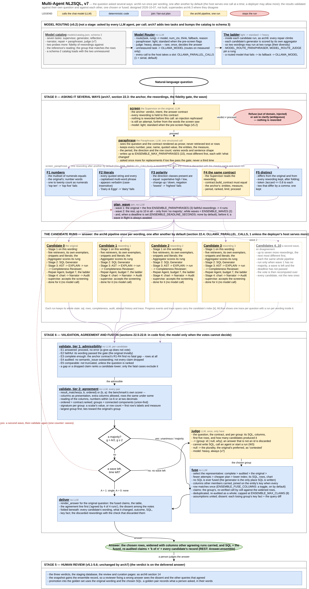
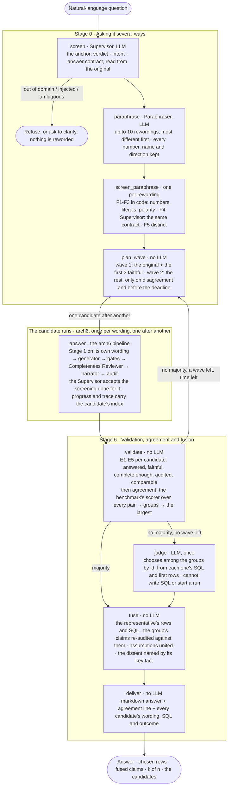

# Multi-Agent NL2SQL Architecture, v7

**Status:** designed, not built (2026-10-07). `Multi-Agent_NL2SQL_arch6.md`
is the architecture as built at 6.1.0, and `_arch6_2.md` and `_arch6_3.md`
what 6.2 and 6.3 changed beneath it; all three stand. This document adds
one thing above them and changes nothing beneath: **the question is asked
several ways.** The natural-language question is reworded into at least
three and at most ten paraphrases; the arch6 pipeline -- every stage of it,
its own retrieval, its own generation, its own gates -- runs once on the
original and once on each rewording that survives a fidelity check; the
results are validated one by one against the question that produced them
and then against each other; and from the ones that pass, one answer is
chosen or several are fused into one that is stronger than any of them
alone. It is written to be the pipeline a larger NL-to-SQL tool calls for
a question it judges extremely difficult, and it accepts the cost of
asking several ways for those: every call to the model host is serial
by default, because the host this was designed against serves one call
at a time (the owner's word, 2026-10-07), so a question answered four ways
takes about four times as long as one answered once; a deployer whose
host serves several calls at once says so in one setting, and the runs
then overlap up to that number. Column fusion is on by default and a
setting turns it off. Section 22 is the design; the build plan, module by
module, is
[`Multi-Agent_NL2SQL_arch7_implementation.md`](Multi-Agent_NL2SQL_arch7_implementation.md). Sections 2, 3, 8, 9, 10, 11, 12 and 13
below carry arch6's numbers and record only the rows that change.
Supersedes `Multi-Agent_NL2SQL_arch6_3.md` where they disagree. When it is
built, what departed from this document is recorded the way arch5.2's
departures were -- in `agent/README.md`, the changelog and the next
specification -- and never by editing this one.

**Diagram:** [`Multi-Agent_NL2SQL_arch7.drawio`](Multi-Agent_NL2SQL_arch7.drawio)
(editable in draw.io) and [`Multi-Agent_NL2SQL_arch7.png`](Multi-Agent_NL2SQL_arch7.png)
(rendered), generated by [`make_arch7_drawio.py`](make_arch7_drawio.py):
the two new stages around the arch6 pipeline, which is drawn once per
candidate as the box it is in this design. arch6's own diagram remains the
drawing of what is inside each box. The same architecture is drawn inline
below in Mermaid.



**Ground truth used for the design:** the pipeline in
`agent/nl2sql_agent/` at 6.3.0 (`graph.py`, nineteen nodes; `state.py`;
`supervisor.py`; `contract.py`; `completeness.py`; `present.py`;
`router.py` and `complexity.py`), the REST contract in `api/models.py`,
the job store in `api/jobs.py`, the benchmark's scorer in
`benchmarks/runner.py`, the model catalog's schema in
`models/build_catalog.py`, and the measurements in `agent/README.md` and
`benchmarks/README.md`.

What changed, in one line each:

| Area | arch6.3 | arch7 | arch6 § |
| --- | --- | --- | --- |
| The question | asked once, in the words it arrived in | screened once, reworded into 3 to 10 paraphrases, each checked for fidelity, and asked once per wording | 2, 4.1 |
| The pipeline | one run per question | one run per wording, one after another, each the whole arch6 pipeline on its own retrieval; the Supervisor accepts a screening done for it | 2, 3 |
| The model host | two API jobs may call it at once | `OLLAMA_PARALLEL_CALLS` calls in flight at once, process-wide, 1 by default -- serial -- and the candidate runs one after another; a deployer whose host serves several raises it, and that many candidates run at once | 15, 22.9 |
| The answer | the one run's | the rows of the candidate chosen from the largest group of agreeing results, widened with the columns other agreeing runs carried (`ENSEMBLE_FUSE_COLUMNS`, on by default); the claims, assumptions and caveats of that group fused; an agreement line (`k of n`); every candidate's wording, SQL and outcome shown | 7, 22.8 |
| Validation | did it run; is it complete; is the prose true to the rows | and: does it answer the question that produced it (E1-E5); does it agree with the others (the benchmark's own scorer); a Judge only when the votes cannot decide | 6, 7.3, 22.5-22.7 |
| Model calls | 3 or 4 on the happy path | about four times as many at the default width, and about four times the wall time on a host that serves one call at a time; a second wave only on disagreement; a Judge rarely | 9 |
| Routing | five tasks | seven: the Paraphraser and the Judge join; catalog schema 3 | 15 |
| Progress and trace | one stream, one trace | one stream whose events name their candidate; one trace with a run per candidate under it | 18, 22.11 |
| Off | -- | `ENSEMBLE_ENABLED=false` is arch6 exactly, to the answer | 11 |

---

## 22. Asking it several ways (arch7)

### 22.0 The premise, and what it rests on

Everything arch4 to arch6 added to the pipeline made one run of one wording
more likely to be right: retrieval before generation, deterministic gates,
an answer contract, a completeness check, a routed model per call. Nothing
in it asks whether the same question asked in other words would have got
the same answer. The benchmark asks each of its fifteen questions once, in
one wording, so the pipeline's sensitivity to wording has never been
measured -- and this project's own history says the sensitivity is real:

- the Supervisor once paraphrased B13's *ratio* into a *difference* and the
  generator computed one (the contract line now never restates a measure
  the question names, arch6 section 4.1);
- an intent framing that said "return both sides" lost a `LIMIT` and turned
  one right row into five (section 4.1's rule that a framing describes the
  calculation, never the row count);
- "How many stores are there?" was once answered with ten named stores,
  because the reflection could ask for a column of a dimension the rows
  did not identify (the fourth bound on it, recorded in
  `completeness.py`).

Each of those was a change of a few words in a prompt, not in the
question; each changed the answer. A person's own rewording of a question
is a larger change than any of them.

**What asking several ways buys.** Three things, none of which one run can
provide:

1. **A confidence signal.** Four runs that agree say something a single
   run's audit cannot: the answer did not depend on how the question
   happened to be phrased. Four runs that split two and two say the
   question, or the pipeline's reading of it, is unstable -- which is worth
   more to a reader than either answer alone.
2. **A catch for wording-sensitive mistakes.** A draft that lost a `LIMIT`,
   a measure read as its gross rather than net column, a filter put on the
   calendar year rather than the fiscal one: when such a mistake follows
   from one wording and not from the others, the vote outvotes it, and the
   dissent is named in the answer.
3. **Independent retrieval.** Each wording embeds differently, so each run
   finds its own exemplars, snippets and literals. A paraphrase that
   happens to resemble a golden pair the original did not brings that
   pair's reasoning into one candidate's prompt. This is diversity the
   pipeline cannot get any other way: temperature is 0 everywhere
   (`Settings.temperature`), so asking the same prompt twice returns the
   same SQL. **A different wording is the only independent draw this
   pipeline has**, which is why the ensemble is over paraphrases and not
   over samples.

**What it does not buy.** Agreement is not correctness. Four runs that all
join the sales fact to the calendar on the wrong key agree on the same
wrong total; the grain trap (benchmark B07) and the fan-out trap (B08) are
exactly the mistakes a model makes *regardless* of wording, and the
ensemble will not catch them. What agreement rules out is sensitivity to
wording, and what it adds is the measured width of that sensitivity. The
answer says "agreed by 4 of 4 runs", never "verified".

**The claim to test** (section 10, Phase 0): that the current pipeline's
accuracy on the benchmark drops when each question is asked in three other
wordings, and that the ensemble's accuracy on the same set is at least the
single run's at a cost of about four times the model calls and the wall
time. If the first part is false -- if arch6 answers every paraphrase of
every benchmark question identically -- the ensemble buys the confidence
signal and nothing else. The default is on either way (section 13, item
15): this is the pipeline a larger tool calls for its hardest questions,
and the measurement says what that tool is paying for, not whether to
pay it.

### 22.1 Architecture

Two stages around the arch6 pipeline, one outer shared state, one wave
loop. The arch6 pipeline is unchanged inside each candidate run but for one
node accepting work done for it (section 22.4). Agents marked **LLM** call
a chat model; everything else is deterministic code. On the happy path at
the default width the outer stages make two model calls of their own -- the
anchor screening, which replaces the original run's Supervisor call, and
the Paraphraser -- plus one light screening per rewording; the candidate
runs make arch6's calls each; the Judge is called only when the votes
cannot decide.



| Stage | Node | What it does | LLM |
|---|---|---|---|
| 0 | `screen` | The Supervisor on the original: verdict, intent, the answer contract -- the anchor every rewording is held to | screens |
| 0 | `refuse` | A refused or ambiguous question is answered as arch6 answers it; nothing is reworded | -- |
| 0 | `paraphrase` | The Paraphraser: up to `ENSEMBLE_MAX_PARAPHRASES` rewordings in one structured call, most different first, with the contract's invariants in its instructions | writes rewordings |
| 0 | `screen_paraphrase` | One rewording after another by default, up to `OLLAMA_PARALLEL_CALLS` at once: the deterministic fidelity checks, then the Supervisor's reading compared with the anchor's; a rewording that fails is discarded with the reason and never run | screens, light |
| 0 | `plan_wave` | Which candidates run now: the original and the first `ENSEMBLE_PARAPHRASES` faithful rewordings; on a second wave the rest, if the deadline allows | -- |
| runs | `answer` | One candidate after another by default, up to `OLLAMA_PARALLEL_CALLS` at once: the arch6 pipeline on the candidate's wording, seeded with its screening; every model call takes a slot of the host gate first | arch6's |
| 6 | `validate` | E1-E5 on each candidate; agreement between every pair with the benchmark's scorer; groups; the largest; whether it is a majority | -- |
| 6 | `judge` | Only when no majority and no wave remains: which group answers the question, chosen by id | once |
| 6 | `fuse` | The representative of the winning group; its rows and SQL; the group's claims re-audited against them; the dissent named | -- |
| 6 | `deliver` | The markdown answer with the agreement line and the candidates' record | -- |

The screenings and the candidate runs go through a pool of
`OLLAMA_PARALLEL_CALLS` workers (section 22.9). With the default of one
that is a loop -- one rewording, then one candidate, after another --
because a host that serves one call at a time would serialise their calls
anyway, and nothing a candidate does outside its model calls takes long
enough to be worth overlapping with another's. A deployer whose host
serves several calls at once raises the number, and that many candidates
run at once. `candidates` is appended to as each run finishes, so the
progress stream shows the runs in the order they finished. The wave loop
is bounded by one counter, `waves` (`ENSEMBLE_WAVES`, default 2), and by a
deadline when one is set; there is no path round it that does not spend
the counter.

### 22.2 The outer state

The arch6 `AgentState` is untouched: it is the state of one candidate run.
Above it, the ensemble has a state of its own, with the same rules -- every
node a function of a subset returning a partial update, a reducer on every
key two branches write, a lifetime on every field.

```python
class EnsembleState(TypedDict, total=False):
    # --- input ---------------------------------------------------------
    question: str                    # the original, as the person wrote it
    principal: str | None

    # --- stage 0: the anchor and the rewordings --------------------------
    verdict: Verdict                 # the anchor screening's; != proceed stops everything
    intent: Intent
    clarification: str | None
    answer_contract: AnswerContract  # the anchor contract every rewording is held to
    paraphrases: list[Paraphrase]    # {index, text, changed, status, reason, screening}
                                     #   status in faithful | discarded; filled by the gate
    waves: int                       # waves run so far; the one loop counter
    deadline: float                  # monotonic time after which no wave starts

    # --- the candidate runs ----------------------------------------------
    candidates: Annotated[list[Candidate], operator.add]
                                     # one per run: {index, wording, origin, wave,
                                     #   state: AgentState, outcome, admissible, reasons}

    # --- stage 6 --------------------------------------------------------
    groups: list[Group]              # {members, representative, signature}, largest first
    agreement: Agreement             # {admissible, agreed, total, level, judged, why}
    judgement: Judgement | None      # the Judge's choice, when it was asked
    decision: Decision               # {chosen, fused_from, dissent: list[Dissent]}

    # --- output and observability ----------------------------------------
    answer: str
    narrative: str
    sql: str                         # the chosen candidate's
    result: QueryResult | None       # the chosen candidate's rows
    chart: ChartSpec | None
    claims: list[Claim]              # the fused, re-audited claims
    audit: AuditReport               # of the fused claims against the chosen rows
    assumptions: list[str]
    error: str | None
    node_errors: Annotated[dict[str, str], merge_errors]
    trace: Annotated[list[TraceEntry], operator.add]   # the outer nodes'; each
                                     #   candidate's own trace is inside its state
    trace_id: str
```

Three payloads carry the design:

```python
@dataclass
class Paraphrase:
    index: int                 # 1..10; 0 is the original
    text: str
    changed: str               # the Paraphraser's one line: what it varied
    status: str = "pending"    # pending | faithful | discarded
    reason: str = ""           # which check failed, for the record
    screening: dict | None = None   # the Supervisor's reading, seeded into its run

@dataclass
class Candidate:
    index: int                 # the paraphrase's index; 0 is the original
    wording: str
    origin: str                # original | paraphrase
    wave: int
    state: AgentState          # the whole run: sql, result, completeness, audit, trace...
    outcome: str               # answered | gave_up | refused
    admissible: bool = False
    reasons: list[str] = field(default_factory=list)   # E1-E5 failures, by rule
    signature: str = ""        # the result's key fact, for the record and the dissent

@dataclass
class Agreement:
    admissible: int            # candidates that passed E1-E5
    agreed: int                # members of the winning group
    total: int                 # candidates run
    level: str                 # unanimous | majority | judged | contested | single | none
    why: str
```

Rules that follow from the contract:

- **The anchor contract is one for the whole question.** Every candidate's
  result is held to the contract read from the original. A rewording whose
  own reading would build a different contract is not run (F4, section
  22.3); so every admissible result is about the same entities, measure and
  period, and comparing them is comparing like with like.
- **`candidates` is append-only and `waves` is the only loop counter.** A
  second wave adds candidates; nothing removes or replaces one. The outer
  graph has one cycle, `validate -> plan_wave`, and it spends `waves`.
- **Each candidate's state is whole.** Its `trace`, `attempt_history`,
  `completeness` and `audit` are kept as they were, so a reader of the
  answer, the API's `ensemble` field or the MLflow trace sees each run as
  arch6 would have shown it. The outer `trace` holds the outer nodes only;
  the benchmark sums both.
- **Lifetimes.** Every field above is a *run* field but `groups`,
  `agreement`, `judgement` and `decision`, which are *wave* fields: emptied
  by `plan_wave` when a second wave starts, because they describe the vote
  before it. A test holds the table as `tests/agent/test_state.py` holds
  arch6's.

### 22.3 Stage 0: the anchor, the Paraphraser and the fidelity gate

**The anchor screening** (`screen`) is arch6's Supervisor on the original
question, unchanged: verdict, intent, clarification, and the three fields
the answer contract is built from. A verdict other than `proceed` ends the
run as it does today -- refused, or the clarification asked back -- and
*nothing is reworded first*. Two reasons. An injection attempt rephrased
ten ways is ten attempts, each one step further from the words the screen
saw; the screen must see the original and only the original before any
other model sees it. And an ambiguous question made ten ways is not less
ambiguous; the right answer to ambiguity is the question back, and
section 13 notes that disagreement among candidates is itself a sign of
it.

**The Paraphraser** (`paraphrase`) is one structured call. It sees the
question and the anchor contract rendered as prose -- the same sentence the
generator is shown -- and nothing else: no schema, no retrieved text, no
rows. It is told what it may not change, in the contract's own terms, and
what it should vary:

```
system:  You reword questions about a retail database without changing what
         they ask. Keep every number, year, name and quoted value exactly as
         written. Keep what the answer is about (<entities>), the quantity that
         answers or ranks it (<measure>), the period (<period, or "none named">),
         the direction (top or bottom, highest or lowest, more or less) and the
         row count asked for (<N>). Add no period, filter or measure the question
         lacks; drop none it has. Vary the words and the shape: a question and an
         instruction, another common verb, another order of clauses, a plainer or
         a more formal register, "our" and "the company's".
human:   Question: <original>
         A complete answer includes: <contract, rendered>
         Write <M> rewordings, each different from the question and from the
         others, the most different first. For each, say in a few words what you
         changed.
-> {"rewordings": [{"text": "...", "changed": "instruction form; 'best-selling' for 'top'"}, ...]}
```

`M` is `ENSEMBLE_MAX_PARAPHRASES` (default 10, the ceiling): writing ten
short sentences costs about what writing three does, and having the
reserve written means a second wave needs no second Paraphraser call. The
rewordings are kept in the order the model gave them -- most different
first -- because that is the order the waves spend them in. The call is
routed as the Supervisor's is (section 22.10): light when the pre-screen is
clear, standard when it flags the question.

**The fidelity gate** (`screen_paraphrase`, one rewording after another by
default; section 22.9) decides which rewordings are the same question. Five checks, the
first three and the last in code, the fourth a model call:

| Check | Rule | Fails when |
|---|---|---|
| F1 numbers | the multiset of numerals in the rewording equals the original's; number words one to twenty count as their numerals | "top ten" became "top five", or "2025" went missing |
| F2 literals | every quoted string and every capitalised multi-word phrase in the original appears verbatim (case-insensitive) in the rewording | "Dairy & Eggs" became "dairy products" |
| F3 polarity | the set of direction classes present is equal: superlative-high (top, highest, best, most, largest), superlative-low (bottom, lowest, worst, least, fewest), change-up, change-down, negation (not, no, never, without, excluding) | "lowest" became "highest"; "excluding markdowns" lost its "excluding" |
| F4 the same contract | the Supervisor's reading of the rewording, built into a contract by `contract.build_contract`, equals the anchor's: the same entities by resolved key, label and table, the same stated measure, the same period and default flag, the same `ranked` and `limit`; and `verdict = proceed` | the model read "stores" where the original said "banners"; a period appeared; the screen refused it |
| F5 distinct | after case-folding and stripping punctuation the rewording differs from the original and from every rewording already kept, and its token Jaccard similarity to each is at most 0.8 | two rewordings that differ by a comma |

F4 is the Supervisor -- the agent that already reads a question into a
contract -- on each rewording, at the light rung. It is a model call per
rewording, and it is paid because it is the one check that reads meaning:
F1 to F3 catch the visible slips, F4 catches "banners" read as "stores".
Its `intent` is *not* compared: intent classification is the noisiest of
the Supervisor's outputs ("how many" is a lookup to one reading and an
aggregate to another) and it shapes only the framing line and the chart,
neither of which changes what the rows are. Each candidate runs with its
own intent, recorded. What F4 does fix is everything the comparison in
section 22.6 depends on.

A rewording that fails any check is `discarded` with the check's name and
is never run; the record shows it. **If fewer than
`ENSEMBLE_PARAPHRASES` are faithful**, the Paraphraser is asked once more
-- told which rewordings failed and why -- for replacements, and the gate
runs on those; this second call is the only retry, and after it the
ensemble proceeds with whatever is faithful, down to the original alone.
The ensemble never fails a question for want of rewordings: with none
faithful it is arch6, and the answer says so.

**The wave plan** (`plan_wave`) is deterministic. Wave 1 is the original
and the first `ENSEMBLE_PARAPHRASES` faithful rewordings (default 3: four
runs). Wave 2, reached only from `validate` with no majority, is every
remaining faithful rewording, up to the ceiling of ten in all -- unless
`waves` has reached `ENSEMBLE_WAVES` or, when a deadline is set
(`ENSEMBLE_DEADLINE_SECONDS`, default none; section 22.9), the monotonic
clock has passed it, in which case the vote stands as it is and the run
goes to the Judge. A wave in flight is always awaited; a deadline gates
starting one.

### 22.4 The candidate runs

Each candidate (`answer`, one candidate after another by default) is the
arch6 pipeline, invoked as a function of a seeded state, on one agent instance
shared by every candidate -- the same `Nl2SqlAgent`, its database pool,
router, retrievers, literal catalog and label map built once, as the API's
jobs already share them. Five things are particular to a candidate run,
and nothing else differs from arch6:

1. **The question is the candidate's wording.** Stage 1 retrieves on it,
   the generator is asked it, the narrator writes about it. That is the
   point: a paraphrase that resembles a golden pair the original did not
   finds that pair.
2. **The Supervisor accepts a screening done for it.** The seeded state
   carries the candidate's verdict, intent, clarification and the anchor
   contract, and a flag, `screened`, that says so; `supervise` then returns
   them with no model call and the detail "screened by the ensemble". For
   the original, the anchor screening is seeded, so its Supervisor call is
   not paid twice; for a rewording, the F4 screening is. This is the one
   change inside `graph.py`, and `SUPERVISOR_ENABLED` still means what it
   meant: with it off, no screening is made anywhere and the contract is
   built from the wording alone.
3. **Progress names the candidate.** The pipeline's progress callback
   gains the candidate's index beside the step and the detail, so the
   REST event stream and the CLI's stderr can show four `generate_sql`
   lines as four candidates and not as one node reporting four times
   (section 22.11).
4. **The trace nests.** The candidate's agent spans open under a span of
   their own, "Candidate k", under the question's root span, so MLflow
   shows one trace per question with a run per wording inside it. When
   candidates run at once, each worker is given the active span and the
   progress callback by a copied context (`contextvars.copy_context`), as
   the five retrievers' branches already are; with one worker the active
   span is simply the enclosing one. Nothing changes in `tracing.py` but
   the candidate span.
5. **Every call to the host takes a slot of the host gate.** Each model
   call a candidate makes -- and every other call the agent makes: the
   anchor's, the Paraphraser's, the screenings', the Judge's, and any
   other job's -- acquires one of `OLLAMA_PARALLEL_CALLS` slots first
   (section 22.9). With the default of one slot the candidates run one
   after another: the host would serialise their calls anyway, and
   sequential runs cost no threads, no second connection, and no
   interleaving of two runs' progress lines or of two models on the host.
   With more slots, that many candidates run at once, and the number is
   the deployer's statement about the host, not something the agent
   measures.

Everything else is arch6's: the five retrievers and the aggregator, the
generator, the three gates, the Completeness Reviewer and its one
reflection, the Repair Agent and the shared `attempts` budget of seven, the
narrator and the audit, model routing per call with the ladder. A
candidate that gives up is a candidate with `outcome = gave_up`; it is
recorded, counts for nothing in the vote, and its attempt history is in
the answer's record as a give-up's always was.

### 22.5 Stage 6, tier 1: is each result an answer to its own question?

The first tier of `validate` runs on each candidate alone, in code, and
marks it admissible or not. A candidate that is not admissible does not
vote. The rules read the candidate's state and the anchor contract:

| Rule | Check | A candidate fails when |
|---|---|---|
| E1 answered | `outcome = answered`: `verdict = proceed` and `error` is None | it gave up inside its budget, or its screening refused it |
| E2 faithful | its wording's status is `faithful` (trivially so for the original) | never, by construction: an unfaithful rewording is not run. The rule exists so the record says every voter was checked |
| E3 complete enough | the anchor contract's rules R1-R4 (`completeness.check_rules`) against its result find no gap it was not shown with: a label beside every key, the ranking's measure present, the period, and -- the fatal one -- rows at all when the question implies rows | its result is empty for a question that implies rows; it lacks the measure that ranked it |
| E4 audited | `audit.semantic_issue` is None and the audit did not drop every claim | the audit judged the rows wrong and the budget ran out before a repair; a narrative with no claim the rows support |
| E5 comparable | its result is not truncated, or the question is ranked so its first rows are its answer | an unordered result that hit the row cap: its first fifty rows are a sample, and a sample agrees with nothing |

E3 and E4 are arch6's own gates, read back: a candidate that reached
`finish` passed them on its last attempt, but it may have been *shown*
with an accepted gap (section 6.6's same-result guard) or with claims
dropped, and those are what the ranking in section 22.8 reads. Only the
fatal cases make a candidate inadmissible; a result with a missing label
is still a vote, and still worth showing if it wins -- the gap named, as
arch6 names it.

### 22.6 Stage 6, tier 2: do the results agree?

The second tier compares every pair of admissible candidates with **the
benchmark's own scorer**, `benchmarks.runner.result_matches`: column names
and order are presentation, extra columns are allowed, row order counts
only when the contract is ranked, numbers agree within `1e-6` relative or
at two decimals, and the rows on each side must be the same rows under
*some* reading of the columns -- the column-assignment search that rejects
a result whose values are all present but attached to the wrong rows,
which is what a join on the wrong key produces. Two candidates **agree**
when either's result matches the other's: `result_matches(a, b, ordered)`
or `result_matches(b, a, ordered)`, with `ordered = contract.ranked`. One
direction suffices because the scorer allows the wider result extra
columns, so a run that returned the brand beside each SKU agrees with one
that did not, if the SKUs and their sales are the same.

Agreement is computed between every pair, and candidates are grouped as
the connected components of it -- union-find over the pairs -- so a
tolerance that lets *a* match *b* and *b* match *c* puts all three
together. Each group has a **signature**, for the record and the dissent:
a scalar result's value; otherwise the row count and the first row's
entity labels and measure. Groups are ordered by size, ties broken toward
the group holding the original, then toward lower candidate indices.

**The vote.** With `A` admissible candidates and the largest group of
size `g`:

| Outcome | Condition | `agreement.level` | Then |
|---|---|---|---|
| Unanimous | `g = A` and `A >= 2` | `unanimous` | `fuse` |
| Majority | `g > A / 2` and `g >= 2` | `majority` | `fuse` |
| No majority, a wave left | `g <= A / 2`, `waves < ENSEMBLE_WAVES`, before the deadline, faithful rewordings remain | -- | `plan_wave`: the second wave runs and `validate` runs again on every candidate |
| No majority, no wave left | otherwise, with two or more groups | `judged` or `contested` | `judge` (section 22.7) |
| Single | `A = 1` | `single` | `fuse`, with the one; a second wave is tried first if one is left |
| None | `A = 0` | `none` | `deliver` reports what every candidate tried, as a give-up does, and the original's error |

The quorum is a strict majority of the admissible, never of the run: a
candidate that gave up neither agrees nor dissents. Two is the smallest
group that can be said to agree, so a 1-1-1 split is three dissenters and
no majority. The vote is recomputed over *all* candidates after a second
wave, not over the new ones alone.

**Why votes before a judge.** arch6's verdict (section 1) is that the
model is the wrong tool for a validation gate, and the only question in
forty-five benchmark runs that no configuration answered was one where a
correct query was rejected three times by its own model reviewer.
Agreement between independent runs is evidence that no model produced;
the scorer that reads it is the one the benchmark's own numbers rest on,
tested against both kinds of mistake it could make. The Judge is asked
only when that evidence is silent.

### 22.7 Stage 6, tier 3: the Judge, once, when the votes cannot decide

The Judge is one structured call, made only when no group holds a
majority and no wave remains. Its prompt is the original question, the
contract rendered as prose, and for each group: the representative's SQL,
its columns, its first five rows, and how many candidates produced it. It
returns a group id, or none:

```json
{"group": 2,
 "why": "Group 1 filters dim_date.calendar_year; the question asks for the fiscal year, which group 2 filters."}
```

It is bounded the way the reflection is (section 6.6), and for the same
reason -- an unbounded "let me think about this some more" is the fault W3
removed from the presentation stage:

1. **It chooses among ids.** An answer naming a group that does not exist,
   or SQL, or a new query, is discarded unread, and the vote falls back to
   the plurality.
2. **It cannot start a run, call an agent or ask for a repair.** There is
   no edge from `judge` anywhere but `fuse`.
3. **It runs once per question.** Its verdict is recorded with its
   reasoning, and `agreement.level` is `judged`; `none` from it is
   `contested`, and the plurality group -- the original's, when it is one
   of them -- is delivered with the caveat that the runs disagreed and the
   Judge could not say which was right.

It is routed at the heavy rung (section 22.10): it runs rarely, once, and
decides the answer, so it is the one call where the strongest model costs
least per decision it makes. `ENSEMBLE_JUDGE_ENABLED=false` skips it and
delivers the plurality as `contested`.

### 22.8 Select, then fuse

**Selection** chooses the **representative** of the winning group, and
selection is where "the best answer" is decided. The ranking, in order:

| Rank by | Prefer | Because |
|---|---|---|
| 1. completeness | a result shown with no accepted gap over one shown with a gap | every member agrees on the contract's columns; the one that also carries the label the reviewer asked for is the stronger result |
| 2. audit | a narrative with no dropped claim over one with drops | its claims were all traced to cells on the first or second try |
| 3. origin | the original's own run over a paraphrase's | the person asked it in those words, and the SQL they read should be the SQL written for them |
| 4. attempts | fewer generations | a draft that passed every gate first time is the less fragile query |
| 5. plan cost | the cheaper plan | all else equal, the lighter query |
| 6. index | the lower | determinism |

Its SQL is the answer's SQL, its rows are the answer's rows, its chart is
the answer's chart. **No SQL is ever fused**: the generator is the only
place SQL is written (section 5.1) and the ensemble keeps it so. The other
members' queries are listed in the record as having produced the same
result, which is useful to a reviewer -- two differently written queries
that agree are two pieces of evidence about a join.

**Fusion** (`fuse`) then combines, in code and with no model call, what
can be combined without inventing anything, in this order:

- **Columns** (`ENSEMBLE_FUSE_COLUMNS`, a toggle, on by default; the
  owner's decision, 2026-10-07; off leaves the representative's own
  columns and the record says so). An attribute column another member of
  the group carries
  and the representative does not -- a label or an attribute of an entity
  the rows identify, per the label map -- is joined onto the
  representative's rows by that entity's key, when every row of the
  representative's matches exactly one row of the member's on the key and
  the column is of a dimension the rows already identify (the reflection's
  own fourth bound). A column that would not join cleanly -- a key missing,
  a row matching twice or not at all -- is left out, and the record says
  so. This is the one fusion that makes rows no single query returned: the
  representative's rows, wider. The delivered SQL does not produce the
  added columns, so the answer names the run each one came from, and that
  run's SQL is in the record beside the chosen one; a reviewer can see
  where every column came from. Section 11 measures how often a column is
  added and how often one is declined.
- **Claims.** Start with the representative's surviving claims. For each
  other member of the group, take each of its surviving claims whose cited
  cells exist in the widened result -- the column names present, the row
  indices in range -- and whose value the Audit Checker reproduces from
  those cells (`present.check_claim`, deterministic). Drop a claim that
  duplicates one already kept (the same value from the same cells, or the
  same text). Then audit the fused set as a whole (`present.audit`),
  against the widened rows and the union of assumptions; whatever does not
  survive is dropped and said. The result is a narrative with more
  verified sentences than any one run wrote: four narrators looking at the
  same rows notice different things, and every one of their numbers has
  been checked against a cell. The fused narrative is capped at
  `ENSEMBLE_MAX_CLAIMS` (default 8), kept in representative-first order.
- **Assumptions.** The union; in practice identical, since every run was
  held to one contract and the default period is the contract's.
- **Agreement.** The line every answer carries: "Agreed by 4 of 4
  independent runs, each asking the question in different words", or
  "3 of 4 runs agreed; 1 answered differently", or "the runs disagreed; the
  Judge chose this answer because ...".
- **Dissent.** For each losing group, one line naming its key fact and how
  its representative's query differs from the chosen one -- in code, from
  the two ASTs (`completeness.read_query`, extended to filters): the
  tables one uses and the other does not, the columns one filters on and
  the other does not. "1 of 4 runs answered 1,495,000.11; its query filters
  `dim_date.calendar_year` where the chosen one filters `fiscal_year`."
  A reader is told what was outvoted and roughly why, without a model
  having been asked to explain it.

**What "stronger" means here, precisely.** The fused answer has the
representative's rows, which passed every gate and agreed with a majority
of independent runs, widened with the attributes other agreeing runs
carried beside the same keys; more cell-verified claims than any run
wrote; the assumptions every run made, stated once; a measured confidence;
and the alternatives named. It is never stronger in a way no run's query
supports: every column is some candidate's, every claim is checked against
the cells it cites, and the candidate behind each is in the record.

**The delivered answer** (`deliver`) is `present.render_answer` as today --
the claims, the table, the notes on assumptions, accepted gaps and dropped
claims -- plus the agreement line first and the dissent lines among the
notes, and, folded beneath for the clients that show their working, the
candidates: each wording with what it changed, its outcome, its SQL and
its key fact, and the discarded rewordings with the check that discarded
them. The question the answer is rendered for is the original.

### 22.9 Cost, latency and the controls

**Model calls.** arch6 makes three or four on the happy path and 3.7
measured. At the default width:

| Call | arch6 | arch7, wave 1 | Rung |
|---|---|---|---|
| Supervisor on the original (the anchor) | 1 | 1 | light, or standard if pre-screened |
| Paraphraser | -- | 1 (2 if replacements are needed) | light, or standard if pre-screened |
| Supervisor on each rewording (F4) | -- | 3 | light |
| Generator, per candidate | 1 | 4 | each candidate's own score |
| Completeness reflection, per candidate | 0 or 1 | 0 to 4 | the generation's, capped |
| Narrator, per candidate | 1 | 4 | by result size |
| Repair, unclassified errors only | rarely | rarely, x4 | above the generator |
| Judge | -- | 0, or 1 on disagreement | heavy |
| **Happy path** | **3-4** | **13-17** | |

About four times the calls, and about four times the tokens: the
screenings and the Paraphraser have small prompts, and the four generator
prompts are four copies of arch6's. A second wave adds up to seven more
candidates' worth, and is taken only on disagreement.

**Wall time.** The model host this was designed against serves one
call at a time -- the owner's word -- and the design's default follows it:
every call the agent makes takes a slot of one process-wide **host gate**
(`OLLAMA_PARALLEL_CALLS`, default 1), held around each routed call and
released when the call returns or `OLLAMA_TIMEOUT` ends it. With one slot
a wave's time is its runs' times added: a four-run wave takes about four
times arch6's median -- a question that took half a minute routed takes
about two -- and a full second wave about three times that again. A
deployer whose host serves several calls at once (Ollama's own
`OLLAMA_NUM_PARALLEL` above one, with the memory for it) sets the number
of slots to what the host serves, no higher; that many candidates then
run at once, and a wave takes about its width divided by the slots, times
one run. The agent does not measure the host's capacity: the number is
the deployer's statement, and a number above what the host serves only
queues at the host what would have queued at the gate. The cost is
accepted either way: this is the pipeline a larger tool calls for a
question it judges extremely difficult, and the controls below bound the
work, not the clock:

| Setting | Default | What it bounds |
|---|---|---|
| `ENSEMBLE_ENABLED` | `true` | off is arch6, to the answer |
| `ENSEMBLE_PARAPHRASES` | `3` | rewordings in the first wave; 3 to 10, a value outside refused at startup |
| `ENSEMBLE_MAX_PARAPHRASES` | `10` | the ceiling the Paraphraser writes to and the waves spend to |
| `ENSEMBLE_WAVES` | `2` | the loop counter's limit; 1 is one wave and no loop |
| `OLLAMA_PARALLEL_CALLS` | `1` | model calls in flight to the host at once, process-wide, and candidate runs at once per question; 1 is serial, the default; a deployer sets it no higher than the host's own `OLLAMA_NUM_PARALLEL` |
| `ENSEMBLE_DEADLINE_SECONDS` | `0` | none by default; set, no wave starts after that many seconds from the question's arrival, for a caller that blocks on `API_MAX_WAIT_SECONDS`; a wave in flight is always awaited |
| `ENSEMBLE_JUDGE_ENABLED` | `true` | off delivers the plurality as `contested` |
| `ENSEMBLE_MAX_CLAIMS` | `8` | the fused narrative's length |
| `ENSEMBLE_FUSE_COLUMNS` | `true` | the toggle for column fusion: columns other agreeing runs carried, joined on the entity's key; off leaves the representative's own columns |
| `MODEL_ROUTE_PARAPHRASER`, `MODEL_ROUTE_JUDGE` | unset | a pin per rung, as the five tasks have |

**What the host gate touches.** The API's `API_MAX_CONCURRENCY` (2)
lets two questions run at once; with the gate they still do, in everything
but their model calls, which share the slots. With one slot a deployment
that serves the ensemble should set it to 1, so one question's candidates
are not slowed by another's and the host is not asked to swap between two
questions' models; the queue (`API_MAX_QUEUED`) holds the rest. The reader
role's connection limit (60, `common/nl2sql_common/roles.py`) bounds
`API_MAX_CONCURRENCY x OLLAMA_PARALLEL_CALLS` candidates holding a
connection at once -- two jobs of ten slots would be twenty, well inside
it -- and the agent container's process ceiling (`pids_limit`, 6.3) is
re-derived for that product times the pipeline's own threads when the
slots are more than one; with one slot both are as today. `API_MAX_WAIT_SECONDS`
(900) is the longest a *blocking* caller waits, and a full second wave on
one slot can outlast it; the larger tool should watch the job (`GET
/v1/questions/{id}`, or its event stream, which reconnects with
`Last-Event-ID`) rather than block, which is what the job model is for --
or raise the bound, or set `ENSEMBLE_DEADLINE_SECONDS` so no wave starts
that cannot finish inside it.

### 22.10 Routing: two tasks more

`router.TASKS` grows from five to seven: `paraphraser` and `judge`. Each
gets a rung rule in `complexity.py`, a prior in the catalog builder, a
probe in the calibrator and a column in the routing table; nothing else
in section 15 changes.

| Task | Rung rule | Prior (by size, as the five have) | Probe |
|---|---|---|---|
| `paraphraser` | the Supervisor's: light when the pre-screen is clear, standard when it flags the question | as the narrator's | the fifteen benchmark questions with their reference contracts: the fraction of rewordings that pass F1-F5 against the reference model's reading, and the fraction distinct; a model is suited at a rung when its fidelity rate is within one rewording in ten of the reference's |
| `judge` | heavy, always | as the reflection's | the benchmark questions each with two or three groups built from reference and trap queries (`BenchmarkQuestion.trap` names the wrong answer each question invites): the fraction of times the model picks the group that matches the reference rows |

The catalog's `schema` goes from 2 to 3; `tasks` and `task_budgets` carry
the two (8,192 tokens for the Paraphraser, 16,384 for the Judge, which
reads several queries and their rows). A catalog at schema 2 is read as
one with the two tasks unmeasured, and the router then answers them with
`OLLAMA_MODEL` -- the "routes on measured suitability only" rule -- rather
than refusing to start; `models/build_catalog.py` carries measurements
across a rebuild for unchanged weights, so the committed catalog is
rebuilt once and `calibrate.py --tasks paraphraser judge` measures only the
two. Documents about the calibrated models stay generic, as they are.

### 22.11 What the surfaces show

**REST** (`api/models.py`, every model strict). `Answer` gains
`ensemble: Ensemble | None` -- `None` with the ensemble off, so a client
written for 6.3 reads the same answer it always did:

```python
class EnsembleCandidate(Wire):
    index: int; wording: str; origin: str; wave: int; changed: str
    outcome: str; admissible: bool; reasons: list[str]
    sql: str; signature: str; attempts: int; group: int | None
    trace: list[TraceEntry]           # the candidate's own run, node by node

class Ensemble(Wire):
    agreement: Agreement              # admissible, agreed, total, level, why
    chosen: int                       # the representative's index
    fused_from: list[int]             # the winning group's members
    dissent: list[Dissent]            # key fact + how the query differs, per losing group
    judged: Judgement | None
    candidates: list[EnsembleCandidate]
    discarded: list[DiscardedRewording]   # text, changed, reason
```

`ProgressEvent` gains `candidate: int | None` (0 the original, 1.. a
rewording, `None` an outer node). `Meta.pipeline` gains the outer nodes
in `nodes` and an `ensemble` block -- `enabled`, `paraphrases`,
`max_paraphrases`, `waves` -- so a client knows how many lanes to draw
before the first event. `Limits` is unchanged. The TypeScript types and
the Java records that mirror these models are held to them field by field
by `tests/gui/` and `tests/java/`, so the three clients move together or
their tests fail.

**The web interface.** The progress panel groups events by `candidate`:
one lane per candidate, each the arch6 step list, with the outer steps
above and below; the lanes fill one after another on a host that serves
one call at a time, and side by side when the deployer has allowed more --
either way the honest picture of the runs. The answer shows the agreement line as a
badge beside the sentence, the dissent among the notes, and a disclosure,
"The question, asked 4 ways", listing each wording, what it changed, its
outcome and its SQL, and the rewordings that were discarded and why.
Feedback is unchanged: three buttons, on the delivered answer.

**The desktop client.** The same, in its records and panes.

**The CLI.** `--paraphrases N` and `--no-ensemble`; stderr progress lines
carry `[k]` for a candidate's node; `--json` carries `ensemble` whole.

**MLflow.** One trace per question. The root span is the question; under
it the outer nodes as spans named as section 22.1 names them, and a span
per candidate, "Candidate k", under which that run's spans are what
arch6's trace shows today. The trace's tags gain `nl2sql.agreement`
(`k/n level`) and `nl2sql.candidates`. A verdict is recorded on the
question's trace, as it is today.

**The benchmark.** `--configuration ensemble` beside `single`; per-candidate
attribution from each candidate's trace; the metrics in section 11.

**Feedback and review.** The verdict is on the delivered answer. The
snapshot the staging database keeps gains the `ensemble` record, so a
reviewer fixing a wrong answer sees the dissent and the other queries that
agreed. Promotion into the golden set uses the *original* wording and the
chosen SQL: a golden pair records what a person asked, in their words.
What else the rewordings could be used for is section 13.

### 22.12 Degradation and failure

| What fails | What happens | Recorded in |
|---|---|---|
| The Paraphraser's call | the original runs alone; the answer says "asked 1 way" | `node_errors.paraphraser` |
| Fewer than `ENSEMBLE_PARAPHRASES` faithful after the one retry | the faithful ones run; the agreement line gives the true count | `paraphrases[].reason` |
| A candidate gives up or its screening refuses it | it does not vote; its attempts are in the record | `candidates[].outcome` |
| Every candidate inadmissible | the original's state is delivered as arch6 would deliver it -- its error, its attempt history -- with every candidate's record beneath | `agreement.level = none` |
| No majority after every wave and the Judge cannot say | the plurality, the original's group preferred, delivered as `contested` with the dissent | `agreement.level`, `judgement` |
| A deadline is set and passes during wave 1 | wave 1 is awaited; no wave 2; the vote stands | `agreement.why` |
| A model call hangs | `OLLAMA_TIMEOUT` (600 s) ends it and releases its slot of the host gate; the call fails as it does today -- the fallback chain, then `node_errors` or a repair -- and the next call proceeds | the candidate's trace |
| `ENSEMBLE_FUSE_COLUMNS=false` | the representative's own columns; claims, assumptions, agreement and dissent are still fused | `decision.columns_fused = false` |
| A column would not join cleanly | it is left out; the answer has the representative's own columns there, and the record says which column was declined and why | `decision.declined_columns` |
| `ENSEMBLE_ENABLED=false` | arch6, to the answer; `ensemble` is `None` on the wire | -- |

---

## 2. What runs where: the rows that change

Nothing new runs anywhere. The ensemble is code in the agent's image; it
adds no container, no store, no port and no role.

| Component | Host | Used by |
|---|---|---|
| Chat models through the Model Router, now for seven tasks: the Paraphraser (light or standard) and the Judge (heavy) beside the five -- `OLLAMA_PARALLEL_CALLS` calls in flight at once, one by default | the Ollama host | `paraphrase`, `screen_paraphrase` (the Supervisor), `judge`, and every candidate run's four, each taking a slot of the gate first |
| Retail database | `nl2sql-postgres` | every candidate's Planner Gate and Safe Executor, as the person who asked, on the reader's one pool |
| The RAG stores and the snippet store | as before | every candidate's Stage 1, on its own wording |
| MLflow | as before | one trace per question, a run per candidate inside it |

## 3. The shared state: what is added

`AgentState` gains one field, `screened: bool` (lifetime *run*): the
Supervisor's signal that the screening it would make has been made. Every
other field is as arch6 declares it. Above `AgentState`, `EnsembleState`
(section 22.2) is a second contract with its own lifetimes table and its
own test.

## 8. Security blueprint: the rows arch7 adds

arch6's blueprint stands row for row, and 6.3's additions to it. The
ensemble adds no credential, no transport, no store and no route; what it
adds is model output used as input -- a rewording is a question the model
wrote -- and more work per question, and the rows below are about those
two things. Files that do not exist yet are named without a directory
until they do; the blueprint test holds every path to the tree.

| Layer | Rule | Enforced in | Held by |
|---|---|---|---|
| Input | The original question is screened before any rewording is made, and every rewording is screened as a question is: the Supervisor's verdict must be `proceed` and its reading must build the anchor's contract (F4), after the deterministic checks F1-F3 and F5. A rewording that fails is never run. The Paraphraser sees the question and the contract, never retrieved text or rows. | `agent/nl2sql_agent/supervisor.py`; the ensemble module, `ensemble.py` (planned) | `tests/agent/test_supervisor.py`; `test_ensemble.py` (planned) |
| Statement | One SQL per candidate, written by the SQL Generator and by nothing else; fusion never writes, edits or combines SQL; the delivered SQL is one candidate's, having passed the Static Validator, the Planner Gate and the Safe Executor as every query does. | `agent/nl2sql_agent/validate.py`, `agent/nl2sql_agent/database.py` | `tests/agent/test_validate.py`, `tests/agent/test_graph.py` |
| Judgement | Agreement is decided in code, by the benchmark's scorer over the candidates' rows; the Judge is asked only when the votes cannot decide, chooses among group ids, and cannot write SQL, call an agent or start a run (W3). An answer that is not a group id is discarded unread. | `benchmarks/runner.py` (`result_matches`); `ensemble.py` (planned) | `tests/benchmarks/test_run_benchmark.py`; `test_ensemble.py` (planned) |
| Load | At most `OLLAMA_PARALLEL_CALLS` model calls in flight to the host at once, process-wide (one by default), and as many candidate runs at once per question; at most `ENSEMBLE_WAVES` waves, and none started past `ENSEMBLE_DEADLINE_SECONDS` when one is set; the API's ceilings (`API_MAX_CONCURRENCY`, `API_MAX_QUEUED`, `API_MAX_PER_PERSON`, `API_QUEUE_TTL_SECONDS`) are unchanged and apply to the question, not the candidate; the reader role's connection limit bounds the whole. | `agent/nl2sql_agent/router.py` (the gate around every routed call), `agent/nl2sql_agent/api/jobs.py`, `common/nl2sql_common/roles.py`; `ensemble.py` (planned) | `tests/agent/test_router.py`, `tests/api/test_jobs.py`, `tests/common/test_roles.py` |
| Who is asking | Every candidate runs as the person who asked -- `SET LOCAL ROLE` on the reader's pool -- with the same statement timeout and row cap as a single run. | `agent/nl2sql_agent/database.py` | `tests/agent/test_least_privilege_live.py` |
| Output | The answer carries the chosen candidate's rows -- widened only with columns another agreeing candidate's query returned, each named with the run it came from -- and every candidate's wording, SQL and key fact; a dissenting result is named by its key fact, never its rows; nothing a candidate retrieved leaves the stack beyond what one run's answer already shows. Every new wire model forbids a field it does not declare. | `agent/nl2sql_agent/present.py`, `agent/nl2sql_agent/api/models.py` | `tests/agent/test_present.py`, `tests/security/test_wire_models.py` |

## 9. Model calls and expected cost

Section 22.9 has the table. In one line: the happy path goes from three or
four calls to thirteen to seventeen at the default width, about four times
the tokens, and -- on a host that serves one call at a time, the default
-- about four times the wall time, divided by the slots a deployer allows;
a second wave, taken only on disagreement, can nearly triple that again;
the Judge is one heavy call, rarely. The cost is accepted for
the questions this pipeline is called for; every number is expected, not
measured, until Phase 0.

## 10. Mapping to the code and build order

What is new, what is touched, and the order to build it in -- each phase
benchmarkable on its own, and the first two changing no answer by
construction, as routing's first steps did (Phase 8 in arch6).

| Component | Status | Module |
|---|---|---|
| The outer graph: `screen`, `refuse`, `paraphrase`, `screen_paraphrase`, `plan_wave`, `answer`, `validate`, `judge`, `fuse`, `deliver`; `EnsembleState` and its lifetimes; the loops over rewordings and candidates; the wave loop | new | `ensemble.py` (the graph and its nodes), `ensemble_state.py` (the contract) in `agent/nl2sql_agent/` |
| The host gate: `OLLAMA_PARALLEL_CALLS` slots, process-wide, one by default, each held around a routed call and released on return or timeout; the worker pool of the same size for screenings and candidates | new | `hostgate.py`; `router.py` (around every routed call); `config.py` (`ollama_parallel_calls`) |
| The Paraphraser: the prompt, the structured output, the one retry | new | `paraphrase.py`, `prompts.py` |
| The fidelity gate: F1-F3 and F5 in code; F4 through `supervisor.screen` and `contract.build_contract`; contract equality | new | `fidelity.py`; `contract.py` gains `same_contract(a, b)` |
| Admissibility E1-E5 | new | `agreement.py`, reading `completeness.check_rules` |
| Agreement: pairs through `result_matches`, union-find, groups, signatures, the vote | new; the scorer moves | `agreement.py`; `result_matches` and its helpers move from `benchmarks/runner.py` into the agent package (`compare.py`) and the benchmark imports them from there, so the agent's image does not import the benchmark |
| The Judge: prompt, structured output restricted to ids | new | `judge.py`, `prompts.py` |
| Fusion: columns joined on the entity's key, claims re-verified and re-audited, assumptions, dissent from two ASTs, the agreement line | new | `fuse.py`; `completeness.read_query` gains the filtered columns; `present.render_answer` gains the agreement and dissent notes and the columns' provenance |
| The Supervisor accepting a screening | touched | `graph.py` (`_supervise`, `screened`), `state.py` |
| Progress with a candidate index | touched | `graph.py` (`ProgressFn`), `api/jobs.py`, `api/translate.py`, `__main__.py` |
| The candidate span and the two tags | touched | `tracing.py` |
| Two routing tasks, their rung rules, priors, probes, budgets; catalog schema 3 | touched | `router.py`, `complexity.py`, `models/build_catalog.py`, `models/calibrate.py`, `models/probes/paraphrase.json`, `models/probes/judge.json`, `models/catalog.json` |
| The wire: `Ensemble`, `EnsembleCandidate`, `Dissent`, `Judgement`, `ProgressEvent.candidate`, `Meta.pipeline.ensemble` | touched | `api/models.py`, `api/translate.py`, `gui/src/api/types.ts`, the desktop's records |
| The web interface: lanes, the badge, the disclosure | touched | `gui/src/components/Progress.tsx`, `AnswerView.tsx`, a new `Candidates.tsx` |
| The desktop client: the same | touched | `desktop/` |
| The benchmark: the paraphrase set, `ensemble` configuration, the metrics | touched | `benchmarks/paraphrases.py` (new), `run_benchmark.py`, `runner.py` |
| The staging snapshot carrying `ensemble` | touched | `api/feedback.py`, `review/nl2sql_review/store.py` |
| Settings | touched | `config.py` (`ensemble_*`), `api/settings.py` (nothing: the API's ceilings apply to the question) |

**Phase 0 -- measure the premise.** No pipeline change. Three rewordings
of each of the fifteen benchmark questions, written by hand and checked
against the reference contract (`benchmarks/paraphrases.py`, 45 wordings);
the arch6 pipeline run on all 60 as `--configuration single`. Report, per
question: how many wordings matched the reference; and overall, the
**stability** -- the fraction of questions every wording of which was
right. This is the number the rest of the design is argued from, and the
number that says what the larger tool is paying for.

**Phase 1 -- the outer graph with one candidate, and the host gate.**
`ensemble.py` with `ENSEMBLE_PARAPHRASES` forced to 0 and the Paraphraser
not called: the anchor screening seeds the original's run, `validate`
finds one admissible candidate, `fuse` selects it, `deliver` renders it.
The gate around every routed call, which changes no answer: with one slot
every call waits for the one before it, two jobs included; with more, that
many go at once. The benchmark must be the
same run as 6.3 to the answer; the wire carries `ensemble` with one
candidate; the progress stream names candidate 0; the trace nests one run.
Plumbing, proved before it carries anything.

**Phase 2 -- rewordings, the gate, the vote, selection.** The Paraphraser,
F1-F5, one wave, E1-E5, agreement, selection by the ranking; no fusion of
claims, no Judge. Benchmark: `ensemble` beside `single` -- accuracy must
hold at 15/15; the agreement rate, the fidelity rejection rate and the
cost multiplier are measured for the first time. Tests: each check F1-F5
and E1-E5 on hand-built cases; the vote on every outcome of the table in
section 22.6; a wording that would change the contract is never run.

**Phase 3 -- fusion and the second wave.** Columns joined on the
entity's key under the join rule, then claims re-verified and re-audited
against the widened rows, assumptions united, the dissent computed from
two ASTs, the agreement line; then `waves`, the optional deadline, the
recomputed vote. Tests: a column is joined only when every row matches
exactly once and its dimension is one the rows identify, and a declined
column is named; a claim from another member citing a column the widened
result lacks is dropped; a claim the audit cannot reproduce from the
widened rows is dropped; the second wave starts only on disagreement,
inside a deadline when one is set, and never a third; a wave in flight is
awaited past the deadline.

**Phase 4 -- the Judge and routing.** `judge.py`; `paraphraser` and
`judge` in `TASKS`, their rung rules, priors, probes and budgets; catalog
schema 3; the committed catalog rebuilt and the two tasks calibrated.
Tests: the Judge's answer that is not a group id is discarded; it is
called only on the no-majority, no-wave path; a schema-2 catalog loads
with the two tasks unmeasured and routes them to `OLLAMA_MODEL`.

**Phase 5 -- the surfaces.** The web interface's lanes, badge and
disclosure; the desktop's; the CLI's flags and `--json`; the staging
snapshot; `agent/README.md`, `agent/API.md`, `docs/agent.md`,
`docs/web_interface.md`, `docs/rest_api.md`, `docs/benchmark.md`,
`docs/model_catalog.md`, `docs/tracing.md`; `arch_diagrams/arch_v7.svg`
from `generate.py`; the test counts in `docs/tests.md`. The docs tests
read the outer graph's node names from `ensemble.py` as they read
`graph.py`'s.

## 11. Evaluation

The benchmark gains what the ensemble can be measured by:

1. **Stability** (Phase 0): the fraction of questions every wording of
   which the single pipeline answers correctly. The premise's number.
2. **Ensemble accuracy against single**: on the fifteen questions and on
   the paraphrase set, with `ensemble` and `single` as configurations.
3. **Agreement rate**: the fraction of questions reaching `unanimous` or
   `majority` in the first wave; the fraction needing a second; the
   fraction reaching the Judge.
4. **Agreement on a wrong answer**: the number of questions where the
   winning group did not match the reference. The dangerous case, and the
   one the ensemble cannot fix; reported so no one mistakes agreement for
   correctness.
5. **Fidelity rejection rate**, by check: how many rewordings F1-F5
   discarded, and which check did it. A high F4 rate says the Paraphraser
   or the Supervisor is unstable; a high F5 rate says the Paraphraser is
   not varying enough.
6. **Cost**: model calls per question, tokens where the trace has them,
   wall time per question and per candidate, beside `single`'s.
7. **Fusion's yield**: claims in the delivered narrative against claims in
   the representative's own, and how many fused claims the final audit
   dropped; columns joined from other members, and columns declined
   because they would not join cleanly.

Configurations for ablation, each an environment flag as the others are:
`ENSEMBLE_ENABLED`, `ENSEMBLE_PARAPHRASES`, `ENSEMBLE_WAVES`,
`ENSEMBLE_JUDGE_ENABLED`, `ENSEMBLE_FUSE_COLUMNS`, and the five tasks'
pins joined by `MODEL_ROUTE_PARAPHRASER` and `MODEL_ROUTE_JUDGE`.

## 12. Change log against arch6

| Change | From | Reason |
|---|---|---|
| The question is asked once per wording, at least three rewordings and at most ten, each run the whole arch6 pipeline on its own retrieval | arch6 (one run) | section 22.0: wording changed answers three times in this project's own history, and at temperature 0 a different wording is the only independent draw the pipeline has |
| The original is screened before any rewording is made; every rewording is screened as a question is | -- | an injection attempt rephrased is still an attempt, further from the words the screen saw; a rewording is model output used as input |
| Rewordings are held to the anchor's contract (F4) and never run when they would change it | -- | comparing results is comparing like with like only if every candidate is about the same entities, measure and period |
| Agreement is decided by the benchmark's scorer, in code; the Judge only when the votes cannot | arch6 section 1's verdict, applied | the model is the wrong tool for a validation gate; agreement between independent runs is evidence no model produced |
| Selection ranks completeness and audit above the original's own run | -- | every member of the group agrees on the contract's columns; the one that also carries the label asked for is the stronger result |
| No SQL is fused; claims, assumptions, agreement, dissent and -- joined on the entity's key -- columns are | section 5.1 (the generator is the only place SQL is written) | a fused query would be SQL written by no agent and validated by no gate; a joined column is one some candidate's validated query returned, and the record names which |
| Every call to the model host takes a slot of a process-wide gate, one slot by default, so calls are serial and the candidate runs one after another; a deployer whose host serves several calls at once raises the number | arch6 (two API jobs could call the host at once; Stage 1's branches were the model for the fan-out) | the owner's word: the host this was designed against serves one call at a time, and the number is the deployer's to state; the cost is accepted because a larger tool calls this pipeline only for extremely difficult questions |
| A second wave only on disagreement, bounded by one counter and a deadline | section 6.4's one-counter rule, applied to the outer loop | cost follows the question's difficulty; there is no path round the loop that does not spend `waves` |
| The Supervisor accepts a screening done for it | section 4.1 | the anchor's and F4's screenings are the candidates' screenings; paying for them twice buys nothing |
| Two routing tasks; catalog schema 3, read leniently | section 15 | the Paraphraser is a language task with a cheap check behind it; the Judge is one rare call that decides the answer |
| `Answer.ensemble`, `ProgressEvent.candidate`, `Meta.pipeline.ensemble`; `None` and absent when the ensemble is off | section 3's strict wire | a client that shows its working needs the candidates; a client written for 6.3 must read the same answer |

## 13. Open decisions

arch6's fourteen stand. These are arch7's; the first is the one Phase 0
decides.

15. **Decided: on by default** (the owner, 2026-10-07). This is the
    pipeline a larger NL-to-SQL tool calls for a question it judges
    extremely difficult, and the cost of asking several ways -- about four
    times the model calls and the wall time, on a host that serves one call
    at a time -- is accepted for those. `ENSEMBLE_ENABLED=false` remains,
    for the ablation. Phase 0 still measures the premise, for the record
    and for what the larger tool is paying for, not to gate the default.
16. **Three rewordings and two waves.** Three is the owner's floor; the
    second wave spends up to seven more only on disagreement. The
    alternatives are a fixed wider first wave -- cheap to choose now that
    the runtime is accepted, and it would spare a disagreeing question the
    second wave's wait -- and no second wave. Kept because a unanimous
    first wave answers the question, and more runs add nothing to it.
17. **The Judge after the second wave, not before.** A wave costs minutes
    and the Judge seconds, so the cheaper step could come first; it comes
    second because more votes are evidence and a judgement is an opinion,
    and the design's principle is to ask the model only when the evidence
    is silent.
18. **Completeness and audit rank above the original's own run.** The
    person's own wording is third. The alternative is to prefer the
    original whenever it is in the winning group, so the SQL a person reads
    was written for their words; it costs a label the reviewer asked for,
    some of the time.
19. **Each candidate keeps the budget of seven.** With three others
    covering for it, a failing candidate need not be repaired to
    exhaustion; a smaller per-candidate budget (`MAX_ATTEMPTS` 4, say)
    would cut the worst-case cost by nearly half. Kept at seven because
    one counter meaning one thing everywhere is worth more than the saving
    until the saving is measured.
20. **Decided: column fusion is on, and a toggle** (the owner,
    2026-10-07): `ENSEMBLE_FUSE_COLUMNS`, on by default, under the join
    rule in section 22.8 -- an attribute of an entity the rows identify,
    joined on its key, only when every row matches exactly once, with the
    run it came from named in the answer and that run's SQL in the record.
    It is the one fusion that makes rows no single query returned, which is
    why the rule is strict, the provenance is shown, and a deployer can
    turn it off.
21. **Diversity through models.** The candidates differ in wording and
    therefore in retrieval and routing score, but a rewording routed to the
    same rung gets the same model. Running one candidate a rung up would
    add model diversity at the cost of a slower run; not done, because
    section 15's ladder already climbs on failure and the ensemble should
    first be measured as a wording ensemble alone.
22. **Rewordings into the golden set.** A promoted answer's rewordings
    are three more phrasings of a question the pipeline got right; as
    keywords on the golden pair they would help the BM25 retriever find it
    from a person's next wording. Not done: it changes the golden pair's
    document format, and a reviewer should see the rewordings before they
    are kept.
23. **Disagreement as a sign of ambiguity.** When the candidates split
    into two groups whose queries differ in one filter, the question may
    admit two readings -- which is what the Supervisor's `ambiguous`
    verdict is for (M3), and what the clarification path asks back. The
    ensemble delivers the plurality with the dissent named; asking the
    person instead, when a client can, is the better answer and a design of
    its own.
24. **Truncated results do not vote** (E5) unless the question is ranked.
    An unordered result that hit the row cap is a sample, and two samples
    of the same rows need not agree. The alternative is to compare by
    columns and count alone; rejected because a count agreeing says little.
25. **Shared or independent Stage 1.** Independent, by design: retrieval
    on each wording is the diversity the ensemble is for, and retrieval is
    one per cent of a run's time. Sharing it would make four runs four
    generations from one prompt at temperature 0 -- the same SQL four
    times.
26. **The scorer moves into the agent.** `result_matches` is the
    benchmark's; the agent needs it at run time, and the agent's image
    should not import the benchmark. The alternative is a copy; rejected
    because two scorers drift.
27. **No per-candidate cancellation.** A candidate that is slow is
    awaited; `OLLAMA_TIMEOUT` bounds each call and the waves bound the
    work. Stopping a run between its nodes is possible in principle and not
    done: `API_MAX_WAIT_SECONDS` remains the bound a blocking caller waits,
    and the larger tool is expected to watch the job rather than block.
28. **Decided: serial by default, parallel by the deployer's word**
    (the owner, 2026-10-07). `OLLAMA_PARALLEL_CALLS` is one number for two
    things -- the slots of the host gate and the width of the worker pool
    -- because a candidate makes one call at a time, so more workers than
    slots would only queue at the gate. The agent does not measure the
    host's capacity or read Ollama's `OLLAMA_NUM_PARALLEL`: a wrong guess
    either way is worse than a setting the deployer owns. The alternative
    was two settings; rejected because the only reason to run more
    candidates than the host serves is none.
29. **`API_MAX_CONCURRENCY` with one slot.** The gate makes two concurrent
    questions share the host call by call, each slowing the other and
    asking the host to swap between their models. One is recommended when
    the ensemble is on with one slot, and is not forced: a deployment that
    mostly serves short questions may prefer two in the queue's place.
    Serial by gate *and* by sequence, rather than by one of them: the
    sequence keeps one question's runs from interleaving, the gate keeps
    two questions' calls -- and any caller the agent has -- from reaching
    the host together.
