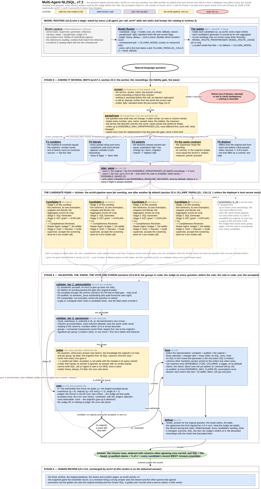
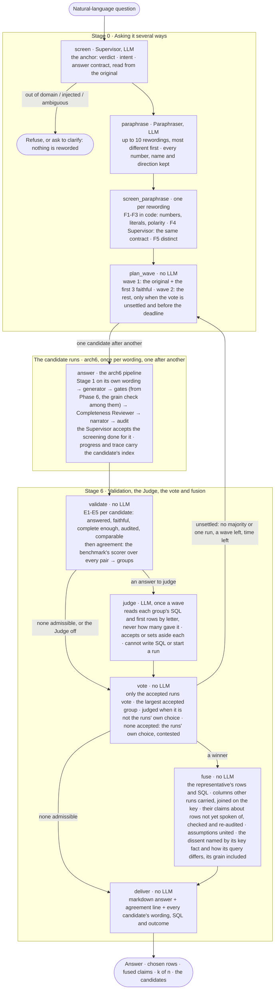

# Multi-Agent NL2SQL Architecture, v7.2

**Status:** arch7.1 with what building its Phase 3 taught it, and with a
phase added (2026-10-09). arch7.1's Phases 0 to 3 are built in 7.0.0,
unpublished; Phase 6, the grain check, is a design and is not built.
`Multi-Agent_NL2SQL_arch7_1.md` and `Multi-Agent_NL2SQL_arch7.md` stand
where this document does not change them; this one supersedes them where
they differ, as they supersede `Multi-Agent_NL2SQL_arch6_3.md`.

**What changes.** Three things, each measured or decided on 2026-10-09:

1. **Fusion as built.** Phase 3's departures from arch7.1 -- a claim is
   added only when it speaks of a row the narrative has not, a column of no
   dimension is passed over, the vote decides on a second wave once --
   are carried into the sections they touch and listed in section 22.13.
2. **The dissent reads the grain.** arch7.1's dissent compared two queries'
   tables and filters. B07's wrong answer reads the same tables and
   filters on the same columns as the right one; what differs is the grain
   at which they combine the facts -- daily sales joined to monthly costs on
   the date, row by row, against both rolled up to the fiscal month first.
   The dissent now reads that too: what a nested grouping rolls each
   aggregated table up to, and the columns it is joined on to the others
   (section 22.8). Built with Phase 3, at the owner's word.
3. **The grain check, a phase of its own.** Naming a grain mistake after
   the vote is a description, and the Judge's naming of one is a model's
   reading; neither keeps a run from making it. Phase 6 adds a check in
   code, in every run: each table's grain measured from its own data, and
   a join of tables of different grains on their dates, the finer not
   rolled up first, sent to the Repair Agent before the query runs (section
   22.14). Its own phase because it changes what the single pipeline counts
   as wrong, with the ensemble off as well as on; whether it ships in 7.0.0
   is open (section 13, item 32).

Everything else in arch7.1 stands. The build plan, module by module, is
[`Multi-Agent_NL2SQL_arch7_2_implementation.md`](Multi-Agent_NL2SQL_arch7_2_implementation.md),
with [`Multi-Agent_NL2SQL_arch7_2_risks_by_phase.md`](Multi-Agent_NL2SQL_arch7_2_risks_by_phase.md),
which wins where the two differ. Sections 2, 3, 8, 9, 10, 11, 12 and 13
below carry arch6's numbers and record only the rows that change. What
departs from this document when it is built is recorded the way arch7.1's
departures were -- in `agent/README.md`, the changelog and the next
specification -- and never by editing this one.

**Diagram:** [`Multi-Agent_NL2SQL_arch7_2.drawio`](Multi-Agent_NL2SQL_arch7_2.drawio)
(editable in draw.io) and [`Multi-Agent_NL2SQL_arch7_2.png`](Multi-Agent_NL2SQL_arch7_2.png)
(rendered), generated by [`make_arch7_2_drawio.py`](make_arch7_2_drawio.py):
the two new stages around the arch6 pipeline, which is drawn once per
candidate as the box it is in this design, with the grain check marked
among its gates; Stage 6 as arch7.1 orders it -- the groups, the Judge,
then the vote -- with the second wave taken when the vote is unsettled;
and fusion as built. arch6's own diagram remains the drawing of what is
inside each box. The same architecture is drawn inline below in Mermaid.



**Ground truth used for the design:** arch7.1's, and the ensemble as 7.0
built it through Phase 3 -- fusion and the second wave in `fuse.py` and
`ensemble.py`, the queries' reading in `completeness.read_query` -- with
the measurements of it in `docs/benchmark.md` ("The second wave and
fusion"), and the knowledge base's grain table
(`knowledge/business_index.md`, "Grain: which tables are daily, weekly and
monthly").

What changed, in one line each:

| Area | arch6.3 | arch7.2 | arch6 § |
| --- | --- | --- | --- |
| The question | asked once, in the words it arrived in | screened once, reworded into 3 to 10 paraphrases, each checked for fidelity, and asked once per wording | 2, 4.1 |
| The pipeline | one run per question | one run per wording, one after another, each the whole arch6 pipeline on its own retrieval; the Supervisor accepts a screening done for it | 2, 3 |
| The model host | two API jobs may call it at once | `OLLAMA_PARALLEL_CALLS` calls in flight at once, process-wide, 1 by default -- serial -- and the candidate runs one after another; a deployer whose host serves several raises it, and that many candidates run at once | 15, 22.9 |
| The answer | the one run's | the rows of the candidate chosen from the largest group of agreeing results, widened with the columns other agreeing runs carried (`ENSEMBLE_FUSE_COLUMNS`, on by default); the claims, assumptions and caveats of that group fused; an agreement line (`k of n`); every candidate's wording, SQL and outcome shown; each answer that lost named, with how its query differs -- its grain included | 7, 22.8 |
| Validation | did it run; is it complete; is the prose true to the rows | and: does it answer the question that produced it (E1-E5); which results agree (the benchmark's own scorer); does each distinct answer answer the question as asked (the Judge, every question, before the vote); which accepted answer most runs gave (the vote); and, from Phase 6, does every join of tables recorded at different grains roll the finer up first (the grain check, in code, in every run) | 6, 7.3, 22.5-22.7, 22.14 |
| Model calls | 3 or 4 on the happy path | about four times as many at the default width, and about four times the wall time on a host that serves one call at a time; a second wave only when the vote is unsettled; one Judge call a wave | 9 |
| Routing | five tasks | seven: the Paraphraser and the Judge join; catalog schema 3 | 15 |
| Progress and trace | one stream, one trace | one stream whose events name their candidate; one trace with a run per candidate under it | 18, 22.11 |
| Off | -- | `ENSEMBLE_ENABLED=false` is arch6 exactly, to the answer | 11 |

---

## 22. Asking it several ways (arch7.2)

### 22.0 The premise, and what it rests on

Everything arch4 to arch6 added to the pipeline made one run of one wording
more likely to be right: retrieval before generation, deterministic gates,
an answer contract, a completeness check, a routed model per call. Nothing
in it asks whether the same question asked in other words would have got
the same answer. The benchmark asks each of its fifteen questions once, in
one wording, so the pipeline's sensitivity to wording has never been
measured -- and this project's own history says the sensitivity is real:

- the Supervisor once paraphrased B13's *ratio* into a *difference* and the
  generator computed one (the contract line now never restates a measure
  the question names, arch6 section 4.1);
- an intent framing that said "return both sides" lost a `LIMIT` and turned
  one right row into five (section 4.1's rule that a framing describes the
  calculation, never the row count);
- "How many stores are there?" was once answered with ten named stores,
  because the reflection could ask for a column of a dimension the rows
  did not identify (the fourth bound on it, recorded in
  `completeness.py`).

Each of those was a change of a few words in a prompt, not in the
question; each changed the answer. A person's own rewording of a question
is a larger change than any of them.

**What asking several ways buys.** Three things, none of which one run can
provide:

1. **A confidence signal.** Four runs that agree say something a single
   run's audit cannot: the answer did not depend on how the question
   happened to be phrased. Four runs that split two and two say the
   question, or the pipeline's reading of it, is unstable -- which is worth
   more to a reader than either answer alone.
2. **A catch for wording-sensitive mistakes.** A draft that lost a `LIMIT`,
   a measure read as its gross rather than net column, a filter put on the
   calendar year rather than the fiscal one: when such a mistake follows
   from one wording and not from the others, the vote outvotes it, and the
   dissent is named in the answer.
3. **Independent retrieval.** Each wording embeds differently, so each run
   finds its own exemplars, snippets and literals. A paraphrase that
   happens to resemble a golden pair the original did not brings that
   pair's reasoning into one candidate's prompt. This is diversity the
   pipeline cannot get any other way: temperature is 0 everywhere
   (`Settings.temperature`), so asking the same prompt twice returns the
   same SQL. **A different wording is the only independent draw this
   pipeline has**, which is why the ensemble is over paraphrases and not
   over samples.

**What it does not buy.** Agreement is not correctness. Four runs that all
join the sales fact to the calendar on the wrong key agree on the same
wrong total; the grain trap (benchmark B07) and the fan-out trap (B08) are
exactly the mistakes a model makes *regardless* of wording, and the
ensemble will not catch them. What agreement rules out is sensitivity to
wording, and what it adds is the measured width of that sensitivity. The
answer says "agreed by 4 of 4 runs", never "verified".

**Measured, it was worse than that** (arch7.1). On the paraphrase set
asked through arch7 as built, the mistakes the runs made were mostly made
by several runs at once: B07's grain trap was fallen into by three of four
wordings, which agreed on the same wrong figure and outvoted the one that
did not, and every wrong answer delivered had a majority behind it. Runs of
one pipeline on near wordings of one question are not independent draws,
so their agreement is weaker evidence than a count of them suggests. That
is why arch7.1 has every distinct answer read against the question before
any is counted (section 22.7).

**The claim to test** (section 10, Phase 0): that the current pipeline's
accuracy on the benchmark drops when each question is asked in three other
wordings, and that the ensemble's accuracy on the same set is at least the
single run's at a cost of about four times the model calls and the wall
time. If the first part is false -- if arch6 answers every paraphrase of
every benchmark question identically -- the ensemble buys the confidence
signal and nothing else. The default is on either way (section 13, item
15): this is the pipeline a larger tool calls for its hardest questions,
and the measurement says what that tool is paying for, not whether to
pay it.

### 22.1 Architecture

Two stages around the arch6 pipeline, one outer shared state, one wave
loop. The arch6 pipeline is unchanged inside each candidate run but for one
node accepting work done for it (section 22.4). Agents marked **LLM** call
a chat model; everything else is deterministic code. On the happy path at
the default width the outer stages make two model calls of their own -- the
anchor screening, which replaces the original run's Supervisor call, and
the Paraphraser -- plus one light screening per rewording; the candidate
runs make arch6's calls each; the Judge once, before the vote.



| Stage | Node | What it does | LLM |
|---|---|---|---|
| 0 | `screen` | The Supervisor on the original: verdict, intent, the answer contract -- the anchor every rewording is held to | screens |
| 0 | `refuse` | A refused or ambiguous question is answered as arch6 answers it; nothing is reworded | -- |
| 0 | `paraphrase` | The Paraphraser: up to `ENSEMBLE_MAX_PARAPHRASES` rewordings in one structured call, most different first, with the contract's invariants in its instructions | writes rewordings |
| 0 | `screen_paraphrase` | One rewording after another by default, up to `OLLAMA_PARALLEL_CALLS` at once: the deterministic fidelity checks, then the Supervisor's reading compared with the anchor's; a rewording that fails is discarded with the reason and never run | screens, light |
| 0 | `plan_wave` | Which candidates run now: the original and the first `ENSEMBLE_PARAPHRASES` faithful rewordings; on a second wave the rest, if the deadline allows | -- |
| runs | `answer` | One candidate after another by default, up to `OLLAMA_PARALLEL_CALLS` at once: the arch6 pipeline on the candidate's wording, seeded with its screening; every model call takes a slot of the host gate first | arch6's |
| 6 | `validate` | E1-E5 on each candidate; agreement between every pair with the benchmark's scorer; the groups | -- |
| 6 | `judge` | Every question with an admissible answer, before the vote: a verdict on each group's answer -- accepted, or set aside with the mistake named -- read by letter, never with the count | once a wave |
| 6 | `vote` | Only the runs whose answer the Judge accepted vote; the winning group; whether it is a majority; `judged` when it is not the group the runs alone would have chosen; when the Judge accepted none, the runs' own vote, `contested` | -- |
| 6 | `fuse` | The representative of the winning group; its rows and SQL; the columns and claims of the group's other runs that its rows bear out; the dissent named, with how its query differs | -- |
| 6 | `deliver` | The markdown answer with the agreement line and the candidates' record | -- |

The screenings and the candidate runs go through a pool of
`OLLAMA_PARALLEL_CALLS` workers (section 22.9). With the default of one
that is a loop -- one rewording, then one candidate, after another --
because a host that serves one call at a time would serialise their calls
anyway, and nothing a candidate does outside its model calls takes long
enough to be worth overlapping with another's. A deployer whose host
serves several calls at once raises the number, and that many candidates
run at once. `candidates` is appended to as each run finishes, so the
progress stream shows the runs in the order they finished. The wave loop
is bounded by one counter, `waves` (`ENSEMBLE_WAVES`, default 2), and by a
deadline when one is set; there is no path round it that does not spend
the counter.

### 22.2 The outer state

The arch6 `AgentState` is untouched: it is the state of one candidate run.
Above it, the ensemble has a state of its own, with the same rules -- every
node a function of a subset returning a partial update, a reducer on every
key two branches write, a lifetime on every field.

```python
class EnsembleState(TypedDict, total=False):
    # --- input ---------------------------------------------------------
    question: str                    # the original, as the person wrote it
    principal: str | None

    # --- stage 0: the anchor and the rewordings --------------------------
    verdict: Verdict                 # the anchor screening's; != proceed stops everything
    intent: Intent
    clarification: str | None
    answer_contract: AnswerContract  # the anchor contract every run is held to
    screening: dict | None           # the anchor's reading, seeded into the original's run
    paraphrases: list[Paraphrase]    # {index, text, changed, status, reason, screening}
                                     #   status in faithful | discarded; filled by the gate
    paraphrase_retried: bool         # the Paraphraser's one retry spent
    waves: int                       # waves run so far; the one loop counter
    deadline: float                  # monotonic time after which no wave starts
    wave_plan: list[int]             # the candidates the current wave runs (a wave field)
    parallel_calls: int              # runs allowed at once, for the record on the wire

    # --- the candidate runs ----------------------------------------------
    candidates: Annotated[list[Candidate], upsert_candidates]
                                     # one per run: {index, wording, origin, wave,
                                     #   state: AgentState, outcome, admissible, reasons,
                                     #   signature, group}; appended by `answer`,
                                     #   marked where it stands by `validate`

    # --- stage 6 --------------------------------------------------------
    groups: list[Group]              # {members, representative, signature}, largest first
    judgement: Judgement | None      # the Judge's verdicts, given before the vote
    agreement: Agreement             # {admissible, agreed, total, level, why, set_aside}
    decision: Decision               # {chosen, fused_from, dissent: list[Dissent]}

    # --- output and observability ----------------------------------------
    answer: str
    narrative: str
    sql: str                         # the chosen candidate's
    result: QueryResult | None       # the chosen candidate's rows
    chart: ChartSpec | None
    claims: list[Claim]              # the fused, re-audited claims
    audit: AuditReport               # of the fused claims against the chosen rows
    assumptions: list[str]
    error: str | None
    node_errors: Annotated[dict[str, str], merge_errors]
    trace: Annotated[list[TraceEntry], operator.add]   # the outer nodes'; each
                                     #   candidate's own trace is inside its state
    trace_id: str
```

Five payloads carry the design:

```python
@dataclass
class Paraphrase:
    index: int                 # 1..10; 0 is the original
    text: str
    changed: str               # the Paraphraser's one line: what it varied
    status: str = "pending"    # pending | faithful | discarded
    reason: str = ""           # which check failed, for the record
    screening: dict | None = None   # the Supervisor's reading, seeded into its run

@dataclass
class Candidate:
    index: int                 # the paraphrase's index; 0 is the original
    wording: str
    origin: str                # original | paraphrase
    wave: int
    state: AgentState          # the whole run: sql, result, completeness, audit, trace...
    outcome: str               # answered | gave_up | refused
    admissible: bool = False
    reasons: list[str] = field(default_factory=list)   # E1-E5 failures, by rule
    signature: str = ""        # the result's key fact, for the record and the dissent

@dataclass
class Agreement:
    admissible: int            # candidates that voted: passed E1-E5, and not set aside
    agreed: int                # members of the winning group
    total: int                 # candidates run
    level: str                 # unanimous | majority | judged | contested | single | none
    why: str
    set_aside: int = 0         # candidates the Judge kept from voting

@dataclass
class GroupVerdict:
    group: int                 # the group's index, 0 the largest
    accepted: bool
    why: str = ""              # the mistake it named, or why the answer is right

@dataclass
class Judgement:
    verdicts: list[GroupVerdict]     # one per group, in group order
    set_aside: list[int]             # the candidates whose answer it rejected
    overruled: bool = False          # it set aside the runs' own choice
    instead_of: int | None = None    # that choice's representative, when it did
    model: str = ""
    error: str = ""                  # why it could not be asked; the runs then vote alone
```

Rules that follow from the contract:

- **The anchor contract is one for the whole question.** Every candidate's
  run is seeded with the contract read from the original and its result is
  held to it -- the run does not rebuild a contract from its own wording. A
  rewording whose reading would build a different contract is not run (F4,
  section 22.3); so every admissible result is about the same entities,
  measure and period, and comparing them is comparing like with like.
- **`candidates` is append-only and `waves` is the only loop counter.** A
  second wave adds candidates; nothing removes one. `validate` marks a run
  -- admissible or not, its group -- through a reducer that replaces it by
  its index, so the list stays append-only in what ran. The outer graph has
  one cycle, `vote -> plan_wave`, and it spends `waves`.
- **Each candidate's state is whole.** Its `trace`, `attempt_history`,
  `completeness` and `audit` are kept as they were, so a reader of the
  answer, the API's `ensemble` field or the MLflow trace sees each run as
  arch6 would have shown it. The outer `trace` holds the outer nodes only;
  the benchmark sums both.
- **Lifetimes.** Every field above is a *run* field but `groups`,
  `agreement`, `judgement` and `decision`, which are *wave* fields: emptied
  by `plan_wave` when a second wave starts, because they describe the vote
  before it. A test holds the table as `tests/agent/test_state.py` holds
  arch6's.

### 22.3 Stage 0: the anchor, the Paraphraser and the fidelity gate

**The anchor screening** (`screen`) is arch6's Supervisor on the original
question, unchanged: verdict, intent, clarification, and the three fields
the answer contract is built from. A verdict other than `proceed` ends the
run as it does today -- refused, or the clarification asked back -- and
*nothing is reworded first*. Two reasons. An injection attempt rephrased
ten ways is ten attempts, each one step further from the words the screen
saw; the screen must see the original and only the original before any
other model sees it. And an ambiguous question made ten ways is not less
ambiguous; the right answer to ambiguity is the question back, and
section 13 notes that disagreement among candidates is itself a sign of
it.

**The Paraphraser** (`paraphrase`) is one structured call. It sees the
question and what its answer may not change, in everyday words, and nothing
else: no schema, no retrieved text, no rows, and not the contract as the
generator is shown it -- shown that, it wrote the contract's column names
into its rewordings ("for every banner_name"), which the gate then
rejected wholesale. The measure is named only as the generator is told it:
the measure the question states, or "the figure the question asks for, in
its own words" -- told the Supervisor's own words for a measure, it turned
B13's "prices lowest relative to us" into "the smallest average price
gap", and two such rewordings outvoted the original's right answer. It is
told what it may not change and what it should vary:

```
system:  You reword questions about a retail database without changing what
         they ask. Keep every number, year, name and quoted value exactly as
         written. Keep what the answer is about (<entities>), the quantity that
         answers or ranks it (<measure, as stated, or "the figure the question
         asks for, in its own words">), the period (<period, or "none named">),
         the direction (top or bottom, highest or lowest, more or less) and the
         row count asked for (<N>). Add no period, filter or measure the question
         lacks; drop none it has. Vary the words and the shape: a question and an
         instruction, another common verb, another order of clauses, a plainer or
         a more formal register, "our" and "the company's". Write as the person
         asking would, in everyday words: keep any code or name the question
         itself uses, and add no column, table or field name of your own.
human:   Question: <original>
         Write <M> rewordings, each different from the question and from the
         others, the most different first. For each, say in a few words what you
         changed.
-> {"rewordings": [{"text": "...", "changed": "instruction form; 'best-selling' for 'top'"}, ...]}
```

`M` is `ENSEMBLE_MAX_PARAPHRASES` (default 10, the ceiling): writing ten
short sentences costs about what writing three does, and having the
reserve written means a second wave needs no second Paraphraser call. The
rewordings are kept in the order the model gave them -- most different
first -- because that is the order the waves spend them in. The call is
routed as the Supervisor's is (section 22.10): light when the pre-screen is
clear, standard when it flags the question.

**The fidelity gate** (`screen_paraphrase`, one rewording after another by
default; section 22.9) decides which rewordings are the same question. Five checks, the
first three and the last in code, the fourth a model call:

| Check | Rule | Fails when |
|---|---|---|
| F1 numbers | the multiset of numerals in the rewording equals the original's; number words one to twenty count as their numerals | "top ten" became "top five", or "2025" went missing |
| F2 literals | every quoted string and every capitalised multi-word phrase in the original appears verbatim (case-insensitive) in the rewording | "Dairy & Eggs" became "dairy products" |
| F3 polarity | the set of direction classes present is equal: superlative-high (top, highest, best, most, largest), superlative-low (bottom, lowest, worst, least, fewest), change-up, change-down, negation (not, no, never, without, excluding) | "lowest" became "highest"; "excluding markdowns" lost its "excluding" |
| F4 the same contract | the Supervisor's reading of the rewording, built into a contract in the original's shape -- one number or a list, ranked, how many rows, which F1 and F3 have held the words to already -- equals the anchor's in what the reading supplies: the same entities by resolved key, label and table, the same stated measure (a stated measure the same as a named one that contains it), the same period, however it is spelled ("fiscal Q4 of FY2025" is "the fourth fiscal quarter of fiscal year 2025"), and its default flag; and `verdict = proceed`; a screening that could not be made fails | the model read "stores" where the original said "banners"; a period appeared; the screen refused it |
| F5 distinct | after case-folding and stripping punctuation the rewording differs from the original and from every rewording before it that passed the checks in code, and its token Jaccard similarity to each is at most 0.8 | two rewordings that differ by a comma |

F4 is the Supervisor -- the agent that already reads a question into a
contract -- on each rewording, at the light rung. It is a model call per
rewording, and it is paid because it is the one check that reads meaning:
F1 to F3 catch the visible slips, F4 catches "banners" read as "stores".
Its `intent` is *not* compared: intent classification is the noisiest of
the Supervisor's outputs ("how many" is a lookup to one reading and an
aggregate to another) and it shapes only the framing line and the chart,
neither of which changes what the rows are. Each candidate runs with its
own intent, recorded. Nor is the contract's *shape* read from the
rewording's own words: arch7 compared each rewording's contract built from
its own words, and the live Supervisor's readings of the forty-five
hand-written rewordings then failed eighteen -- eleven for nothing but how
the period was spelled, most of the rest because the contract's reading of
a question's shape knows a count only as "how many" and a ranking only by
its own word list ("What is the store count?" read as a list). The shape is
the original's, which F1 and F3 have already held the words to, so F4
compares the reading -- the entities, the measure, the period -- and the
forty-five lose three, each a reading of another entity. What F4 does fix
is everything the comparison in section 22.6 depends on.

The checks in code run on every pending rewording before any reading
starts, so a rewording that visibly changed the question costs no model
call. A rewording that fails any check is `discarded` with the check's
name and is never run; the record shows it. With the Supervisor off
nothing is reworded: no rewording runs that the Supervisor has not read,
and with it off nobody reads one. **If fewer than
`ENSEMBLE_PARAPHRASES` are faithful**, the Paraphraser is asked once more
-- told which rewordings failed and why -- for replacements, and the gate
runs on those -- a replacement it has written before is not judged
twice; this second call is the only retry, and after it the
ensemble proceeds with whatever is faithful, down to the original alone.
The ensemble never fails a question for want of rewordings: with none
faithful it is arch6, and the answer says so.

**The wave plan** (`plan_wave`) is deterministic. Wave 1 is the original
and the first `ENSEMBLE_PARAPHRASES` faithful rewordings (default 3: four
runs). Wave 2, reached only from `vote` with no majority among the
accepted, is every remaining faithful rewording, up to the ceiling of ten
in all -- unless `waves` has reached `ENSEMBLE_WAVES` or, when a deadline
is set (`ENSEMBLE_DEADLINE_SECONDS`, default none; section 22.9), the
monotonic clock has passed it, in which case the vote stands as it is and
the largest accepted group is delivered as `contested`. A wave in flight
is always awaited; a deadline gates starting one.

### 22.4 The candidate runs

Each candidate (`answer`, one candidate after another by default) is the
arch6 pipeline, invoked as a function of a seeded state, on one agent instance
shared by every candidate -- the same `Nl2SqlAgent`, its database pool,
router, retrievers, literal catalog and label map built once, as the API's
jobs already share them. Five things are particular to a candidate run,
and nothing else differs from arch6:

1. **The question is the candidate's wording.** Stage 1 retrieves on it,
   the generator is asked it, the narrator writes about it. That is the
   point: a paraphrase that resembles a golden pair the original did not
   finds that pair.
2. **The Supervisor accepts a screening done for it.** The seeded state
   carries the candidate's verdict, intent, clarification and the anchor
   contract, and a flag, `screened`, that says so; `supervise` then returns
   them with no model call and the detail "screened by the ensemble". For
   the original, the anchor screening is seeded, so its Supervisor call is
   not paid twice; for a rewording, the F4 screening is. This is the one
   change inside `graph.py`, and `SUPERVISOR_ENABLED` still means what it
   meant: with it off, no screening is made anywhere and the contract is
   built from the wording alone.
3. **Progress names the candidate.** The pipeline's progress callback
   gains the candidate's index beside the step and the detail, so the
   REST event stream and the CLI's stderr can show four `generate_sql`
   lines as four candidates and not as one node reporting four times
   (section 22.11).
4. **The trace nests.** The candidate's agent spans open under a span of
   their own, "Candidate k", under the question's root span, so MLflow
   shows one trace per question with a run per wording inside it. When
   candidates run at once, each worker is given the active span and the
   progress callback by a copied context (`contextvars.copy_context`), as
   the five retrievers' branches already are; with one worker the active
   span is simply the enclosing one. Nothing changes in `tracing.py` but
   the candidate span.
5. **Every call to the host takes a slot of the host gate.** Each model
   call a candidate makes -- and every other call the agent makes: the
   anchor's, the Paraphraser's, the screenings', the Judge's, and any
   other job's -- acquires one of `OLLAMA_PARALLEL_CALLS` slots first
   (section 22.9). With the default of one slot the candidates run one
   after another: the host would serialise their calls anyway, and
   sequential runs cost no threads, no second connection, and no
   interleaving of two runs' progress lines or of two models on the host.
   With more slots, that many candidates run at once, and the number is
   the deployer's statement about the host, not something the agent
   measures.

Everything else is arch6's: the five retrievers and the aggregator, the
generator, the three gates, the Completeness Reviewer and its one
reflection, the Repair Agent and the shared `attempts` budget of seven, the
narrator and the audit, model routing per call with the ladder. A
candidate that gives up is a candidate with `outcome = gave_up`; it is
recorded, counts for nothing in the vote, and its attempt history is in
the answer's record as a give-up's always was.

### 22.5 Stage 6, tier 1: is each result an answer to its own question?

The first tier of `validate` runs on each candidate alone, in code, and
marks it admissible or not. A candidate that is not admissible does not
vote. The rules read the candidate's state and the anchor contract:

| Rule | Check | A candidate fails when |
|---|---|---|
| E1 answered | `outcome = answered`: `verdict = proceed` and `error` is None | it gave up inside its budget, or its screening refused it |
| E2 faithful | its wording's status is `faithful` (trivially so for the original) | never, by construction: an unfaithful rewording is not run. The rule exists so the record says every voter was checked |
| E3 complete enough | the anchor contract's rules R1-R4 (`completeness.check_rules`) against its result find no gap it was not shown with: a label beside every key, the ranking's measure present, the period, and -- the fatal one -- rows at all when the question implies rows | its result is empty for a question that implies rows; it lacks the measure that ranked it |
| E4 audited | `audit.semantic_issue` is None | the audit judged the rows wrong and the budget ran out before a repair |
| E5 comparable | its result is not truncated, or the question is ranked so its first rows are its answer | an unordered result that hit the row cap: its first fifty rows are a sample, and a sample agrees with nothing |

E4 is the audit's verdict on the rows and nothing else. arch7 also
excluded a narrative none of whose claims the audit could trace to a cell;
measured, that was the one reason runs could not vote -- six runs in
fifteen questions, right answers among them, B09's original's -- and it
judges the narrator, not the rows. Such a run votes, and selection puts an
audited run of its group before it (section 22.8).

E3 and E4 are arch6's own gates, read back: a candidate that reached
`finish` passed them on its last attempt, but it may have been *shown*
with an accepted gap (section 6.6's same-result guard) or with claims
dropped, and those are what the ranking in section 22.8 reads. Only the
fatal cases make a candidate inadmissible; a result with a missing label
is still a vote, and still worth showing if it wins -- the gap named, as
arch6 names it.

### 22.6 Stage 6, tier 2: which results agree?

The second tier compares every pair of admissible candidates with **the
benchmark's own scorer**, `compare.result_matches` -- moved into the agent
from `benchmarks/runner.py`, which imports it back: column names
and order are presentation, extra columns are allowed, row order counts
only when the contract is ranked, numbers agree within `1e-6` relative or
at two decimals, and the rows on each side must be the same rows under
*some* reading of the columns -- the column-assignment search that rejects
a result whose values are all present but attached to the wrong rows,
which is what a join on the wrong key produces. Two candidates **agree**
when either's result matches the other's: `result_matches(a, b, ordered)`
or `result_matches(b, a, ordered)`, with `ordered = contract.ranked`. One
direction suffices because the scorer allows the wider result extra
columns, so a run that returned the brand beside each SKU agrees with one
that did not, if the SKUs and their sales are the same.

Agreement is computed between every pair, and candidates are grouped as
the connected components of it -- union-find over the pairs -- so a
tolerance that lets *a* match *b* and *b* match *c* puts all three
together. Each group has a **signature**, for the record and the dissent:
a scalar result's value; otherwise the row count and the first row's
entity labels and measure. Groups are ordered by size, ties broken toward
the group holding the original, then toward lower candidate indices.

The groups are what the Judge reads and what the vote counts; the Judge
comes first.

### 22.7 Stage 6, tier 3: the Judge, then the vote

**The Judge** (`judge`) is one structured call a wave, made on every
question with an admissible answer, before anything is counted. Its prompt
is the original question; what every answer was held to -- the entities,
the measure as stated, the period, the rows asked for -- in everyday words,
as the Paraphraser is told it; the assumptions the runs were told to make;
the knowledge the original's run retrieved (arch6's knowledge base, the
document that says which facts are monthly and which daily), capped; and
for each group, by a letter: the representative's SQL, its columns and its
first five rows, with how many rows there were. It returns a verdict per
letter:

```json
{"rulings": [
  {"answer": "A", "accepted": true,  "why": "It rolls sales and costs up to the month before it joins them."},
  {"answer": "B", "accepted": false, "why": "It joins daily sales to the monthly item costs on the date."}]}
```

It is bounded the way the reflection is (section 6.6), and for the same
reason -- an unbounded "let me think about this some more" is the fault W3
removed from the presentation stage:

1. **It reads; it does not count.** The answers are lettered in the order
   their runs were asked -- the original's first -- never by the size of
   their group, and it is never told how many runs gave each. More than one
   answer may be right, or none.
2. **It sets an answer aside only for a mistake it can name in the query**
   -- a filter the question does not state (names given as examples, "such
   as", "like", "and so on", are not a list to keep), a join that is not at
   the grain the knowledge gives, the measure in other units than asked (a
   fraction for a percentage), another period, other entities -- and says
   the mistake in one sentence. Answers that differ only in column names,
   order or rounding are equally right.
3. **It chooses among letters.** A verdict on a letter that names no
   answer is discarded unread, so is a second verdict on one, and an answer
   it gave no verdict on stands: the Judge raised no objection to it.
4. **It cannot start a run, call an agent, write SQL or ask for a
   repair.** There is no edge from `judge` anywhere but `vote`.
5. **It runs once a wave.** A second wave adds runs and may merge groups,
   so the Judge reads every group again after it -- at most `ENSEMBLE_WAVES`
   calls a question.

It is routed at the heavy rung (section 22.10): it decides which answers
are counted at all, so it is the one call where the strongest model costs
least per decision it makes. A Judge whose call fails costs its verdicts
and nothing else: the runs vote alone, and the answer says the Judge could
not be asked. `ENSEMBLE_JUDGE_ENABLED=false` skips it, and the runs vote
alone, as arch7's did before a Judge was asked.

**The vote** (`vote`) counts only the runs whose answer the Judge
accepted. With `A` of them -- the admissible candidates less those it set
aside -- and the largest accepted group of size `g`:

| Outcome | Condition | `agreement.level` | Then |
|---|---|---|---|
| Unanimous | `g = A` and `A >= 2` | `unanimous` | `fuse` |
| Majority | `g > A / 2` and `g >= 2` | `majority` | `fuse` |
| No majority, a wave left | `g <= A / 2`, `waves < ENSEMBLE_WAVES`, before the deadline, faithful rewordings remain | -- | `plan_wave`: the second wave runs, and `validate`, `judge` and `vote` run again on every candidate |
| No majority, no wave left | otherwise, with two or more accepted groups | `contested` | `fuse`, with the largest accepted group, the original's preferred |
| Single | `A = 1` | `single` | `fuse`, with the one; a second wave is tried first if one is left |
| Judged | the winner above is not the group the runs alone would have chosen -- the Judge set that one aside | `judged` | `fuse`, with the winner; the record names the answer it set aside |
| None accepted | the Judge set aside every answer | `contested` | `fuse`, with the group the runs alone choose, by the table above over every admissible run; the answer carries the Judge's objection |
| None | no admissible candidate | `none` | `deliver` reports what every candidate tried, as a give-up does, and the original's error; the Judge is not asked |

The quorum is a strict majority of those that vote, never of the run: a
candidate that gave up, or whose answer the Judge set aside, neither agrees
nor dissents. Two is the smallest group that can be said to agree, so a
1-1-1 split is three dissenters and no majority. Groups keep the order
section 22.6 gave them, so the largest accepted group, ties to the
original's, wins. The vote is recomputed over *all* candidates after a
second wave, not over the new ones alone. `agreement.set_aside` counts the
runs the Judge kept from voting, apart from those that could not answer.

**Why the Judge before the vote.** arch7 put the vote first: arch6's
verdict (section 1) is that the model is the wrong tool for a validation
gate -- the only question in forty-five benchmark runs that no
configuration answered was one where a correct query was rejected three
times by its own model reviewer -- and agreement between independent runs
is evidence that no model produced. Measured, the runs were not
independent enough for that. Over the paraphrase set's sixty wordings the
vote changed two answers, both from right to wrong; every wrong answer it
delivered had a majority behind it, unanimous answers were right 46 times
in 47 but majorities only 5 in 9; and a Judge asked only on a split never
saw one of the wrong majorities. A shared mistake is exactly what a count
cannot see and a reader can. arch6's lesson is kept in the bounds rather
than in the order: the Judge cannot loop or repair; it judges every answer
on its own, by its query, against the knowledge the runs had, without the
count to lean on; and it cannot take the question's answer away -- when it
accepts none, the runs' own choice is still delivered, marked contested
with its objection, so a Judge that is wrong costs a caveat, not a right
answer. What the order costs is a heavy call on every question, which the
owner accepted (section 13, item 17).

### 22.8 Select, then fuse

**Selection** chooses the **representative** of the winning group, and
selection is where "the best answer" is decided. The ranking, in order:

| Rank by | Prefer | Because |
|---|---|---|
| 1. completeness | a result shown with no accepted gap over one shown with a gap | every member agrees on the contract's columns; the one that also carries the label the reviewer asked for is the stronger result |
| 2. audit | a narrative with no dropped claim over one with drops | its claims were all traced to cells on the first or second try |
| 3. origin | the original's own run over a paraphrase's | the person asked it in those words, and the SQL they read should be the SQL written for them |
| 4. attempts | fewer generations | a draft that passed every gate first time is the less fragile query |
| 5. plan cost | the cheaper plan | all else equal, the lighter query |
| 6. index | the lower | determinism |

Its SQL is the answer's SQL, its rows are the answer's rows, its chart is
the answer's chart. **No SQL is ever fused**: the generator is the only
place SQL is written (section 5.1) and the ensemble keeps it so. The other
members' queries are listed in the record as having produced the same
result, which is useful to a reviewer -- two differently written queries
that agree are two pieces of evidence about a join.

**Fusion** (`fuse`) then combines, in code and with no model call, what
can be combined without inventing anything, in this order:

- **Columns** (`ENSEMBLE_FUSE_COLUMNS`, a toggle, on by default; the
  owner's decision, 2026-10-07; off leaves the representative's own
  columns and the record says so). An attribute column another member of
  the group carries
  and the representative does not -- a label or an attribute of an entity
  the rows identify, per the label map -- is joined onto the
  representative's rows by that entity's key, when every row of the
  representative's matches exactly one row of the member's on the key and
  the column is of a dimension the rows already identify (the reflection's
  own fourth bound). A column that would not join cleanly -- a key missing,
  a row matching twice or not at all -- is left out, and the record says
  so. A column of no dimension the label map names -- a figure under
  another name, which agreeing runs often carry -- is no attribute and is
  passed over unsaid; a column one run could not join and another could is
  joined, not declined. This is the one fusion that makes rows no single query returned: the
  representative's rows, wider. The delivered SQL does not produce the
  added columns, so the answer names the run each one came from, and that
  run's SQL is in the record beside the chosen one; a reviewer can see
  where every column came from. Section 11 measures how often a column is
  added and how often one is declined.
- **Claims.** Start with the representative's surviving claims. For each
  other member of the group, in rank order, take each of its surviving
  claims that speaks of a row the narrative does not yet speak of, whose
  cited cells exist in the widened result -- the column names present, the
  row indices in range -- and whose value the Audit Checker reproduces from
  those cells (`present.check_claim`, deterministic). A claim every row of
  which a kept claim already cites is a repeat, however it is worded and
  whichever of those rows' columns it cites; a claim that cites no cell has
  nothing the rows could bear out, and is not added. Then audit the fused
  set as a whole (`present.audit`), against the widened rows and the union
  of assumptions; the representative's own dropped claims stay dropped and
  said. Measured, narrators of one result mostly say the same things about
  the same rows -- on B10 three of four said the top product sold the most,
  each citing other columns of its row -- so what fusion adds is what the
  chosen narrator left out: four claims over the fifteen benchmark
  questions, each about a row the chosen narrative had not mentioned
  (`docs/benchmark.md`). The fused narrative is capped at
  `ENSEMBLE_MAX_CLAIMS` (default 8), kept in representative-first order;
  the cap stops the other runs' claims and never cuts the representative's.
- **Assumptions.** The union; in practice identical, since every run was
  held to one contract and the default period is the contract's.
- **Agreement.** The line every answer carries: "Agreed by 4 of 4
  independent runs of the question, each worded differently", or "3 of 4
  runs agreed; 1 answered differently", each with what the Judge set aside
  beside it ("; the Judge set aside the answer of 1 other"); when the Judge
  overruled the runs, "The Judge set aside the answer 3 of 4 runs gave --
  <its reason> -- and accepted this one, which 1 gave"; when it accepted
  none, "The Judge accepted none of the answers -- <its reason> -- so this
  is the runs' own choice, which 4 of 4 gave"; and, when it could not be
  asked, "The Judge could not be asked." after the runs' own line.
- **Dissent.** For each losing group, one line naming its key fact and how
  its representative's query differs from the chosen one -- in code, from
  the two queries' trees (`completeness.read_query`): the tables one reads
  and the other does not; the columns one filters on and the other does
  not, each alias read as its table and compared by name; and how each
  combines the tables it aggregates -- what a nested grouping (a CTE's, a
  subquery's) rolls each up to before anything else reads it, and the
  columns it is joined on to the other aggregated tables, directly, through
  the CTE or subquery that holds it, or through a dimension both are joined
  to. The last is where a mistake of grain shows, which the tables and
  filters cannot: B07's wrong answer reads the four tables and filters on
  the three columns the right one does. Its line says "run 1's query joins
  fact_item_cogs on date_key, product_key, row by row and joins
  fact_pos_retail_sales on product_key, sales_date_key, row by row; the
  chosen one rolls fact_item_cogs and fact_pos_retail_sales up to
  fiscal_year, fiscal_month_num, product_key, store_key and joins them on
  those." Only equalities between qualified columns are read, and `USING`
  only between two single tables, CTEs or subqueries; a join whose sides
  cannot be told apart is left out, not guessed. A reader is told what was
  outvoted and how its query differs, without a model having been asked to
  explain it -- the difference, not the verdict: which side is wrong is the
  Judge's reading and, once Phase 6 is built, the grain check's (section
  22.14).

**What "stronger" means here, precisely.** The fused answer has the
representative's rows, which passed every gate, were read against the
question by the Judge and accepted, and agreed with a majority of the runs
that voted, widened with the attributes other agreeing runs
carried beside the same keys; more cell-verified claims than any run
wrote; the assumptions every run made, stated once; a measured confidence;
and the alternatives named. It is never stronger in a way no run's query
supports: every column is some candidate's, every claim is checked against
the cells it cites, and the candidate behind each is in the record.

**The delivered answer** (`deliver`) is `present.render_answer` as today --
the claims, the table, the notes on assumptions, accepted gaps and dropped
claims -- plus the agreement line first and the dissent lines among the
notes, and, folded beneath for the clients that show their working, the
candidates: each wording with what it changed, its outcome, its SQL and
its key fact, and the discarded rewordings with the check that discarded
them. The question the answer is rendered for is the original.

### 22.9 Cost, latency and the controls

**Model calls.** arch6 makes three or four on the happy path and 3.7
measured. At the default width:

| Call | arch6 | arch7, wave 1 | Rung |
|---|---|---|---|
| Supervisor on the original (the anchor) | 1 | 1 | light, or standard if pre-screened |
| Paraphraser | -- | 1 (2 if replacements are needed) | light, or standard if pre-screened |
| Supervisor on each rewording (F4) | -- | 3 | light |
| Generator, per candidate | 1 | 4 | each candidate's own score |
| Completeness reflection, per candidate | 0 or 1 | 0 to 4 | the generation's, capped |
| Narrator, per candidate | 1 | 4 | by result size |
| Repair, unclassified errors only | rarely | rarely, x4 | above the generator |
| Judge | -- | 1 | heavy |
| **Happy path** | **3-4** | **14-18** | |

About four times the calls, and about four times the tokens: the
screenings and the Paraphraser have small prompts, and the four generator
prompts are four copies of arch6's. The Judge's prompt is the largest of
the outer calls -- every distinct answer's query and rows, and the
knowledge -- but there is one a wave. A second wave adds up to seven more
candidates' worth and a second Judge call, and is taken only on
disagreement.

**Wall time.** The model host this was designed against serves one
call at a time -- the owner's word -- and the design's default follows it:
every call the agent makes takes a slot of one process-wide **host gate**
(`OLLAMA_PARALLEL_CALLS`, default 1), held around each routed call and
released when the call returns or `OLLAMA_TIMEOUT` ends it. With one slot
a wave's time is its runs' times added: a four-run wave takes about four
times arch6's median -- a question that took half a minute routed takes
about two -- and a full second wave about three times that again. A
deployer whose host serves several calls at once (Ollama's own
`OLLAMA_NUM_PARALLEL` above one, with the memory for it) sets the number
of slots to what the host serves, no higher; that many candidates then
run at once, and a wave takes about its width divided by the slots, times
one run. The agent does not measure the host's capacity: the number is
the deployer's statement, and a number above what the host serves only
queues at the host what would have queued at the gate. The cost is
accepted either way: this is the pipeline a larger tool calls for a
question it judges extremely difficult, and the controls below bound the
work, not the clock:

| Setting | Default | What it bounds |
|---|---|---|
| `ENSEMBLE_ENABLED` | `true` | off is arch6, to the answer |
| `ENSEMBLE_PARAPHRASES` | `3` | rewordings in the first wave; 3 to 10, a value outside refused at startup |
| `ENSEMBLE_MAX_PARAPHRASES` | `10` | the ceiling the Paraphraser writes to and the waves spend to |
| `ENSEMBLE_WAVES` | `2` | the loop counter's limit; 1 is one wave and no loop |
| `OLLAMA_PARALLEL_CALLS` | `1` | model calls in flight to the host at once, process-wide, and candidate runs at once per question; 1 is serial, the default; a deployer sets it no higher than the host's own `OLLAMA_NUM_PARALLEL` |
| `ENSEMBLE_DEADLINE_SECONDS` | `0` | none by default; set, no wave starts after that many seconds from the question's arrival, for a caller that blocks on `API_MAX_WAIT_SECONDS`; a wave in flight is always awaited |
| `ENSEMBLE_JUDGE_ENABLED` | `true` | the Judge before every vote; off, the runs vote alone |
| `ENSEMBLE_MAX_CLAIMS` | `8` | the fused narrative's length |
| `ENSEMBLE_FUSE_COLUMNS` | `true` | the toggle for column fusion: columns other agreeing runs carried, joined on the entity's key; off leaves the representative's own columns |
| `MODEL_ROUTE_PARAPHRASER`, `MODEL_ROUTE_JUDGE` | unset | a pin per rung, as the five tasks have |

**What the host gate touches.** The API's `API_MAX_CONCURRENCY` (2)
lets two questions run at once; with the gate they still do, in everything
but their model calls, which share the slots. With one slot a deployment
that serves the ensemble should set it to 1, so one question's candidates
are not slowed by another's and the host is not asked to swap between two
questions' models; the queue (`API_MAX_QUEUED`) holds the rest. The reader
role's connection limit (60, `common/nl2sql_common/roles.py`) bounds
`API_MAX_CONCURRENCY x OLLAMA_PARALLEL_CALLS` candidates holding a
connection at once -- two jobs of ten slots would be twenty, well inside
it -- and the agent container's process ceiling (`pids_limit`, 6.3) is
re-derived for that product times the pipeline's own threads when the
slots are more than one; with one slot both are as today. `API_MAX_WAIT_SECONDS`
(900) is the longest a *blocking* caller waits, and a full second wave on
one slot can outlast it; the larger tool should watch the job (`GET
/v1/questions/{id}`, or its event stream, which reconnects with
`Last-Event-ID`) rather than block, which is what the job model is for --
or raise the bound, or set `ENSEMBLE_DEADLINE_SECONDS` so no wave starts
that cannot finish inside it.

### 22.10 Routing: two tasks more

`router.TASKS` grows from five to seven: `paraphraser` and `judge`. Each
gets a rung rule in `complexity.py`, a prior in the catalog builder, a
probe in the calibrator and a column in the routing table; nothing else
in section 15 changes.

| Task | Rung rule | Prior (by size, as the five have) | Probe |
|---|---|---|---|
| `paraphraser` | the Supervisor's: light when the pre-screen is clear, standard when it flags the question | as the narrator's | the fifteen benchmark questions with their reference contracts: the fraction of rewordings that pass F1-F5 against the reference model's reading, and the fraction distinct; a model is suited at a rung when its fidelity rate is within one rewording in ten of the reference's |
| `judge` | heavy, always | as the reflection's | the benchmark questions each with two or three answers built from reference and trap queries (`BenchmarkQuestion.trap` names the wrong answer each question invites), shown by letter without counts: the fraction of verdicts that match the reference -- the reference's answer accepted, a trap's set aside |

The catalog's `schema` goes from 2 to 3; `tasks` and `task_budgets` carry
the two (8,192 tokens for the Paraphraser, 16,384 for the Judge, which
reads several queries and their rows). A catalog at schema 2 is read as
one with the two tasks unmeasured, and the router then answers them with
`OLLAMA_MODEL` -- the "routes on measured suitability only" rule -- rather
than refusing to start; `models/build_catalog.py` carries measurements
across a rebuild for unchanged weights, so the committed catalog is
rebuilt once and `calibrate.py --tasks paraphraser judge` measures only the
two. Documents about the calibrated models stay generic, as they are.

### 22.11 What the surfaces show

**REST** (`api/models.py`, every model strict). `Answer` gains
`ensemble: Ensemble | None` -- `None` with the ensemble off, so a client
written for 6.3 reads the same answer it always did:

```python
class EnsembleCandidate(Wire):
    index: int; wording: str; origin: str; wave: int; changed: str
    outcome: str; admissible: bool; reasons: list[str]
    sql: str; signature: str; attempts: int; group: int | None
    trace: list[TraceEntry]           # the candidate's own run, node by node

class EnsembleVerdict(Wire):
    group: int; accepted: bool; why: str

class EnsembleJudgement(Wire):
    verdicts: list[EnsembleVerdict]   # one per group
    set_aside: list[int]              # the runs whose answer it rejected
    overruled: bool                   # it set aside the runs' own choice...
    instead_of: int | None            # ...that choice's run
    model: str; error: str            # error: why it could not be asked

class Ensemble(Wire):
    agreement: Agreement              # admissible, agreed, total, level, why, set_aside
    chosen: int                       # the representative's index
    fused_from: list[int]             # the winning group's members
    dissent: list[Dissent]            # key fact + how the query differs, per losing group
    judged: EnsembleJudgement | None  # None when the Judge was not asked
    candidates: list[EnsembleCandidate]
    discarded: list[DiscardedRewording]   # text, changed, reason
```

`ProgressEvent` gains `candidate: int | None` (0 the original, 1.. a
rewording, `None` an outer node). `Meta.pipeline` gains the outer nodes
in `nodes` and an `ensemble` block -- `enabled`, `paraphrases`,
`max_paraphrases`, `waves` -- so a client knows how many lanes to draw
before the first event. `Limits` is unchanged. The TypeScript types and
the Java records that mirror these models are held to them field by field
by `tests/gui/` and `tests/java/`, so the three clients move together or
their tests fail.

**The web interface.** The progress panel groups events by `candidate`:
one lane per candidate, each the arch6 step list, with the outer steps
above and below; the lanes fill one after another on a host that serves
one call at a time, and side by side when the deployer has allowed more --
either way the honest picture of the runs. The answer shows the agreement line as a
badge beside the sentence, the dissent among the notes, and a disclosure,
"The question, asked 4 ways", listing each wording, what it changed, its
outcome and its SQL, and the rewordings that were discarded and why.
Feedback is unchanged: three buttons, on the delivered answer.

**The desktop client.** The same, in its records and panes.

**The CLI.** `--paraphrases N` and `--no-ensemble`; stderr progress lines
carry `[k]` for a candidate's node; `--json` carries `ensemble` whole.

**MLflow.** One trace per question. The root span is the question; under
it the outer nodes as spans named as section 22.1 names them, and a span
per candidate, "Candidate k", under which that run's spans are what
arch6's trace shows today. The trace's tags gain `nl2sql.agreement`
(`k/n level`), `nl2sql.candidates` and `nl2sql.judge` -- what the Judge
did: `accepted`, `set aside`, `overruled`, `accepted none`, `failed` or
`not asked`. A verdict is recorded on the question's trace, as it is
today.

**The benchmark.** `--configuration ensemble` beside `single`; per-candidate
attribution from each candidate's trace; the metrics in section 11, the
Judge's among them: what it did on each question, and where it overruled
the runs, the runs' own choice scored beside the delivered answer.

**Feedback and review.** The verdict is on the delivered answer. The
snapshot the staging database keeps gains the `ensemble` record, so a
reviewer fixing a wrong answer sees the dissent and the other queries that
agreed. Promotion into the golden set uses the *original* wording and the
chosen SQL: a golden pair records what a person asked, in their words.
What else the rewordings could be used for is section 13.

### 22.12 Degradation and failure

| What fails | What happens | Recorded in |
|---|---|---|
| The Paraphraser's call | the original runs alone; the answer says "asked 1 way" | `node_errors.paraphraser` |
| Fewer than `ENSEMBLE_PARAPHRASES` faithful after the one retry | the faithful ones run; the agreement line gives the true count | `paraphrases[].reason` |
| A candidate gives up or its screening refuses it | it does not vote; its attempts are in the record | `candidates[].outcome` |
| Every candidate inadmissible | the original's state is delivered as arch6 would deliver it -- its error, its attempt history -- with every candidate's record beneath | `agreement.level = none` |
| The Judge's call fails | the runs vote alone; the answer says the Judge could not be asked | `node_errors.judge`, `judgement.error` |
| The Judge accepts no answer | the runs' own choice, delivered as `contested` with the Judge's objection | `judgement.verdicts`, `agreement.level` |
| No majority among the accepted after every wave | the largest accepted group, the original's preferred, delivered as `contested` with the dissent | `agreement.level`, `judgement` |
| A deadline is set and passes during wave 1 | wave 1 is awaited; no wave 2; the vote stands | `agreement.why` |
| A model call hangs | `OLLAMA_TIMEOUT` (600 s) ends it and releases its slot of the host gate; the call fails as it does today -- the fallback chain, then `node_errors` or a repair -- and the next call proceeds | the candidate's trace |
| `ENSEMBLE_FUSE_COLUMNS=false` | the representative's own columns; claims, assumptions, agreement and dissent are still fused | `decision.columns_fused = false` |
| A column would not join cleanly | it is left out; the answer has the representative's own columns there, and the record says which column was declined and why | `decision.declined_columns` |
| The grains cannot be read (Phase 6) | the grain check stands down for the process, as a label map that cannot be read costs the labels; every run goes on as before | the contract resources' `errors` |
| `ENSEMBLE_ENABLED=false` | arch6, to the answer; `ensemble` is `None` on the wire | -- |

### 22.13 What 7.0's build changed, carried here

arch7's Phases 0 to 2 and arch7.1's Phase 3 were built in 7.0.0 and
measured against the running 6.3 stack. What departed from arch7 and
arch7.1 is recorded in the changelog's v7_0 entry; this document carries
it, and the sections named say it now.

| Departure | Why | Section |
|---|---|---|
| The Judge reads every answer before the vote, which counts only the accepted | the vote, first, changed two answers of sixty, both from right to wrong, and every wrong answer had a majority behind it | 22.7 |
| Every run is held to the anchor contract; F4 builds a rewording's contract in the original's shape and compares the reading -- entities, measure, period, however spelled | compared as arch7 had it, F4 discarded 18 of 45 hand-written rewordings, 11 for the spelling of a period; growing the contract's phrase lists instead chased each new phrasing and changed what one run reads | 22.2, 22.3 |
| The Paraphraser is not shown the contract as the generator sees it, is given the measure only as stated, keeps the question's codes and names, and adds no column name | it copied column names into rewordings, and turned a stated "lowest relative to us" into a difference that outvoted the right answer | 22.3 |
| E4 is the audit judging the rows wrong, and nothing else | "every claim dropped" was the one reason runs could not vote, and it took right answers out | 22.5 |
| F5 against the rewordings before it that passed the checks in code; a screening that could not be made discards; with the Supervisor off nothing is reworded; a replacement written before is not judged twice | so the checks in code finish before any reading starts, and no rewording runs that nobody read | 22.3 |
| `EnsembleState` has `screening`, `wave_plan`, `parallel_calls` and `paraphrase_retried`; `candidates` takes an upsert reducer | the anchor's reading seeds the original's run; the wire states the width; `validate` marks a run where it stands | 22.2 |
| The original's run makes no Supervisor call; the anchor screening is the pipeline's own `screen` | the anchor's reading is its reading | 22.4 |
| No `single` configuration: `snippets` is one run a question and stays the benchmark's default; `ensemble` is a fifth configuration | the name waited on a setting that does not change what one run is | 22.11 |
| Another run's claim is added only when it speaks of a row the narrative does not yet speak of, never when it cites no cell; the cap stops the others' claims, never the representative's; `claims_dropped` counts the others' claims the rows do not bear out | arch7.1's repeat, the same value from the same cells, added B10's top row three times over, each narrator citing other columns of it; a rule by the exact rows cited restated B03's banners; a fragment citing nothing failed no check | 22.8 |
| A column of no labelled dimension is passed over, not declined; a column one run could not join and another could is joined; `contract.dimensions` takes the label map | agreeing runs carry their measures under other names, and declining each would note every alias | 22.8 |
| The dissent reads filters by column name, each alias as its table, and how each query rolls up and joins the tables it aggregates | under each query's own qualifiers two aliases of `dim_date` differed; and B07's wrong answer read the same tables and filters as the right one -- only its grain differed | 22.8 |
| The vote decides on a second wave once and records it in the state (`another_wave`); more than two waves is two | the deadline is read once; a second wave runs every faithful rewording left, so a third has none | 22.7 |

### 22.14 The grain check (Phase 6)

The dissent can now say how a losing query combined its facts, and the
Judge, reading the knowledge, can say that a combination is wrong; neither
keeps a run from making the mistake. B07's trap is the knowledge base's
best-documented one -- its grain table says that joining daily sales to
weekly prices or monthly costs directly on the date key matches almost
nothing -- the generator is shown that passage, and runs fall in all the
same: on the paraphrase set, the trap's figure was the runs' majority on
three of B07's four wordings. Whether a join is at the right grain is a
question code can answer once it knows each table's grain.

**The grains, read once.** For each table with a column that references
the date dimension's key, its grain is the coarsest of the date
dimension's periods -- the day, the fiscal week, the fiscal month -- in
which no period holds two of its date values, measured from its own data
on first use and kept for the process, as the label map is
(`contract.load_resources`). A table stamped on the first day of each
fiscal month is monthly, whatever its key is called; one with a value on
most days is daily. The periods are the date dimension's own columns --
`fiscal_year` with `fiscal_week_num`, and with `fiscal_month_num` -- named
in the check's settings rather than in code. A failure to read them costs
the check and nothing else.

**The rule.** From the reading the dissent uses (section 22.8): two
tables the query aggregates, joined on a date column of each -- directly,
or each through the date dimension's key -- whose grains differ, the finer
not rolled up first to a period of the coarser. A join of the two on the
period's columns passes, and so does one of the finer rolled up to the
period; so does any join the reading cannot read -- an expression, a
`USING` across several tables -- which is passed, not guessed at.

**What happens.** A mismatch is a Static Validator failure like any other
(arch6 section 6): the query does not run, the Repair Agent is told what is
wrong and how to put it right, and the shared budget is spent (section
6.4). The issue names both grains and the way round: "fact_item_cogs is
monthly (one date in each fiscal month) and fact_pos_retail_sales daily;
joined on the date, each month's cost meets one day's sales. Roll the
sales up to the fiscal month and join on fiscal_year and
fiscal_month_num." It writes no SQL and changes no query.

**Under the ensemble.** Every candidate runs the check, so the trap is
repaired inside the run that falls into it, and the vote and the Judge
see repaired answers. With the check off, the dissent still names the
difference (section 22.8); with it on, a query that reaches the vote has
passed it.

**Off, and the default.** `GRAIN_CHECK_ENABLED` turns it off, leaving the
Static Validator as arch6's. Whether it is on by default and whether 7.0.0
ships it are open (section 13, items 32 and 33).

**Why a phase of its own.** It is the one part of arch7.2 that changes how
the arch6 pipeline judges a query, with the ensemble off as well as on, so
it is built and measured apart: every benchmark reference must pass it --
a check that rejects a right query is arch6 section 1's warning about
validation gates, made in code -- and the grain questions (B07, B09, B13)
and the paraphrase set are run before and after, through `snippets` and
`ensemble`, with the runs it sent to repair counted and how each ended.

---

## 2. What runs where: the rows that change

Nothing new runs anywhere. The ensemble is code in the agent's image; it
adds no container, no store, no port and no role.

| Component | Host | Used by |
|---|---|---|
| Chat models through the Model Router, now for seven tasks: the Paraphraser (light or standard) and the Judge (heavy) beside the five -- `OLLAMA_PARALLEL_CALLS` calls in flight at once, one by default | the Ollama host | `paraphrase`, `screen_paraphrase` (the Supervisor), `judge`, and every candidate run's four, each taking a slot of the gate first |
| Retail database | `nl2sql-postgres` | every candidate's Planner Gate and Safe Executor, as the person who asked, on the reader's one pool |
| The RAG stores and the snippet store | as before | every candidate's Stage 1, on its own wording |
| MLflow | as before | one trace per question, a run per candidate inside it |

## 3. The shared state: what is added

`AgentState` gains one field, `screened: bool` (lifetime *run*): the
Supervisor's signal that the screening it would make has been made. Every
other field is as arch6 declares it. Above `AgentState`, `EnsembleState`
(section 22.2) is a second contract with its own lifetimes table and its
own test.

## 8. Security blueprint: the rows arch7.2 adds

arch6's blueprint stands row for row, and 6.3's additions to it. The
ensemble adds no credential, no transport, no store and no route; what it
adds is model output used as input -- a rewording is a question the model
wrote -- and more work per question, and the rows below are about those
two things. Every file is named by its path, built; the blueprint test
holds every path to the tree.

| Layer | Rule | Enforced in | Held by |
|---|---|---|---|
| Input | The original question is screened before any rewording is made, and every rewording is screened as a question is: the Supervisor's verdict must be `proceed` and its reading must build the anchor's contract (F4), after the deterministic checks F1-F3 and F5. A rewording that fails is never run. The Paraphraser sees the question and what may not change, never retrieved text, rows or column names. | `agent/nl2sql_agent/supervisor.py`, `agent/nl2sql_agent/ensemble.py`, `agent/nl2sql_agent/fidelity.py` | `tests/agent/test_supervisor.py`, `tests/agent/test_ensemble.py`, `tests/agent/test_fidelity.py` |
| Statement (Phase 6) | A join of two aggregated tables recorded at different grains, on their date columns, the finer not rolled up to the coarser's period first, is a Static Validator failure sent to the Repair Agent; the grains are measured from the data once a process, and a check that cannot read them stands down. Planned files are named without a directory until they exist. | `grain.py`, `agent/nl2sql_agent/validate.py`, `agent/nl2sql_agent/completeness.py` | `test_grain.py`, `tests/agent/test_validate.py`, `tests/agent/test_completeness.py` |
| Statement | One SQL per candidate, written by the SQL Generator and by nothing else; fusion never writes, edits or combines SQL; the delivered SQL is one candidate's, having passed the Static Validator, the Planner Gate and the Safe Executor as every query does. | `agent/nl2sql_agent/validate.py`, `agent/nl2sql_agent/database.py` | `tests/agent/test_validate.py`, `tests/agent/test_graph.py` |
| Judgement | Agreement is decided in code, by the benchmark's scorer over the candidates' rows; the Judge reads every distinct answer before the vote, by letter and without the count, returns a verdict per letter, and cannot write SQL, call an agent or start a run (W3). A verdict on no answer shown is discarded unread; an answer with no verdict stands; when it accepts none, the runs' own choice is delivered, marked contested. The vote, in code, counts only the accepted. | `agent/nl2sql_agent/compare.py` (`result_matches`), `agent/nl2sql_agent/judge.py`, `agent/nl2sql_agent/agreement.py` | `tests/agent/test_compare.py`, `tests/agent/test_judge.py`, `tests/agent/test_agreement.py` |
| Load | At most `OLLAMA_PARALLEL_CALLS` model calls in flight to the host at once, process-wide (one by default), and as many candidate runs at once per question; at most `ENSEMBLE_WAVES` waves, and none started past `ENSEMBLE_DEADLINE_SECONDS` when one is set; the API's ceilings (`API_MAX_CONCURRENCY`, `API_MAX_QUEUED`, `API_MAX_PER_PERSON`, `API_QUEUE_TTL_SECONDS`) are unchanged and apply to the question, not the candidate; the reader role's connection limit bounds the whole. | `agent/nl2sql_agent/hostgate.py` (the gate around every routed call), `agent/nl2sql_agent/api/jobs.py`, `common/nl2sql_common/roles.py`, `agent/nl2sql_agent/ensemble.py` | `tests/agent/test_hostgate.py`, `tests/api/test_jobs.py`, `tests/common/test_roles.py` |
| Who is asking | Every candidate runs as the person who asked -- `SET LOCAL ROLE` on the reader's pool -- with the same statement timeout and row cap as a single run. | `agent/nl2sql_agent/database.py` | `tests/agent/test_least_privilege_live.py` |
| Output | The answer carries the chosen candidate's rows -- widened only with columns another agreeing candidate's query returned, each named with the run it came from -- and every candidate's wording, SQL and key fact; a dissenting result is named by its key fact, never its rows; nothing a candidate retrieved leaves the stack beyond what one run's answer already shows. Every new wire model forbids a field it does not declare. | `agent/nl2sql_agent/present.py`, `agent/nl2sql_agent/api/models.py` | `tests/agent/test_present.py`, `tests/security/test_wire_models.py` |

## 9. Model calls and expected cost

Section 22.9 has the table. In one line: the happy path goes from three or
four calls to fourteen to eighteen at the default width, about four times
the tokens, and -- on a host that serves one call at a time, the default
-- about four times the wall time, divided by the slots a deployer allows;
a second wave, taken only on disagreement, can nearly triple that again;
the Judge is one heavy call a wave, on every question. The cost is accepted
for the questions this pipeline is called for. Measured on arch7 as built,
before the Judge: 20.9 model calls a question against one run's 3.5, and
138 s a question at the median against 28 s (`docs/benchmark.md`).

## 10. Mapping to the code and build order

What is new, what is touched, and the order to build it in -- each phase
benchmarkable on its own, and the first two changing no answer by
construction, as routing's first steps did (Phase 8 in arch6).

| Component | Status | Module |
|---|---|---|
| The outer graph: `screen`, `refuse`, `paraphrase`, `screen_paraphrase`, `plan_wave`, `answer`, `validate`, `judge`, `vote`, `fuse`, `deliver`; `EnsembleState` and its lifetimes; the loops over rewordings and candidates; the wave loop | new | `ensemble.py` (the graph and its nodes), `ensemble_state.py` (the contract) in `agent/nl2sql_agent/` |
| The host gate: `OLLAMA_PARALLEL_CALLS` slots, process-wide, one by default, each held around a routed call and released on return or timeout; the worker pool of the same size for screenings and candidates | new | `hostgate.py`; `router.py` (around every routed call); `config.py` (`ollama_parallel_calls`) |
| The Paraphraser: the prompt, the structured output, the one retry | new | `paraphrase.py`, `prompts.py` |
| The fidelity gate: F1-F3 and F5 in code; F4 through `supervisor.screen` and `contract.build_contract`; contract equality | new | `fidelity.py`; `contract.py` gains `same_contract(a, b)` |
| Admissibility E1-E5 | new | `agreement.py`, reading `completeness.check_rules` |
| Agreement: pairs through `result_matches`, union-find, groups, signatures; the vote over the accepted (`decide`) | new; the scorer moves | `agreement.py`; `result_matches` and its helpers move from `benchmarks/runner.py` into the agent package (`compare.py`) and the benchmark imports them from there, so the agent's image does not import the benchmark |
| The Judge: the prompt -- the answers by letter, never the count, with the knowledge -- and the structured output, a verdict per letter | new | `judge.py`, `prompts.py` |
| Fusion: columns joined on the entity's key, claims re-verified and re-audited, assumptions, dissent from two queries' trees -- their grain included -- the agreement line | new, built (Phase 3) | `fuse.py`; `completeness.read_query` gains the filtered columns and how the aggregated tables are rolled up and joined; `contract.dimensions`; `present.render_answer` gains the agreement and dissent notes and the columns' provenance |
| The grain check: the grains read once, the rule over `read_query`'s reading, the Static Validator's issue | new (Phase 6) | `grain.py`; `validate.py`; `graph.py` (the grains beside the label map); `config.py` (`grain_check_enabled`) |
| The Supervisor accepting a screening | touched | `graph.py` (`_supervise`, `screened`), `state.py` |
| Progress with a candidate index | touched | `graph.py` (`ProgressFn`), `api/jobs.py`, `api/translate.py`, `__main__.py` |
| The candidate span and the two tags | touched | `tracing.py` |
| Two routing tasks, their rung rules, priors, probes, budgets; catalog schema 3 | touched | `router.py`, `complexity.py`, `models/build_catalog.py`, `models/calibrate.py`, `models/probes/paraphrase.json`, `models/probes/judge.json`, `models/catalog.json` |
| The wire: `Ensemble`, `EnsembleCandidate`, `Dissent`, `Judgement`, `ProgressEvent.candidate`, `Meta.pipeline.ensemble` | touched | `api/models.py`, `api/translate.py`, `gui/src/api/types.ts`, the desktop's records |
| The web interface: lanes, the badge, the disclosure | touched | `gui/src/components/Progress.tsx`, `AnswerView.tsx`, a new `Candidates.tsx` |
| The desktop client: the same | touched | `desktop/` |
| The benchmark: the paraphrase set, `ensemble` configuration, the metrics | touched | `benchmarks/paraphrases.py` (new), `run_benchmark.py`, `runner.py` |
| The staging snapshot carrying `ensemble` | touched | `api/feedback.py`, `review/nl2sql_review/store.py` |
| Settings | touched | `config.py` (`ensemble_*`), `api/settings.py` (nothing: the API's ceilings apply to the question) |

**Phase 0 -- measure the premise.** No pipeline change. Three rewordings
of each of the fifteen benchmark questions, written by hand and checked
against the reference contract (`benchmarks/paraphrases.py`, 45 wordings);
the arch6 pipeline run on all 60 as `--configuration single`. Report, per
question: how many wordings matched the reference; and overall, the
**stability** -- the fraction of questions every wording of which was
right. This is the number the rest of the design is argued from, and the
number that says what the larger tool is paying for.

**Phase 1 -- the outer graph with one candidate, and the host gate.**
`ensemble.py` with `ENSEMBLE_PARAPHRASES` forced to 0 and the Paraphraser
not called: the anchor screening seeds the original's run, `validate`
finds one admissible candidate, `fuse` selects it, `deliver` renders it.
The gate around every routed call, which changes no answer: with one slot
every call waits for the one before it, two jobs included; with more, that
many go at once. The benchmark must be the
same run as 6.3 to the answer; the wire carries `ensemble` with one
candidate; the progress stream names candidate 0; the trace nests one run.
Plumbing, proved before it carries anything.

**Phase 2 -- rewordings, the gate, the Judge, the vote, selection.** The
Paraphraser, F1-F5, one wave, E1-E5, agreement, the Judge before the vote,
the vote over the accepted, selection by the ranking; no fusion of claims.
Built in 7.0 as arch7's Phase 2, and the Judge moved into it when arch7.1
moved it before the vote (2026-10-08). Benchmark: `ensemble` beside
`single` -- accuracy must hold at 15/15; the agreement rate, the fidelity
rejection rate, what the Judge did and where it changed the answer, and
the cost multiplier are measured. Tests: each check F1-F5 and E1-E5 on
hand-built cases; the vote on every outcome of the table in section 22.7,
the Judge's among them; a wording that would change the contract is never
run; the Judge is never told the count, and a verdict on no answer shown
is discarded.

**Phase 3 -- fusion and the second wave.** Built in 7.0 (2026-10-09).
Columns joined on the entity's key under the join rule; the other runs'
claims about rows not yet spoken of, re-verified and re-audited against
the widened rows; assumptions united; the dissent from two queries' trees
-- tables, filters, and how each rolls up and joins the tables it
aggregates; the agreement line; then `waves`, the optional deadline, the
recomputed vote, the Judge reading every group again. Tests: a column is
joined only when every row matches exactly once and its dimension is one
the rows identify, and a declined column is named; a claim citing a
column the widened result lacks, or a value its cells do not hold, is
dropped, and one about rows already spoken of is not added; the second
wave starts only when the vote is unsettled, inside a deadline when one is
set, and never a third; the Judge is asked once a wave and no more; B07's
two queries read as the dissent names them. Measured: 15 of 15 held, one
question took a second wave, and fusion added four claims and joined no
column (`docs/benchmark.md`).

**Phase 4 -- routing.** `paraphraser` and `judge` are in `TASKS` with
their rung rules, and a schema-2 catalog is read leniently, since Phase 2;
this phase adds their priors, probes and budgets in the catalog builder
and the calibrator, rebuilds the committed catalog at schema 3 and
calibrates the two tasks. Tests: each probe on a fixture; a schema-3
catalog routes the two tasks on their measurements.

**Phase 5 -- the surfaces.** The web interface's lanes, badge and
disclosure; the desktop's; the CLI's flags and `--json`; the staging
snapshot; `agent/README.md`, `agent/API.md`, `docs/agent.md`,
`docs/web_interface.md`, `docs/rest_api.md`, `docs/benchmark.md`,
`docs/model_catalog.md`, `docs/tracing.md`; `arch_diagrams/arch_v7.svg`
from `generate.py`; the test counts in `docs/tests.md`. The docs tests
read the outer graph's node names from `ensemble.py` as they read
`graph.py`'s.

**Phase 6 -- the grain check.** A phase of its own (section 22.14), after
the surfaces and before the release. The grains read once from the data;
the rule over `read_query`'s reading, which Phase 3 built for the dissent;
the Static Validator's issue and its repair message;
`GRAIN_CHECK_ENABLED`. Benchmark: every reference passes; the grain
questions and the paraphrase set before and after, through `snippets` and
`ensemble`; the runs it sent to repair, and how each ended. Tests: each
grain measured from a fixture's dates; a join on the date of tables of
different grains, directly and through the date dimension, failing with
its message; the same rolled up to the period, joined on the period, or
of one grain, passing; a join the reading cannot read passing; the check
off changing nothing.

## 11. Evaluation

The benchmark gains what the ensemble can be measured by:

1. **Stability** (Phase 0): the fraction of questions every wording of
   which the single pipeline answers correctly. The premise's number.
2. **Ensemble accuracy against single**: on the fifteen questions and on
   the paraphrase set, with `ensemble` and `single` as configurations.
3. **Agreement rate**: the fraction of questions reaching `unanimous` or
   `majority` in the first wave; the fraction needing a second.
4. **Agreement on a wrong answer**: the number of questions where the
   winning group did not match the reference. The dangerous case;
   reported so no one mistakes agreement for correctness.
5. **What the Judge did**: on how many questions it accepted every answer,
   set some aside, overruled the runs, or accepted none; and, where it
   overruled them, the runs' own choice scored beside the delivered answer
   -- how often it turned a wrong answer right and a right one wrong. The
   number arch7.1's order is argued from.
6. **Fidelity rejection rate**, by check: how many rewordings F1-F5
   discarded, and which check did it. A high F4 rate says the Paraphraser
   or the Supervisor is unstable; a high F5 rate says the Paraphraser is
   not varying enough.
7. **Cost**: model calls per question, tokens where the trace has them,
   wall time per question and per candidate, beside `single`'s.
8. **Fusion's yield**: claims added from the other runs, and claims of
   theirs the delivered rows did not bear out; columns joined from other
   members, and columns declined because they would not join cleanly.
9. **The grain check** (Phase 6): the runs it sent to repair, and how each
   ended, scored; the references it rejected, which must be none; the grain
   questions and the paraphrase set's stability with it and without.

Configurations for ablation, each an environment flag as the others are:
`ENSEMBLE_ENABLED`, `ENSEMBLE_PARAPHRASES`, `ENSEMBLE_WAVES`,
`ENSEMBLE_JUDGE_ENABLED`, `ENSEMBLE_FUSE_COLUMNS`, `GRAIN_CHECK_ENABLED`, and the five tasks'
pins joined by `MODEL_ROUTE_PARAPHRASER` and `MODEL_ROUTE_JUDGE`.

## 12. Change log against arch6

| Change | From | Reason |
|---|---|---|
| The question is asked once per wording, at least three rewordings and at most ten, each run the whole arch6 pipeline on its own retrieval | arch6 (one run) | section 22.0: wording changed answers three times in this project's own history, and at temperature 0 a different wording is the only independent draw the pipeline has |
| The original is screened before any rewording is made; every rewording is screened as a question is | -- | an injection attempt rephrased is still an attempt, further from the words the screen saw; a rewording is model output used as input |
| Rewordings are held to the anchor's contract (F4) and never run when they would change it | -- | comparing results is comparing like with like only if every candidate is about the same entities, measure and period |
| Agreement is decided by the benchmark's scorer, in code; the Judge reads every distinct answer before the vote, which counts only the answers it accepted | arch6 section 1's verdict, bounded rather than applied (arch7 asked the Judge only when the votes could not decide) | measured, runs of one pipeline on near wordings share their mistakes, so a wrong answer can carry a majority a later Judge never sees; the Judge reads without the count, cannot loop or repair, and cannot take the answer away (section 22.7) |
| Selection ranks completeness and audit above the original's own run | -- | every member of the group agrees on the contract's columns; the one that also carries the label asked for is the stronger result |
| No SQL is fused; claims, assumptions, agreement, dissent and -- joined on the entity's key -- columns are | section 5.1 (the generator is the only place SQL is written) | a fused query would be SQL written by no agent and validated by no gate; a joined column is one some candidate's validated query returned, and the record names which |
| Every call to the model host takes a slot of a process-wide gate, one slot by default, so calls are serial and the candidate runs one after another; a deployer whose host serves several calls at once raises the number | arch6 (two API jobs could call the host at once; Stage 1's branches were the model for the fan-out) | the owner's word: the host this was designed against serves one call at a time, and the number is the deployer's to state; the cost is accepted because a larger tool calls this pipeline only for extremely difficult questions |
| A second wave only on disagreement, bounded by one counter and a deadline | section 6.4's one-counter rule, applied to the outer loop | cost follows the question's difficulty; there is no path round the loop that does not spend `waves` |
| The Supervisor accepts a screening done for it | section 4.1 | the anchor's and F4's screenings are the candidates' screenings; paying for them twice buys nothing |
| Two routing tasks; catalog schema 3, read leniently | section 15 | the Paraphraser is a language task with a cheap check behind it; the Judge is one call a question that decides which answers count |
| `Answer.ensemble`, `ProgressEvent.candidate`, `Meta.pipeline.ensemble`; `None` and absent when the ensemble is off | section 3's strict wire | a client that shows its working needs the candidates; a client written for 6.3 must read the same answer |
| A join of tables recorded at different grains on their dates, the finer not rolled up first, is a validation failure (Phase 6) | section 6 (the Static Validator's rules) | the generator is shown each table's grain and falls into the trap anyway; whether a join is at the right grain is a question code can answer given the grains, and a failure it names is repaired inside the run |

## 13. Open decisions

arch6's fourteen stand. These are arch7's, as arch7.2 leaves them -- 17
decided otherwise, 30 and 31 arch7.1's, 32 to 35 new.

15. **Decided: on by default** (the owner, 2026-10-07). This is the
    pipeline a larger NL-to-SQL tool calls for a question it judges
    extremely difficult, and the cost of asking several ways -- about four
    times the model calls and the wall time, on a host that serves one call
    at a time -- is accepted for those. `ENSEMBLE_ENABLED=false` remains,
    for the ablation. Phase 0 still measures the premise, for the record
    and for what the larger tool is paying for, not to gate the default.
16. **Three rewordings and two waves.** Three is the owner's floor; the
    second wave spends up to seven more only on disagreement. The
    alternatives are a fixed wider first wave -- cheap to choose now that
    the runtime is accepted, and it would spare a disagreeing question the
    second wave's wait -- and no second wave. Kept because a unanimous
    first wave answers the question, and more runs add nothing to it.
17. **Decided: the Judge before the vote, on every question** (the
    owner, 2026-10-08). arch7 asked it only after the votes and any second
    wave had failed to decide, because more votes are evidence and a
    judgement is an opinion. Measured, the votes were evidence for a shared
    mistake as often as for the answer (section 22.7), and a Judge that
    sees only a split never sees a wrong majority. The alternatives were
    the Judge only when the runs disagree -- cheaper, but blind to a
    unanimous wrong answer -- and a Judge call per run, each answer alone --
    four heavy calls and no side-by-side reading; the owner chose one call
    on every question, reading every answer.
18. **Completeness and audit rank above the original's own run.** The
    person's own wording is third. The alternative is to prefer the
    original whenever it is in the winning group, so the SQL a person reads
    was written for their words; it costs a label the reviewer asked for,
    some of the time.
19. **Each candidate keeps the budget of seven.** With three others
    covering for it, a failing candidate need not be repaired to
    exhaustion; a smaller per-candidate budget (`MAX_ATTEMPTS` 4, say)
    would cut the worst-case cost by nearly half. Kept at seven because
    one counter meaning one thing everywhere is worth more than the saving
    until the saving is measured.
20. **Decided: column fusion is on, and a toggle** (the owner,
    2026-10-07): `ENSEMBLE_FUSE_COLUMNS`, on by default, under the join
    rule in section 22.8 -- an attribute of an entity the rows identify,
    joined on its key, only when every row matches exactly once, with the
    run it came from named in the answer and that run's SQL in the record.
    It is the one fusion that makes rows no single query returned, which is
    why the rule is strict, the provenance is shown, and a deployer can
    turn it off.
21. **Diversity through models.** The candidates differ in wording and
    therefore in retrieval and routing score, but a rewording routed to the
    same rung gets the same model. Running one candidate a rung up would
    add model diversity at the cost of a slower run; not done, because
    section 15's ladder already climbs on failure and the ensemble should
    first be measured as a wording ensemble alone.
22. **Rewordings into the golden set.** A promoted answer's rewordings
    are three more phrasings of a question the pipeline got right; as
    keywords on the golden pair they would help the BM25 retriever find it
    from a person's next wording. Not done: it changes the golden pair's
    document format, and a reviewer should see the rewordings before they
    are kept.
23. **Disagreement as a sign of ambiguity.** When the candidates split
    into two groups whose queries differ in one filter, the question may
    admit two readings -- which is what the Supervisor's `ambiguous`
    verdict is for (M3), and what the clarification path asks back. The
    ensemble delivers the plurality with the dissent named; asking the
    person instead, when a client can, is the better answer and a design of
    its own.
24. **Truncated results do not vote** (E5) unless the question is ranked.
    An unordered result that hit the row cap is a sample, and two samples
    of the same rows need not agree. The alternative is to compare by
    columns and count alone; rejected because a count agreeing says little.
25. **Shared or independent Stage 1.** Independent, by design: retrieval
    on each wording is the diversity the ensemble is for, and retrieval is
    one per cent of a run's time. Sharing it would make four runs four
    generations from one prompt at temperature 0 -- the same SQL four
    times.
26. **The scorer moves into the agent.** `result_matches` is the
    benchmark's; the agent needs it at run time, and the agent's image
    should not import the benchmark. The alternative is a copy; rejected
    because two scorers drift.
27. **No per-candidate cancellation.** A candidate that is slow is
    awaited; `OLLAMA_TIMEOUT` bounds each call and the waves bound the
    work. Stopping a run between its nodes is possible in principle and not
    done: `API_MAX_WAIT_SECONDS` remains the bound a blocking caller waits,
    and the larger tool is expected to watch the job rather than block.
28. **Decided: serial by default, parallel by the deployer's word**
    (the owner, 2026-10-07). `OLLAMA_PARALLEL_CALLS` is one number for two
    things -- the slots of the host gate and the width of the worker pool
    -- because a candidate makes one call at a time, so more workers than
    slots would only queue at the gate. The agent does not measure the
    host's capacity or read Ollama's `OLLAMA_NUM_PARALLEL`: a wrong guess
    either way is worse than a setting the deployer owns. The alternative
    was two settings; rejected because the only reason to run more
    candidates than the host serves is none.
29. **`API_MAX_CONCURRENCY` with one slot.** The gate makes two concurrent
    questions share the host call by call, each slowing the other and
    asking the host to swap between their models. One is recommended when
    the ensemble is on with one slot, and is not forced: a deployment that
    mostly serves short questions may prefer two in the queue's place.
    Serial by gate *and* by sequence, rather than by one of them: the
    sequence keeps one question's runs from interleaving, the gate keeps
    two questions' calls -- and any caller the agent has -- from reaching
    the host together.
30. **Decided: when the Judge accepts no answer, the runs' own choice**
    (the owner, 2026-10-08), delivered as `contested` with the Judge's
    objection in the answer's first line. The alternative was no answer --
    the question given up with the Judge's reasons -- so that nothing the
    Judge rejected is ever delivered; rejected, because a Judge that is
    wrong would then cost a right answer, and the runs' unanimous answers
    were right 46 times in 47 before it was asked.
31. **The Judge's rules name the mistakes measured.** It is told what to
    look for in general terms -- a filter the question does not state,
    examples read as a list to keep, a join off the grain the knowledge
    gives, other units than asked -- and those are the kinds of mistake the
    benchmark's runs made (B15, B07, B08's fraction for a percentage). The
    benchmark is therefore no longer blind to them, and its score through
    the Judge says less about questions it has not seen than one run's
    does. A fresh set of hard questions is the honest test; until there is
    one, the Judge's effect is reported where it overruled the runs, scored
    both ways (section 11, item 5).
32. **The grain check in 7.0.0, or after.** Phase 6 follows the surfaces
    and precedes the release as written, so 7.0.0 would ship it. It touches
    the single pipeline -- every configuration of the benchmark, the
    ensemble off included -- and could as well ship apart, as a minor
    release after 7.0.0. The owner's call, with Phase 6's measurement in
    hand.
33. **On by default.** A deterministic check that names its reason is the
    kind of gate arch6 kept (the Static Validator, the Planner Gate), and a
    wrong rejection costs a repair attempt while the budget lasts, not the
    answer. On, if every reference passes and the paraphrase set loses no
    wording; off otherwise, with the measurement saying why.
34. **Grains measured or declared.** Measured from the data, as designed:
    generic, true of the data as it is, one query per date-stamped table
    per process. Declared: the knowledge base already states each table's
    grain, in a prose table; a structured line in its meta block would
    make it data the deployer owns -- and wrong, silently, when the data
    changes. Measured is recommended; the knowledge's statement could be
    compared with the measurement at start and a disagreement logged.
35. **Fan-out across periods.** Two time-stamped tables of different
    grains joined on product and store but on no date match each sale to
    every month's cost: a fan-out rather than a date mismatch. The
    Completeness Reviewer's measure rules and the Judge look for it today.
    The rule could cover it -- the reading has what it needs -- at the risk
    of rejecting a query that rolled both up over the same filtered period
    first. Left out of Phase 6 until a run shows it.
